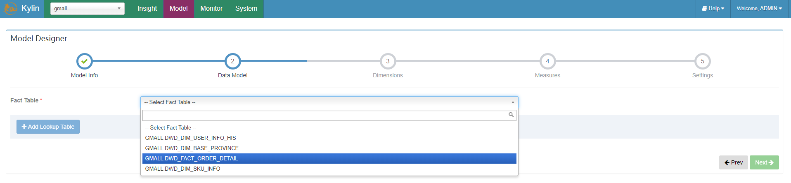
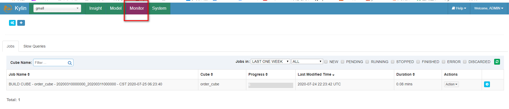
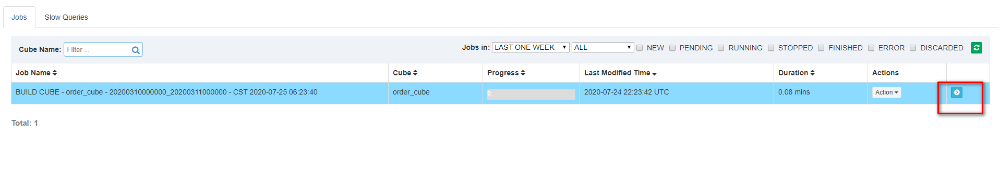
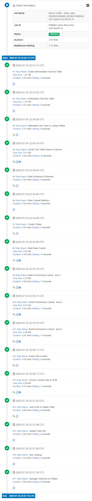
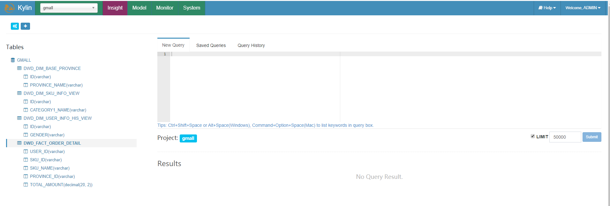

# kylin基本使用

## 启动与停止

### 启动依赖
启动Kylin之前，需先启动Hadoop（hdfs，yarn，jobhistoryserver）、Zookeeper、Hbase
```
[hadoop@hadoop101 app-script]$ ./hadoop_cluster.sh start
[hadoop@hadoop101 app-script]$ ./zookeeper_cluster.sh start
[hadoop@hadoop101 app-script]$ start-hbase.sh 
```

**hive原数据服务也是需要启动的**
```
[hadoop@hadoop101 hive-2.3.6]$ bin/hive --service metastore
```
要不会报错启动：
```
Retrieving hive dependency...
Couldn't find hive configuration directory. Please set HIVE_CONF to the path which contains hive-site.xml.
```


测试历史服务器是否可用：
```
[hadoop@hadoop101 module]$ hadoop jar /opt/module/hadoop-2.7.2/share/hadoop/mapreduce/hadoop-mapreduce-examples-2.7.2.jar pi 1 1
```
访问http://hadoop102:8088/cluster，点击刚运行的任务的History,跳到了历史服务器的页面可以`http://hadoop101:19888/jobhistory/job/job_1595548993932_0001`


### 启动
```
[hadoop@hadoop101 kylin-2.5.1]$ bin/kylin.sh start
```

启动成功
```
A new Kylin instance is started by hadoop. To stop it, run 'kylin.sh stop'
Check the log at /opt/module/kylin-2.5.1/logs/kylin.log
Web UI is at http://<hostname>:7070/kylin
```

### Web页面
在http://hadoop101:7070/kylin查看Web页面

用户名为：**ADMIN**，密码为：**KYLIN**


### 关闭
```
[hadoop@hadoop101 kylin-2.5.1]$ bin/kylin.sh stop
```

### 关闭所有集群
```
[hadoop@hadoop101 kylin-2.5.1]$ bin/kylin.sh stop
[hadoop@hadoop101 app-script]$ stop-hbase.sh
[hadoop@hadoop101 app-script]$ ./zookeeper_cluster.sh stop
[hadoop@hadoop101 app-script]$ ./hadoop_cluster.sh stop
```

## 基本使用
以gmall数据仓库中的dwd_payment_info作为事实表，dwd_order_info_his、dwd_user_info作为维度表，构建星型模型，并演示如何使用Kylin进行OLAP分析。

### 创建工程
1）点击下图中的"+"。


2）填写项目名称和描述信息，并点击Submit按钮提交。


3）选择工程


### 获取数据源
1）点击DataSource


2）点击下图按钮导入Hive表

前两个按钮用于离线数据，第三个按钮用于实时数据。第一个要自己输入表名，第二个会读取hive的原数据，图形化显示，可视化操作选择。

3）选择所需数据表，并点击Sync按钮


显示这样，可以查看表的信息：


### 创建model
1）点击Models，点击"+New"按钮，点击"★New Model"按钮。


2）填写Model信息，点击Next


3）指定事实表


4）选择维度表，并指定事实表和维度表的关联条件，点击Ok


5）指定维度字段，并点击Next。这里的维度可以从维度表中选，也可以从事实表表中选。


6）指定度量字段，并点击Next


7）指定事实表分区字段（**仅支持时间分区*），点击Save按钮，model创建完毕


### 构建cube
1）点击new， 并点击new cube


2）填写cube信息，选择cube所依赖的model，并点击next


3）选择所需的维度，如下图所示


4）选择所需度量值，如下图所示


可以选择这么多。


5）cube自动合并设置，cube需按照日期分区字段每天进行构建，每次构建的结果会保存在Hbase中的一张表内，为提高查询效率，需将每日的cube进行合并，此处可设置合并周期。


6）Kylin高级配置（优化相关，暂时跳过）


7）Kylin相关属性配置覆盖


8）Cube信息总览，点击Save，Cube创建完成


### 运行cube
1）构建Cube（计算），点击对应Cube的action按钮，选择build


2）选择要构建的时间区间，点击Submit


3）点击Monitor查看构建进度



查看进度：



报错了：


Kylin关联维度表不允许维度表的键重复。

### 维度表重复Key问题解决方案
1）每日全量维度表及拉链维度表重复Key问题如何处理

按照上述流程，会发现，在cube构建流程中出现以下错误


错误原因分析：
上述错误原因是model中的维度表dwd_dim_user_info_his为拉链表、dwd_dim_sku_info为每日全量表，故使用整张表作为维度表，必然会出现订单表中同一个user_id或者sku_id对应多条数据的问题，针对上述问题，有以下两种解决方案。

方案一：在hive中创建维度表的临时表，该临时表中只存放维度表最新的一份完整的数据，在kylin中创建模型时选择该临时表作为维度表。

方案二：与方案一思路相同，但不使用物理临时表，而选用视图（view）实现相同的功能。

此处采用方案二：

### 创建维度表视图
```sql
--拉链维度表视图
create view dwd_dim_user_info_his_view as select * from dwd_dim_user_info_his where end_date='9999-99-99';

--全量维度表视图
create view dwd_dim_sku_info_view as select * from dwd_dim_sku_info where dt=date_add(current_date(),-1);

--当前情形我们先创建一个2020-03-10的视图
create view dwd_dim_sku_info_view as select * from dwd_dim_sku_info where dt='2020-03-10';
```

### 删除之前的维度表，使用维度表视图
在DataSource中导入新创建的视图，之前的维度表，可选择性删除。

删除之前的cube和model重新创建，需要按创建的相反顺序删除，先删除任务再删除cube，在删除model，不然会报被引用。


### 重新创建model、cube运行
用视图可以克服重复的数据，可以运行成功：


### 查询
查询只能查询提前构建好的字段。同时join的方式要和之前定义的一样。理所应当的。


可以看到之前选择哪些维度和度量，这里出现什么：



选择三个维度：
```sql
select
    province_name,
    gender,
    category1_name,
    sum(total_amount)
from dwd_fact_order_detail od
left join dwd_dim_user_info_his_view ui on od.user_id=ui.id
left join dwd_dim_sku_info_view si on od.sku_id=si.id
left join dwd_dim_base_province dp on od.province_id=dp.id
group by gender, category1_name, province_name;
```


选择两个维度：
```sql
select
    gender,
    category1_name,
    sum(total_amount)
from dwd_fact_order_detail od
left join dwd_dim_user_info_his_view ui on od.user_id=ui.id
left join dwd_dim_sku_info_view si on od.sku_id=si.id
group by gender, category1_name;
```


选择一个维度：
```sql
select
    gender,
    sum(total_amount)
from dwd_fact_order_detail od
left join dwd_dim_user_info_his_view ui on od.user_id=ui.id
group by gender;
```


## 每日自动构建cube
Kylin提供了Restful API，因次我们可以将构建cube的命令写到脚本中，将脚本交给azkaban或者oozie这样的调度工具，以实现定时调度的功能。

### Restful API

api的文档：


#### query
文档写的很清楚


官方的示例：
```
curl -X POST -H "Authorization: Basic XXXXXXXXX" -H "Content-Type: application/json" -d '{ "sql":"select count(*) from TEST_KYLIN_FACT", "project":"learn_kylin" }' http://localhost:7070/kylin/api/query
```
`XXXXXXXXX`用于认证，格式为`UserName:Password`的base64编码。ADMIN:KYLIN编码为QURNSU46S1lMSU4=

测试：
```
curl -X POST -H "Authorization: Basic QURNSU46S1lMSU4=" -H "Content-Type: application/json" -d '{ "sql":"select gender,sum(total_amount) from dwd_fact_order_detail od left join dwd_dim_user_info_his_view ui on od.user_id=ui.id group by gender", "project":"gmall" }' http://hadoop101:7070/kylin/api/query
```

效果：
```
[hadoop@hadoop101 kylin-2.5.1]$ curl -X POST -H "Authorization: Basic QURNSU46S1lMSU4=" -H "Content-Type: application/json" -d '{ "sql":"select gender,sum(total_amount) from dwd_fact_order_detail od left join dwd_dim_user_info_his_view ui on od.user_id=ui.id group by gender", "project":"gmall" }' http://hadoop101:7070/kylin/api/query
{"columnMetas":[{"isNullable":1,"displaySize":256,"label":"GENDER","name":"GENDER","schemaName":"GMALL","catelogName":null,"tableName":"DWD_DIM_USER_INFO_HIS_VIEW","precision":256,"scale":0,"columnType":12,"columnTypeName":"VARCHAR","autoIncrement":false,"caseSensitive":true,"searchable":false,"currency":false,"definitelyWritable":false,"readOnly":true,"writable":false,"signed":true},{"isNullable":1,"displaySize":19,"label":"EXPR$1","name":"EXPR$1","schemaName":null,"catelogName":null,"tableName":null,"precision":19,"scale":2,"columnType":3,"columnTypeName":"DECIMAL","autoIncrement":false,"caseSensitive":true,"searchable":false,"currency":false,"definitelyWritable":false,"readOnly":true,"writable":false,"signed":true}],"results":[["F","29644"],["M","17800"]],"cube":"CUBE[name=order_cube]","affectedRowCount":0,"isException":false,"exceptionMessage":null,"duration":61,"totalScanCount":2,"totalScanBytes":88,"hitExceptionCache":false,"storageCacheUsed":false,"traceUrl":null,"pushDown":false,"partial":false}[hadoop@hadoop101 kylin-2.5.1]$
```


#### Build cube


Curl Example
```
curl -X PUT -H "Authorization: Basic XXXXXXXXX" -H 'Content-Type: application/json' -d '{"startTime":'1423526400000', "endTime":'1423612800000', "buildType":"BUILD"}' http://<host>:<port>/kylin/api/cubes/{cubeName}/build
```

### 每日自动构建cube脚本
```sh
#!/bin/bash
cube_name=order_cube
do_date=`date -d '-1 day' +%F`

#获取00:00时间戳，这样的写法是获取东八区的时间
start_date_unix=`date -d "$do_date 08:00:00" +%s`
start_date=$(($start_date_unix*1000))

#获取24:00的时间戳
stop_date=$(($start_date+86400000))

curl -X PUT -H "Authorization: Basic QURNSU46S1lMSU4=" -H 'Content-Type: application/json' -d '{"startTime":'$start_date', "endTime":'$stop_date', "buildType":"BUILD"}' http://hadoop101:7070/kylin/api/cubes/$cube_name/build
```


```sql

```

