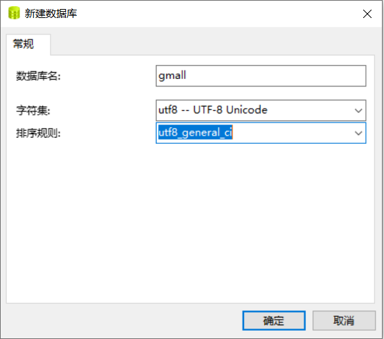

## 生成业务数据

### 创建数据库


导入数据库结构脚本（gmall2020-03-16.sql），主要是用于生成表结构，表中的数据是要清除的。

### 生成业务数据
在`/home/hadoop/bigdata-project/ecdw`目录下创建`db-log`文件夹
```
[hadoop@hadoop101 ecdw]$ mkdir db-log
```

把gmall-mock-db-2020-03-16-SNAPSHOT.jar和 application.properties上传到hadoop101的db-log目录下。

根据需求修改application.properties相关配置
```properties
logging.level.root=info

spring.datasource.driver-class-name=com.mysql.jdbc.Driver
spring.datasource.url=jdbc:mysql://hadoop101:3306/gmall?characterEncoding=utf-8&useSSL=false&serverTimezone=GMT%2B8
spring.datasource.username=root
spring.datasource.password=123456

logging.pattern.console=%m%n

mybatis-plus.global-config.db-config.field-strategy=not_null

#业务日期
mock.date=2020-03-10
#是否重置：是否清空之前的数据
mock.clear=1

#是否生成新用户
mock.user.count=50
#男性比例
mock.user.male-rate=20

#收藏取消比例
mock.favor.cancel-rate=10
#收藏数量
mock.favor.count=100

#购物车数量
mock.cart.count=10
#每个商品最多购物个数
mock.cart.sku-maxcount-per-cart=3

#用户下单比例
mock.order.user-rate=80
#用户从购物中购买商品比例
mock.order.sku-rate=70
#是否参加活动
mock.order.join-activity=1
#是否使用购物券
mock.order.use-coupon=1
#购物券领取人数
mock.coupon.user-count=10

#支付比例
mock.payment.rate=70
#支付方式 支付宝：微信 ：银联
mock.payment.payment-type=30:60:10

#评价比例 好：中：差：自动
mock.comment.appraise-rate=30:10:10:50

#退款原因比例：质量问题 商品描述与实际描述不一致 缺货 号码不合适 拍错 不想买了 其他
mock.refund.reason-rate=30:10:20:5:15:5:5

```

并在该目录下执行，如下命令，生成2020-03-10日期数据：
```
[hadoop@hadoop101 db-log]$ java -jar gmall-mock-db-2020-03-16-SNAPSHOT.jar
```

在配置文件application.properties中修改
```
#业务日期
mock.date=2020-03-11
#是否重置：是否清空之前的数据
mock.clear=0
```

再次执行命令，生成2020-03-11日期数据：
```
[hadoop@hadoop101 db-log]$ java -jar gmall-mock-db-2020-03-16-SNAPSHOT.jar
```


```

```

