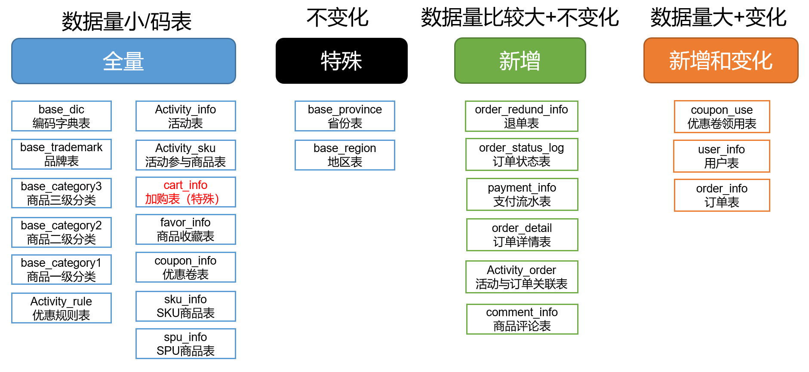
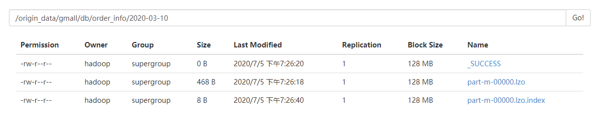

## 业务数据导入HDFS

### 分析表同步策略


### 脚本测试
先用一个表测试测试

创建sqoop文件用于存放sqoop脚本
```
[hadoop@hadoop101 ecdw]$ mkdir sqoop
```

创建mysql_to_hdfs.sh：
```
[hadoop@hadoop101 ecdw]$ cd sqoop/
[hadoop@hadoop101 sqoop]$ vi mysql_to_hdfs_test.sh
```
添加如下内容：
```sh
#! /bin/bash

sqoop_home=/opt/module/sqoop-1.4.6

# 当天日期天的部分
do_date=`date -d '-1 day' +%F`

# 第二个参数不为空，日期按照第二个参数为准
if [[ -n "$2" ]]; then
    do_date=$2
fi

# 导入函数。第一个参数：表的名字(也是在hdfs中文件夹的名字)，第一个参数：sql查询语句。
# 参函数中$1、$1代表本函数的参数，\$CONDITIONS是转义$
import_data(){
$sqoop_home/bin/sqoop import \
--connect jdbc:mysql://hadoop101:3306/gmall \
--username root \
--password 123456 \
--target-dir /origin_data/gmall/db/$1/$do_date \
--delete-target-dir \
--query "$2 and  \$CONDITIONS" \
--num-mappers 1 \
--fields-terminated-by '\t' \
--compress \
--compression-codec lzop \
--null-string '\\N' \
--null-non-string '\\N'

# 创建lzo索引
hadoop jar /opt/module/hadoop-2.7.2/share/hadoop/common/hadoop-lzo-0.4.20.jar com.hadoop.compression.lzo.DistributedLzoIndexer /origin_data/gmall/db/$1/$do_date
}

import_order_info(){
import_data order_info "select
    id, 
    final_total_amount, 
    order_status, 
    user_id, 
    out_trade_no, 
    create_time, 
    operate_time,
    province_id,
    benefit_reduce_amount,
    original_total_amount,
    feight_fee      
from order_info
where (date_format(create_time,'%Y-%m-%d')='$do_date' 
or date_format(operate_time,'%Y-%m-%d')='$do_date')"
}

import_order_detail(){
import_data order_detail "select 
    od.id,
    order_id, 
    user_id, 
    sku_id,
    sku_name,
    order_price,
    sku_num, 
    od.create_time
from order_detail od
join order_info oi
on od.order_id=oi.id
where DATE_FORMAT(od.create_time,'%Y-%m-%d')='$do_date'"
}

case $1 in
"order_info")
    import_order_info
;;
"order_detail")
    import_order_detail
;;
*)
    echo "参数不对"
    exit;
;;
esac
```

测试：
```sh
./mysql_to_hdfs_test.sh order_info 2020-03-10
```

数据导入了


### 脚本编写
创建sqoop文件用于存放sqoop脚本
```
[hadoop@hadoop101 ecdw]$ mkdir sqoop
```

创建mysql_to_hdfs.sh：
```
[hadoop@hadoop101 ecdw]$ cd sqoop/
[hadoop@hadoop101 sqoop]$ vi mysql_to_hdfs.sh
```
添加如下内容：
```sh
#! /bin/bash

sqoop_home=/opt/module/sqoop-1.4.6

# 当天日期天的部分
do_date=`date -d '-1 day' +%F`

# 第二个参数不为空，日期按照第二个参数为准
if [[ -n "$2" ]]; then
    do_date=$2
fi

# 导入函数。第一个参数：表的名字(也是在hdfs中文件夹的名字)，第一个参数：sql查询语句。
# 参函数中$1、$1代表本函数的参数，\$CONDITIONS是转义$
import_data(){
$sqoop_home/bin/sqoop import \
--connect jdbc:mysql://hadoop101:3306/gmall \
--username root \
--password 123456 \
--target-dir /origin_data/gmall/db/$1/$do_date \
--delete-target-dir \
--query "$2 and  \$CONDITIONS" \
--num-mappers 1 \
--fields-terminated-by '\t' \
--compress \
--compression-codec lzop \
--null-string '\\N' \
--null-non-string '\\N'

# 创建lzo索引
hadoop jar /opt/module/hadoop-2.7.2/share/hadoop/common/hadoop-lzo-0.4.20.jar com.hadoop.compression.lzo.DistributedLzoIndexer /origin_data/gmall/db/$1/$do_date
}

import_order_info(){
import_data order_info "select
    id, 
    final_total_amount, 
    order_status, 
    user_id, 
    out_trade_no, 
    create_time, 
    operate_time,
    province_id,
    benefit_reduce_amount,
    original_total_amount,
    feight_fee      
from order_info
where (date_format(create_time,'%Y-%m-%d')='$do_date' 
or date_format(operate_time,'%Y-%m-%d')='$do_date')"
}

import_coupon_use(){
import_data coupon_use "select
                      id,
                      coupon_id,
                      user_id,
                      order_id,
                      coupon_status,
                      get_time,
                      using_time,
                      used_time
                    from coupon_use
                    where (date_format(get_time,'%Y-%m-%d')='$do_date'
                    or date_format(using_time,'%Y-%m-%d')='$do_date'
                    or date_format(used_time,'%Y-%m-%d')='$do_date')"
}

import_order_status_log(){
import_data order_status_log "select
                              id,
                              order_id,
                              order_status,
                              operate_time
                            from order_status_log
                            where date_format(operate_time,'%Y-%m-%d')='$do_date'"
}

import_activity_order(){
import_data activity_order "select
                            id,
                            activity_id,
                            order_id,
                            create_time
                          from activity_order
                          where date_format(create_time,'%Y-%m-%d')='$do_date'"
}

import_user_info(){
import_data "user_info" "select 
                        id,
                        name,
                        birthday,
                        gender,
                        email,
                        user_level, 
                        create_time,
                        operate_time
                      from user_info 
                      where (DATE_FORMAT(create_time,'%Y-%m-%d')='$do_date' 
                      or DATE_FORMAT(operate_time,'%Y-%m-%d')='$do_date')"
}

import_order_detail(){
import_data order_detail "select 
                          od.id,
                          order_id, 
                          user_id, 
                          sku_id,
                          sku_name,
                          order_price,
                          sku_num, 
                          od.create_time  
                        from order_detail od
                        join order_info oi
                        on od.order_id=oi.id
                        where DATE_FORMAT(od.create_time,'%Y-%m-%d')='$do_date'"
}

import_payment_info(){
import_data "payment_info"  "select 
                            id,  
                            out_trade_no, 
                            order_id, 
                            user_id, 
                            alipay_trade_no, 
                            total_amount,  
                            subject, 
                            payment_type, 
                            payment_time 
                          from payment_info 
                          where DATE_FORMAT(payment_time,'%Y-%m-%d')='$do_date'"
}

import_comment_info(){
import_data comment_info "select
                          id,
                          user_id,
                          sku_id,
                          spu_id,
                          order_id,
                          appraise,
                          comment_txt,
                          create_time
                        from comment_info
                        where date_format(create_time,'%Y-%m-%d')='$do_date'"
}

import_order_refund_info(){
import_data order_refund_info "select
                            id,
                            user_id,
                            order_id,
                            sku_id,
                            refund_type,
                            refund_num,
                            refund_amount,
                            refund_reason_type,
                            create_time
                          from order_refund_info
                          where date_format(create_time,'%Y-%m-%d')='$do_date'"
}

import_sku_info(){
import_data sku_info "select 
                      id,
                      spu_id,
                      price,
                      sku_name,
                      sku_desc,
                      weight,
                      tm_id,
                      category3_id,
                      create_time
                    from sku_info where 1=1"
}

import_base_category1(){
import_data "base_category1" "select 
                              id,
                              name 
                            from base_category1 where 1=1"
}

import_base_category2(){
import_data "base_category2" "select
                              id,
                              name,
                              category1_id 
                            from base_category2 where 1=1"
}

import_base_category3(){
import_data "base_category3" "select
                              id,
                              name,
                              category2_id
                            from base_category3 where 1=1"
}

import_base_province(){
import_data base_province "select
                          id,
                          name,
                          region_id,
                          area_code,
                          iso_code
                        from base_province
                        where 1=1"
}

import_base_region(){
import_data base_region "select
                          id,
                          region_name
                        from base_region
                        where 1=1"
}

import_base_trademark(){
import_data base_trademark "select
                            tm_id,
                            tm_name
                          from base_trademark
                          where 1=1"
}

import_spu_info(){
import_data spu_info "select
                        id,
                        spu_name,
                        category3_id,
                        tm_id
                      from spu_info
                      where 1=1"
}

import_favor_info(){
import_data favor_info "select
                      id,
                      user_id,
                      sku_id,
                      spu_id,
                      is_cancel,
                      create_time,
                      cancel_time
                    from favor_info
                    where 1=1"
}

import_cart_info(){
import_data cart_info "select
                    id,
                    user_id,
                    sku_id,
                    cart_price,
                    sku_num,
                    sku_name,
                    create_time,
                    operate_time,
                    is_ordered,
                    order_time
                  from cart_info
                  where 1=1"
}

import_coupon_info(){
import_data coupon_info "select
                      id,
                      coupon_name,
                      coupon_type,
                      condition_amount,
                      condition_num,
                      activity_id,
                      benefit_amount,
                      benefit_discount,
                      create_time,
                      range_type,
                      spu_id,
                      tm_id,
                      category3_id,
                      limit_num,
                      operate_time,
                      expire_time
                    from coupon_info
                    where 1=1"
}

import_activity_info(){
import_data activity_info "select
                          id,
                          activity_name,
                          activity_type,
                          start_time,
                          end_time,
                          create_time
                        from activity_info
                        where 1=1"
}

import_activity_rule(){
import_data activity_rule "select
                                id,
                                activity_id,
                                condition_amount,
                                condition_num,
                                benefit_amount,
                                benefit_discount,
                                benefit_level
                            from activity_rule
                            where 1=1"
}

import_base_dic(){
import_data base_dic "select
                        dic_code,
                        dic_name,
                        parent_code,
                        create_time,
                        operate_time
                      from base_dic
                      where 1=1" 
}

case $1 in
"order_info")
    import_order_info
;;
"base_category1")
    import_base_category1
;;
"base_category2")
    import_base_category2
;;
"base_category3")
    import_base_category3
;;
"order_detail")
    import_order_detail
;;
"sku_info")
    import_sku_info
;;
"user_info")
    import_user_info
;;
"payment_info")
    import_payment_info
;;
"base_province")
    import_base_province
;;
"base_region")
    import_base_region
;;
"base_trademark")
    import_base_trademark
;;
"activity_info")
    import_activity_info
;;
"activity_order")
    import_activity_order
;;
"cart_info")
    import_cart_info
;;
"comment_info")
    import_comment_info
;;
"coupon_info")
    import_coupon_info
;;
"coupon_use")
    import_coupon_use
;;
"favor_info")
    import_favor_info
;;
"order_refund_info")
    import_order_refund_info
;;
"order_status_log")
    import_order_status_log
;;
"spu_info")
    import_spu_info
;;
"activity_rule")
    import_activity_rule
;;
"base_dic")
    import_base_dic
;;

"first")
   import_base_category1
   import_base_category2
   import_base_category3
   import_order_info
   import_order_detail
   import_sku_info
   import_user_info
   import_payment_info
   import_base_province
   import_base_region
   import_base_trademark
   import_activity_info
   import_activity_order
   import_cart_info
   import_comment_info
   import_coupon_use
   import_coupon_info
   import_favor_info
   import_order_refund_info
   import_order_status_log
   import_spu_info
   import_activity_rule
   import_base_dic
;;
"all")
   import_base_category1
   import_base_category2
   import_base_category3
   import_order_info
   import_order_detail
   import_sku_info
   import_user_info
   import_payment_info
   import_base_trademark
   import_activity_info
   import_activity_order
   import_cart_info
   import_comment_info
   import_coupon_use
   import_coupon_info
   import_favor_info
   import_order_refund_info
   import_order_status_log
   import_spu_info
   import_activity_rule
   import_base_dic
;;
esac

```

之前的测试不用删除，sqoop有`target-dir /origin_data/gmall/db/$1/$do_date`参数，每次都会删除之前的数据。

初次导入
```
[hadoop@hadoop101 sqoop]$ ./mysql_to_hdfs.sh first 2020-03-10
```
每日导入
```
[hadoop@hadoop101 sqoop]$ ./mysql_to_hdfs.sh all 2020-03-11
```

### 项目经验
Hive中的Null在底层是以“\N”来存储，而MySQL中的Null在底层就是Null，为了保证数据两端的一致性。在导出数据时采用--input-null-string和--input-null-non-string两个参数。导入数据时采用--null-string和--null-non-string。


```

```