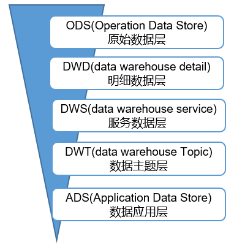

## 数据仓库分层

* ODS层：原始数据层，存放原始数据，直接加载原始日志、数据，数据保持原貌不做处理。

* DWD层：明细数据层，对ODS层数据进行清洗（去除空值，脏数据，超过极限范围的数据）、维度退化、脱敏等

* DWS层：服务数据层，以DWD为基础，按天进行轻度汇总。

* DWT层：数据主题层，以DWS为基础，按主题进行汇总。

* ADS层：数据应用层，为各种统计报表提供数据

## 数据仓库为什么要分层
1）**把复杂问题简单化**。将复杂的任务分解成多层来完成，每一层只处理简单的任务，方便定位问题。

2）**减少重复开发**。规范数据分层，通过的中间层数据，能够减少极大的重复计算，增加一次计算结果的复用性。

3）**隔离原始数据**。不论是数据的异常还是数据的敏感性，使真实数据与统计数据解耦开。

## 数据集市与数据仓库概念
数据集市（Data Market），现在市面上的公司和书籍都对数据集市有不同的概念。

**数据集市是一种微型的数据仓库**，它通常有更少的数据，更少的主题区域，以及更少的历史数据，因此**是部门级的**，一般只能为某个局部范围内的管理人员服务。

**数据仓库是企业级的**，能为整个企业各个部门的运行提供决策支持手段。

## 数仓命名规范

### 表命名
* ODS层命名为ods_表名
* DWD层命名为dwd_dim/fact_表名
* DWS层命名为dws_表名  
* DWT层命名为dwt_购物车
* ADS层命名为ads_表名
* 临时表命名为xxx_tmp
* 用户行为表，以log为后缀。

### 脚本命名
* 数据源_to_目标_db/log.sh
* 用户行为脚本以log为后缀；业务数据脚本以db为后缀。

