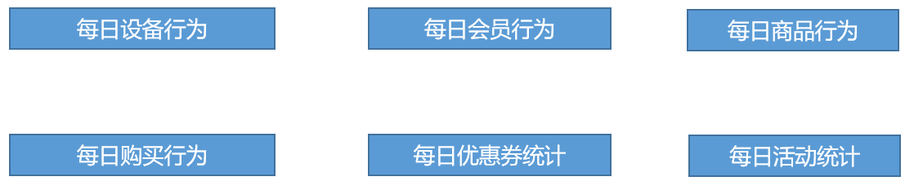

## 范式理论
javaee中数据库的三范式等。

略

## 关系建模与维度建模
当今的数据处理大致可以分成两大类：联机事务处理OLTP（on-line transaction processing）、联机分析处理OLAP（On-Line Analytical Processing）。OLTP是传统的关系型数据库的主要应用，主要是基本的、日常的事务处理，例如银行交易。OLAP是数据仓库系统的主要应用，支持复杂的分析操作，侧重决策支持，并且提供直观易懂的查询结果。二者的主要区别对比如下表所示。

| 对比属性 | OLTP                       | OLAP                       |
| -------- | -------------------------- | -------------------------- |
| 读特性   | 每次查询只返回少量记录     | 对大量记录进行汇总         |
| 写特性   | 随机、低延时写入用户的输入 | 批量导入                   |
| 使用场景 | 用户，Java EE项目          | 内部分析师，为决策提供支持 |
| 数据表征 | 最新数据状态               | 随时间变化的历史状态       |
| 数据规模 | GB                         | TB到PB                     |

### 关系建模

关系模型如图所示，严格遵循第三范式（3NF），从图中可以看出，较为松散、零碎，物理表数量多，而数据冗余程度低。由于数据分布于众多的表中，这些数据可以更为灵活地被应用，功能性较强。关系模型主要应用与OLTP系统中，为了保证数据的一致性以及避免冗余，所以大部分业务系统的表都是遵循第三范式的。

### 维度建模

维度模型如图所示，主要应用于OLAP系统中，通常以某一个事实表为中心进行表的组织，主要面向业务，特征是可能存在数据的冗余，但是能方便的得到数据。

**关系模型虽然冗余少，但是在大规模数据，跨表分析统计查询过程中，会造成多表关联，这会大大降低执行效率。**

**所以通常我们采用维度模型建模，把相关各种表整理成两种：事实表和维度表两种。**

### 维度建模的三种模型
在维度建模的基础上又分为三种模型：星型模型、雪花模型、星座模型。

#### 星型模型、雪花模型
雪花模型与星型模型的区别主要在于维度的层级，标准的星型模型维度只有一层，而雪花模型可能会涉及多级。

**星型模型**

**雪花模型**

雪花模型，比较靠近3NF，但是无法完全遵守，因为遵循3NF的性能成本太高。

#### 星座模型

**星座模型与前两种情况的区别是事实表的数量，星座模型是基于多个事实表。**

基本上是很多数据仓库的常态，因为很多数据仓库都是多个事实表的。所以星座不星座只反映是否有多个事实表，他们之间是否共享一些维度表。

所以星座模型并不和前两个模型冲突。

#### 模型的选择
首先就是星座不星座这个只跟数据和需求有关系，跟设计没关系，不用选择。

星型还是雪花，取决于**性能优先**，还是**灵活更优先**。

目前实际企业开发中，不会绝对选择一种，根据情况灵活组合，甚至并存（一层维度和多层维度都保存）。但是整体来看，**更倾向于维度更少的星型模型**。尤其是Hadoop体系，**减少Join就是减少Shuffle**，性能差距很大。（关系型数据可以依靠强大的主键索引）

## 维度表和事实表（重点）

### 维度表
**维度表**：一般是对事实的**描述信息**。每一张维表对应现实世界中的一个对象或者概念。    例如：用户、商品、日期、地区等。

**维表的特征**：

* 维表的范围很宽（具有多个属性、列比较多）
* 跟事实表相比，行数相对较小：通常< 10万条
* 内容相对固定：编码表

时间维度表：

| 日期ID     | day of week | day of year | 季度 | 节假日 |
| ---------- | ----------- | ----------- | ---- | ------ |
| 2020-01-01 | 2           | 1           | 1    | 元旦   |
| 2020-01-02 | 3           | 2           | 1    | 无     |
| 2020-01-03 | 4           | 3           | 1    | 无     |
| 2020-01-04 | 5           | 4           | 1    | 无     |
| 2020-01-05 | 6           | 5           | 1    | 无     |

### 事实表
事实表中的**每行数据代表一个业务事件**（下单、支付、退款、评价等）。“事实”这个术语表示的是业务事件的**度量值**（可统计次数、个数、金额等），例如，订单事件中的下单金额。

每一个事实表的行包括：具有可加性的数值型的度量值、与维表相连接的外键、通常具有两个和两个以上的外键、外键之间表示维表之间多对多的关系。

**事实表的特征**：

* 非常的大
* 内容相对的窄：列数较少
* 经常发生变化，每天会新增加很多。

#### 事务型事实表
以**每个事务或事件为单位**，例如一个销售订单记录，一笔支付记录等，作为事实表里的一行数据。一旦事务被提交，事实表数据被插入，数据就不再进行更改，其更新方式为增量更新。

#### 周期型快照事实表
周期型快照事实表中**不会保留所有数据，只保留固定时间间隔的数据**，例如每天或者每月的销售额，或每月的账户余额等。

#### 累积型快照事实表
**累计快照事实表用于跟踪业务事实的变化**。例如，数据仓库中可能需要累积或者存储订单从下订单开始，到订单商品被打包、运输、和签收的各个业务阶段的时间点数据来跟踪订单声明周期的进展情况。当这个业务过程进行时，事实表的记录也要不断更新。

## 数据仓库建模（绝对重点）

### ODS层
（1）保持数据原貌不做任何修改，起到备份数据的作用。
（2）数据采用压缩，减少磁盘存储空间（例如：原始数据100G，可以压缩到10G左右）
（3）创建分区表，防止后续的全表扫描

### DWD层
DWD层需构建维度模型，一般采用**星型模型**，呈现的状态一般为星座模型。

维度建模一般按照以下**四个步骤**：

**选择业务过程→声明粒度→确认维度→确认事实**

#### 选择业务过程
在业务系统中，挑选我们感兴趣的业务线，比如下单业务，支付业务，退款业务，物流业务，一条业务线对应一张事实表。

#### 声明粒度
数据粒度指数据仓库的数据中保存数据的细化程度或综合程度的级别。
声明粒度意味着精确定义事实表中的一行数据表示什么，应该**尽可能选择最小粒度**，以此来应各种各样的需求。

典型的粒度声明如下：

* 订单中，每个商品项作为下单事实表中的一行，粒度为每次下单
* 每周的订单次数作为一行，粒度就是每周下单。
* 每月的订单次数作为一行，粒度就是每月下单

#### 确定维度
维度的主要作用是描述业务是事实，主要表示的是“**谁，何处，何时**”等信息。

#### 确定事实
此处的“事实”一词，指的是业务中的**度量值**，例如订单金额、下单次数等。

在DWD层，以**业务过程**为建模驱动，基于每个具体业务过程的特点，构建**最细粒度**的明细层事实表。**事实表可做适当的宽表化处理**。

#### 数仓建模

至此，数仓的维度建模已经完毕，DWS、DWT和ADS和维度建模已经没有关系了。

DWS和DWT都是建宽表，宽表都是按照主题去建。主题相当于观察问题的角度。对应着维度表。

### DWS层
统计**各个主题对象**的**当天行为**，服务于DWT层的主题宽表，以及一些业务明细数据，应对特殊需求（例如，购买行为，统计商品复购率）。

DWS层宽表：

### DWT层
以分析的**主题对象**为建模驱动，基于上层的应用和产品的指标需求，构建主题对象的**全量宽表**。

DWT层主题宽表：

### ADS层
对电商系统各大主题指标分别进行分析。

