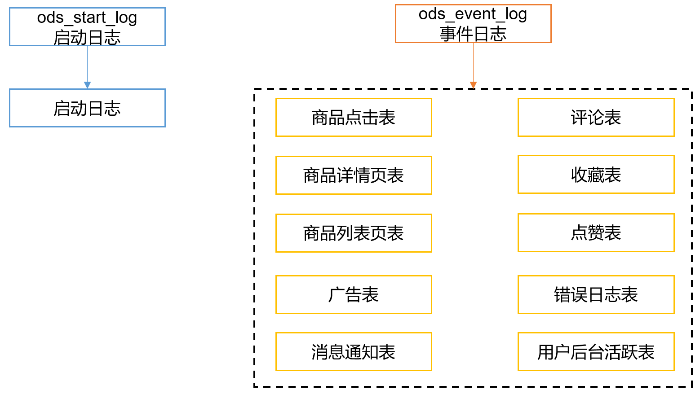
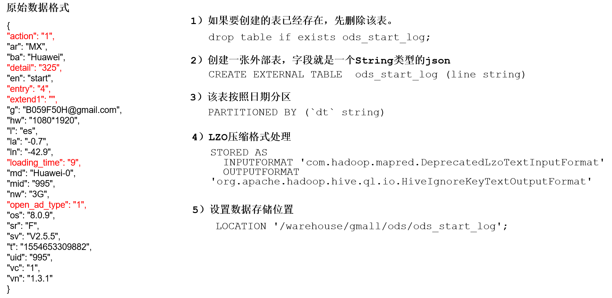
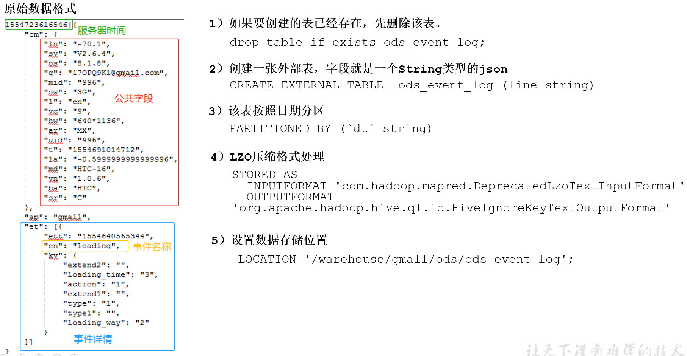

# 数仓搭建-ODS层
* 1）保持数据原貌不做任何修改，起到备份数据的作用。    
* 2）数据采用LZO压缩，减少磁盘存储空间。100G数据可以压缩到10G以内。    
* 3）创建分区表，防止后续的全表扫描，在企业开发中大量使用分区表。    
* 4）创建外部表。在企业开发中，除了自己用的临时表，创建内部表外，绝大多数场景都是创建外部表。


# ODS层（用户行为数据）


## 启动日志表
创建启动日志表ods_start_log

### ODS层创建启动日志表分析

原始数据格式
```js
{
    "action":"1",
    "ar":"MX",
    "ba":"Huawei",
    "detail":"325",
    "en":"start",
    "entry":"4",
    "extend1":"",
    "g":"B059F50H@gmail.com",
    "hw":"1080*1920",
    "l":"es",
    "la":"-0.7",
    "ln":"-42.9",
    "loading_time":"9",
    "md":"Huawei-0",
    "mid":"995",
    "nw":"3G",
    "open_ad_type":"1",
    "os":"8.0.9",
    "sr":"F",
    "sv":"V2.5.5",
    "t":"1554653309882",
    "uid":"995",
    "vc":"1",
    "vn":"1.3.1"
}
```

1）如果要创建的表已经存在，先删除该表。
```
drop table if exists ods_start_log;
```
2）创建一张外部表，字段就是一个String类型的json
```
CREATE EXTERNAL TABLE  ods_start_log (line string)
```
3）该表按照日期分区
```
PARTITIONED BY (`dt` string)
```
4）LZO压缩格式处理
```
STORED AS
  INPUTFORMAT 'com.hadoop.mapred.DeprecatedLzoTextInputFormat'
  OUTPUTFORMAT 'org.apache.hadoop.hive.ql.io.HiveIgnoreKeyTextOutputFormat'
```
5）设置数据存储位置
```
LOCATION '/warehouse/gmall/ods/ods_start_log';
```

### 建表语句
创建输入数据是lzo输出是text，支持json解析的分区表
```sql
drop table if exists ods_start_log;

create external table ods_start_log (
    `line` string comment '一整条日志'
)
partitioned by (`dt` string)
stored as
    inputformat 'com.hadoop.mapred.DeprecatedLzoTextInputFormat'
    outputformat 'org.apache.hadoop.hive.ql.io.HiveIgnoreKeyTextOutputFormat'
location '/warehouse/gmall/ods/ods_start_log';
```

### 加载数据并创建lzo索引
加载一天的数据到ods_start_log
```sql
load data inpath '/origin_data/gmall/log/topic_start/2020-03-10' overwrite into table ods_start_log partition(dt='2020-03-10');
```
**注意：时间格式都配置成YYYY-MM-DD格式，这是Hive默认支持的时间格式**

查看一下数据
```sql
select * from ods_start_log limit 5;
```

为lzo压缩文件创建索引
```sh
hadoop jar /opt/module/hadoop-2.7.2/share/hadoop/common/hadoop-lzo-0.4.20.jar com.hadoop.compression.lzo.DistributedLzoIndexer /warehouse/gmall/ods/ods_start_log/dt=2020-03-10
```


### 测试过程
启动hive服务
```sh
[hadoop@hadoop101 hive-2.3.6]$ nohup bin/hive --service metastore &
```

登录客户端
```
[hadoop@hadoop101 hive-2.3.6]$ bin/hive
```

使用hiveserver2服务（**这个版本必须要启动metastore服务**）
```
[hadoop@hadoop101 hive-2.3.6]$ nohup bin/hive --service hiveserver2 &
```
登录退出hiveserver2客户端
```
bin/beeline
# 连接，之后需要输入启动hive服务的linux用户的用户名和密码
!connect jdbc:hive2://localhost:10000
# 退出
!exit
```

创建ods_start_log：
```sql
drop table if exists ods_start_log;

create external table ods_start_log (
    `line` string comment '一整条日志'
)
partitioned by (`dt` string)
stored as
    inputformat 'com.hadoop.mapred.DeprecatedLzoTextInputFormat'
    outputformat 'org.apache.hadoop.hive.ql.io.HiveIgnoreKeyTextOutputFormat'
location '/warehouse/gmall/ods/ods_start_log';
```
妈的把整个sql转成小写，一直到deprecatedlzotextinputformat这个类找不到，最后才发现是类名写错了。查看java进程启动的详细信息`jps -ml`。


加载一天的数据到ods_start_log
```sql
load data inpath '/origin_data/gmall/log/topic_start/2020-03-10' overwrite into table ods_start_log partition(dt='2020-03-10');
```

查看一下数据
```sql
select * from ods_start_log limit 5;
```

删除表重现创建表，加载分区(不然查不到数据)。
```sql
alter table ods_start_log add partition(dt='2020-03-10');
```

表注释中文乱码解决
```
https://www.jianshu.com/p/d383884f8247
https://www.cnblogs.com/qingyunzong/p/8724155.html
```

查看表结构
```sql
desc ods_start_log;
```
显示建表语句
```sql
show create table ods_start_log;
```

由于之前把表删了，又重建使用`alter table ods_start_log add partition(dt='2020-03-10');`修复分区发现`select count(1)`和`select count(*)`直接就返回的都是0，而`select count(line)`会跑任务，暂时不知道咋回事。

先重新load一下就好了
```sh
hadoop fs -mv /warehouse/gmall/ods/ods_start_log/dt=2020-03-10 /origin_data/gmall/log/topic_start
load data inpath '/origin_data/gmall/log/topic_start/dt=2020-03-10' overwrite into table ods_start_log partition(dt='2020-03-10');
```


为lzo压缩文件创建索引
```sh
hadoop jar /opt/module/hadoop-2.7.2/share/hadoop/common/hadoop-lzo-0.4.20.jar com.hadoop.compression.lzo.DistributedLzoIndexer /warehouse/gmall/ods/ods_start_log/dt=2020-03-10
```

## 事件日志表
创建事件日志表ods_event_log

### ODS层创建事件日志表分析


### 建表语句
创建输入数据是lzo输出是text，支持json解析的分区表
```sql
drop table if exists ods_event_log;

create external table ods_event_log (
    `line` string comment '一整条日志'
)
partitioned by (`dt` string)
stored as
    inputformat 'com.hadoop.mapred.DeprecatedLzoTextInputFormat'
    outputformat 'org.apache.hadoop.hive.ql.io.HiveIgnoreKeyTextOutputFormat'
location '/warehouse/gmall/ods/ods_event_log';
```

### 加载数据并创建lzo索引
加载一天的数据到ods_event_log
```sql
load data inpath '/origin_data/gmall/log/topic_event/2020-03-10' overwrite into table ods_event_log partition(dt='2020-03-10');
```
**注意：时间格式都配置成YYYY-MM-DD格式，这是Hive默认支持的时间格式**

查看一下数据
```sql
select * from ods_event_log limit 5;
```

为lzo压缩文件创建索引
```sh
hadoop jar /opt/module/hadoop-2.7.2/share/hadoop/common/hadoop-lzo-0.4.20.jar com.hadoop.compression.lzo.DistributedLzoIndexer /warehouse/gmall/ods/ods_event_log/dt=2020-03-10
```


```

```