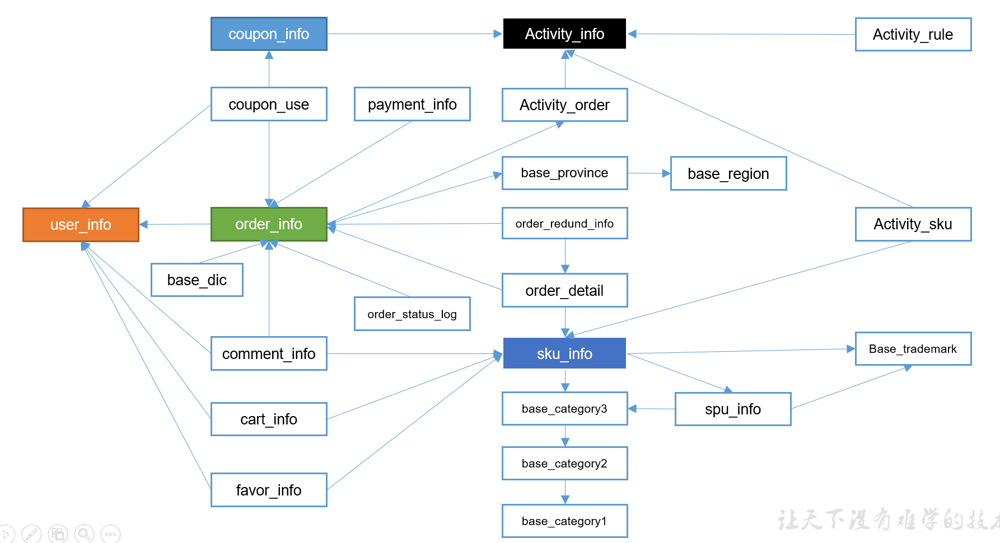

# 各个表的建表语句


## 1 订单表（增量及更新）
```sql
drop table if exists ods_order_info;

create external table ods_order_info (
    `id` string comment '订单号',
    `final_total_amount` decimal(10,2) comment '订单金额',
    `order_status` string comment '订单状态',
    `user_id` string comment '用户id',
    `out_trade_no` string comment '支付流水号',
    `create_time` string comment '创建时间',
    `operate_time` string comment '操作时间',
    `province_id` string comment '省份ID',
    `benefit_reduce_amount` decimal(10,2) comment '优惠金额',
    `original_total_amount` decimal(10,2)  comment '原价金额',
    `feight_fee` decimal(10,2)  comment '运费'
) comment '订单表'
partitioned by (`dt` string)
row format delimited fields terminated by '\t'
stored AS
  inputformat 'com.hadoop.mapred.DeprecatedLzoTextInputFormat'
  outputformat 'org.apache.hadoop.hive.ql.io.HiveIgnoreKeyTextOutputFormat'
location '/warehouse/gmall/ods/ods_order_info';
```

## 2 订单详情表（增量）
```sql
drop table if exists ods_order_detail;

create external table ods_order_detail( 
    `id` string comment '订单编号',
    `order_id` string  comment '订单号', 
    `user_id` string comment '用户id',
    `sku_id` string comment '商品id',
    `sku_name` string comment '商品名称',
    `order_price` decimal(10,2) comment '商品价格',
    `sku_num` bigint comment '商品数量',
    `create_time` string comment '创建时间'
) comment '订单详情表'
partitioned by (`dt` string)
row format delimited fields terminated by '\t' 
stored AS
  inputformat 'com.hadoop.mapred.DeprecatedLzoTextInputFormat'
  outputformat 'org.apache.hadoop.hive.ql.io.HiveIgnoreKeyTextOutputFormat'
location '/warehouse/gmall/ods/ods_order_detail';
```

## 3 SKU商品表（全量）
```sql
drop table if exists ods_sku_info;

create external table ods_sku_info( 
    `id` string COMMENT 'skuId',
    `spu_id` string   COMMENT 'spuid', 
    `price` decimal(10,2) COMMENT '价格',
    `sku_name` string COMMENT '商品名称',
    `sku_desc` string COMMENT '商品描述',
    `weight` string COMMENT '重量',
    `tm_id` string COMMENT '品牌id',
    `category3_id` string COMMENT '品类id',
    `create_time` string COMMENT '创建时间'
) COMMENT 'SKU商品表'
PARTITIONED BY (`dt` string)
row format delimited fields terminated by '\t'
STORED AS
  INPUTFORMAT 'com.hadoop.mapred.DeprecatedLzoTextInputFormat'
  OUTPUTFORMAT 'org.apache.hadoop.hive.ql.io.HiveIgnoreKeyTextOutputFormat'
location '/warehouse/gmall/ods/ods_sku_info/';
```

## 4 用户表（增量及更新）
```sql
drop table if exists ods_user_info;

create external table ods_user_info( 
    `id` string COMMENT '用户id',
    `name`  string COMMENT '姓名',
    `birthday` string COMMENT '生日',
    `gender` string COMMENT '性别',
    `email` string COMMENT '邮箱',
    `user_level` string COMMENT '用户等级',
    `create_time` string COMMENT '创建时间',
    `operate_time` string COMMENT '操作时间'
) COMMENT '用户表'
PARTITIONED BY (`dt` string)
row format delimited fields terminated by '\t'
STORED AS
  INPUTFORMAT 'com.hadoop.mapred.DeprecatedLzoTextInputFormat'
  OUTPUTFORMAT 'org.apache.hadoop.hive.ql.io.HiveIgnoreKeyTextOutputFormat'
location '/warehouse/gmall/ods/ods_user_info/';
```

## 5 商品一级分类表（全量）
```sql
drop table if exists ods_base_category1;

create external table ods_base_category1( 
    `id` string COMMENT 'id',
    `name`  string COMMENT '名称'
) COMMENT '商品一级分类表'
PARTITIONED BY (`dt` string)
row format delimited fields terminated by '\t'
STORED AS
  INPUTFORMAT 'com.hadoop.mapred.DeprecatedLzoTextInputFormat'
  OUTPUTFORMAT 'org.apache.hadoop.hive.ql.io.HiveIgnoreKeyTextOutputFormat'
location '/warehouse/gmall/ods/ods_base_category1/';
```

## 6 商品二级分类表（全量）
```sql
drop table if exists ods_base_category2;

create external table ods_base_category2( 
    `id` string COMMENT ' id',
    `name` string COMMENT '名称',
    category1_id string COMMENT '一级品类id'
) COMMENT '商品二级分类表'
PARTITIONED BY (`dt` string)
row format delimited fields terminated by '\t'
STORED AS
  INPUTFORMAT 'com.hadoop.mapred.DeprecatedLzoTextInputFormat'
  OUTPUTFORMAT 'org.apache.hadoop.hive.ql.io.HiveIgnoreKeyTextOutputFormat'
location '/warehouse/gmall/ods/ods_base_category2/';
```

## 7 商品三级分类表（全量）
```sql
drop table if exists ods_base_category3;

create external table ods_base_category3(
    `id` string COMMENT ' id',
    `name`  string COMMENT '名称',
    category2_id string COMMENT '二级品类id'
) COMMENT '商品三级分类表'
PARTITIONED BY (`dt` string)
row format delimited fields terminated by '\t'
STORED AS
  INPUTFORMAT 'com.hadoop.mapred.DeprecatedLzoTextInputFormat'
  OUTPUTFORMAT 'org.apache.hadoop.hive.ql.io.HiveIgnoreKeyTextOutputFormat'
location '/warehouse/gmall/ods/ods_base_category3/';
```

## 8 支付流水表（增量）
```sql
drop table if exists ods_payment_info;

create external table ods_payment_info(
    `id`   bigint COMMENT '编号',
    `out_trade_no`    string COMMENT '对外业务编号',
    `order_id`        string COMMENT '订单编号',
    `user_id`         string COMMENT '用户编号',
    `alipay_trade_no` string COMMENT '支付宝交易流水编号',
    `total_amount`    decimal(16,2) COMMENT '支付金额',
    `subject`         string COMMENT '交易内容',
    `payment_type`    string COMMENT '支付类型',
    `payment_time`    string COMMENT '支付时间'
)  COMMENT '支付流水表'
PARTITIONED BY (`dt` string)
row format delimited fields terminated by '\t'
STORED AS
  INPUTFORMAT 'com.hadoop.mapred.DeprecatedLzoTextInputFormat'
  OUTPUTFORMAT 'org.apache.hadoop.hive.ql.io.HiveIgnoreKeyTextOutputFormat'
location '/warehouse/gmall/ods/ods_payment_info/';
```

## 9 省份表（特殊）
```sql
drop table if exists ods_base_province;

create external table ods_base_province (
    `id`   bigint COMMENT '编号',
    `name`        string COMMENT '省份名称',
    `region_id`    string COMMENT '地区ID',
    `area_code`    string COMMENT '地区编码',
    `iso_code` string COMMENT 'iso编码'
   )  COMMENT '省份表'
row format delimited fields terminated by '\t'
STORED AS
  INPUTFORMAT 'com.hadoop.mapred.DeprecatedLzoTextInputFormat'
  OUTPUTFORMAT 'org.apache.hadoop.hive.ql.io.HiveIgnoreKeyTextOutputFormat'
location '/warehouse/gmall/ods/ods_base_province/';
```

## 10 地区表（特殊）
```sql
drop table if exists ods_base_region;

create external table ods_base_region (
    `id`   bigint COMMENT '编号',
    `region_name`        string COMMENT '地区名称'
   )  COMMENT '地区表'
row format delimited fields terminated by '\t'
STORED AS
  INPUTFORMAT 'com.hadoop.mapred.DeprecatedLzoTextInputFormat'
  OUTPUTFORMAT 'org.apache.hadoop.hive.ql.io.HiveIgnoreKeyTextOutputFormat'
location '/warehouse/gmall/ods/ods_base_region/';
```

## 11 品牌表（全量）
```sql
drop table if exists ods_base_trademark;

create external table ods_base_trademark (
    `tm_id`   bigint COMMENT '编号',
    `tm_name` string COMMENT '品牌名称'
)  COMMENT '品牌表'
PARTITIONED BY (`dt` string)
row format delimited fields terminated by '\t'
STORED AS
  INPUTFORMAT 'com.hadoop.mapred.DeprecatedLzoTextInputFormat'
  OUTPUTFORMAT 'org.apache.hadoop.hive.ql.io.HiveIgnoreKeyTextOutputFormat'
location '/warehouse/gmall/ods/ods_base_trademark/';
```

## 12 订单状态表（增量）
```sql
drop table if exists ods_order_status_log;

create external table ods_order_status_log (
    `id`   bigint COMMENT '编号',
    `order_id` string COMMENT '订单ID',
    `order_status` string COMMENT '订单状态',
    `operate_time` string COMMENT '修改时间'
)  COMMENT '订单状态表'
PARTITIONED BY (`dt` string)
row format delimited fields terminated by '\t'
STORED AS
  INPUTFORMAT 'com.hadoop.mapred.DeprecatedLzoTextInputFormat'
  OUTPUTFORMAT 'org.apache.hadoop.hive.ql.io.HiveIgnoreKeyTextOutputFormat'
location '/warehouse/gmall/ods/ods_order_status_log/';
```

## 13 SPU商品表（全量）
```sql
drop table if exists ods_spu_info;

create external table ods_spu_info(
    `id` string COMMENT 'spuid',
    `spu_name` string COMMENT 'spu名称',
    `category3_id` string COMMENT '品类id',
    `tm_id` string COMMENT '品牌id'
) COMMENT 'SPU商品表'
PARTITIONED BY (`dt` string)
row format delimited fields terminated by '\t'
STORED AS
  INPUTFORMAT 'com.hadoop.mapred.DeprecatedLzoTextInputFormat'
  OUTPUTFORMAT 'org.apache.hadoop.hive.ql.io.HiveIgnoreKeyTextOutputFormat'
location '/warehouse/gmall/ods/ods_spu_info/';
```

## 14 商品评论表（增量）
```sql
drop table if exists ods_comment_info;

create external table ods_comment_info(
    `id` string COMMENT '编号',
    `user_id` string COMMENT '用户ID',
    `sku_id` string COMMENT '商品sku',
    `spu_id` string COMMENT '商品spu',
    `order_id` string COMMENT '订单ID',
    `appraise` string COMMENT '评价',
    `create_time` string COMMENT '评价时间'
) COMMENT '商品评论表'
PARTITIONED BY (`dt` string)
row format delimited fields terminated by '\t'
STORED AS
  INPUTFORMAT 'com.hadoop.mapred.DeprecatedLzoTextInputFormat'
  OUTPUTFORMAT 'org.apache.hadoop.hive.ql.io.HiveIgnoreKeyTextOutputFormat'
location '/warehouse/gmall/ods/ods_comment_info/';
```

## 15 退单表（增量）
```sql
drop table if exists ods_order_refund_info;

create external table ods_order_refund_info(
    `id` string COMMENT '编号',
    `user_id` string COMMENT '用户ID',
    `order_id` string COMMENT '订单ID',
    `sku_id` string COMMENT '商品ID',
    `refund_type` string COMMENT '退款类型',
    `refund_num` bigint COMMENT '退款件数',
    `refund_amount` decimal(16,2) COMMENT '退款金额',
    `refund_reason_type` string COMMENT '退款原因类型',
    `create_time` string COMMENT '退款时间'
) COMMENT '退单表'
PARTITIONED BY (`dt` string)
row format delimited fields terminated by '\t'
STORED AS
  INPUTFORMAT 'com.hadoop.mapred.DeprecatedLzoTextInputFormat'
  OUTPUTFORMAT 'org.apache.hadoop.hive.ql.io.HiveIgnoreKeyTextOutputFormat'
location '/warehouse/gmall/ods/ods_order_refund_info/';
```

## 16 加购表（全量）
```sql
drop table if exists ods_cart_info;

create external table ods_cart_info(
    `id` string COMMENT '编号',
    `user_id` string  COMMENT '用户id',
    `sku_id` string  COMMENT 'skuid',
    `cart_price` string  COMMENT '放入购物车时价格',
    `sku_num` string  COMMENT '数量',
    `sku_name` string  COMMENT 'sku名称 (冗余)',
    `create_time` string  COMMENT '创建时间',
    `operate_time` string COMMENT '修改时间',
    `is_ordered` string COMMENT '是否已经下单',
    `order_time` string  COMMENT '下单时间'
) COMMENT '加购表'
PARTITIONED BY (`dt` string)
row format delimited fields terminated by '\t'
STORED AS
  INPUTFORMAT 'com.hadoop.mapred.DeprecatedLzoTextInputFormat'
  OUTPUTFORMAT 'org.apache.hadoop.hive.ql.io.HiveIgnoreKeyTextOutputFormat'
location '/warehouse/gmall/ods/ods_cart_info/';
```

## 17 商品收藏表（全量）
```sql
drop table if exists ods_favor_info;

create external table ods_favor_info(
    `id` string COMMENT '编号',
    `user_id` string  COMMENT '用户id',
    `sku_id` string  COMMENT 'skuid',
    `spu_id` string  COMMENT 'spuid',
    `is_cancel` string  COMMENT '是否取消',
    `create_time` string  COMMENT '收藏时间',
    `cancel_time` string  COMMENT '取消时间'
) COMMENT '商品收藏表'
PARTITIONED BY (`dt` string)
row format delimited fields terminated by '\t'
STORED AS
  INPUTFORMAT 'com.hadoop.mapred.DeprecatedLzoTextInputFormat'
  OUTPUTFORMAT 'org.apache.hadoop.hive.ql.io.HiveIgnoreKeyTextOutputFormat'
location '/warehouse/gmall/ods/ods_favor_info/';
```

## 18 优惠券领用表（新增及变化）
```sql
drop table if exists ods_coupon_use;

create external table ods_coupon_use(
    `id` string COMMENT '编号',
    `coupon_id` string  COMMENT '优惠券ID',
    `user_id` string  COMMENT 'skuid',
    `order_id` string  COMMENT 'spuid',
    `coupon_status` string  COMMENT '优惠券状态',
    `get_time` string  COMMENT '领取时间',
    `using_time` string  COMMENT '使用时间(下单)',
    `used_time` string  COMMENT '使用时间(支付)'
) COMMENT '优惠券领用表'
PARTITIONED BY (`dt` string)
row format delimited fields terminated by '\t'
STORED AS
  INPUTFORMAT 'com.hadoop.mapred.DeprecatedLzoTextInputFormat'
  OUTPUTFORMAT 'org.apache.hadoop.hive.ql.io.HiveIgnoreKeyTextOutputFormat'
location '/warehouse/gmall/ods/ods_coupon_use/';
```

## 19 优惠券表（全量）
```sql
drop table if exists ods_coupon_info;

create external table ods_coupon_info(
  `id` string COMMENT '购物券编号',
  `coupon_name` string COMMENT '购物券名称',
  `coupon_type` string COMMENT '购物券类型 1 现金券 2 折扣券 3 满减券 4 满件打折券',
  `condition_amount` string COMMENT '满额数',
  `condition_num` string COMMENT '满件数',
  `activity_id` string COMMENT '活动编号',
  `benefit_amount` string COMMENT '减金额',
  `benefit_discount` string COMMENT '折扣',
  `create_time` string COMMENT '创建时间',
  `range_type` string COMMENT '范围类型 1、商品 2、品类 3、品牌',
  `spu_id` string COMMENT '商品id',
  `tm_id` string COMMENT '品牌id',
  `category3_id` string COMMENT '品类id',
  `limit_num` string COMMENT '最多领用次数',
  `operate_time`  string COMMENT '修改时间',
  `expire_time`  string COMMENT '过期时间'
) COMMENT '优惠券表'
PARTITIONED BY (`dt` string)
row format delimited fields terminated by '\t'
STORED AS
  INPUTFORMAT 'com.hadoop.mapred.DeprecatedLzoTextInputFormat'
  OUTPUTFORMAT 'org.apache.hadoop.hive.ql.io.HiveIgnoreKeyTextOutputFormat'
location '/warehouse/gmall/ods/ods_coupon_info/';
```

## 20 活动表（全量）
```sql
drop table if exists ods_activity_info;

create external table ods_activity_info(
    `id` string COMMENT '编号',
    `activity_name` string  COMMENT '活动名称',
    `activity_type` string  COMMENT '活动类型',
    `start_time` string  COMMENT '开始时间',
    `end_time` string  COMMENT '结束时间',
    `create_time` string  COMMENT '创建时间'
) COMMENT '活动表'
PARTITIONED BY (`dt` string)
row format delimited fields terminated by '\t'
STORED AS
  INPUTFORMAT 'com.hadoop.mapred.DeprecatedLzoTextInputFormat'
  OUTPUTFORMAT 'org.apache.hadoop.hive.ql.io.HiveIgnoreKeyTextOutputFormat'
location '/warehouse/gmall/ods/ods_activity_info/';
```

## 21 活动订单关联表（增量）
```sql
drop table if exists ods_activity_order;

create external table ods_activity_order(
    `id` string COMMENT '编号',
    `activity_id` string  COMMENT '优惠券ID',
    `order_id` string  COMMENT '订单编号',
    `create_time` string  COMMENT '发生日期'
) COMMENT '活动订单关联表'
PARTITIONED BY (`dt` string)
row format delimited fields terminated by '\t'
STORED AS
  INPUTFORMAT 'com.hadoop.mapred.DeprecatedLzoTextInputFormat'
  OUTPUTFORMAT 'org.apache.hadoop.hive.ql.io.HiveIgnoreKeyTextOutputFormat'
location '/warehouse/gmall/ods/ods_activity_order/';
```

## 22 优惠规则表（全量）
```sql
drop table if exists ods_activity_rule;

create external table ods_activity_rule(
    `id` string COMMENT '编号',
    `activity_id` string  COMMENT '活动ID',
    `condition_amount` string  COMMENT '满减金额',
    `condition_num` string  COMMENT '满减件数',
    `benefit_amount` string  COMMENT '优惠金额',
    `benefit_discount` string  COMMENT '优惠折扣',
    `benefit_level` string  COMMENT '优惠级别'
) COMMENT '优惠规则表'
PARTITIONED BY (`dt` string)
row format delimited fields terminated by '\t'
STORED AS
  INPUTFORMAT 'com.hadoop.mapred.DeprecatedLzoTextInputFormat'
  OUTPUTFORMAT 'org.apache.hadoop.hive.ql.io.HiveIgnoreKeyTextOutputFormat'
location '/warehouse/gmall/ods/ods_activity_rule/';
```

## 23 编码字典表（全量）
```sql
drop table if exists ods_base_dic;

create external table ods_base_dic(
    `dic_code` string COMMENT '编号',
    `dic_name` string  COMMENT '编码名称',
    `parent_code` string  COMMENT '父编码',
    `create_time` string  COMMENT '创建日期',
    `operate_time` string  COMMENT '操作日期'
) COMMENT '编码字典表'
PARTITIONED BY (`dt` string)
row format delimited fields terminated by '\t'
STORED AS
  INPUTFORMAT 'com.hadoop.mapred.DeprecatedLzoTextInputFormat'
  OUTPUTFORMAT 'org.apache.hadoop.hive.ql.io.HiveIgnoreKeyTextOutputFormat'
location '/warehouse/gmall/ods/ods_base_dic/';
```

## 一次创建所有表
把所有建表语句写到文件中
```
[hadoop@hadoop101 hive-mr-script]$ vi create_table_ods_db.sql
```
使用`hive -f file.sql`执行SQL文件。
```
[hadoop@hadoop101 hive-mr-script]$ /opt/module/hive-2.3.6/bin/hive -f create_table_ods_db.sql
```

SQL文件内容：
```sql
-- 选择数据库
use gmall;

-- 订单表（增量及更新）
create external table if not exists ods_order_info (
    `id` string comment '订单号',
    `final_total_amount` decimal(10,2) comment '订单金额',
    `order_status` string comment '订单状态',
    `user_id` string comment '用户id',
    `out_trade_no` string comment '支付流水号',
    `create_time` string comment '创建时间',
    `operate_time` string comment '操作时间',
    `province_id` string comment '省份ID',
    `benefit_reduce_amount` decimal(10,2) comment '优惠金额',
    `original_total_amount` decimal(10,2)  comment '原价金额',
    `feight_fee` decimal(10,2)  comment '运费'
) comment '订单表'
partitioned by (`dt` string)
row format delimited fields terminated by '\t'
stored AS
  inputformat 'com.hadoop.mapred.DeprecatedLzoTextInputFormat'
  outputformat 'org.apache.hadoop.hive.ql.io.HiveIgnoreKeyTextOutputFormat'
location '/warehouse/gmall/ods/ods_order_info';

-- 订单详情表（增量）
create external table if not exists ods_order_detail( 
    `id` string comment '订单编号',
    `order_id` string  comment '订单号', 
    `user_id` string comment '用户id',
    `sku_id` string comment '商品id',
    `sku_name` string comment '商品名称',
    `order_price` decimal(10,2) comment '商品价格',
    `sku_num` bigint comment '商品数量',
    `create_time` string comment '创建时间'
) comment '订单详情表'
partitioned by (`dt` string)
row format delimited fields terminated by '\t' 
stored AS
  inputformat 'com.hadoop.mapred.DeprecatedLzoTextInputFormat'
  outputformat 'org.apache.hadoop.hive.ql.io.HiveIgnoreKeyTextOutputFormat'
location '/warehouse/gmall/ods/ods_order_detail';

-- SKU商品表（全量）
create external table if not exists ods_sku_info( 
    `id` string COMMENT 'skuId',
    `spu_id` string   COMMENT 'spuid', 
    `price` decimal(10,2) COMMENT '价格',
    `sku_name` string COMMENT '商品名称',
    `sku_desc` string COMMENT '商品描述',
    `weight` string COMMENT '重量',
    `tm_id` string COMMENT '品牌id',
    `category3_id` string COMMENT '品类id',
    `create_time` string COMMENT '创建时间'
) COMMENT 'SKU商品表'
PARTITIONED BY (`dt` string)
row format delimited fields terminated by '\t'
STORED AS
  INPUTFORMAT 'com.hadoop.mapred.DeprecatedLzoTextInputFormat'
  OUTPUTFORMAT 'org.apache.hadoop.hive.ql.io.HiveIgnoreKeyTextOutputFormat'
location '/warehouse/gmall/ods/ods_sku_info/';

-- 用户表（增量及更新）
create external table if not exists ods_user_info( 
    `id` string COMMENT '用户id',
    `name`  string COMMENT '姓名',
    `birthday` string COMMENT '生日',
    `gender` string COMMENT '性别',
    `email` string COMMENT '邮箱',
    `user_level` string COMMENT '用户等级',
    `create_time` string COMMENT '创建时间',
    `operate_time` string COMMENT '操作时间'
) COMMENT '用户表'
PARTITIONED BY (`dt` string)
row format delimited fields terminated by '\t'
STORED AS
  INPUTFORMAT 'com.hadoop.mapred.DeprecatedLzoTextInputFormat'
  OUTPUTFORMAT 'org.apache.hadoop.hive.ql.io.HiveIgnoreKeyTextOutputFormat'
location '/warehouse/gmall/ods/ods_user_info/';

-- 商品一级分类表（全量）
create external table if not exists ods_base_category1( 
    `id` string COMMENT 'id',
    `name`  string COMMENT '名称'
) COMMENT '商品一级分类表'
PARTITIONED BY (`dt` string)
row format delimited fields terminated by '\t'
STORED AS
  INPUTFORMAT 'com.hadoop.mapred.DeprecatedLzoTextInputFormat'
  OUTPUTFORMAT 'org.apache.hadoop.hive.ql.io.HiveIgnoreKeyTextOutputFormat'
location '/warehouse/gmall/ods/ods_base_category1/';

-- 商品二级分类表（全量）
create external table if not exists ods_base_category2( 
    `id` string COMMENT ' id',
    `name` string COMMENT '名称',
    category1_id string COMMENT '一级品类id'
) COMMENT '商品二级分类表'
PARTITIONED BY (`dt` string)
row format delimited fields terminated by '\t'
STORED AS
  INPUTFORMAT 'com.hadoop.mapred.DeprecatedLzoTextInputFormat'
  OUTPUTFORMAT 'org.apache.hadoop.hive.ql.io.HiveIgnoreKeyTextOutputFormat'
location '/warehouse/gmall/ods/ods_base_category2/';

-- 商品三级分类表（全量）
create external table if not exists ods_base_category3(
    `id` string COMMENT ' id',
    `name`  string COMMENT '名称',
    category2_id string COMMENT '二级品类id'
) COMMENT '商品三级分类表'
PARTITIONED BY (`dt` string)
row format delimited fields terminated by '\t'
STORED AS
  INPUTFORMAT 'com.hadoop.mapred.DeprecatedLzoTextInputFormat'
  OUTPUTFORMAT 'org.apache.hadoop.hive.ql.io.HiveIgnoreKeyTextOutputFormat'
location '/warehouse/gmall/ods/ods_base_category3/';

-- 支付流水表（增量）
create external table if not exists ods_payment_info(
    `id`   bigint COMMENT '编号',
    `out_trade_no`    string COMMENT '对外业务编号',
    `order_id`        string COMMENT '订单编号',
    `user_id`         string COMMENT '用户编号',
    `alipay_trade_no` string COMMENT '支付宝交易流水编号',
    `total_amount`    decimal(16,2) COMMENT '支付金额',
    `subject`         string COMMENT '交易内容',
    `payment_type`    string COMMENT '支付类型',
    `payment_time`    string COMMENT '支付时间'
)  COMMENT '支付流水表'
PARTITIONED BY (`dt` string)
row format delimited fields terminated by '\t'
STORED AS
  INPUTFORMAT 'com.hadoop.mapred.DeprecatedLzoTextInputFormat'
  OUTPUTFORMAT 'org.apache.hadoop.hive.ql.io.HiveIgnoreKeyTextOutputFormat'
location '/warehouse/gmall/ods/ods_payment_info/';

-- 省份表（特殊）
create external table if not exists ods_base_province (
    `id`   bigint COMMENT '编号',
    `name`        string COMMENT '省份名称',
    `region_id`    string COMMENT '地区ID',
    `area_code`    string COMMENT '地区编码',
    `iso_code` string COMMENT 'iso编码'
   )  COMMENT '省份表'
row format delimited fields terminated by '\t'
STORED AS
  INPUTFORMAT 'com.hadoop.mapred.DeprecatedLzoTextInputFormat'
  OUTPUTFORMAT 'org.apache.hadoop.hive.ql.io.HiveIgnoreKeyTextOutputFormat'
location '/warehouse/gmall/ods/ods_base_province/';

-- 地区表（特殊）
create external table if not exists ods_base_region (
    `id`   bigint COMMENT '编号',
    `region_name`        string COMMENT '地区名称'
   )  COMMENT '地区表'
row format delimited fields terminated by '\t'
STORED AS
  INPUTFORMAT 'com.hadoop.mapred.DeprecatedLzoTextInputFormat'
  OUTPUTFORMAT 'org.apache.hadoop.hive.ql.io.HiveIgnoreKeyTextOutputFormat'
location '/warehouse/gmall/ods/ods_base_region/';

-- 品牌表（全量）
create external table if not exists ods_base_trademark (
    `tm_id`   bigint COMMENT '编号',
    `tm_name` string COMMENT '品牌名称'
)  COMMENT '品牌表'
PARTITIONED BY (`dt` string)
row format delimited fields terminated by '\t'
STORED AS
  INPUTFORMAT 'com.hadoop.mapred.DeprecatedLzoTextInputFormat'
  OUTPUTFORMAT 'org.apache.hadoop.hive.ql.io.HiveIgnoreKeyTextOutputFormat'
location '/warehouse/gmall/ods/ods_base_trademark/';

-- 订单状态表（增量）
create external table if not exists ods_order_status_log (
    `id`   bigint COMMENT '编号',
    `order_id` string COMMENT '订单ID',
    `order_status` string COMMENT '订单状态',
    `operate_time` string COMMENT '修改时间'
)  COMMENT '订单状态表'
PARTITIONED BY (`dt` string)
row format delimited fields terminated by '\t'
STORED AS
  INPUTFORMAT 'com.hadoop.mapred.DeprecatedLzoTextInputFormat'
  OUTPUTFORMAT 'org.apache.hadoop.hive.ql.io.HiveIgnoreKeyTextOutputFormat'
location '/warehouse/gmall/ods/ods_order_status_log/';

-- SPU商品表（全量）
create external table if not exists ods_spu_info(
    `id` string COMMENT 'spuid',
    `spu_name` string COMMENT 'spu名称',
    `category3_id` string COMMENT '品类id',
    `tm_id` string COMMENT '品牌id'
) COMMENT 'SPU商品表'
PARTITIONED BY (`dt` string)
row format delimited fields terminated by '\t'
STORED AS
  INPUTFORMAT 'com.hadoop.mapred.DeprecatedLzoTextInputFormat'
  OUTPUTFORMAT 'org.apache.hadoop.hive.ql.io.HiveIgnoreKeyTextOutputFormat'
location '/warehouse/gmall/ods/ods_spu_info/';

-- 商品评论表（增量）
create external table if not exists ods_comment_info(
    `id` string COMMENT '编号',
    `user_id` string COMMENT '用户ID',
    `sku_id` string COMMENT '商品sku',
    `spu_id` string COMMENT '商品spu',
    `order_id` string COMMENT '订单ID',
    `appraise` string COMMENT '评价',
    `create_time` string COMMENT '评价时间'
) COMMENT '商品评论表'
PARTITIONED BY (`dt` string)
row format delimited fields terminated by '\t'
STORED AS
  INPUTFORMAT 'com.hadoop.mapred.DeprecatedLzoTextInputFormat'
  OUTPUTFORMAT 'org.apache.hadoop.hive.ql.io.HiveIgnoreKeyTextOutputFormat'
location '/warehouse/gmall/ods/ods_comment_info/';

-- 退单表（增量）
create external table if not exists ods_order_refund_info(
    `id` string COMMENT '编号',
    `user_id` string COMMENT '用户ID',
    `order_id` string COMMENT '订单ID',
    `sku_id` string COMMENT '商品ID',
    `refund_type` string COMMENT '退款类型',
    `refund_num` bigint COMMENT '退款件数',
    `refund_amount` decimal(16,2) COMMENT '退款金额',
    `refund_reason_type` string COMMENT '退款原因类型',
    `create_time` string COMMENT '退款时间'
) COMMENT '退单表'
PARTITIONED BY (`dt` string)
row format delimited fields terminated by '\t'
STORED AS
  INPUTFORMAT 'com.hadoop.mapred.DeprecatedLzoTextInputFormat'
  OUTPUTFORMAT 'org.apache.hadoop.hive.ql.io.HiveIgnoreKeyTextOutputFormat'
location '/warehouse/gmall/ods/ods_order_refund_info/';

-- 加购表（全量）
create external table if not exists ods_cart_info(
    `id` string COMMENT '编号',
    `user_id` string  COMMENT '用户id',
    `sku_id` string  COMMENT 'skuid',
    `cart_price` string  COMMENT '放入购物车时价格',
    `sku_num` string  COMMENT '数量',
    `sku_name` string  COMMENT 'sku名称 (冗余)',
    `create_time` string  COMMENT '创建时间',
    `operate_time` string COMMENT '修改时间',
    `is_ordered` string COMMENT '是否已经下单',
    `order_time` string  COMMENT '下单时间'
) COMMENT '加购表'
PARTITIONED BY (`dt` string)
row format delimited fields terminated by '\t'
STORED AS
  INPUTFORMAT 'com.hadoop.mapred.DeprecatedLzoTextInputFormat'
  OUTPUTFORMAT 'org.apache.hadoop.hive.ql.io.HiveIgnoreKeyTextOutputFormat'
location '/warehouse/gmall/ods/ods_cart_info/';

-- 商品收藏表（全量）
create external table if not exists ods_favor_info(
    `id` string COMMENT '编号',
    `user_id` string  COMMENT '用户id',
    `sku_id` string  COMMENT 'skuid',
    `spu_id` string  COMMENT 'spuid',
    `is_cancel` string  COMMENT '是否取消',
    `create_time` string  COMMENT '收藏时间',
    `cancel_time` string  COMMENT '取消时间'
) COMMENT '商品收藏表'
PARTITIONED BY (`dt` string)
row format delimited fields terminated by '\t'
STORED AS
  INPUTFORMAT 'com.hadoop.mapred.DeprecatedLzoTextInputFormat'
  OUTPUTFORMAT 'org.apache.hadoop.hive.ql.io.HiveIgnoreKeyTextOutputFormat'
location '/warehouse/gmall/ods/ods_favor_info/';

-- 优惠券领用表（新增及变化）
create external table if not exists ods_coupon_use(
    `id` string COMMENT '编号',
    `coupon_id` string  COMMENT '优惠券ID',
    `user_id` string  COMMENT 'skuid',
    `order_id` string  COMMENT 'spuid',
    `coupon_status` string  COMMENT '优惠券状态',
    `get_time` string  COMMENT '领取时间',
    `using_time` string  COMMENT '使用时间(下单)',
    `used_time` string  COMMENT '使用时间(支付)'
) COMMENT '优惠券领用表'
PARTITIONED BY (`dt` string)
row format delimited fields terminated by '\t'
STORED AS
  INPUTFORMAT 'com.hadoop.mapred.DeprecatedLzoTextInputFormat'
  OUTPUTFORMAT 'org.apache.hadoop.hive.ql.io.HiveIgnoreKeyTextOutputFormat'
location '/warehouse/gmall/ods/ods_coupon_use/';

-- 优惠券表（全量）
create external table if not exists ods_coupon_info(
  `id` string COMMENT '购物券编号',
  `coupon_name` string COMMENT '购物券名称',
  `coupon_type` string COMMENT '购物券类型 1 现金券 2 折扣券 3 满减券 4 满件打折券',
  `condition_amount` string COMMENT '满额数',
  `condition_num` string COMMENT '满件数',
  `activity_id` string COMMENT '活动编号',
  `benefit_amount` string COMMENT '减金额',
  `benefit_discount` string COMMENT '折扣',
  `create_time` string COMMENT '创建时间',
  `range_type` string COMMENT '范围类型 1、商品 2、品类 3、品牌',
  `spu_id` string COMMENT '商品id',
  `tm_id` string COMMENT '品牌id',
  `category3_id` string COMMENT '品类id',
  `limit_num` string COMMENT '最多领用次数',
  `operate_time`  string COMMENT '修改时间',
  `expire_time`  string COMMENT '过期时间'
) COMMENT '优惠券表'
PARTITIONED BY (`dt` string)
row format delimited fields terminated by '\t'
STORED AS
  INPUTFORMAT 'com.hadoop.mapred.DeprecatedLzoTextInputFormat'
  OUTPUTFORMAT 'org.apache.hadoop.hive.ql.io.HiveIgnoreKeyTextOutputFormat'
location '/warehouse/gmall/ods/ods_coupon_info/';

-- 活动表（全量）
create external table if not exists ods_activity_info(
    `id` string COMMENT '编号',
    `activity_name` string  COMMENT '活动名称',
    `activity_type` string  COMMENT '活动类型',
    `start_time` string  COMMENT '开始时间',
    `end_time` string  COMMENT '结束时间',
    `create_time` string  COMMENT '创建时间'
) COMMENT '活动表'
PARTITIONED BY (`dt` string)
row format delimited fields terminated by '\t'
STORED AS
  INPUTFORMAT 'com.hadoop.mapred.DeprecatedLzoTextInputFormat'
  OUTPUTFORMAT 'org.apache.hadoop.hive.ql.io.HiveIgnoreKeyTextOutputFormat'
location '/warehouse/gmall/ods/ods_activity_info/';

-- 活动订单关联表（增量）
create external table if not exists ods_activity_order(
    `id` string COMMENT '编号',
    `activity_id` string  COMMENT '优惠券ID',
    `order_id` string  COMMENT '订单编号',
    `create_time` string  COMMENT '发生日期'
) COMMENT '活动订单关联表'
PARTITIONED BY (`dt` string)
row format delimited fields terminated by '\t'
STORED AS
  INPUTFORMAT 'com.hadoop.mapred.DeprecatedLzoTextInputFormat'
  OUTPUTFORMAT 'org.apache.hadoop.hive.ql.io.HiveIgnoreKeyTextOutputFormat'
location '/warehouse/gmall/ods/ods_activity_order/';

-- 优惠规则表（全量）
create external table if not exists ods_activity_rule(
    `id` string COMMENT '编号',
    `activity_id` string  COMMENT '活动ID',
    `condition_amount` string  COMMENT '满减金额',
    `condition_num` string  COMMENT '满减件数',
    `benefit_amount` string  COMMENT '优惠金额',
    `benefit_discount` string  COMMENT '优惠折扣',
    `benefit_level` string  COMMENT '优惠级别'
) COMMENT '优惠规则表'
PARTITIONED BY (`dt` string)
row format delimited fields terminated by '\t'
STORED AS
  INPUTFORMAT 'com.hadoop.mapred.DeprecatedLzoTextInputFormat'
  OUTPUTFORMAT 'org.apache.hadoop.hive.ql.io.HiveIgnoreKeyTextOutputFormat'
location '/warehouse/gmall/ods/ods_activity_rule/';

-- 编码字典表（全量）
create external table if not exists ods_base_dic(
    `dic_code` string COMMENT '编号',
    `dic_name` string  COMMENT '编码名称',
    `parent_code` string  COMMENT '父编码',
    `create_time` string  COMMENT '创建日期',
    `operate_time` string  COMMENT '操作日期'
) COMMENT '编码字典表'
PARTITIONED BY (`dt` string)
row format delimited fields terminated by '\t'
STORED AS
  INPUTFORMAT 'com.hadoop.mapred.DeprecatedLzoTextInputFormat'
  OUTPUTFORMAT 'org.apache.hadoop.hive.ql.io.HiveIgnoreKeyTextOutputFormat'
location '/warehouse/gmall/ods/ods_base_dic/';

```


# ODS层加载数据脚本
这个脚本中不用创建lzo索引，在sqoop导出数据时已经创建过了。

创建hdfs_to_ods_db.sh
```
[hadoop@hadoop101 hive-mr-script]$ vi hdfs_to_ods_db.sh
[hadoop@hadoop101 hive-mr-script]$ chmod +x hdfs_to_ods_db.sh 
```

内容：
```sh
#!/bin/bash

hive=/opt/module/hive-2.3.6/bin/hive
hive_db=gmall

# 如果是输入的日期按照取输入日期；如果没输入日期取当前时间的前一天
if [[ -n "$2" ]]; then
    do_date=$2
else
    do_date=`date -d '-1 day' +%F`
fi

echo "===日志日期为 $do_date==="

sql1="
use $hive_db;

load data inpath '/origin_data/gmall/db/order_info/$do_date' OVERWRITE into table ods_order_info partition(dt='$do_date');

load data inpath '/origin_data/gmall/db/order_detail/$do_date' OVERWRITE into table ods_order_detail partition(dt='$do_date');

load data inpath '/origin_data/gmall/db/sku_info/$do_date' OVERWRITE into table ods_sku_info partition(dt='$do_date');

load data inpath '/origin_data/gmall/db/user_info/$do_date' OVERWRITE into table ods_user_info partition(dt='$do_date');

load data inpath '/origin_data/gmall/db/payment_info/$do_date' OVERWRITE into table ods_payment_info partition(dt='$do_date');

load data inpath '/origin_data/gmall/db/base_category1/$do_date' OVERWRITE into table ods_base_category1 partition(dt='$do_date');

load data inpath '/origin_data/gmall/db/base_category2/$do_date' OVERWRITE into table ods_base_category2 partition(dt='$do_date');

load data inpath '/origin_data/gmall/db/base_category3/$do_date' OVERWRITE into table ods_base_category3 partition(dt='$do_date'); 

load data inpath '/origin_data/gmall/db/base_trademark/$do_date' OVERWRITE into table ods_base_trademark partition(dt='$do_date'); 

load data inpath '/origin_data/gmall/db/activity_info/$do_date' OVERWRITE into table ods_activity_info partition(dt='$do_date'); 

load data inpath '/origin_data/gmall/db/activity_order/$do_date' OVERWRITE into table ods_activity_order partition(dt='$do_date'); 

load data inpath '/origin_data/gmall/db/cart_info/$do_date' OVERWRITE into table ods_cart_info partition(dt='$do_date'); 

load data inpath '/origin_data/gmall/db/comment_info/$do_date' OVERWRITE into table ods_comment_info partition(dt='$do_date'); 

load data inpath '/origin_data/gmall/db/coupon_info/$do_date' OVERWRITE into table ods_coupon_info partition(dt='$do_date'); 

load data inpath '/origin_data/gmall/db/coupon_use/$do_date' OVERWRITE into table ods_coupon_use partition(dt='$do_date'); 

load data inpath '/origin_data/gmall/db/favor_info/$do_date' OVERWRITE into table ods_favor_info partition(dt='$do_date'); 

load data inpath '/origin_data/gmall/db/order_refund_info/$do_date' OVERWRITE into table ods_order_refund_info partition(dt='$do_date'); 

load data inpath '/origin_data/gmall/db/order_status_log/$do_date' OVERWRITE into table ods_order_status_log partition(dt='$do_date'); 

load data inpath '/origin_data/gmall/db/spu_info/$do_date' OVERWRITE into table ods_spu_info partition(dt='$do_date'); 

load data inpath '/origin_data/gmall/db/activity_rule/$do_date' OVERWRITE into table ods_activity_rule partition(dt='$do_date'); 

load data inpath '/origin_data/gmall/db/base_dic/$do_date' OVERWRITE into table ods_base_dic partition(dt='$do_date'); 
"

sql2="
use $hive_db;

load data inpath '/origin_data/gmall/db/base_province/$do_date' OVERWRITE into table ods_base_province;

load data inpath '/origin_data/gmall/db/base_region/$do_date' OVERWRITE into table ods_base_region;
"
case $1 in
"first"){
    $hive -e "$sql1"
    $hive -e "$sql2"
};;
"all"){
    $hive -e "$sql1"
};;
esac

```


初次导入
```
[hadoop@hadoop101 hive-mr-script]$ ./hdfs_to_ods_db.sh first 2020-03-10
```

之后每日导入
```
[hadoop@hadoop101 hive-mr-script]$ ./hdfs_to_ods_db.sh all 2020-03-11
```

数据已经是有了：
```
hive (gmall)> select * from ods_order_detail where dt='2020-03-10';
```

```

```
