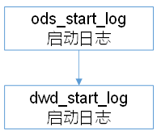

# 数仓搭建-DWD层
1）对用户行为数据解析
2）对核心数据进行判空过滤。
3）对业务数据采用**维度模型**重新建模，即**维度退化**。

# DWD层（启动表数据解析）
DWD层（用户行为启动表数据解析）


## 创建启动表
**说明：数据采用parquet存储方式，是可以支持切片的，不需要再对数据创建索引。**

建表语句
```sql
drop table if exists dwd_start_log;

create external table dwd_start_log(
    `mid_id` string comment '设备唯一标识',
    `user_id` string comment '用户标识',
    `version_code` string comment '程序版本号',
    `version_name` string comment '程序版本名',
    `lang` string comment '系统语言',
    `source` string comment '渠道号,应用从哪个渠道来的', 
    `os` string comment '安卓系统版本',
    `area` string comment '区域',
    `model` string comment '手机型号',
    `brand` string comment '手机品牌', 
    `sdk_version` string comment 'sdkVersion',
    `gmail` string comment 'gmail谷歌邮箱', 
    `height_width` string comment '屏幕宽高', 
    `app_time` string comment '客户端日志产生时的时间',
    `network` string comment '网络模式', 
    `lng` string comment '经度',
    `lat` string comment '纬度',
    `entry` string comment '入口：push=1，widget=2，icon=3，notification=4, lockscreen_widget =5', 
    `open_ad_type` string comment '开屏广告类型: 开屏原生广告=1, 开屏插屏广告=2', 
    `action` string comment '状态：成功=1  失败=2',
    `loading_time` string comment '加载时长：计算下拉开始到接口返回数据的时间',
    `detail` string comment '失败码（没有则上报空）', 
    `extend1` string comment '失败的message（没有则上报空）'
)
partitioned by (dt string)
stored as parquet
location '/warehouse/gmall/dwd/dwd_start_log'
tblproperties('parquet.compression'='lzo');
```

## josn解析测试
```sql
select get_json_object(line,'$.mid') from ods_start_log limit 5;
select json_tuple(line,'mid','uid') as (mid,uid)from ods_start_log limit 5;
select line,mid,uid from ods_start_log lateral view json_tuple(line,'mid','uid')  tmp as mid,uid limit 5;
select mid,uid from ods_start_log lateral view json_tuple(line,'mid','uid')  tmp as mid,uid limit 5;
```

## 向启动表导入数据
**load时table前带into，insert时前不带into**。

插入时的语法`insert into`和`insert overwrite`。没有`insert overwrite into`。
```sql
insert overwrite table dwd_start_log partition(dt='2020-03-10')
select
    json_tuple(line,'mid','uid','vc','vn','l','sr','os','ar','md','ba','sv','g','hw','t','nw','ln','la','entry','open_ad_type','action','loading_time','detail','extend1') 
    as (mid_id,user_id,version_code,version_name,lang,source,os,area,model,brand,sdk_version,gmail,height_width,app_time,network,lng,lat,entry,open_ad_type,action,loading_time,detail,extend1)
from ods_start_log where dt='2020-03-10';
```

```sql
# 第一次分区我写错了
alter table dwd_start_log drop partition (dt='2019-02-10');
```

测试
```
hive (gmall)> select * from dwd_start_log where dt='2020-03-10' limit 5;
```

## 加载数据脚本
创建ods_to_dwd_start_log.sh执行解析ods层启动日志到dwd层。
```
[hadoop@hadoop101 hive-mr-script]$ vi ods_to_dwd_start_log.sh
```

内容：
```sh
#!/bin/bash

hive=/opt/module/hive-2.3.6/bin/hive
hive_db=gmall

# 如果是输入的日期按照取输入日期；如果没输入日期取当前时间的前一天
if [[ -n "$1" ]]; then
    do_date=$1
else
    do_date=`date -d '-1 day' +%F`
fi

if [ ${#do_date} -ne 10 ];then
    echo "日期格式不正确"
    exit
fi

echo "===日志日期为 $do_date==="

sql="
use $hive_db;

insert overwrite table dwd_start_log partition(dt='$do_date')
select
    json_tuple(line,'mid','uid','vc','vn','l','sr','os','ar','md','ba','sv','g','hw','t','nw','ln','la','entry','open_ad_type','action','loading_time','detail','extend1') 
    as (mid_id,user_id,version_code,version_name,lang,source,os,area,model,brand,sdk_version,gmail,height_width,app_time,network,lng,lat,entry,open_ad_type,action,loading_time,detail,extend1)
from ods_start_log where dt='$do_date';
"

#echo "$sql"

$hive -e "$sql"

```

脚本测试：
```
[hadoop@hadoop101 hive-mr-script]$ ./ods_to_dwd_start_log.sh 2020-03-11
```

查看导入数据
```sql
hive (gmall)> select * from dwd_start_log where dt='2020-03-11' limit 5;
```


