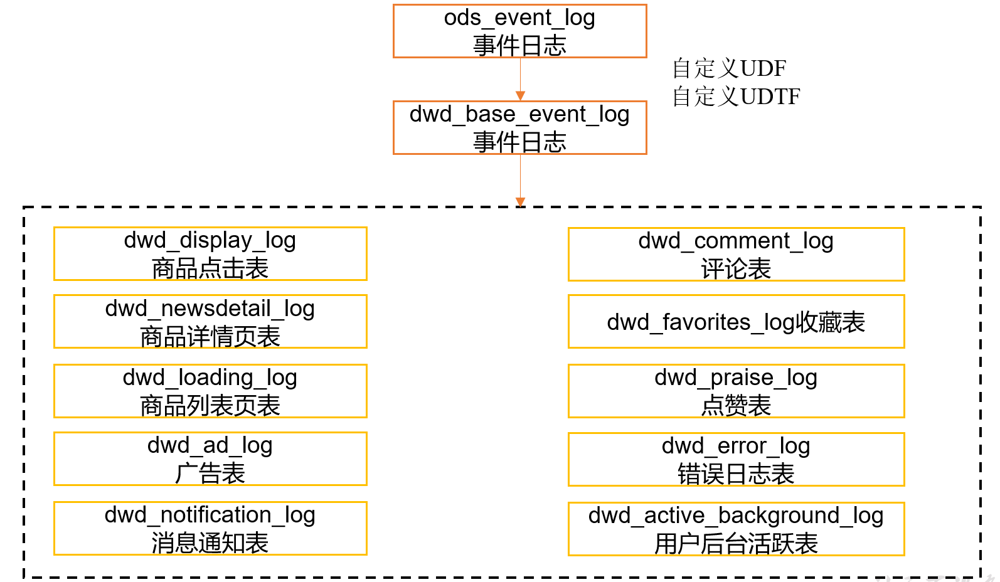
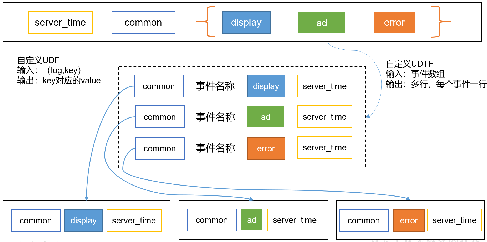
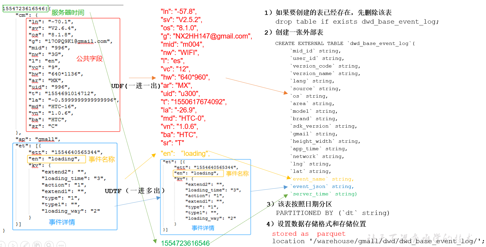
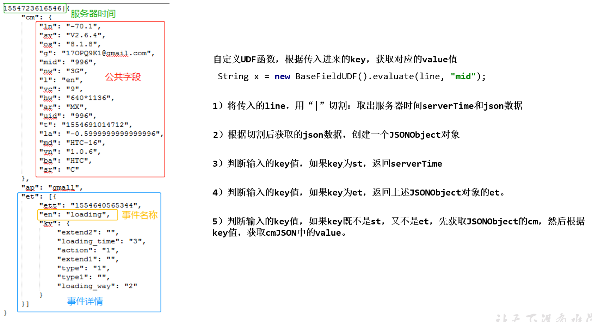
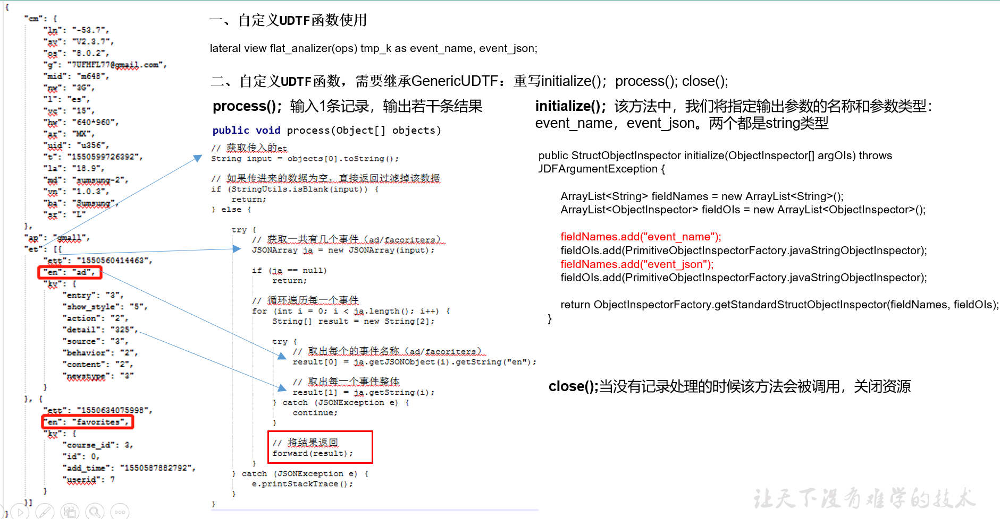

# DWD层（用户行为事件表数据解析）



## 创建基础明细表
明细表用于存储ODS层原始表转换过来的明细数据。


创建事件日志基础明细表：
```sql
drop table if exists dwd_base_event_log;

create external table if not exists dwd_base_event_log(
    `mid_id` string comment '设备唯一标识',
    `user_id` string comment '用户标识',
    `version_code` string comment '程序版本号',
    `version_name` string comment '程序版本名',
    `lang` string comment '系统语言',
    `source` string comment '渠道号,应用从哪个渠道来的', 
    `os` string comment '安卓系统版本',
    `area` string comment '区域',
    `model` string comment '手机型号',
    `brand` string comment '手机品牌', 
    `sdk_version` string comment 'sdkVersion',
    `gmail` string comment 'gmail谷歌邮箱', 
    `height_width` string comment '屏幕宽高', 
    `app_time` string comment '客户端日志产生时的时间',
    `network` string comment '网络模式', 
    `lng` string comment '经度',
    `lat` string comment '纬度',
    `event_name` string comment '事件名称',
    `event_json` string comment 'event_json',
    `server_time` string comment '服务器时间'
)
partitioned by (`dt` string)
stored as parquet
location '/warehouse/gmall/dwd/dwd_base_event_log/'
tblproperties('parquet.compression'='lzo');
```
说明：其中event_name和event_json用来对应事件名和整个事件。这个地方将原始日志1对多的形式拆分出来了。操作的时候我们需要将原始日志展平，需要用到UDF和UDTF。


## 自定义函数引入依赖
创建一个maven工程：hiveFunc

pom文件：
```xml
<?xml version="1.0" encoding="UTF-8"?>
<project xmlns="http://maven.apache.org/POM/4.0.0"
         xmlns:xsi="http://www.w3.org/2001/XMLSchema-instance"
         xsi:schemaLocation="http://maven.apache.org/POM/4.0.0 http://maven.apache.org/xsd/maven-4.0.0.xsd">
    <modelVersion>4.0.0</modelVersion>

    <groupId>com.ecdw2.hive</groupId>
    <artifactId>hiveFunc</artifactId>
    <version>1.0-SNAPSHOT</version>

    <properties>
        <project.build.sourceEncoding>UTF-8</project.build.sourceEncoding>
        <project.reporting.outputEncoding>UTF-8</project.reporting.outputEncoding>
        <maven.compiler.source>1.8</maven.compiler.source>
        <maven.compiler.target>1.8</maven.compiler.target>
        <hive.version>2.3.0</hive.version>
    </properties>

    <dependencies>
        <!--添加hive依赖-->
        <dependency>
            <groupId>org.apache.hive</groupId>
            <artifactId>hive-exec</artifactId>
            <version>${hive.version}</version>
            <scope>provided</scope>
        </dependency>
        
        <!--json解析-->
        <dependency>
            <groupId>com.fasterxml.jackson.core</groupId>
            <artifactId>jackson-databind</artifactId>
            <version>2.10.0</version>
        </dependency>
    </dependencies>

    <build>
        <finalName>hive-func</finalName>
        <plugins>
            <plugin>
                <groupId>org.apache.maven.plugins</groupId>
                <artifactId>maven-compiler-plugin</artifactId>
                <version>3.0</version>
            </plugin>

            <plugin>
                <artifactId>maven-assembly-plugin</artifactId>
                <version>2.5.5</version>
                <configuration>
                    <descriptorRefs>
                        <descriptorRef>jar-with-dependencies</descriptorRef>
                    </descriptorRefs>
                </configuration>
                <executions>
                    <execution>
                        <id>make-zip</id>
                        <!-- 绑定到package生命周期阶段上 -->
                        <phase>package</phase>
                        <goals>
                            <!-- 绑定到package生命周期阶段上 -->
                            <goal>single</goal>
                        </goals>
                    </execution>
                </executions>
            </plugin>
        </plugins>
    </build>
</project>
```


## 自定义UDF函数（解析公共字段）
UDF函数特点：一行进一行出。简称，一进一出。


```java
package com.ecdw2.hive.udf;

import com.fasterxml.jackson.databind.JsonNode;
import com.fasterxml.jackson.databind.ObjectMapper;
import org.apache.hadoop.hive.ql.exec.UDF;


/**
 * UDF的注释说的很清楚，自定义UDF只需要定义一个有返回值的evaluate方法即可，
 *
 * fasterxml.jackson的JsonNode使用toString获得字符串的时候有个坑：会带引号，
 * asText方法不会，但是只能获得单个字符串的类型，josn对象和数据asText都返回空字符串。
 * 早知道不用fasterxml.jackson了。
 */
public class BaseFieldUDF extends UDF{
    public static final ObjectMapper mapper = new ObjectMapper();

    /**
     * 如果key为st，返回serverTime服务器时间
     * 如果key为et，返回上述事件行为json数组
     * 否则根据key获取公共字段
     *
     * @param eventLine
     * @param key
     * @return
     */
    public String evaluate(String eventLine, String key){
        if(eventLine == null || eventLine.isEmpty() || key == null || key.isEmpty()){
            return null;
        }

        String[] logContents = eventLine.trim().split("\\|");
        if (logContents.length != 2){
            return null;
        }

        if("st".equals(key)){
            return logContents[0];
        }else {
            try {
                JsonNode jsonNode = mapper.readTree(logContents[1]);
                if("et".equals(key)){
                    JsonNode node = jsonNode.get(key);
                    //造数据的问题，有可能没有
                    if(node == null){
                        return "[]";
                    }else {
                        return jsonNode.get(key).toString();
                    }
                }else {
                    JsonNode node = jsonNode.get("cm");
                    return node.get(key).asText();
                }

            } catch (Exception e) {
                e.printStackTrace();
            }
        }

        return null;
    }

    /**
     * 测试，记得把hive的<scope>provided</scope>注释了
     * @param args
     */
    public static void main(String[] args) throws Exception{
        String line = "1593605753538|{\"cm\":{\"ln\":\"-57.9\",\"sv\":\"V2.6.5\",\"os\":\"8.2.5\",\"g\":\"823501BA@gmail.com\",\"mid\":\"6\",\"nw\":\"WIFI\",\"l\":\"es\",\"vc\":\"6\",\"hw\":\"750*1134\",\"ar\":\"MX\",\"uid\":\"6\",\"t\":\"1593601011266\",\"la\":\"-28.5\",\"md\":\"HTC-2\",\"vn\":\"1.1.2\",\"ba\":\"HTC\",\"sr\":\"U\"},\"ap\":\"app\",\"et\":[{\"ett\":\"1593571525608\",\"en\":\"loading\",\"kv\":{\"extend2\":\"\",\"loading_time\":\"42\",\"action\":\"3\",\"extend1\":\"\",\"type\":\"3\",\"type1\":\"\",\"loading_way\":\"1\"}},{\"ett\":\"1593536178400\",\"en\":\"notification\",\"kv\":{\"ap_time\":\"1593534274739\",\"action\":\"1\",\"type\":\"1\",\"content\":\"\"}},{\"ett\":\"1593525033583\",\"en\":\"active_foreground\",\"kv\":{\"access\":\"1\",\"push_id\":\"3\"}},{\"ett\":\"1593576782616\",\"en\":\"favorites\",\"kv\":{\"course_id\":3,\"id\":0,\"add_time\":\"1593541988273\",\"userid\":9}},{\"ett\":\"1593554021262\",\"en\":\"praise\",\"kv\":{\"target_id\":2,\"id\":8,\"type\":1,\"add_time\":\"1593566071509\",\"userid\":5}}]}";
        BaseFieldUDF udf = new BaseFieldUDF();

        System.out.println(udf.evaluate(line, "st"));
        System.out.println(udf.evaluate(line, "et"));
        System.out.println(udf.evaluate(line, "mid"));
        System.out.println(udf.evaluate(line, "g"));

        JsonNode jsonNodes = mapper.readTree(udf.evaluate(line, "et"));
        for (int i = 0; i < jsonNodes.size(); i++) {
            JsonNode node = jsonNodes.get(i);
            String eventName = node.get("en").asText();
            String eventJson = node.toString();
            System.out.println(eventName + " , " + eventJson);
        }
    }

}

```

## 自定义UDTF函数（解析事件字段）
UDTF函数特点：多行进多行出。 简称，多进多出。


```java
package com.ecdw2.hive.udtf;

import com.fasterxml.jackson.databind.JsonNode;
import com.fasterxml.jackson.databind.ObjectMapper;
import org.apache.hadoop.hive.ql.exec.UDFArgumentException;
import org.apache.hadoop.hive.ql.metadata.HiveException;
import org.apache.hadoop.hive.ql.udf.generic.GenericUDTF;
import org.apache.hadoop.hive.serde2.objectinspector.ObjectInspector;
import org.apache.hadoop.hive.serde2.objectinspector.ObjectInspectorFactory;
import org.apache.hadoop.hive.serde2.objectinspector.StructObjectInspector;
import org.apache.hadoop.hive.serde2.objectinspector.primitive.PrimitiveObjectInspectorFactory;

import java.util.ArrayList;

/**
 * 其实udtf就是可以返回多个列，既可以返回一行数据也可以返回多行数据。
 * 这里返回多行数据，每行为时间的名称和时间的json字符串。
 * UDTF的输入参数是object数据
 *
 * javaStringObjectInspector一定要和输出的类型对应，不然不会输出。
 * 刚开始复制的writableStringObjectInspector输出string不行，人家输出的hadoop的text，而我输出的是string
 * string要用javaStringObjectInspector
 */
public class EventJsonArrayUDTF extends GenericUDTF {
    public static final ObjectMapper mapper = new ObjectMapper();
    // 这个初始化一次就行，GenericUDTFExplode中就是这样
    private transient final String[] forwardObj = new String[2];

    //就重写这个就行，hive默认的udtf就是重写的这个，不知道为啥标记@Deprecated
    @Override
    public StructObjectInspector initialize(ObjectInspector[] args)
            throws UDFArgumentException {
        if (args.length != 1) {
            throw new UDFArgumentException("takes only one argument");
        }

        // construct output object inspector
        ArrayList<String> fieldNames = new ArrayList<String>(2);
        ArrayList<ObjectInspector> fieldOIs = new ArrayList<ObjectInspector>(2);

        fieldNames.add("event_name");
        fieldOIs.add(PrimitiveObjectInspectorFactory.javaStringObjectInspector);
        fieldNames.add("event_json");
        fieldOIs.add(PrimitiveObjectInspectorFactory.javaStringObjectInspector);


        return ObjectInspectorFactory.getStandardStructObjectInspector(fieldNames, fieldOIs);
    }

    @Override
    public void process(Object[] args) throws HiveException {
        String jsonArray = args[0].toString();

        try {
            JsonNode jsonNodes = mapper.readTree(jsonArray);
            for (int i = 0; i < jsonNodes.size(); i++) {
                JsonNode node = jsonNodes.get(i);
                String eventName = node.get("en").asText();
                String eventJson = node.toString();

                forwardObj[0] = eventName;
                forwardObj[1] = eventJson;
                forward(forwardObj);
            }

        } catch (Exception e) {
            e.printStackTrace();
        }
    }

    @Override
    public void close() throws HiveException {

    }
}

```

## 函数测试

```sql
add jar /home/hadoop/bigdata-project/ecdw/hive-func/hive-func-jar-with-dependencies.jar;
create temporary function event_base_field as 'com.ecdw2.hive.udf.BaseFieldUDF';
create temporary function event_json_explode as 'com.ecdw2.hive.udtf.EventJsonArrayUDTF';
```

```sql
select event_base_field(line, 'st'), event_base_field(line, 'uid') l  from ods_event_log where dt='2020-03-10' limit 3;
select event_base_field(line, 'et') l  from ods_event_log where dt='2020-03-10' limit 3;
```

```sql
-- udtf写在前面时as重命名必须带括号
select event_json_explode(event_base_field(line, 'et')) as (name, event_json) from ods_event_log where dt='2020-03-10' limit 3;

-- udtf写在后面时as重命名必须不带带括号，但是lateral view必须在table_name之后，where就必须放在最后
select name, event_json from ods_event_log lateral view event_json_explode(event_base_field(line, 'et')) tmp as name, event_json limit 3;

-- 可以这样
select name, event_json from (select * from ods_event_log where dt='2020-03-10') a lateral view event_json_explode(event_base_field(line, 'et')) tmp as name, event_json limit 3;
```

## 直接用一个UDTF搞定
前面的定义UDF和UDTF也有测试的意思，其实直接用一个UDTF就可以搞定，而且效率肯定更高。

这个模仿官方解析json的函数，使用writableStringObjectInspector和org.apache.hadoop.io.Text。
```java
package com.ecdw2.hive.udtf;

import org.apache.hadoop.hive.ql.exec.UDFArgumentException;
import org.apache.hadoop.hive.ql.metadata.HiveException;
import org.apache.hadoop.hive.ql.udf.generic.GenericUDTF;
import org.apache.hadoop.hive.serde2.objectinspector.ObjectInspector;
import org.apache.hadoop.hive.serde2.objectinspector.ObjectInspectorFactory;
import org.apache.hadoop.hive.serde2.objectinspector.StructObjectInspector;
import org.apache.hadoop.hive.serde2.objectinspector.primitive.PrimitiveObjectInspectorFactory;
import org.apache.hadoop.io.Text;
import org.json.JSONArray;
import org.json.JSONObject;

import java.util.ArrayList;

/**
 * 直接用一个UDTF解析日志输出所有的字段。
 * 这个模仿官方解析json的函数，使用writableStringObjectInspector和org.apache.hadoop.io.Text。
 */
public class EventLogUDTF extends GenericUDTF {
    private transient Text[] retCols; // array of returned column values
    // 这个就不要了，是个对象池，GenericUDTFJSONTuple中使用了，考虑到数据比较规范，不会解析到null，就先不用了。
    //object pool of non-null Text, avoid creating objects all the time
    //private transient Text[] cols;

    //就重写这个就行，hive默认的udtf就是重写的这个，不知道为啥标记@Deprecated
    @Override
    public StructObjectInspector initialize(ObjectInspector[] args)
            throws UDFArgumentException {
        if (args.length != 1) {
            throw new UDFArgumentException("takes only one argument");
        }

        // construct output object inspector
        ArrayList<String> fieldNames = new ArrayList<String>(2);
        ArrayList<ObjectInspector> fieldOIs = new ArrayList<ObjectInspector>(2);

        fieldNames.add("mid_id");// 设备唯一标识
        fieldOIs.add(PrimitiveObjectInspectorFactory.writableStringObjectInspector);
        fieldNames.add("user_id");// 用户标识
        fieldOIs.add(PrimitiveObjectInspectorFactory.writableStringObjectInspector);
        fieldNames.add("version_code");// 程序版本号
        fieldOIs.add(PrimitiveObjectInspectorFactory.writableStringObjectInspector);
        fieldNames.add("version_name");// 程序版本名
        fieldOIs.add(PrimitiveObjectInspectorFactory.writableStringObjectInspector);
        fieldNames.add("lang");// 系统语言
        fieldOIs.add(PrimitiveObjectInspectorFactory.writableStringObjectInspector);
        fieldNames.add("source");// 渠道号,应用从哪个渠道来的
        fieldOIs.add(PrimitiveObjectInspectorFactory.writableStringObjectInspector);
        fieldNames.add("os");// 安卓系统版本
        fieldOIs.add(PrimitiveObjectInspectorFactory.writableStringObjectInspector);
        fieldNames.add("area");// 区域
        fieldOIs.add(PrimitiveObjectInspectorFactory.writableStringObjectInspector);
        fieldNames.add("model");// 手机型号
        fieldOIs.add(PrimitiveObjectInspectorFactory.writableStringObjectInspector);
        fieldNames.add("brand");// 手机品牌
        fieldOIs.add(PrimitiveObjectInspectorFactory.writableStringObjectInspector);
        fieldNames.add("sdk_version");// sdkVersion
        fieldOIs.add(PrimitiveObjectInspectorFactory.writableStringObjectInspector);
        fieldNames.add("gmail");// gmail谷歌邮箱
        fieldOIs.add(PrimitiveObjectInspectorFactory.writableStringObjectInspector);
        fieldNames.add("height_width");// 屏幕宽高
        fieldOIs.add(PrimitiveObjectInspectorFactory.writableStringObjectInspector);
        fieldNames.add("app_time");// 客户端日志产生时的时间
        fieldOIs.add(PrimitiveObjectInspectorFactory.writableStringObjectInspector);
        fieldNames.add("network");// 网络模式
        fieldOIs.add(PrimitiveObjectInspectorFactory.writableStringObjectInspector);
        fieldNames.add("lng");// 经度
        fieldOIs.add(PrimitiveObjectInspectorFactory.writableStringObjectInspector);
        fieldNames.add("lat");// 纬度
        fieldOIs.add(PrimitiveObjectInspectorFactory.writableStringObjectInspector);
        fieldNames.add("event_name");// 事件名称
        fieldOIs.add(PrimitiveObjectInspectorFactory.writableStringObjectInspector);
        fieldNames.add("event_json");// event_json
        fieldOIs.add(PrimitiveObjectInspectorFactory.writableStringObjectInspector);
        fieldNames.add("server_time");// 服务器时间
        fieldOIs.add(PrimitiveObjectInspectorFactory.writableStringObjectInspector);

        int numCols = 20;
        retCols = new Text[numCols];
        for (int i = 0; i < numCols; ++i) {
            retCols[i] = new Text();
        }

        return ObjectInspectorFactory.getStandardStructObjectInspector(fieldNames, fieldOIs);
    }

    @Override
    public void process(Object[] args) throws HiveException {
        String log = args[0].toString();

        if(log == null || log.isEmpty()){
            return;
        }

        String[] logContents = log.trim().split("\\|");
        if (logContents.length != 2){
            return;
        }

        try {
            JSONObject eventLog = new JSONObject(logContents[1]);
            if(!eventLog.has("cm") || !eventLog.has("et")){
                return;
            }

            JSONObject common = eventLog.getJSONObject("cm");
            JSONArray events = eventLog.getJSONArray("et");

            retCols[0].set(common.getString("mid"));// mid_id：设备唯一标识
            retCols[1].set(common.getString("uid"));// user_id：用户标识
            retCols[2].set(common.getString("vc"));// version_code：程序版本号
            retCols[3].set(common.getString("vn"));// version_name：程序版本名
            retCols[4].set(common.getString("l"));// lang：系统语言
            retCols[5].set(common.getString("sr"));// source：渠道号,应用从哪个渠道来的
            retCols[6].set(common.getString("os"));// os：安卓系统版本
            retCols[7].set(common.getString("ar"));// area：区域
            retCols[8].set(common.getString("md"));// model：手机型号
            retCols[9].set(common.getString("ba"));// brand：手机品牌
            retCols[10].set(common.getString("sv"));// sdk_version：sdkVersion
            retCols[11].set(common.getString("g"));// gmail：gmail谷歌邮箱
            retCols[12].set(common.getString("hw"));// height_width：屏幕宽高
            retCols[13].set(common.getString("t"));// app_time：客户端日志产生时的时间
            retCols[14].set(common.getString("nw"));// network：网络模式
            retCols[15].set(common.getString("ln"));// lng：经度
            retCols[16].set(common.getString("la"));// lat：纬度
            retCols[19].set(logContents[0]);// server_time：服务器时间

            for (int i = 0; i < events.length(); i++) {
                JSONObject event = events.getJSONObject(i);
                retCols[17].set(event.getString("en"));// event_name：事件名称
                retCols[18].set(event.toString());// event_json：event_json

                forward(retCols);
            }

        } catch (Exception e) {
            e.printStackTrace();
        }

    }

    @Override
    public void close() throws HiveException {

    }

}

```

## 函数测试

```sql
add jar /home/hadoop/bigdata-project/ecdw/hive-func/hive-func-jar-with-dependencies.jar;
create temporary function event_log_tuple as 'com.ecdw2.hive.udtf.EventLogUDTF';
```

```sql
select event_log_tuple(line) from ods_event_log where dt='2020-03-10' limit 3;

select event_log_tuple(line) from (select line from ods_event_log where dt='2020-03-10' limit 3) a;

select mid_id,event_name,event_json from ods_event_log lateral view event_log_tuple(line) tmp where dt='2020-03-10' limit 3;

-- udtf写在前面时as重命名必须带括号
select event_log_tuple(line) as (mid_id,user_id,version_code,version_name,lang,source,os,area,model,brand,sdk_version,gmail,height_width,app_time,network,lng,lat,event_name,event_json,server_time) from ods_event_log where dt='2020-03-10' limit 3;

-- udtf写在后面时as重命名必须不带带括号，但是lateral view必须在table_name之后，where就必须放在最后
select mid_id,event_name,event_json from ods_event_log lateral view event_log_tuple(line) tmp as  mid_id,user_id,version_code,version_name,lang,source,os,area,model,brand,sdk_version,gmail,height_width,app_time,network,lng,lat,event_name,event_json,server_time where dt='2020-03-10' limit 3;
```

## DWD层数据解析脚本
创建ods_to_dwd_base_event_log.sh
```
[hadoop@hadoop101 hive-mr-script]$ vi ods_to_dwd_base_event_log.sh
```


内容：
```sh
#!/bin/bash

hive=/opt/module/hive-2.3.6/bin/hive
hive_db=gmall

# 如果是输入的日期按照取输入日期；如果没输入日期取当前时间的前一天
if [[ -n "$1" ]]; then
    do_date=$1
else
    do_date=`date -d '-1 day' +%F`
fi

if [ ${#do_date} -ne 10 ];then
    echo "日期格式不正确"
    exit
fi

echo "===日志日期为 $do_date==="

sql="
use $hive_db;

add jar /home/hadoop/bigdata-project/ecdw/hive-func/hive-func-jar-with-dependencies.jar;
create temporary function event_log_tuple as 'com.ecdw2.hive.udtf.EventLogUDTF';

insert overwrite table dwd_base_event_log partition(dt='$do_date')
select
    event_log_tuple(line)
from ods_event_log where dt='$do_date';
"

#echo "$sql"

$hive -e "$sql"

```

脚本测试：
```
[hadoop@hadoop101 hive-mr-script]$ ./ods_to_dwd_base_event_log.sh 2020-03-10

[hadoop@hadoop101 hive-mr-script]$ ./ods_to_dwd_base_event_log.sh 2020-03-11
```

查看导入数据
```sql
/opt/module/hive-2.3.6/bin/hive -e "select * from gmall.dwd_base_event_log where dt='2020-03-10' limit 5"
```


```

```