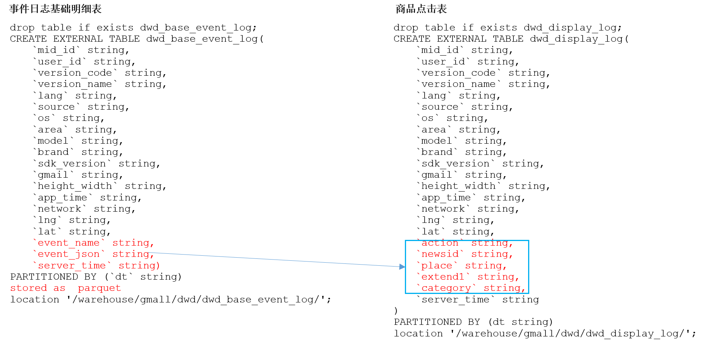

# DWD层（用户行为事件表获取）


## 商品列表页表(loading)

### 建表语句
```sql
drop table if exists dwd_loading_log;

create external table if not exists dwd_loading_log(
    `mid_id` string comment '设备唯一标识',
    `user_id` string comment '用户标识',
    `version_code` string comment '程序版本号',
    `version_name` string comment '程序版本名',
    `lang` string comment '系统语言',
    `source` string comment '渠道号,应用从哪个渠道来的', 
    `os` string comment '安卓系统版本',
    `area` string comment '区域',
    `model` string comment '手机型号',
    `brand` string comment '手机品牌', 
    `sdk_version` string comment 'sdkVersion',
    `gmail` string comment 'gmail谷歌邮箱', 
    `height_width` string comment '屏幕宽高', 
    `app_time` string comment '客户端日志产生时的时间',
    `network` string comment '网络模式', 
    `lng` string comment '经度',
    `lat` string comment '纬度',
    `action` string comment '动作：开始加载=1，加载成功=2，加载失败=3',
    `loading_time` string comment '加载时长：计算下拉开始到接口返回数据的时间，（开始加载报0，加载成功或加载失败才上报时间）',
    `loading_way` string comment '加载类型：1-读取缓存，2-从接口拉新数据（加载成功才上报加载类型）',
    `extend1` string comment '扩展字段 Extend1',
    `extend2` string comment '扩展字段 Extend2',
    `type` string comment '加载类型：自动加载=1，用户下拽加载=2，底部加载=3（底部条触发点击底部提示条/点击返回顶部加载）',
    `type1` string comment '加载失败码：把加载失败状态码报回来（报空为加载成功，没有失败）',
    `event_time` string comment '客户端事件产生时间',
    `server_time` string comment '服务器时间'
)
partitioned by (`dt` string)
stored as parquet
location '/warehouse/gmall/dwd/dwd_loading_log/'
tblproperties('parquet.compression'='lzo');
```

### 导入数据
查询测试：
```sql
show functions like '*unix*';

--测试
select
    get_json_object(event_json, '$.kv.action'),
    get_json_object(event_json, '$.kv.loading_time'), 
    get_json_object(event_json, '$.kv.loading_way'),
    get_json_object(event_json, '$.kv.extend1'), 
    get_json_object(event_json, '$.kv.extend2'), 
    get_json_object(event_json, '$.kv.type'), 
    get_json_object(event_json, '$.kv.type1'), 
    get_json_object(event_json, '$.ett'), 
    -- 可以直接对字符串做除法，会自动转换，但是除法的返回值都是double，要转成int才可以成为from_unixtime的参数
    from_unixtime( cast(get_json_object(event_json, '$.ett')/1000 as bigint) ),
    server_time
from dwd_base_event_log
where dt='2020-03-10' and event_name='loading' limit 3;

-- 不行：json_tuple只能获取一层，真要追求效率的话可以自己写UDTF
select
    json_tuple(event_json, 'kv.action', 'kv.loading_time', 'kv.loading_way', 'kv.extend1', 'kv.extend2', 'ett')
from dwd_base_event_log
where dt = '2020-03-10' and event_name='loading' limit 3;

-- get_json_object实现
select
    mid_id,user_id,version_code,version_name,lang,source,os,area,model,brand,sdk_version,gmail,height_width,app_time,network,lng,lat,
    get_json_object(event_json, '$.kv.action'),
    get_json_object(event_json, '$.kv.loading_time'), 
    get_json_object(event_json, '$.kv.loading_way'),
    get_json_object(event_json, '$.kv.extend1'), 
    get_json_object(event_json, '$.kv.extend2'), 
    get_json_object(event_json, '$.kv.type'), 
    get_json_object(event_json, '$.kv.type1'), 
    from_unixtime( cast(get_json_object(event_json, '$.ett')/1000 as bigint) ), 
    from_unixtime(cast(server_time/1000 as bigint))
from dwd_base_event_log
where dt = '2020-03-10' and event_name='loading' limit 3;

-- json_tuple实现
select
    a.mid_id,a.user_id,a.version_code,a.version_name,a.lang,a.source,a.os,a.area,a.model,a.brand,a.sdk_version,a.gmail,a.height_width,a.app_time,a.network,a.lng,a.lat,
    b.action,b.loading_time,b.loading_way,b.extend1,b.extend2, b.type,b.type1,
    from_unixtime(cast(get_json_object(a.event_json, '$.ett')/1000 as bigint)) event_time,
    from_unixtime(cast(a.server_time/1000 as bigint)) server_time
from dwd_base_event_log a lateral view json_tuple(get_json_object(a.event_json, '$.kv'), 'action', 'loading_time', 'loading_way', 'extend1', 'extend2', 'type', 'type1') b as action, loading_time, loading_way, extend1, extend2, type, type1
where dt = '2020-03-10' and event_name='loading' limit 3;
```

导入数据：
```sql
insert overwrite table dwd_loading_log partition(dt='2020-03-10')
select
    a.mid_id,a.user_id,a.version_code,a.version_name,a.lang,a.source,a.os,a.area,a.model,a.brand,a.sdk_version,a.gmail,a.height_width,a.app_time,a.network,a.lng,a.lat,
    b.action,b.loading_time,b.loading_way,b.extend1,b.extend2, b.type,b.type1,
    from_unixtime(cast(get_json_object(a.event_json, '$.ett')/1000 as bigint)) event_time,
    from_unixtime(cast(a.server_time/1000 as bigint)) server_time
from dwd_base_event_log a lateral view json_tuple(get_json_object(a.event_json, '$.kv'), 'action', 'loading_time', 'loading_way', 'extend1', 'extend2', 'type', 'type1') b as action, loading_time, loading_way, extend1, extend2, type, type1
where dt = '2020-03-10' and event_name='loading';
```

查看：
```
select * from dwd_loading_log where dt='2020-03-10' limit 2;
```


## 商品点击表(display)

### 建表语句

```sql
drop table if exists dwd_display_log;

create external table if not exists dwd_display_log(
    `mid_id` string comment '设备唯一标识',
    `user_id` string comment '用户标识',
    `version_code` string comment '程序版本号',
    `version_name` string comment '程序版本名',
    `lang` string comment '系统语言',
    `source` string comment '渠道号,应用从哪个渠道来的', 
    `os` string comment '安卓系统版本',
    `area` string comment '区域',
    `model` string comment '手机型号',
    `brand` string comment '手机品牌', 
    `sdk_version` string comment 'sdkVersion',
    `gmail` string comment 'gmail谷歌邮箱', 
    `height_width` string comment '屏幕宽高', 
    `app_time` string comment '客户端日志产生时的时间',
    `network` string comment '网络模式', 
    `lng` string comment '经度',
    `lat` string comment '纬度',
    `action` string comment '动作：曝光商品=1，点击商品=2',
    `goodsid` string comment '商品ID（服务端下发的ID）',
    `place` string comment '顺序（第几条商品，第一条为0，第二条为1，如此类推）',
    `extend1` string comment '曝光类型：1 - 首次曝光 2-重复曝光',
    `category` string comment '分类ID（服务端定义的分类ID）',
    `event_time` string comment '客户端事件产生时间',
    `server_time` string comment '服务器时间'
)
partitioned by (`dt` string)
stored as parquet
location '/warehouse/gmall/dwd/dwd_display_log/'
tblproperties('parquet.compression'='lzo');
```

### 导入数据
查询测试：
```sql
show functions like '*unix*';

--测试
select
    get_json_object(event_json, '$.kv.action'),
    get_json_object(event_json, '$.kv.goodsid'), 
    get_json_object(event_json, '$.kv.place'),
    get_json_object(event_json, '$.kv.extend1'), 
    get_json_object(event_json, '$.kv.category'), 
    get_json_object(event_json, '$.ett'), 
    -- 可以直接对字符串做除法，会自动转换，但是除法的返回值都是double，要转成int才可以成为from_unixtime的参数
    from_unixtime( cast(get_json_object(event_json, '$.ett')/1000 as bigint) ),
    server_time
from dwd_base_event_log
where dt='2020-03-10' and event_name='display' limit 3;

-- 不行：json_tuple只能获取一层，真要追求效率的话可以自己写UDTF
select
    json_tuple(event_json, 'kv.action', 'kv.goodsid', 'kv.place', 'kv.extend1', 'kv.category', 'ett')
from dwd_base_event_log
where dt = '2020-03-10' and event_name='display' limit 3;

-- get_json_object实现
select
    mid_id,user_id,version_code,version_name,lang,source,os,area,model,brand,sdk_version,gmail,height_width,app_time,network,lng,lat,
    get_json_object(event_json, '$.kv.action'),
    get_json_object(event_json, '$.kv.goodsid'), 
    get_json_object(event_json, '$.kv.place'),
    get_json_object(event_json, '$.kv.extend1'), 
    get_json_object(event_json, '$.kv.category'), 
    from_unixtime( cast(get_json_object(event_json, '$.ett')/1000 as bigint) ), 
    from_unixtime(cast(server_time/1000 as bigint))
from dwd_base_event_log
where dt = '2020-03-10' and event_name='display' limit 3;

-- json_tuple实现
select
    a.mid_id,a.user_id,a.version_code,a.version_name,a.lang,a.source,a.os,a.area,a.model,a.brand,a.sdk_version,a.gmail,a.height_width,a.app_time,a.network,a.lng,a.lat,
    b.action,b.goodsid,b.place,b.extend1,b.category, 
    from_unixtime(cast(get_json_object(a.event_json, '$.ett')/1000 as bigint)) event_time,
    from_unixtime(cast(a.server_time/1000 as bigint)) server_time
from dwd_base_event_log a lateral view json_tuple(get_json_object(a.event_json, '$.kv'), 'action', 'goodsid', 'place', 'extend1', 'category') b as action,goodsid,place,extend1,category
where dt = '2020-03-10' and event_name='display' limit 3;
```

导入数据：
```sql
insert overwrite table dwd_display_log partition(dt='2020-03-10')
select
    a.mid_id,a.user_id,a.version_code,a.version_name,a.lang,a.source,a.os,a.area,a.model,a.brand,a.sdk_version,a.gmail,a.height_width,a.app_time,a.network,a.lng,a.lat,
    b.action,b.goodsid,b.place,b.extend1,b.category, 
    from_unixtime(cast(get_json_object(a.event_json, '$.ett')/1000 as bigint)) event_time,
    from_unixtime(cast(a.server_time/1000 as bigint)) server_time
from dwd_base_event_log a lateral view json_tuple(get_json_object(a.event_json, '$.kv'), 'action', 'goodsid', 'place', 'extend1', 'category') b as action,goodsid,place,extend1,category
where dt = '2020-03-10' and event_name='display';
```

查看：
```
select * from dwd_display_log where dt='2020-03-10' limit 2;
```

## 商品详情页表(newsdetail)

### 建表语句

```sql
drop table if exists dwd_newsdetail_log;

create external table if not exists dwd_newsdetail_log(
    `mid_id` string comment '设备唯一标识',
    `user_id` string comment '用户标识',
    `version_code` string comment '程序版本号',
    `version_name` string comment '程序版本名',
    `lang` string comment '系统语言',
    `source` string comment '渠道号,应用从哪个渠道来的', 
    `os` string comment '安卓系统版本',
    `area` string comment '区域',
    `model` string comment '手机型号',
    `brand` string comment '手机品牌', 
    `sdk_version` string comment 'sdkVersion',
    `gmail` string comment 'gmail谷歌邮箱', 
    `height_width` string comment '屏幕宽高', 
    `app_time` string comment '客户端日志产生时的时间',
    `network` string comment '网络模式', 
    `lng` string comment '经度',
    `lat` string comment '纬度',
    `entry` string comment '页面入口来源：应用首页=1、push=2、详情页相关推荐=3',
    `action` string comment '动作：开始加载=1，加载成功=2（pv），加载失败=3, 退出页面=4',
    `goodsid` string comment '商品ID（服务端下发的ID）',
    `showtype` string comment '商品样式：0、无图1、一张大图2、两张图3、三张小图4、一张小图5、一张大图两张小图   来源于详情页相关推荐的商品，上报样式都为0（因为都是左文右图）',
    `news_staytime` string comment '页面停留时长',
    `loading_time` string comment '加载时长：计算页面开始加载到接口返回数据的时间 （开始加载报0，加载成功或加载失败才上报时间）',
    `type1` string comment '加载失败码：把加载失败状态码报回来（报空为加载成功，没有失败）',
    `category` string comment '分类ID（服务端定义的分类ID）',
    `event_time` string comment '客户端事件产生时间',
    `server_time` string comment '服务器时间'
)
partitioned by (`dt` string)
stored as parquet
location '/warehouse/gmall/dwd/dwd_newsdetail_log/'
tblproperties('parquet.compression'='lzo');
```

### 导入数据
查询测试：
```sql
show functions like '*unix*';

-- get_json_object实现
select
    mid_id,user_id,version_code,version_name,lang,source,os,area,model,brand,sdk_version,gmail,height_width,app_time,network,lng,lat,
    get_json_object(event_json, '$.kv.entry'),
    get_json_object(event_json, '$.kv.action'),
    get_json_object(event_json, '$.kv.goodsid'), 
    get_json_object(event_json, '$.kv.showtype'),
    get_json_object(event_json, '$.kv.news_staytime'), 
    get_json_object(event_json, '$.kv.loading_time'), 
    get_json_object(event_json, '$.kv.type1'), 
    get_json_object(event_json, '$.kv.category'),
    from_unixtime( cast(get_json_object(event_json, '$.ett')/1000 as bigint) ), 
    from_unixtime(cast(server_time/1000 as bigint))
from dwd_base_event_log
where dt = '2020-03-10' and event_name='newsdetail' limit 3;

-- json_tuple实现
select
    a.mid_id,a.user_id,a.version_code,a.version_name,a.lang,a.source,a.os,a.area,a.model,a.brand,a.sdk_version,a.gmail,a.height_width,a.app_time,a.network,a.lng,a.lat,
    b.entry,b.action,b.goodsid,b.showtype,b.news_staytime,b.loading_time,b.type1,b.category, 
    from_unixtime(cast(get_json_object(a.event_json, '$.ett')/1000 as bigint)) event_time,
    from_unixtime(cast(a.server_time/1000 as bigint)) server_time
from dwd_base_event_log a lateral view json_tuple(get_json_object(a.event_json, '$.kv'), 'entry', 'action', 'goodsid', 'showtype', 'news_staytime', 'loading_time', 'type1', 'category') b as entry,action,goodsid,showtype,news_staytime,loading_time,type1,category
where dt = '2020-03-10' and event_name='newsdetail' limit 3;
```

导入数据：
```sql
insert overwrite table dwd_newsdetail_log partition(dt='2020-03-10')
select
    a.mid_id,a.user_id,a.version_code,a.version_name,a.lang,a.source,a.os,a.area,a.model,a.brand,a.sdk_version,a.gmail,a.height_width,a.app_time,a.network,a.lng,a.lat,
    b.entry,b.action,b.goodsid,b.showtype,b.news_staytime,b.loading_time,b.type1,b.category, 
    from_unixtime(cast(get_json_object(a.event_json, '$.ett')/1000 as bigint)) event_time,
    from_unixtime(cast(a.server_time/1000 as bigint)) server_time
from dwd_base_event_log a lateral view json_tuple(get_json_object(a.event_json, '$.kv'), 'entry', 'action', 'goodsid', 'showtype', 'news_staytime', 'loading_time', 'type1', 'category') b as entry,action,goodsid,showtype,news_staytime,loading_time,type1,category
where dt = '2020-03-10' and event_name='newsdetail';
```

查看：
```
select * from dwd_newsdetail_log where dt='2020-03-10' limit 2;
```

## 广告表(ad)

### 建表语句

```sql
drop table if exists dwd_ad_log;

create external table if not exists dwd_ad_log(
    `mid_id` string comment '设备唯一标识',
    `user_id` string comment '用户标识',
    `version_code` string comment '程序版本号',
    `version_name` string comment '程序版本名',
    `lang` string comment '系统语言',
    `source` string comment '渠道号,应用从哪个渠道来的', 
    `os` string comment '安卓系统版本',
    `area` string comment '区域',
    `model` string comment '手机型号',
    `brand` string comment '手机品牌', 
    `sdk_version` string comment 'sdkVersion',
    `gmail` string comment 'gmail谷歌邮箱', 
    `height_width` string comment '屏幕宽高', 
    `app_time` string comment '客户端日志产生时的时间',
    `network` string comment '网络模式', 
    `lng` string comment '经度',
    `lat` string comment '纬度',
    `entry` string comment '入口：商品列表页=1  应用首页=2 商品详情页=3',
    `action` string comment '动作： 广告展示=1 广告点击=2',
    `contentType` string comment 'Type: 1 商品 2 营销活动',
    `displayMills` string comment '展示时长 毫秒数',
    `itemId` string comment '商品id',
    `activityId` string comment '营销活动id',
    `event_time` string comment '客户端事件产生时间',
    `server_time` string comment '服务器时间'
)
partitioned by (`dt` string)
stored as parquet
location '/warehouse/gmall/dwd/dwd_ad_log/'
tblproperties('parquet.compression'='lzo');
```

### 导入数据
查询测试：
```sql
show functions like '*unix*';

-- get_json_object实现
select
    mid_id,user_id,version_code,version_name,lang,source,os,area,model,brand,sdk_version,gmail,height_width,app_time,network,lng,lat,
    get_json_object(event_json, '$.kv.entry'),
    get_json_object(event_json, '$.kv.action'),
    get_json_object(event_json, '$.kv.contentType'), 
    get_json_object(event_json, '$.kv.displayMills'),
    get_json_object(event_json, '$.kv.itemId'), 
    get_json_object(event_json, '$.kv.activityId'), 
    from_unixtime( cast(get_json_object(event_json, '$.ett')/1000 as bigint) ), 
    from_unixtime(cast(server_time/1000 as bigint))
from dwd_base_event_log
where dt = '2020-03-10' and event_name='ad' limit 3;
```

导入数据：
```sql
insert overwrite table dwd_ad_log partition(dt='2020-03-10')
select
    mid_id,user_id,version_code,version_name,lang,source,os,area,model,brand,sdk_version,gmail,height_width,app_time,network,lng,lat,
    get_json_object(event_json, '$.kv.entry'),
    get_json_object(event_json, '$.kv.action'),
    get_json_object(event_json, '$.kv.contentType'), 
    get_json_object(event_json, '$.kv.displayMills'),
    get_json_object(event_json, '$.kv.itemId'), 
    get_json_object(event_json, '$.kv.activityId'), 
    from_unixtime( cast(get_json_object(event_json, '$.ett')/1000 as bigint) ), 
    from_unixtime(cast(server_time/1000 as bigint))
from dwd_base_event_log
where dt = '2020-03-10' and event_name='ad';
```

查看：
```
select * from dwd_ad_log where dt='2020-03-10' limit 2;
```

由于生成数据的代码的问题，contentType都是0，只生成了activityId没有itemId，不用在意。
```java
flag=rand.nextInt(1);
if(flag==1){
    appAd.setContentType(flag+"");
    flag =rand.nextInt(6);
    appAd.setItemId(flag+ "");
}else{
    appAd.setContentType(flag+"");
    flag =rand.nextInt(1)+1;
    appAd.setActivityId(flag+ "");
}
```

## 消息通知表(notification)

### 建表语句

```sql
drop table if exists dwd_notification_log;

create external table if not exists dwd_notification_log(
    `mid_id` string comment '设备唯一标识',
    `user_id` string comment '用户标识',
    `version_code` string comment '程序版本号',
    `version_name` string comment '程序版本名',
    `lang` string comment '系统语言',
    `source` string comment '渠道号,应用从哪个渠道来的', 
    `os` string comment '安卓系统版本',
    `area` string comment '区域',
    `model` string comment '手机型号',
    `brand` string comment '手机品牌', 
    `sdk_version` string comment 'sdkVersion',
    `gmail` string comment 'gmail谷歌邮箱', 
    `height_width` string comment '屏幕宽高', 
    `app_time` string comment '客户端日志产生时的时间',
    `network` string comment '网络模式', 
    `lng` string comment '经度',
    `lat` string comment '纬度',
    `action` string comment '动作：通知产生=1，通知弹出=2，通知点击=3，常驻通知展示（不重复上报，一天之内只报一次）=4',
    `type` string comment '通知id：预警通知=1，天气预报（早=2，晚=3），常驻=4',
    `ap_time` string comment '客户端弹出时间',
    `content` string comment '备用字段',
    `event_time` string comment '客户端事件产生时间',
    `server_time` string comment '服务器时间'
)
partitioned by (`dt` string)
stored as parquet
location '/warehouse/gmall/dwd/dwd_notification_log/'
tblproperties('parquet.compression'='lzo');
```

### 导入数据
导入数据：
```sql
insert overwrite table dwd_notification_log partition(dt='2020-03-10')
select
    mid_id,user_id,version_code,version_name,lang,source,os,area,model,brand,sdk_version,gmail,height_width,app_time,network,lng,lat,
    get_json_object(event_json, '$.kv.action'),
    get_json_object(event_json, '$.kv.type'),
    get_json_object(event_json, '$.kv.ap_time'), 
    get_json_object(event_json, '$.kv.content'),
    from_unixtime( cast(get_json_object(event_json, '$.ett')/1000 as bigint) ), 
    from_unixtime(cast(server_time/1000 as bigint))
from dwd_base_event_log
where dt = '2020-03-10' and event_name='notification';
```

查看：
```
select * from dwd_notification_log where dt='2020-03-10' limit 2;
```

## 用户后台活跃表(active_background)

### 建表语句

```sql
drop table if exists dwd_active_background_log;

create external table if not exists dwd_active_background_log(
    `mid_id` string comment '设备唯一标识',
    `user_id` string comment '用户标识',
    `version_code` string comment '程序版本号',
    `version_name` string comment '程序版本名',
    `lang` string comment '系统语言',
    `source` string comment '渠道号,应用从哪个渠道来的', 
    `os` string comment '安卓系统版本',
    `area` string comment '区域',
    `model` string comment '手机型号',
    `brand` string comment '手机品牌', 
    `sdk_version` string comment 'sdkVersion',
    `gmail` string comment 'gmail谷歌邮箱', 
    `height_width` string comment '屏幕宽高', 
    `app_time` string comment '客户端日志产生时的时间',
    `network` string comment '网络模式', 
    `lng` string comment '经度',
    `lat` string comment '纬度',
    `active_source` string comment '1=upgrade,2=download(下载),3=plugin_upgrade',
    `event_time` string comment '客户端事件产生时间',
    `server_time` string comment '服务器时间'
)
partitioned by (`dt` string)
stored as parquet
location '/warehouse/gmall/dwd/dwd_active_background_log/'
tblproperties('parquet.compression'='lzo');
```

### 导入数据
导入数据：
```sql
insert overwrite table dwd_active_background_log partition(dt='2020-03-10')
select
    mid_id,user_id,version_code,version_name,lang,source,os,area,model,brand,sdk_version,gmail,height_width,app_time,network,lng,lat,
    get_json_object(event_json, '$.kv.active_source'),
    from_unixtime( cast(get_json_object(event_json, '$.ett')/1000 as bigint) ), 
    from_unixtime(cast(server_time/1000 as bigint))
from dwd_base_event_log
where dt = '2020-03-10' and event_name='active_background';
```

查看：
```
select * from dwd_active_background_log where dt='2020-03-10' limit 2;
```

## 评论表（comment）

### 建表语句

```sql
drop table if exists dwd_comment_log;

create external table if not exists dwd_comment_log(
    `mid_id` string comment '设备唯一标识',
    `user_id` string comment '用户标识',
    `version_code` string comment '程序版本号',
    `version_name` string comment '程序版本名',
    `lang` string comment '系统语言',
    `source` string comment '渠道号,应用从哪个渠道来的', 
    `os` string comment '安卓系统版本',
    `area` string comment '区域',
    `model` string comment '手机型号',
    `brand` string comment '手机品牌', 
    `sdk_version` string comment 'sdkVersion',
    `gmail` string comment 'gmail谷歌邮箱', 
    `height_width` string comment '屏幕宽高', 
    `app_time` string comment '客户端日志产生时的时间',
    `network` string comment '网络模式', 
    `lng` string comment '经度',
    `lat` string comment '纬度',  
    `comment_id` string comment 'comment_id',
    `userid` string comment 'userid',
    `p_comment_id` string comment '父级评论id(为0则是一级评论,不为0则是回复)',
    `content` string comment '评论内容',
    `addtime` string comment '创建时间',
    `other_id` string comment '评论的相关id',
    `praise_count` string comment '点赞数量',
    `reply_count` string comment '回复数量',   
    `event_time` string comment '客户端事件产生时间',
    `server_time` string comment '服务器时间'
)
partitioned by (`dt` string)
stored as parquet
location '/warehouse/gmall/dwd/dwd_comment_log/'
tblproperties('parquet.compression'='lzo');
```

### 导入数据
导入数据：
```sql
insert overwrite table dwd_comment_log partition(dt='2020-03-10')
select
    mid_id,user_id,version_code,version_name,lang,source,os,area,model,brand,sdk_version,gmail,height_width,app_time,network,lng,lat,
    get_json_object(event_json, '$.kv.comment_id'),
    get_json_object(event_json, '$.kv.userid'),
    get_json_object(event_json, '$.kv.p_comment_id'),
    get_json_object(event_json, '$.kv.content'),
    get_json_object(event_json, '$.kv.addtime'),
    get_json_object(event_json, '$.kv.other_id'),
    get_json_object(event_json, '$.kv.praise_count'),
    get_json_object(event_json, '$.kv.reply_count'),
    from_unixtime( cast(get_json_object(event_json, '$.ett')/1000 as bigint) ), 
    from_unixtime(cast(server_time/1000 as bigint))
from dwd_base_event_log
where dt = '2020-03-10' and event_name='comment';
```

查看：
```
select * from dwd_comment_log where dt='2020-03-10' limit 2;
```

## 收藏表（favorites）

### 建表语句

```sql
drop table if exists dwd_favorites_log;

create external table if not exists dwd_favorites_log(
    `mid_id` string comment '设备唯一标识',
    `user_id` string comment '用户标识',
    `version_code` string comment '程序版本号',
    `version_name` string comment '程序版本名',
    `lang` string comment '系统语言',
    `source` string comment '渠道号,应用从哪个渠道来的', 
    `os` string comment '安卓系统版本',
    `area` string comment '区域',
    `model` string comment '手机型号',
    `brand` string comment '手机品牌', 
    `sdk_version` string comment 'sdkVersion',
    `gmail` string comment 'gmail谷歌邮箱', 
    `height_width` string comment '屏幕宽高', 
    `app_time` string comment '客户端日志产生时的时间',
    `network` string comment '网络模式', 
    `lng` string comment '经度',
    `lat` string comment '纬度', 
    `favorite_id` string comment 'favorite_id',
    `course_id` string comment '商品id',
    `userid` string comment '用户ID',
    `add_time` string comment '创建时间',
    `event_time` string comment '客户端事件产生时间',
    `server_time` string comment '服务器时间'
)
partitioned by (`dt` string)
stored as parquet
location '/warehouse/gmall/dwd/dwd_favorites_log/'
tblproperties('parquet.compression'='lzo');
```

### 导入数据
导入数据：
```sql
insert overwrite table dwd_favorites_log partition(dt='2020-03-10')
select
    mid_id,user_id,version_code,version_name,lang,source,os,area,model,brand,sdk_version,gmail,height_width,app_time,network,lng,lat,
    get_json_object(event_json, '$.kv.id'),
    get_json_object(event_json, '$.kv.course_id'),
    get_json_object(event_json, '$.kv.userid'),
    get_json_object(event_json, '$.kv.add_time'),
    from_unixtime( cast(get_json_object(event_json, '$.ett')/1000 as bigint) ), 
    from_unixtime(cast(server_time/1000 as bigint))
from dwd_base_event_log
where dt = '2020-03-10' and event_name='favorites';
```

查看：
```
select * from dwd_favorites_log where dt='2020-03-10' limit 2;
```

## 点赞表（praise）

### 建表语句

```sql
drop table if exists dwd_praise_log;

create external table if not exists dwd_praise_log(
    `mid_id` string comment '设备唯一标识',
    `user_id` string comment '用户标识',
    `version_code` string comment '程序版本号',
    `version_name` string comment '程序版本名',
    `lang` string comment '系统语言',
    `source` string comment '渠道号,应用从哪个渠道来的', 
    `os` string comment '安卓系统版本',
    `area` string comment '区域',
    `model` string comment '手机型号',
    `brand` string comment '手机品牌', 
    `sdk_version` string comment 'sdkVersion',
    `gmail` string comment 'gmail谷歌邮箱', 
    `height_width` string comment '屏幕宽高', 
    `app_time` string comment '客户端日志产生时的时间',
    `network` string comment '网络模式', 
    `lng` string comment '经度',
    `lat` string comment '纬度',     
    `praise_id` string comment 'praise_id',
    `userid` string comment '用户ID',
    `target_id` string comment '点赞的对象id',
    `type` string comment '点赞类型 1问答点赞 2问答评论点赞 3 文章点赞4 评论点赞',
    `add_time` string comment '添加时间',    
    `event_time` string comment '客户端事件产生时间',
    `server_time` string comment '服务器时间'
)
partitioned by (`dt` string)
stored as parquet
location '/warehouse/gmall/dwd/dwd_praise_log/'
tblproperties('parquet.compression'='lzo');
```

### 导入数据
导入数据：
```sql
insert overwrite table dwd_praise_log partition(dt='2020-03-10')
select
    mid_id,user_id,version_code,version_name,lang,source,os,area,model,brand,sdk_version,gmail,height_width,app_time,network,lng,lat,
    get_json_object(event_json, '$.kv.id'),
    get_json_object(event_json, '$.kv.userid'),
    get_json_object(event_json, '$.kv.target_id'),
    get_json_object(event_json, '$.kv.type'),
    get_json_object(event_json, '$.kv.add_time'),
    from_unixtime( cast(get_json_object(event_json, '$.ett')/1000 as bigint) ), 
    from_unixtime(cast(server_time/1000 as bigint))
from dwd_base_event_log
where dt = '2020-03-10' and event_name='praise';
```

查看：
```
select * from dwd_praise_log where dt='2020-03-10' limit 2;
```

## 错误日志表（error）

### 建表语句

```sql
drop table if exists dwd_error_log;

create external table if not exists dwd_error_log(
    `mid_id` string comment '设备唯一标识',
    `user_id` string comment '用户标识',
    `version_code` string comment '程序版本号',
    `version_name` string comment '程序版本名',
    `lang` string comment '系统语言',
    `source` string comment '渠道号,应用从哪个渠道来的', 
    `os` string comment '安卓系统版本',
    `area` string comment '区域',
    `model` string comment '手机型号',
    `brand` string comment '手机品牌', 
    `sdk_version` string comment 'sdkVersion',
    `gmail` string comment 'gmail谷歌邮箱', 
    `height_width` string comment '屏幕宽高', 
    `app_time` string comment '客户端日志产生时的时间',
    `network` string comment '网络模式', 
    `lng` string comment '经度',
    `lat` string comment '纬度',     
    `errorBrief` string comment '错误摘要',
    `errorDetail` string comment '错误详情',   
    `event_time` string comment '客户端事件产生时间',
    `server_time` string comment '服务器时间'
)
partitioned by (`dt` string)
stored as parquet
location '/warehouse/gmall/dwd/dwd_error_log/'
tblproperties('parquet.compression'='lzo');
```

### 导入数据
导入数据：
```sql
insert overwrite table dwd_error_log partition(dt='2020-03-10')
select
    mid_id,user_id,version_code,version_name,lang,source,os,area,model,brand,sdk_version,gmail,height_width,app_time,network,lng,lat,
    get_json_object(event_json, '$.kv.errorBrief'),
    get_json_object(event_json, '$.kv.errorDetail'),
    from_unixtime( cast(get_json_object(event_json, '$.ett')/1000 as bigint) ), 
    from_unixtime(cast(server_time/1000 as bigint))
from dwd_base_event_log
where dt = '2020-03-10' and event_name='error';
```

查看：
```
select * from dwd_error_log where dt='2020-03-10' limit 2;
```

## DWD层事件表加载数据脚本
创建ods_to_dwd_detail_event_log.sh
```
[hadoop@hadoop101 hive-mr-script]$ vi ods_to_dwd_detail_event_log.sh
```


内容：
```sh
#!/bin/bash

hive=/opt/module/hive-2.3.6/bin/hive
hive_db=gmall

# 如果是输入的日期按照取输入日期；如果没输入日期取当前时间的前一天
if [[ -n "$1" ]]; then
    do_date=$1
else
    do_date=`date -d '-1 day' +%F`
fi

if [ ${#do_date} -ne 10 ];then
    echo "日期格式不正确"
    exit
fi

echo "===日志日期为 $do_date==="

sql="
use $hive_db;

-- 商品列表页表(loading)
insert overwrite table dwd_loading_log partition(dt='$do_date')
select
    a.mid_id,a.user_id,a.version_code,a.version_name,a.lang,a.source,a.os,a.area,a.model,a.brand,a.sdk_version,a.gmail,a.height_width,a.app_time,a.network,a.lng,a.lat,
    b.action,b.loading_time,b.loading_way,b.extend1,b.extend2, b.type,b.type1,
    from_unixtime(cast(get_json_object(a.event_json, '$.ett')/1000 as bigint)) event_time,
    from_unixtime(cast(a.server_time/1000 as bigint)) server_time
from dwd_base_event_log a lateral view json_tuple(get_json_object(a.event_json, '$.kv'), 'action', 'loading_time', 'loading_way', 'extend1', 'extend2', 'type', 'type1') b as action, loading_time, loading_way, extend1, extend2, type, type1
where dt = '$do_date' and event_name='loading';

-- 商品点击表(display)
insert overwrite table dwd_display_log partition(dt='$do_date')
select
    a.mid_id,a.user_id,a.version_code,a.version_name,a.lang,a.source,a.os,a.area,a.model,a.brand,a.sdk_version,a.gmail,a.height_width,a.app_time,a.network,a.lng,a.lat,
    b.action,b.goodsid,b.place,b.extend1,b.category, 
    from_unixtime(cast(get_json_object(a.event_json, '$.ett')/1000 as bigint)) event_time,
    from_unixtime(cast(a.server_time/1000 as bigint)) server_time
from dwd_base_event_log a lateral view json_tuple(get_json_object(a.event_json, '$.kv'), 'action', 'goodsid', 'place', 'extend1', 'category') b as action,goodsid,place,extend1,category
where dt = '$do_date' and event_name='display';

-- 商品详情页表(newsdetail)
insert overwrite table dwd_newsdetail_log partition(dt='$do_date')
select
    a.mid_id,a.user_id,a.version_code,a.version_name,a.lang,a.source,a.os,a.area,a.model,a.brand,a.sdk_version,a.gmail,a.height_width,a.app_time,a.network,a.lng,a.lat,
    b.entry,b.action,b.goodsid,b.showtype,b.news_staytime,b.loading_time,b.type1,b.category, 
    from_unixtime(cast(get_json_object(a.event_json, '$.ett')/1000 as bigint)) event_time,
    from_unixtime(cast(a.server_time/1000 as bigint)) server_time
from dwd_base_event_log a lateral view json_tuple(get_json_object(a.event_json, '$.kv'), 'entry', 'action', 'goodsid', 'showtype', 'news_staytime', 'loading_time', 'type1', 'category') b as entry,action,goodsid,showtype,news_staytime,loading_time,type1,category
where dt = '$do_date' and event_name='newsdetail';

-- 广告表(ad)
insert overwrite table dwd_ad_log partition(dt='$do_date')
select
    mid_id,user_id,version_code,version_name,lang,source,os,area,model,brand,sdk_version,gmail,height_width,app_time,network,lng,lat,
    get_json_object(event_json, '$.kv.entry'),
    get_json_object(event_json, '$.kv.action'),
    get_json_object(event_json, '$.kv.contentType'), 
    get_json_object(event_json, '$.kv.displayMills'),
    get_json_object(event_json, '$.kv.itemId'), 
    get_json_object(event_json, '$.kv.activityId'), 
    from_unixtime( cast(get_json_object(event_json, '$.ett')/1000 as bigint) ), 
    from_unixtime(cast(server_time/1000 as bigint))
from dwd_base_event_log
where dt = '$do_date' and event_name='ad';

-- 消息通知表(notification)
insert overwrite table dwd_notification_log partition(dt='$do_date')
select
    mid_id,user_id,version_code,version_name,lang,source,os,area,model,brand,sdk_version,gmail,height_width,app_time,network,lng,lat,
    get_json_object(event_json, '$.kv.action'),
    get_json_object(event_json, '$.kv.type'),
    get_json_object(event_json, '$.kv.ap_time'), 
    get_json_object(event_json, '$.kv.content'),
    from_unixtime( cast(get_json_object(event_json, '$.ett')/1000 as bigint) ), 
    from_unixtime(cast(server_time/1000 as bigint))
from dwd_base_event_log
where dt = '$do_date' and event_name='notification';

-- 用户后台活跃表(active_background)
insert overwrite table dwd_active_background_log partition(dt='$do_date')
select
    mid_id,user_id,version_code,version_name,lang,source,os,area,model,brand,sdk_version,gmail,height_width,app_time,network,lng,lat,
    get_json_object(event_json, '$.kv.active_source'),
    from_unixtime( cast(get_json_object(event_json, '$.ett')/1000 as bigint) ), 
    from_unixtime(cast(server_time/1000 as bigint))
from dwd_base_event_log
where dt = '$do_date' and event_name='active_background';

-- 评论表（comment）
insert overwrite table dwd_comment_log partition(dt='$do_date')
select
    mid_id,user_id,version_code,version_name,lang,source,os,area,model,brand,sdk_version,gmail,height_width,app_time,network,lng,lat,
    get_json_object(event_json, '$.kv.comment_id'),
    get_json_object(event_json, '$.kv.userid'),
    get_json_object(event_json, '$.kv.p_comment_id'),
    get_json_object(event_json, '$.kv.content'),
    get_json_object(event_json, '$.kv.addtime'),
    get_json_object(event_json, '$.kv.other_id'),
    get_json_object(event_json, '$.kv.praise_count'),
    get_json_object(event_json, '$.kv.reply_count'),
    from_unixtime( cast(get_json_object(event_json, '$.ett')/1000 as bigint) ), 
    from_unixtime(cast(server_time/1000 as bigint))
from dwd_base_event_log
where dt = '$do_date' and event_name='comment';

-- 收藏表（favorites）
insert overwrite table dwd_favorites_log partition(dt='$do_date')
select
    mid_id,user_id,version_code,version_name,lang,source,os,area,model,brand,sdk_version,gmail,height_width,app_time,network,lng,lat,
    get_json_object(event_json, '$.kv.id'),
    get_json_object(event_json, '$.kv.course_id'),
    get_json_object(event_json, '$.kv.userid'),
    get_json_object(event_json, '$.kv.add_time'),
    from_unixtime( cast(get_json_object(event_json, '$.ett')/1000 as bigint) ), 
    from_unixtime(cast(server_time/1000 as bigint))
from dwd_base_event_log
where dt = '$do_date' and event_name='favorites';

-- 点赞表（praise）
insert overwrite table dwd_praise_log partition(dt='$do_date')
select
    mid_id,user_id,version_code,version_name,lang,source,os,area,model,brand,sdk_version,gmail,height_width,app_time,network,lng,lat,
    get_json_object(event_json, '$.kv.id'),
    get_json_object(event_json, '$.kv.userid'),
    get_json_object(event_json, '$.kv.target_id'),
    get_json_object(event_json, '$.kv.type'),
    get_json_object(event_json, '$.kv.add_time'),
    from_unixtime( cast(get_json_object(event_json, '$.ett')/1000 as bigint) ), 
    from_unixtime(cast(server_time/1000 as bigint))
from dwd_base_event_log
where dt = '$do_date' and event_name='praise';

-- 错误日志表（error）
insert overwrite table dwd_error_log partition(dt='$do_date')
select
    mid_id,user_id,version_code,version_name,lang,source,os,area,model,brand,sdk_version,gmail,height_width,app_time,network,lng,lat,
    get_json_object(event_json, '$.kv.errorBrief'),
    get_json_object(event_json, '$.kv.errorDetail'),
    from_unixtime( cast(get_json_object(event_json, '$.ett')/1000 as bigint) ), 
    from_unixtime(cast(server_time/1000 as bigint))
from dwd_base_event_log
where dt = '$do_date' and event_name='error';
"

#echo "$sql"

$hive -e "$sql"

```

脚本测试：
```
[hadoop@hadoop101 hive-mr-script]$ ./ods_to_dwd_detail_event_log.sh 2020-03-11
```

查看导入数据
```sql
/opt/module/hive-2.3.6/bin/hive -e "select * from gmall.dwd_praise_log where dt='2020-03-10' limit 5"
```


```

```


