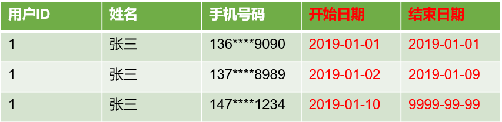
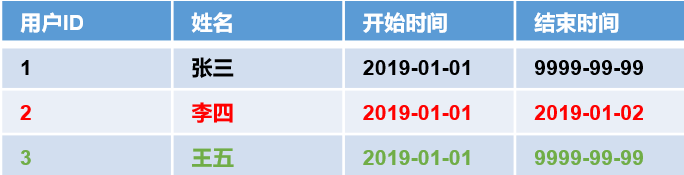

# DWD层（业务数据）
数仓建模：


业务表结构：


## 商品维度表（全量表）
这个只需要join即可。


### 建表语句
```sql
drop table if exists dwd_dim_sku_info;

create external table if not exists dwd_dim_sku_info (
    `id` string comment '商品id',
    `spu_id` string comment 'spuid',
    `price` double comment '商品价格',
    `sku_name` string comment '商品名称',
    `sku_desc` string comment '商品描述',
    `weight` double comment '重量',
    `tm_id` string comment '品牌id',
    `tm_name` string comment '品牌名称',
    `category3_id` string comment '三级分类id',
    `category2_id` string comment '二级分类id',
    `category1_id` string comment '一级分类id',
    `category3_name` string comment '三级分类名称',
    `category2_name` string comment '二级分类名称',
    `category1_name` string comment '一级分类名称',
    `spu_name` string comment 'spu名称',
    `create_time` string comment '创建时间'
) 
comment '商品维度表'
partitioned by (`dt` string)
stored as parquet
location '/warehouse/gmall/dwd/dwd_dim_sku_info/'
tblproperties ("parquet.compression"="lzo");
```

### 导入数据
```sql
insert overwrite table dwd_dim_sku_info
patrition(dt='2020-03-10')
select
    sk.id,
    sk.spu_id,
    sk.price,
    sk.sku_name,
    sk.sku_desc,
    sk.weight,
    sk.tm_id,
    tm.tm_name,
    sk.category3_id,
    c3.category2_id,
    c2.category1_id,
    c3.name,
    c2.name,
    c1.name,
    sp.spu_name,
    sk.create_time
from(
    -- SKU商品表
    select
        id,
        spu_id,
        price,
        sku_name,
        sku_desc,
        weight,
        tm_id,
        category3_id,
        create_time
    from ods_sku_info
    where dt = '2020-03-10'
) sk
left join(
    -- SPU商品表：关联spu名称
    select
        id,
        spu_name
    from ods_spu_info
    where dt = '2020-03-10'
) sp on sk.spu_id = sp.id
left join(
    -- 品牌表：关联品牌名称
    select
        tm_id,
        tm_name
    from ods_base_trademark
    where dt = '2020-03-10'
) tm on sk.tm_id = tm.tm_id
left join(
    -- 商品三级分类表：关联三级分类名称
    select
        id,
        name,
        category2_id
    from ods_base_category3
    where dt = '2020-03-10'
) c3 on sk.category3_id = c3.id
left join(
    -- 商品二级分类表：关联二级分类名称
    select
        id,
        name,
        category1_id
    from ods_base_category2
    where dt = '2020-03-10'
) c2 on c3.category2_id = c2.id
left join(
    -- 商品一级分类表：关联一级分类名称
    select
        id,
        name
    from ods_base_category1
    where dt = '2020-03-10'
) c1 on c2.category1_id = c1.id;
```

查看：
```sql
select * from dwd_dim_sku_info where dt='2020-03-10' limit 2;
```

### sql编写过程
sql编写过程，左边放需要用到的表，右边写sql语句：


left.sql：
```sql
create external table if not exists dwd_dim_sku_info (
    `id` string comment '商品id',
    `spu_id` string comment 'spuid',
    `price` double comment '商品价格',
    `sku_name` string comment '商品名称',
    `sku_desc` string comment '商品描述',
    `weight` double comment '重量',
    `tm_id` string comment '品牌id',
    `tm_name` string comment '品牌名称',
    `category3_id` string comment '三级分类id',
    `category2_id` string comment '二级分类id',
    `category1_id` string comment '一级分类id',
    `category3_name` string comment '三级分类名称',
    `category2_name` string comment '二级分类名称',
    `category1_name` string comment '一级分类名称',
    `spu_name` string comment 'spu名称',
    `create_time` string comment '创建时间'
) 
partitioned by (`dt` string)

create external table ods_sku_info( 
    `id` string comment 'skuId',
    `spu_id` string   comment 'spuid', 
    `price` decimal(10,2) comment '价格',
    `sku_name` string comment '商品名称',
    `sku_desc` string comment '商品描述',
    `weight` string comment '重量',
    `tm_id` string comment '品牌id',
    `category3_id` string comment '品类id',
    `create_time` string comment '创建时间'
) comment 'SKU商品表'
PARTITIONED BY (`dt` string)

create external table ods_spu_info(
    `id` string comment 'spuid',
    `spu_name` string comment 'spu名称',
    `category3_id` string comment '品类id',
    `tm_id` string comment '品牌id'
) comment 'SPU商品表'
PARTITIONED BY (`dt` string)

create external table ods_base_trademark (
    `tm_id`   bigint comment '编号',
    `tm_name` string comment '品牌名称'
)  comment '品牌表'
PARTITIONED BY (`dt` string)

create external table ods_base_category1( 
    `id` string comment 'id',
    `name`  string comment '名称'
) comment '商品一级分类表'
PARTITIONED BY (`dt` string)

create external table ods_base_category2( 
    `id` string comment ' id',
    `name` string comment '名称',
    category1_id string comment '一级品类id'
) comment '商品二级分类表'
PARTITIONED BY (`dt` string)

create external table ods_base_category3(
    `id` string comment ' id',
    `name`  string comment '名称',
    category2_id string comment '二级品类id'
) comment '商品三级分类表'
PARTITIONED BY (`dt` string)
```

right.sql：
```sql
insert overwrite table dwd_dim_sku_info
partition(dt='2020-03-10')
select
    sk.id,
    sk.spu_id,
    sk.price,
    sk.sku_name,
    sk.sku_desc,
    sk.weight,
    sk.tm_id,
    tm.tm_name,
    sk.category3_id,
    c3.category2_id,
    c2.category1_id,
    c3.name,
    c2.name,
    c1.name,
    sp.spu_name,
    sk.create_time
from(
    -- SKU商品表
    select
        id,
        spu_id,
        price,
        sku_name,
        sku_desc,
        weight,
        tm_id,
        category3_id,
        create_time
    from ods_sku_info
    where dt = '2020-03-10'
) sk
left join(
    -- SPU商品表：关联spu名称
    select
        id,
        spu_name
    from ods_spu_info
    where dt = '2020-03-10'
) sp on sk.spu_id = sp.id
left join(
    -- 品牌表：关联品牌名称
    select
        tm_id,
        tm_name
    from ods_base_trademark
    where dt = '2020-03-10'
) tm on sk.tm_id = tm.tm_id
left join(
    -- 商品三级分类表：关联三级分类名称
    select
        id,
        name,
        category2_id
    from ods_base_category3
    where dt = '2020-03-10'
) c3 on sk.category3_id = c3.id
left join(
    -- 商品二级分类表：关联二级分类名称
    select
        id,
        name,
        category1_id
    from ods_base_category2
    where dt = '2020-03-10'
) c2 on c3.category2_id = c2.id
left join(
    -- 商品一级分类表：关联一级分类名称
    select
        id,
        name
    from ods_base_category1
    where dt = '2020-03-10'
) c1 on c2.category1_id = c1.id;
```

## 优惠券信息表（全量）
把ODS层ods_coupon_info表数据导入到DWD层优惠卷信息表，在导入过程中可以做适当的清洗。没有额外的信息，不需要join。

### 建表语句
```sql
drop table if exists dwd_dim_coupon_info;

create external table if not exists dwd_dim_coupon_info(
    `id` string comment '购物券编号',
    `coupon_name` string comment '购物券名称',
    `coupon_type` string comment '购物券类型 1 现金券 2 折扣券 3 满减券 4 满件打折券',
    `condition_amount` string comment '满额数',
    `condition_num` string comment '满件数',
    `activity_id` string comment '活动编号',
    `benefit_amount` string comment '减金额',
    `benefit_discount` string comment '折扣',
    `create_time` string comment '创建时间',
    `range_type` string comment '范围类型 1、商品 2、品类 3、品牌',
    `spu_id` string comment '商品id',
    `tm_id` string comment '品牌id',
    `category3_id` string comment '品类id',
    `limit_num` string comment '最多领用次数',
    `operate_time`  string comment '修改时间',
    `expire_time`  string comment '过期时间'
) comment '优惠券信息表'
partitioned by (`dt` string)
stored as parquet
location '/warehouse/gmall/dwd/dwd_dim_coupon_info/'
tblproperties ("parquet.compression"="lzo");
```

### 导入数据
```sql
insert overwrite table dwd_dim_coupon_info
partition(dt='2020-03-10')
select
    id,
    coupon_name,
    coupon_type,
    condition_amount,
    condition_num,
    activity_id,
    benefit_amount,
    benefit_discount,
    create_time,
    range_type,
    spu_id,
    tm_id,
    category3_id,
    limit_num,
    operate_time,
    expire_time
from ods_coupon_info
where dt = '2020-03-10';
```

查看：
```sql
select * from dwd_dim_coupon_info where dt='2020-03-10' limit 2;
```

## 活动维度表（全量）


### 建表语句
```sql
drop table if exists dwd_dim_activity_info;

create external table if not exists dwd_dim_activity_info(
    `id` string comment '编号',
    `activity_name` string  comment '活动名称',
    `activity_type` string  comment '活动类型',
    `condition_amount` string  comment '满减金额',
    `condition_num` string  comment '满减件数',
    `benefit_amount` string  comment '优惠金额',
    `benefit_discount` string  comment '优惠折扣',
    `benefit_level` string  comment '优惠级别',
    `start_time` string  comment '开始时间',
    `end_time` string  comment '结束时间',
    `create_time` string  comment '创建时间'
) comment '活动信息表'
partitioned by (`dt` string)
stored as parquet
location '/warehouse/gmall/dwd/dwd_dim_activity_info/'
tblproperties ("parquet.compression"="lzo");
```

### 导入数据
```sql
insert overwrite table dwd_dim_activity_info
partition(dt='2020-03-10')
select
    a.id,
    a.activity_name,
    a.activity_type,
    r.condition_amount,
    r.condition_num,
    r.benefit_amount,
    r.benefit_discount,
    r.benefit_level,
    a.start_time,
    a.end_time,
    a.create_time
from(
    select
        id,
        activity_name,
        activity_type,
        start_time,
        end_time,
        create_time
    from ods_activity_info
    where dt = '2020-03-10'
) a
left join(
    select
        -- join中出现的字段必须select，activity_id必须select
        activity_id,
        condition_amount,
        condition_num,
        benefit_amount,
        benefit_discount,
        benefit_level
    from ods_activity_rule
    where dt = '2020-03-10'
) r on a.id = r.activity_id;
```

查看：
```sql
select * from dwd_dim_activity_info where dt='2020-03-10' limit 2;
```

## 地区维度表（特殊）
这个表基本不会变化，导入一次即可。


### 建表语句
```sql
DROP TABLE IF EXISTS `dwd_dim_base_province`;

CREATE EXTERNAL TABLE `dwd_dim_base_province` (
    `id` string COMMENT 'id',
    `province_name` string COMMENT '省市名称',
    `area_code` string COMMENT '地区编码',
    `iso_code` string COMMENT 'ISO编码',
    `region_id` string COMMENT '地区id',
    `region_name` string COMMENT '地区名称'
) 
COMMENT '地区省市表'
stored as parquet
location '/warehouse/gmall/dwd/dwd_dim_base_province/'
tblproperties ("parquet.compression"="lzo");
```

### 导入数据
```sql
insert overwrite table dwd_dim_base_province
select
    p.id,
    p.name,
    p.area_code,
    p.iso_code,
    p.region_id,
    r.region_name
from ods_base_province p
left join ods_base_region r on p.region_id = r.id;
```

查看：
```sql
select * from dwd_dim_base_province limit 5;
```

### sql编写过程


## 时间维度表（特殊）（预留）

### 建表语句
因为需要load上传的原始文件的格式，这里使用`stored as textfile`，load只会把文件原封不动的加载过去，如果使用`stored as parquet`就会按照parquet文件的格式去读。
```sql
DROP TABLE IF EXISTS `dwd_dim_date_info`;

CREATE EXTERNAL TABLE `dwd_dim_date_info`(
    `date_id` string COMMENT '日',
    `week_id` int COMMENT '周',
    `week_day` int COMMENT '周的第几天',
    `day` int COMMENT '每月的第几天',
    `month` int COMMENT '第几月',
    `quarter` int COMMENT '第几季度',
    `year` int COMMENT '年',
    `is_workday` int COMMENT '是否是周末',
    `holiday_id` int COMMENT '是否是节假日'
)
row format delimited fields terminated by '\t'
stored as textfile
location '/warehouse/gmall/dwd/dwd_dim_date_info/'
tblproperties ("parquet.compression"="lzo");
```

### 导入数据
```sql
hive (gmall)>
load data local inpath '/home/hadoop/bigdata-project/ecdw/db-log/date_info.txt' into table dwd_dim_date_info;
load data local inpath '/home/hadoop/bigdata-project/ecdw/db-log/date_info.txt' overwrite into table dwd_dim_date_info;
```

查看：
```sql
select * from dwd_dim_date_info limit 5;
```

## 订单明细事实表（事务型快照事实表）


### 建表语句
```sql
drop table if exists dwd_fact_order_detail;

create external table dwd_fact_order_detail (
    `id` string COMMENT '订单编号',
    `order_id` string COMMENT '订单号',
    `user_id` string COMMENT '用户id',
    `sku_id` string COMMENT 'sku商品id',
    `sku_name` string COMMENT '商品名称',
    `order_price` decimal(10,2) COMMENT '商品价格',
    `sku_num` bigint COMMENT '商品数量',
    `create_time` string COMMENT '创建时间',
    `province_id` string COMMENT '省份ID',
    `total_amount` decimal(20,2) COMMENT '订单总金额'
) 
PARTITIONED BY (`dt` string)
stored as parquet
location '/warehouse/gmall/dwd/dwd_fact_order_detail/'
tblproperties ("parquet.compression"="lzo");
```

### 导入数据
```sql
insert overwrite table dwd_fact_order_detail
partition(dt='2020-03-10')
select
    od.id,
    od.order_id,
    od.user_id,
    od.sku_id,
    od.sku_name,
    od.order_price,
    od.sku_num,
    od.create_time,
    oi.province_id,
    od.order_price * od.sku_num total_amount
from(
    select
        id,
        order_id,
        user_id,
        sku_id,
        sku_name,
        order_price,
        sku_num,
        create_time
    from ods_order_detail
    where dt = '2020-03-10'
) od
join(
    select
        id,
        province_id
    from ods_order_info
    where dt = '2020-03-10'
) oi on od.order_id = oi.id;
```

查看：
```sql
select * from dwd_fact_order_detail where dt='2020-03-10' limit 2;
```

## 支付事实表（事务型快照事实表）


### 建表语句
```sql
drop table if exists dwd_fact_payment_info;

create external table dwd_fact_payment_info (
    `id` string COMMENT '',
    `out_trade_no` string COMMENT '对外业务编号',
    `order_id` string COMMENT '订单编号',
    `user_id` string COMMENT '用户编号',
    `alipay_trade_no` string COMMENT '支付宝交易流水编号',
    `payment_amount`    decimal(16,2) COMMENT '支付金额',
    `subject`         string COMMENT '交易内容',
    `payment_type` string COMMENT '支付类型',
    `payment_time` string COMMENT '支付时间',
    `province_id` string COMMENT '省份ID'
) 
PARTITIONED BY (`dt` string)
stored as parquet
location '/warehouse/gmall/dwd/dwd_fact_payment_info/'
tblproperties ("parquet.compression"="lzo");
```

### 导入数据
```sql
insert overwrite table dwd_fact_payment_info
partition(dt='2020-03-10')
select
    p.id,
    p.out_trade_no,
    p.order_id,
    p.user_id,
    p.alipay_trade_no,
    p.total_amount payment_amount,
    p.subject,
    p.payment_type,
    p.payment_time,
    o.province_id
from(
    select
        id,
        out_trade_no,
        order_id,
        user_id,
        alipay_trade_no,
        total_amount,
        subject,
        payment_type,
        payment_time
    from ods_payment_info
    where dt = '2020-03-10'
) p
join(
    select
        id,
        province_id
    from ods_order_info
    where dt = '2020-03-10'
) o on p.order_id = o.id;
```

查看：
```sql
select * from dwd_fact_payment_info where dt='2020-03-10' limit 2;
```

## 退款事实表（事务型快照事实表）
把ODS层ods_order_refund_info表数据导入到DWD层退款事实表，在导入过程中可以做适当的清洗。


### 建表语句
```sql
drop table if exists dwd_fact_order_refund_info;

create external table dwd_fact_order_refund_info(
    `id` string COMMENT '编号',
    `user_id` string COMMENT '用户ID',
    `order_id` string COMMENT '订单ID',
    `sku_id` string COMMENT '商品ID',
    `refund_type` string COMMENT '退款类型',
    `refund_num` bigint COMMENT '退款件数',
    `refund_amount` decimal(16,2) COMMENT '退款金额',
    `refund_reason_type` string COMMENT '退款原因类型',
    `create_time` string COMMENT '退款时间'
) COMMENT '退款事实表'
PARTITIONED BY (`dt` string)
stored as parquet
location '/warehouse/gmall/dwd/dwd_fact_order_refund_info/'
tblproperties ("parquet.compression"="lzo");
```

### 导入数据
```sql
insert overwrite table dwd_fact_order_refund_info
partition(dt='2020-03-10')
select
    id,
    user_id,
    order_id,
    sku_id,
    refund_type,
    refund_num,
    refund_amount,
    refund_reason_type,
    create_time
from ods_order_refund_info
where dt = '2020-03-10';
```

查看：
```sql
select * from dwd_fact_order_refund_info where dt='2020-03-10' limit 2;
```

## 评价事实表（事务型快照事实表）
把ODS层ods_comment_info表数据导入到DWD层评价事实表，在导入过程中可以做适当的清洗。


### 建表语句
```sql
drop table if exists dwd_fact_comment_info;

create external table dwd_fact_comment_info(
    `id` string COMMENT '编号',
    `user_id` string COMMENT '用户ID',
    `sku_id` string COMMENT '商品sku',
    `spu_id` string COMMENT '商品spu',
    `order_id` string COMMENT '订单ID',
    `appraise` string COMMENT '评价',
    `create_time` string COMMENT '评价时间'
) COMMENT '评价事实表'
PARTITIONED BY (`dt` string)
stored as parquet
location '/warehouse/gmall/dwd/dwd_fact_comment_info/'
tblproperties ("parquet.compression"="lzo");
```

### 导入数据
```sql
insert overwrite table dwd_fact_comment_info
partition(dt='2020-03-10')
select
    id,
    user_id,
    sku_id,
    spu_id,
    order_id,
    appraise,
    create_time
from ods_comment_info
where dt = '2020-03-10';
```

查看：
```sql
select * from dwd_fact_comment_info where dt='2020-03-10' limit 2;
```

## 加购事实表（周期型快照事实表，每日快照）
由于购物车的**数量是会发生变化**，所以导增量不合适。

每天做一次快照，导入的数据是**全量**，区别于事务型事实表,事务型事实表是每天导入**新增**。

周期型快照事实表劣势：存储的数据量会比较大。

解决方案：周期型快照事实表存储的数据比较讲究**时效性**，时间太久了的意义不大，可以**删除以前的数据**。


### 建表语句
```sql
drop table if exists dwd_fact_cart_info;

create external table dwd_fact_cart_info(
    `id` string COMMENT '编号',
    `user_id` string  COMMENT '用户id',
    `sku_id` string  COMMENT 'skuid',
    `cart_price` string  COMMENT '放入购物车时价格',
    `sku_num` string  COMMENT '数量',
    `sku_name` string  COMMENT 'sku名称 (冗余)',
    `create_time` string  COMMENT '创建时间',
    `operate_time` string COMMENT '修改时间',
    `is_ordered` string COMMENT '是否已经下单。1为已下单;0为未下单',
    `order_time` string  COMMENT '下单时间'
) COMMENT '加购事实表'
PARTITIONED BY (`dt` string)
stored as parquet
location '/warehouse/gmall/dwd/dwd_fact_cart_info/'
tblproperties ("parquet.compression"="lzo");
```

### 导入数据
```sql
insert overwrite table dwd_fact_cart_info
partition(dt='2020-03-10')
select
    id,
    user_id,
    sku_id,
    cart_price,
    sku_num,
    sku_name,
    create_time,
    operate_time,
    is_ordered,
    order_time
from ods_cart_info
where dt = '2020-03-10';
```

查看：
```sql
select * from dwd_fact_cart_info where dt='2020-03-10' limit 2;
```

## 收藏事实表（周期型快照事实表，每日快照）
收藏的标记，是否取消，会发生变化，做增量不合适。

每天做一次快照，导入的数据是**全量**，区别于事务型事实表,事务型事实表是每天导入**新增**。

周期型快照事实表劣势：存储的数据量会比较大。

解决方案：周期型快照事实表存储的数据比较讲究**时效性**，时间太久了的意义不大，可以**删除以前的数据**。


### 建表语句
```sql
drop table if exists dwd_fact_favor_info;

create external table dwd_fact_favor_info(
    `id` string COMMENT '编号',
    `user_id` string  COMMENT '用户id',
    `sku_id` string  COMMENT 'skuid',
    `spu_id` string  COMMENT 'spuid',
    `is_cancel` string  COMMENT '是否取消',
    `create_time` string  COMMENT '收藏时间',
    `cancel_time` string  COMMENT '取消时间'
) COMMENT '收藏事实表'
PARTITIONED BY (`dt` string)
stored as parquet
location '/warehouse/gmall/dwd/dwd_fact_favor_info/'
tblproperties ("parquet.compression"="lzo");
```

### 导入数据
```sql
insert overwrite table dwd_fact_favor_info
partition(dt='2020-03-10')
select
    id,
    user_id,
    sku_id,
    spu_id,
    is_cancel,
    create_time,
    cancel_time
from ods_favor_info
where dt = '2020-03-10';
```

查看：
```sql
select * from dwd_fact_favor_info where dt='2020-03-10' limit 2;
```

## 优惠券领用事实表（累积型快照事实表）
优惠卷的生命周期：领取优惠卷-》用优惠卷下单-》优惠卷参与支付

累积型快照事实表使用：统计优惠卷领取次数、优惠卷下单次数、优惠卷参与支付次数


### 建表语句
```sql
drop table if exists dwd_fact_coupon_use;

create external table dwd_fact_coupon_use(
    `id` string COMMENT '编号',
    `coupon_id` string  COMMENT '优惠券ID',
    `user_id` string  COMMENT 'userid',
    `order_id` string  COMMENT '订单id',
    `coupon_status` string  COMMENT '优惠券状态',
    `get_time` string  COMMENT '领取时间',
    `using_time` string  COMMENT '使用时间(下单)',
    `used_time` string  COMMENT '使用时间(支付)'
) COMMENT '优惠券领用事实表'
PARTITIONED BY (`dt` string)
stored as parquet
location '/warehouse/gmall/dwd/dwd_fact_coupon_use/'
tblproperties ("parquet.compression"="lzo");
```

### 导入分析
* ods层按天分区，每天导入变化的数据。
```sql
where (date_format(get_time,'%Y-%m-%d')='$do_date'
                        or date_format(using_time,'%Y-%m-%d')='$do_date'
                        or date_format(used_time,'%Y-%m-%d')='$do_date')
```
* dwd层按照get_time分区  
* 每天把ods层当天分区变化的数据和dwd层数据join(on id)合并更新数据(ods层、dwd层有数据按照ods有数据为准更新，只有ods层有数据为新增的数据),覆盖写入dwd层。 
* join要使用full join，导入ods层分区当天的数据，dwd层新增的ods层get_time当天的数据，更新变化的是ods层get_time当天前的数据。  
* 第一天dwd层都是新增的数据，后面可能新增和更新的都有。ods层、dwd层有数据按照ods有数据为准更新，只有ods层有数据为新增的数据，只有dwd层有数据保持不变。  
* 查询dwd层最好能够避免全表扫描(dwd层只需要查询ods层所有不同get_time的分区)，覆盖写入dwd层需要开启动态分区。


### 导入数据
```sql
set hive.exec.dynamic.partition=true;
set hive.exec.dynamic.partition.mode=nonstrict;

insert overwrite table dwd_fact_coupon_use
partition(dt)
select
    if(new.id is null, old.id, new.id),
    if(new.id is null, old.coupon_id, new.coupon_id),
    if(new.id is null, old.user_id, new.user_id),
    if(new.id is null, old.order_id, new.order_id),
    if(new.id is null, old.coupon_status, new.coupon_status),
    if(new.id is null, old.get_time, new.get_time),
    if(new.id is null, old.using_time, new.using_time),
    if(new.id is null, old.used_time, new.used_time),
    -- 动态分区需要的列
    date_format(if(new.id is null, old.get_time, new.get_time), 'yyyy-MM-dd')
from(
    -- dwd_fact_coupon_use需要更新的数据
    select
        id,
        coupon_id,
        user_id,
        order_id,
        coupon_status,
        get_time,
        using_time,
        used_time
    from dwd_fact_coupon_use
    -- get_time去重应该会好点吧
    where dt in (
        select
            distinct date_format(get_time,'yyyy-MM-dd')
        from ods_coupon_use
        where dt = '2020-03-10'
    )
) old
-- 要使用full join
full join(
    -- ods_coupon_use当天的数据
    select
        id,
        coupon_id,
        user_id,
        order_id,
        coupon_status,
        get_time,
        using_time,
        used_time
    from ods_coupon_use
    where dt = '2020-03-10'
) new on old.id = new.id;
```


查看：
```sql
select * from dwd_fact_coupon_use where dt in (
    select
        distinct date_format(get_time,'yyyy-MM-dd')
    from ods_coupon_use
    where dt = '2020-03-10'
) limit 5;
```

## 订单事实表（累积型快照事实表）


订单生命周期：创建时间=》支付时间=》取消时间=》完成时间=》退款时间=》退款完成时间。

由于ODS层订单表只有创建时间和操作时间两个状态，不能表达所有时间含义，所以需要关联订单状态表。订单事实表里面增加了活动id，所以需要关联活动订单表。


### 建表语句
```sql
drop table if exists dwd_fact_order_info;

create external table dwd_fact_order_info (
    `id` string COMMENT '订单编号',
    `order_status` string COMMENT '订单状态',
    `user_id` string COMMENT '用户id',
    `out_trade_no` string COMMENT '支付流水号',
    `create_time` string COMMENT '创建时间(未支付状态)',
    `payment_time` string COMMENT '支付时间(已支付状态)',
    `cancel_time` string COMMENT '取消时间(已取消状态)',
    `finish_time` string COMMENT '完成时间(已完成状态)',
    `refund_time` string COMMENT '退款时间(退款中状态)',
    `refund_finish_time` string COMMENT '退款完成时间(退款完成状态)',
    `province_id` string COMMENT '省份ID',
    `activity_id` string COMMENT '活动ID',
    `original_total_amount` decimal(10,2) COMMENT '原价金额',
    `benefit_reduce_amount` decimal(10,2) COMMENT '优惠金额',
    `feight_fee` string COMMENT '运费',
    `final_total_amount` decimal(10,2) COMMENT '订单金额'
) 
PARTITIONED BY (`dt` string)
stored as parquet
location '/warehouse/gmall/dwd/dwd_fact_order_info/'
tblproperties ("parquet.compression"="lzo");
```

### 导入数据
```sql
insert overwrite table dwd_fact_order_info
partition(dt)
select
    if(new.id is null, old.id, new.id),
    if(new.id is null, old.order_status, new.order_status),
    if(new.id is null, old.user_id, new.user_id),
    if(new.id is null, old.out_trade_no, new.out_trade_no),
    if(new.id is null, old.create_time, new.create_time),
    -- 这几个变化的列，就不能用id判断了，因为新的数据中只有当天变化状态的时间记录
    if(new.payment_time is null, old.payment_time, new.payment_time),
    if(new.cancel_time is null, old.cancel_time, new.cancel_time),
    if(new.finish_time is null, old.finish_time, new.finish_time),
    if(new.refund_time is null, old.refund_time, new.refund_time),
    if(new.refund_finish_time is null, old.refund_finish_time, new.refund_finish_time),
    if(new.id is null, old.province_id, new.province_id),
    if(new.id is null, old.activity_id, new.activity_id),
    if(new.id is null, old.original_total_amount, new.original_total_amount),
    if(new.id is null, old.benefit_reduce_amount, new.benefit_reduce_amount),
    if(new.id is null, old.feight_fee, new.feight_fee),
    if(new.id is null, old.final_total_amount, new.final_total_amount),
    -- 动态分区需要的列
    date_format(if(new.create_time is null, old.create_time, new.create_time), 'yyyy-MM-dd')
from(
    -- dwd_fact_coupon_use需要更新的数据
    select
        id,
        order_status,
        user_id,
        out_trade_no,
        create_time,
        payment_time,
        cancel_time,
        finish_time,
        refund_time,
        refund_finish_time,
        province_id,
        activity_id,
        original_total_amount,
        benefit_reduce_amount,
        feight_fee,
        final_total_amount
    from dwd_fact_order_info
    -- get_time去重应该会好点吧
    where dt in (
        select
            distinct date_format(create_time,'yyyy-MM-dd')
        from ods_order_info
        where dt = '2020-03-10'
    )
) old
-- 要使用full join
full join(
    -- ods_order_info当天的数据
    select
        id,
        order_status,
        user_id,
        out_trade_no,
        create_time,
        payment_time,
        cancel_time,
        finish_time,
        refund_time,
        refund_finish_time,
        province_id,
        activity_id,
        original_total_amount,
        benefit_reduce_amount,
        feight_fee,
        final_total_amount
    from(
        select
            id,
            order_status,
            user_id,
            out_trade_no,
            province_id,
            original_total_amount,
            benefit_reduce_amount,
            feight_fee,
            final_total_amount
        from ods_order_info
        where dt = '2020-03-10'
    ) oi
    left join(
        select
            order_id,
            max( if(order_status='1001', operate_time, null) ) create_time,
            max( if(order_status='1002', operate_time, null) ) payment_time,
            max( if(order_status='1003', operate_time, null) ) cancel_time,
            max( if(order_status='1004', operate_time, null) ) finish_time,
            max( if(order_status='1005', operate_time, null) ) refund_time,
            max( if(order_status='1006', operate_time, null) ) refund_finish_time
        from ods_order_status_log
        where dt = '2020-03-10'
        group by order_id
    ) os on oi.id = os.order_id
    left join(
        select
            activity_id,
            order_id
        from ods_activity_order
        where dt = '2020-03-10'
    ) oa on oi.id = oa.order_id
) new on old.id = new.id;
```

查看：
```sql
select * from dwd_fact_order_info where dt='2020-03-10' limit 2;
```

### sql编写过程
left
```sql
create external table dwd_fact_order_info (
    `id` string COMMENT '订单编号',
    `order_status` string COMMENT '订单状态',
    `user_id` string COMMENT '用户id',
    `out_trade_no` string COMMENT '支付流水号',
    `create_time` string COMMENT '创建时间(未支付状态)',
    `payment_time` string COMMENT '支付时间(已支付状态)',
    `cancel_time` string COMMENT '取消时间(已取消状态)',
    `finish_time` string COMMENT '完成时间(已完成状态)',
    `refund_time` string COMMENT '退款时间(退款中状态)',
    `refund_finish_time` string COMMENT '退款完成时间(退款完成状态)',
    `province_id` string COMMENT '省份ID',
    `activity_id` string COMMENT '活动ID',
    `original_total_amount` decimal(10,2) COMMENT '原价金额',
    `benefit_reduce_amount` decimal(10,2) COMMENT '优惠金额',
    `feight_fee` string COMMENT '运费',
    `final_total_amount` decimal(10,2) COMMENT '订单金额'
) 
PARTITIONED BY (`dt` string)
('1001','未支付','10',NULL,NULL),
('1002','已支付','10',NULL,NULL),
('1003','已取消','10',NULL,NULL),
('1004','已完成','10',NULL,NULL),
('1005','退款中','10',NULL,NULL),
('1006','退款完成','10',NULL,NULL),


create external table ods_order_info (
    `id` string comment '订单号',
    `final_total_amount` decimal(10,2) comment '订单金额',
    `order_status` string comment '订单状态',
    `user_id` string comment '用户id',
    `out_trade_no` string comment '支付流水号',
    `create_time` string comment '创建时间',
    `operate_time` string comment '操作时间',
    `province_id` string comment '省份ID',
    `benefit_reduce_amount` decimal(10,2) comment '优惠金额',
    `original_total_amount` decimal(10,2)  comment '原价金额',
    `feight_fee` decimal(10,2)  comment '运费'
) comment '订单表'
partitioned by (`dt` string)

create external table ods_order_status_log (
    `id`   bigint COMMENT '编号',
    `order_id` string COMMENT '订单ID',
    `order_status` string COMMENT '订单状态',
    `operate_time` string COMMENT '修改时间'
)  COMMENT '订单状态表'
PARTITIONED BY (`dt` string)

create external table ods_activity_order(
    `id` string COMMENT '编号',
    `activity_id` string  COMMENT '优惠券ID',
    `order_id` string  COMMENT '订单编号',
    `create_time` string  COMMENT '发生日期'
) COMMENT '活动订单关联表'
PARTITIONED BY (`dt` string)
```
right
```sql
insert overwrite table dwd_fact_order_info
partition(dt)
select
    if(new.id is null, old.id, new.id),
    if(new.id is null, old.order_status, new.order_status),
    if(new.id is null, old.user_id, new.user_id),
    if(new.id is null, old.out_trade_no, new.out_trade_no),
    if(new.id is null, old.create_time, new.create_time),
    -- 这几个变化的列，就不能用id判断了，因为新的数据中只有当天变化状态的时间记录
    if(new.payment_time is null, old.payment_time, new.payment_time),
    if(new.cancel_time is null, old.cancel_time, new.cancel_time),
    if(new.finish_time is null, old.finish_time, new.finish_time),
    if(new.refund_time is null, old.refund_time, new.refund_time),
    if(new.refund_finish_time is null, old.refund_finish_time, new.refund_finish_time),
    if(new.id is null, old.province_id, new.province_id),
    if(new.id is null, old.activity_id, new.activity_id),
    if(new.id is null, old.original_total_amount, new.original_total_amount),
    if(new.id is null, old.benefit_reduce_amount, new.benefit_reduce_amount),
    if(new.id is null, old.feight_fee, new.feight_fee),
    if(new.id is null, old.final_total_amount, new.final_total_amount),
    -- 动态分区需要的列
    date_format(if(new.create_time is null, old.create_time, new.create_time), 'yyyy-MM-dd')
from(
    -- dwd_fact_coupon_use需要更新的数据
    select
        id,
        order_status,
        user_id,
        out_trade_no,
        create_time,
        payment_time,
        cancel_time,
        finish_time,
        refund_time,
        refund_finish_time,
        province_id,
        activity_id,
        original_total_amount,
        benefit_reduce_amount,
        feight_fee,
        final_total_amount
    from dwd_fact_order_info
    -- get_time去重应该会好点吧
    where dt in (
        select
            distinct date_format(create_time,'yyyy-MM-dd')
        from ods_order_info
        where dt = '2020-03-10'
    )
) old
-- 要使用full join
full join(
    -- ods_order_info当天的数据
    select
        id,
        order_status,
        user_id,
        out_trade_no,
        create_time,
        payment_time,
        cancel_time,
        finish_time,
        refund_time,
        refund_finish_time,
        province_id,
        activity_id,
        original_total_amount,
        benefit_reduce_amount,
        feight_fee,
        final_total_amount
    from(
        select
            id,
            order_status,
            user_id,
            out_trade_no,
            province_id,
            original_total_amount,
            benefit_reduce_amount,
            feight_fee,
            final_total_amount
        from ods_order_info
        where dt = '2020-03-10'
    ) oi
    left join(
        select
            order_id,
            max( if(order_status='1001', operate_time, null) ) create_time,
            max( if(order_status='1002', operate_time, null) ) payment_time,
            max( if(order_status='1003', operate_time, null) ) cancel_time,
            max( if(order_status='1004', operate_time, null) ) finish_time,
            max( if(order_status='1005', operate_time, null) ) refund_time,
            max( if(order_status='1006', operate_time, null) ) refund_finish_time
        from ods_order_status_log
        where dt = '2020-03-10'
        group by order_id
    ) os on oi.id = os.order_id
    left join(
        select
            activity_id,
            order_id
        from ods_activity_order
        where dt = '2020-03-10'
    ) oa on oi.id = oa.order_id
) new on old.id = new.id;


-- 测试
select
    id,
    order_status,
    user_id,
    out_trade_no,
    create_time,
    payment_time,
    cancel_time,
    finish_time,
    refund_time,
    refund_finish_time,
    province_id,
    activity_id,
    original_total_amount,
    benefit_reduce_amount,
    feight_fee,
    final_total_amount
from(
    select
        id,
        order_status,
        user_id,
        out_trade_no,
        province_id,
        original_total_amount,
        benefit_reduce_amount,
        feight_fee,
        final_total_amount
    from ods_order_info
    where dt = '2020-03-10'
) oi
left join(
    select
        order_id,
        max( if(order_status='1001', operate_time, null) ) payment_time,
        max( if(order_status='1002', operate_time, null) ) payment_time,
        max( if(order_status='1003', operate_time, null) ) cancel_time,
        max( if(order_status='1004', operate_time, null) ) finish_time,
        max( if(order_status='1005', operate_time, null) ) refund_time,
        max( if(order_status='1006', operate_time, null) ) refund_finish_time
    from ods_order_status_log
    where dt = '2020-03-10'
    group by order_id
) on os on oi.id = os.order_id
left join(
    select
        activity_id,
        order_id
    from ods_activity_order
    where dt = '2020-03-10'
) oa on a.id = oa.order_id
```


## 用户维度表（拉链表）
用户表中的数据每日既有可能新增，也有可能修改，但**修改频率并不高**，属于**缓慢变化**维度，此处采用**拉链表**存储用户维度数据。


### 建表语句
```sql
drop table if exists dwd_dim_user_info_his;

create external table dwd_dim_user_info_his(
    `id` string COMMENT '用户id',
    `name` string COMMENT '姓名', 
    `birthday` string COMMENT '生日',
    `gender` string COMMENT '性别',
    `email` string COMMENT '邮箱',
    `user_level` string COMMENT '用户等级',
    `create_time` string COMMENT '创建时间',
    `operate_time` string COMMENT '操作时间',
    `start_date`  string COMMENT '有效开始日期',
    `end_date`  string COMMENT '有效结束日期'
) COMMENT '订单拉链表'
stored as parquet
location '/warehouse/gmall/dwd/dwd_dim_user_info_his/'
tblproperties ("parquet.compression"="lzo");
```

### 临时表
```sql
drop table if exists dwd_dim_user_info_his_tmp;

create external table dwd_dim_user_info_his_tmp(
    `id` string COMMENT '用户id',
    `name` string COMMENT '姓名', 
    `birthday` string COMMENT '生日',
    `gender` string COMMENT '性别',
    `email` string COMMENT '邮箱',
    `user_level` string COMMENT '用户等级',
    `create_time` string COMMENT '创建时间',
    `operate_time` string COMMENT '操作时间',
    `start_date`  string COMMENT '有效开始日期',
    `end_date`  string COMMENT '有效结束日期'
) COMMENT '订单拉链临时表'
stored as parquet
location '/warehouse/gmall/dwd/dwd_dim_user_info_his_tmp/'
tblproperties ("parquet.compression"="lzo");
```

### 表初始化
```sql
--初次导入，实际中2020-03-10为第一次导入，ods_user_info应该从mysql中导入全部的数据。
insert overwrite table dwd_dim_user_info_his
select
    id,
    name,
    birthday,
    gender,
    email,
    user_level,
    create_time,
    operate_time,
    --开始日期根据具体需求可以选择create_time和operate_time
    date_format(create_time, 'yyyy-MM-dd') start_date,
    '9999-99-99' end_date
from ods_user_info
where dt = '2020-03-10';
```

### 导入数据
```sql
-- 先导入临时表
insert overwrite table dwd_dim_user_info_his_tmp
select
    *
from(
    --更新之前的数据，修改end_date
    select
        a.id,
        a.name,
        a.birthday,
        a.gender,
        a.email,
        a.user_level,
        a.create_time,
        a.operate_time,
        a.start_date,
        if(b.id is not null and a.end_date = '9999-99-99', date_sub('2020-03-11', 1),a.end_date) end_date
    from (
        --为了防止多次执行此脚本，做过滤
        select
            *
        from dwd_dim_user_info_his
        where start_date < '2020-03-11'
    ) a
    left join(
        select
            id
        from ods_user_info
        where dt = '2020-03-11'
    ) b on a.id = b.id
    union all
    -- 合并当天的新增及更新，开始时间为当天，结束时间为'9999-99-99'
    select
        id,
        name,
        birthday,
        gender,
        email,
        user_level,
        create_time,
        operate_time,
        '2020-03-11' start_date,
        '9999-99-99' end_date
    from ods_user_info
    where dt = '2020-03-11'
) u
order by id, start_date;

--把临时表覆盖给拉链表
insert overwrite table dwd_dim_user_info_his 
select * from dwd_dim_user_info_his_tmp;
```

查看：
```sql
select * from dwd_dim_user_info_his limit 5;
```

## 拉链表

### 什么是拉链表
拉链表，**记录每条信息的生命周期**，一旦一条记录的生命周期结束，就重新开始一条新的记录，并把当前日期放入生效开始日期。 

如果当前信息至今有效，在生效结束日期中填入一个极大值（如9999-99-99 ）。



### 为什么要做拉链表
**拉链表适合于：数据会发生变化，但是大部分是不变的。（即：缓慢变化维）。**

比如：用户信息会发生变化，但是每天变化的比例不高。如果数据量有一定规模，按照每日全量的方式保存效率很低。 比如：1亿用户*365天，每天一份用户信息。**(做每日全量效率低)**。


### 如何使用拉链表
通过，**生效开始日期<=某个日期  且 生效结束日期>=某个日期** ，能够得到某个时间点的数据全量切片。这里就使用<=和>=没问题，每个id只会过滤出一条数据，因为数据一天更新一次，某个id变化了就会把之前的结束日期设为前一天，例如下图中id为2的用户3号修改了名称。

1）拉链表数据


2）例如获取**2019-01-01**的历史切片：select * from user_info where **start_date<=''2019-01-01' and end_date>='2019-01-01'**


3）例如获取**2019-01-02**的历史切片： select * from order_info where **start_date<='2019-01-02' and end_date>='2019-01-02'**


### 拉链表形成过程
其实就是之前不存在的数据新增，之前存在的数据修改之前最近一条记录的生效结束日期并插入一条最新的记录，没修改的数据原封不动。**总结一下就是当天的更新数据全部新增(包含新增和修改的用户)，之前的数据更新结束日期或者不变**。和累积型快照事实表的唯一区别就是之前存在的数据不是修改更新而是修改之前最近一条记录的结束日期并并插入一条最新的记录。其实就是相当于记录下了每个用户的修改过程(天级别的)。


### 拉链表制作过程图
用户当日全部数据和MySQL中每天变化的数据拼接在一起，形成一个新的临时拉链表数据。用临时的拉链表覆盖旧的拉链表数据。（这就解决了hive表中数据不能更新的问题）。使用临时表也比较安全，直接覆盖原表任务失败表就被清空了。


### 拉链表制作过程
下面的步骤没必要首次独立执行，首次表是空的，数据全部新增即可。后来想了想又是还是需要的，第一次必须把用户全部导入，但是第一次导入时可能用户表已经早都创建了，必须手动把用户表导入，创建时间和修改时间可能都是以前的时间。

**步骤0：初始化拉链表（首次独立执行）**

（1）建立拉链表
```sql
hive (gmall)>
drop table if exists dwd_dim_user_info_his;
create external table dwd_dim_user_info_his(
    `id` string COMMENT '用户id',
    `name` string COMMENT '姓名', 
    `birthday` string COMMENT '生日',
    `gender` string COMMENT '性别',
    `email` string COMMENT '邮箱',
    `user_level` string COMMENT '用户等级',
    `create_time` string COMMENT '创建时间',
    `operate_time` string COMMENT '操作时间',
    `start_date`  string COMMENT '有效开始日期',
    `end_date`  string COMMENT '有效结束日期'
) COMMENT '订单拉链表'
stored as parquet
location '/warehouse/gmall/dwd/dwd_dim_user_info_his/'
tblproperties ("parquet.compression"="lzo");
```

（2）初始化拉链表
这个我感觉不比有，多余了
```sql
insert overwrite table dwd_dim_user_info_his
select
    id,
    name,
    birthday,
    gender,
    email,
    user_level,
    create_time,
    operate_time,
    '2020-03-10',
    '9999-99-99'
from ods_user_info oi
where oi.dt='2020-03-10';
```

**步骤1：制作当日变动数据（包括新增，修改）每日执行**

（1）如何获得每日变动表
```
a.最好表内有创建时间和变动时间（Lucky!）
b.如果没有，可以利用第三方工具监控比如canal，监控MySQL的实时变化进行记录（麻烦）。
c.逐行对比前后两天的数据，检查md5(concat(全部有可能变化的字段))是否相同(low)
d.要求业务数据库提供变动流水（人品，颜值）
```

（2）因为ods_order_info本身导入过来就是新增变动明细的表，所以不用处理
a）数据库中新增2020-03-11一天的数据
b）通过Sqoop把2020-03-11日所有数据导入
```
mysqlTohdfs.sh all 2020-03-11
```
c）ods层数据导入
```
hdfs_to_ods_db.sh all 2020-03-11
```

**步骤2：先合并变动信息，再追加新增信息，插入到临时表中**

1）建立临时表
```sql
hive (gmall)>
drop table if exists dwd_dim_user_info_his_tmp;
create external table dwd_dim_user_info_his_tmp(
    `id` string COMMENT '用户id',
    `name` string COMMENT '姓名', 
    `birthday` string COMMENT '生日',
    `gender` string COMMENT '性别',
    `email` string COMMENT '邮箱',
    `user_level` string COMMENT '用户等级',
    `create_time` string COMMENT '创建时间',
    `operate_time` string COMMENT '操作时间',
    `start_date`  string COMMENT '有效开始日期',
    `end_date`  string COMMENT '有效结束日期'
) COMMENT '订单拉链临时表'
stored as parquet
location '/warehouse/gmall/dwd/dwd_dim_user_info_his_tmp/'
tblproperties ("parquet.compression"="lzo");
```

2）导入脚本
```sql
hive (gmall)>
insert overwrite table dwd_dim_user_info_his_tmp
select * from 
(
    select 
        id,
        name,
        birthday,
        gender,
        email,
        user_level,
        create_time,
        operate_time,
        '2020-03-11' start_date,
        '9999-99-99' end_date
    from ods_user_info where dt='2020-03-11'

    union all 
    select 
        uh.id,
        uh.name,
        uh.birthday,
        uh.gender,
        uh.email,
        uh.user_level,
        uh.create_time,
        uh.operate_time,
        uh.start_date,
        if(ui.id is not null  and uh.end_date='9999-99-99', date_add(ui.dt,-1), uh.end_date) end_date
    from dwd_dim_user_info_his uh left join 
    (
        select
            *
        from ods_user_info
        where dt='2020-03-11'
    ) ui on uh.id=ui.id
)his 
order by his.id, start_date;
```

步骤3：把临时表覆盖给拉链表
```sql
hive (gmall)>
insert overwrite table dwd_dim_user_info_his 
select * from dwd_dim_user_info_his_tmp;
```

## DWD层业务数据导入脚本
创建ods_to_dwd_db.sh
```
[hadoop@hadoop101 hive-mr-script]$ vi ods_to_dwd_db.sh
```


内容：
```sh
#!/bin/bash

hive=/opt/module/hive-2.3.6/bin/hive
hive_db=gmall

# 如果是输入的日期按照取输入日期；如果没输入日期取当前时间的前一天
if [[ -n "$1" ]]; then
    do_date=$1
else
    do_date=`date -d '-1 day' +%F`
fi

if [ ${#do_date} -ne 10 ];then
    echo "日期格式不正确"
    exit
fi

echo "===日志日期为 $do_date==="

# 商品维度表（全量表）
insert_dwd_dim_sku_info="
insert overwrite table dwd_dim_sku_info
partition(dt='$do_date')
select
    sk.id,
    sk.spu_id,
    sk.price,
    sk.sku_name,
    sk.sku_desc,
    sk.weight,
    sk.tm_id,
    tm.tm_name,
    sk.category3_id,
    c3.category2_id,
    c2.category1_id,
    c3.name,
    c2.name,
    c1.name,
    sp.spu_name,
    sk.create_time
from(
    -- SKU商品表
    select
        id,
        spu_id,
        price,
        sku_name,
        sku_desc,
        weight,
        tm_id,
        category3_id,
        create_time
    from ods_sku_info
    where dt = '$do_date'
) sk
left join(
    -- SPU商品表：关联spu名称
    select
        id,
        spu_name
    from ods_spu_info
    where dt = '$do_date'
) sp on sk.spu_id = sp.id
left join(
    -- 品牌表：关联品牌名称
    select
        tm_id,
        tm_name
    from ods_base_trademark
    where dt = '$do_date'
) tm on sk.tm_id = tm.tm_id
left join(
    -- 商品三级分类表：关联三级分类名称
    select
        id,
        name,
        category2_id
    from ods_base_category3
    where dt = '$do_date'
) c3 on sk.category3_id = c3.id
left join(
    -- 商品二级分类表：关联二级分类名称
    select
        id,
        name,
        category1_id
    from ods_base_category2
    where dt = '$do_date'
) c2 on c3.category2_id = c2.id
left join(
    -- 商品一级分类表：关联一级分类名称
    select
        id,
        name
    from ods_base_category1
    where dt = '$do_date'
) c1 on c2.category1_id = c1.id;
"

# 优惠券信息表（全量）
insert_dwd_dim_coupon_info="
insert overwrite table dwd_dim_coupon_info
partition(dt='$do_date')
select
    id,
    coupon_name,
    coupon_type,
    condition_amount,
    condition_num,
    activity_id,
    benefit_amount,
    benefit_discount,
    create_time,
    range_type,
    spu_id,
    tm_id,
    category3_id,
    limit_num,
    operate_time,
    expire_time
from ods_coupon_info
where dt = '$do_date';
"

# 活动维度表（全量）
insert_dwd_dim_activity_info="
insert overwrite table dwd_dim_activity_info
partition(dt='$do_date')
select
    a.id,
    a.activity_name,
    a.activity_type,
    r.condition_amount,
    r.condition_num,
    r.benefit_amount,
    r.benefit_discount,
    r.benefit_level,
    a.start_time,
    a.end_time,
    a.create_time
from(
    select
        id,
        activity_name,
        activity_type,
        start_time,
        end_time,
        create_time
    from ods_activity_info
    where dt = '$do_date'
) a
left join(
    select
        -- join中出现的字段必须select，activity_id必须select
        activity_id,
        condition_amount,
        condition_num,
        benefit_amount,
        benefit_discount,
        benefit_level
    from ods_activity_rule
    where dt = '$do_date'
) r on a.id = r.activity_id;
"

# 订单明细事实表（事务型快照事实表）
insert_dwd_fact_order_detail="
insert overwrite table dwd_fact_order_detail
partition(dt='$do_date')
select
    od.id,
    od.order_id,
    od.user_id,
    od.sku_id,
    od.sku_name,
    od.order_price,
    od.sku_num,
    od.create_time,
    oi.province_id,
    od.order_price * od.sku_num total_amount
from(
    select
        id,
        order_id,
        user_id,
        sku_id,
        sku_name,
        order_price,
        sku_num,
        create_time
    from ods_order_detail
    where dt = '$do_date'
) od
join(
    select
        id,
        province_id
    from ods_order_info
    where dt = '$do_date'
) oi on od.order_id = oi.id;
"

# 支付事实表（事务型快照事实表）
insert_dwd_fact_payment_info="
insert overwrite table dwd_fact_payment_info
partition(dt='$do_date')
select
    p.id,
    p.out_trade_no,
    p.order_id,
    p.user_id,
    p.alipay_trade_no,
    p.total_amount payment_amount,
    p.subject,
    p.payment_type,
    p.payment_time,
    o.province_id
from(
    select
        id,
        out_trade_no,
        order_id,
        user_id,
        alipay_trade_no,
        total_amount,
        subject,
        payment_type,
        payment_time
    from ods_payment_info
    where dt = '$do_date'
) p
join(
    select
        id,
        province_id
    from ods_order_info
    where dt = '$do_date'
) o on p.order_id = o.id;
"

# 退款事实表（事务型快照事实表）
insert_dwd_fact_order_refund_info="
insert overwrite table dwd_fact_order_refund_info
partition(dt='$do_date')
select
    id,
    user_id,
    order_id,
    sku_id,
    refund_type,
    refund_num,
    refund_amount,
    refund_reason_type,
    create_time
from ods_order_refund_info
where dt = '$do_date';
"

# 评价事实表（事务型快照事实表）
insert_dwd_fact_comment_info="
insert overwrite table dwd_fact_comment_info
partition(dt='$do_date')
select
    id,
    user_id,
    sku_id,
    spu_id,
    order_id,
    appraise,
    create_time
from ods_comment_info
where dt = '$do_date';
"

# 加购事实表（周期型快照事实表，每日快照）
insert_dwd_fact_cart_info="
insert overwrite table dwd_fact_cart_info
partition(dt='$do_date')
select
    id,
    user_id,
    sku_id,
    cart_price,
    sku_num,
    sku_name,
    create_time,
    operate_time,
    is_ordered,
    order_time
from ods_cart_info
where dt = '$do_date';
"

# 收藏事实表（周期型快照事实表，每日快照）
insert_dwd_fact_favor_info="
insert overwrite table dwd_fact_favor_info
partition(dt='$do_date')
select
    id,
    user_id,
    sku_id,
    spu_id,
    is_cancel,
    create_time,
    cancel_time
from ods_favor_info
where dt = '$do_date';
"

# 优惠券领用事实表（累积型快照事实表）
insert_dwd_fact_coupon_use="
insert overwrite table dwd_fact_coupon_use
partition(dt)
select
    if(new.id is null, old.id, new.id),
    if(new.id is null, old.coupon_id, new.coupon_id),
    if(new.id is null, old.user_id, new.user_id),
    if(new.id is null, old.order_id, new.order_id),
    if(new.id is null, old.coupon_status, new.coupon_status),
    if(new.id is null, old.get_time, new.get_time),
    if(new.id is null, old.using_time, new.using_time),
    if(new.id is null, old.used_time, new.used_time),
    -- 动态分区需要的列
    date_format(if(new.id is null, old.get_time, new.get_time), 'yyyy-MM-dd')
from(
    -- dwd_fact_coupon_use需要更新的数据
    select
        id,
        coupon_id,
        user_id,
        order_id,
        coupon_status,
        get_time,
        using_time,
        used_time
    from dwd_fact_coupon_use
    -- get_time去重应该会好点吧
    where dt in (
        select
            distinct date_format(get_time,'yyyy-MM-dd')
        from ods_coupon_use
        where dt = '$do_date'
    )
) old
-- 要使用full join
full join(
    -- ods_coupon_use当天的数据
    select
        id,
        coupon_id,
        user_id,
        order_id,
        coupon_status,
        get_time,
        using_time,
        used_time
    from ods_coupon_use
    where dt = '$do_date'
) new on old.id = new.id;
"

# 订单事实表（累积型快照事实表）
insert_dwd_fact_order_info="
insert overwrite table dwd_fact_order_info
partition(dt)
select
    if(new.id is null, old.id, new.id),
    if(new.id is null, old.order_status, new.order_status),
    if(new.id is null, old.user_id, new.user_id),
    if(new.id is null, old.out_trade_no, new.out_trade_no),
    if(new.id is null, old.create_time, new.create_time),
    -- 这几个变化的列，就不能用id判断了，因为新的数据中只有当天变化状态的时间记录
    if(new.payment_time is null, old.payment_time, new.payment_time),
    if(new.cancel_time is null, old.cancel_time, new.cancel_time),
    if(new.finish_time is null, old.finish_time, new.finish_time),
    if(new.refund_time is null, old.refund_time, new.refund_time),
    if(new.refund_finish_time is null, old.refund_finish_time, new.refund_finish_time),
    if(new.id is null, old.province_id, new.province_id),
    if(new.id is null, old.activity_id, new.activity_id),
    if(new.id is null, old.original_total_amount, new.original_total_amount),
    if(new.id is null, old.benefit_reduce_amount, new.benefit_reduce_amount),
    if(new.id is null, old.feight_fee, new.feight_fee),
    if(new.id is null, old.final_total_amount, new.final_total_amount),
    -- 动态分区需要的列
    date_format(if(new.create_time is null, old.create_time, new.create_time), 'yyyy-MM-dd')
from(
    -- dwd_fact_coupon_use需要更新的数据
    select
        id,
        order_status,
        user_id,
        out_trade_no,
        create_time,
        payment_time,
        cancel_time,
        finish_time,
        refund_time,
        refund_finish_time,
        province_id,
        activity_id,
        original_total_amount,
        benefit_reduce_amount,
        feight_fee,
        final_total_amount
    from dwd_fact_order_info
    -- get_time去重应该会好点吧
    where dt in (
        select
            distinct date_format(create_time,'yyyy-MM-dd')
        from ods_order_info
        where dt = '$do_date'
    )
) old
-- 要使用full join
full join(
    -- ods_order_info当天的数据
    select
        id,
        order_status,
        user_id,
        out_trade_no,
        create_time,
        payment_time,
        cancel_time,
        finish_time,
        refund_time,
        refund_finish_time,
        province_id,
        activity_id,
        original_total_amount,
        benefit_reduce_amount,
        feight_fee,
        final_total_amount
    from(
        select
            id,
            order_status,
            user_id,
            out_trade_no,
            province_id,
            original_total_amount,
            benefit_reduce_amount,
            feight_fee,
            final_total_amount
        from ods_order_info
        where dt = '$do_date'
    ) oi
    left join(
        select
            order_id,
            max( if(order_status='1001', operate_time, null) ) create_time,
            max( if(order_status='1002', operate_time, null) ) payment_time,
            max( if(order_status='1003', operate_time, null) ) cancel_time,
            max( if(order_status='1004', operate_time, null) ) finish_time,
            max( if(order_status='1005', operate_time, null) ) refund_time,
            max( if(order_status='1006', operate_time, null) ) refund_finish_time
        from ods_order_status_log
        where dt = '$do_date'
        group by order_id
    ) os on oi.id = os.order_id
    left join(
        select
            activity_id,
            order_id
        from ods_activity_order
        where dt = '$do_date'
    ) oa on oi.id = oa.order_id
) new on old.id = new.id;
"

# 用户维度表（拉链表）
insert_dwd_dim_user_info_his="
-- 先导入临时表
insert overwrite table dwd_dim_user_info_his_tmp
select
    *
from(
    --更新之前的数据，修改end_date
    select
        a.id,
        a.name,
        a.birthday,
        a.gender,
        a.email,
        a.user_level,
        a.create_time,
        a.operate_time,
        a.start_date,
        if(b.id is not null and a.end_date = '9999-99-99', date_sub('$do_date', 1),a.end_date) end_date
    from (
        --为了防止多次执行此脚本，做过滤
        select
            *
        from dwd_dim_user_info_his
        where start_date < '$do_date'
    ) a
    left join(
        select
            id
        from ods_user_info
        where dt = '$do_date'
    ) b on a.id = b.id
    union all
    -- 合并当天的新增及更新，开始时间为当天，结束时间为'9999-99-99'
    select
        id,
        name,
        birthday,
        gender,
        email,
        user_level,
        create_time,
        operate_time,
        '$do_date' start_date,
        '9999-99-99' end_date
    from ods_user_info
    where dt = '$do_date'
) u
order by id, start_date;

--把临时表覆盖给拉链表
insert overwrite table dwd_dim_user_info_his 
select * from dwd_dim_user_info_his_tmp;
"


sql="
use $hive_db;

set hive.exec.dynamic.partition=true;
set hive.exec.dynamic.partition.mode=nonstrict;

-- insert_table:商品维度表（全量表）
$insert_dwd_dim_sku_info

-- insert_table:优惠券信息表（全量）
$insert_dwd_dim_coupon_info

-- insert_table:活动维度表（全量）
$insert_dwd_dim_activity_info

-- insert_table:订单明细事实表（事务型快照事实表）
$insert_dwd_fact_order_detail

-- insert_table:支付事实表（事务型快照事实表）
$insert_dwd_fact_payment_info

-- insert_table:退款事实表（事务型快照事实表）
$insert_dwd_fact_order_refund_info

-- insert_table:评价事实表（事务型快照事实表）
$insert_dwd_fact_comment_info

-- insert_table:加购事实表（周期型快照事实表，每日快照）
$insert_dwd_fact_cart_info

-- insert_table:收藏事实表（周期型快照事实表，每日快照）
$insert_dwd_fact_favor_info

-- insert_table:优惠券领用事实表（累积型快照事实表）
$insert_dwd_fact_coupon_use

-- insert_table:订单事实表（累积型快照事实表）
$insert_dwd_fact_order_info

-- insert_table:用户维度表（拉链表）
$insert_dwd_dim_user_info_his
"

#echo "$sql"

$hive -e "$sql"

```

脚本测试：
```
[hadoop@hadoop101 hive-mr-script]$ ./ods_to_dwd_db.sh 2020-03-11
```

查看导入数据
```sql
/opt/module/hive-2.3.6/bin/hive -e "select * from gmall.dwd_fact_order_info where dt='2020-03-11' limit 5"
```


