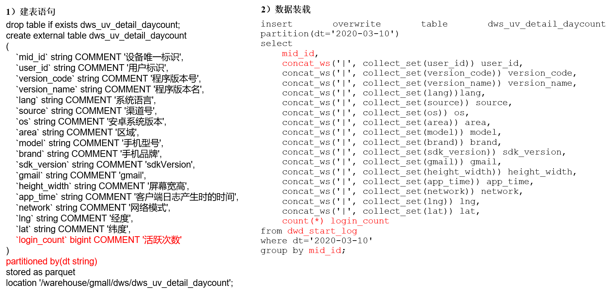

# DWS层（用户行为）
从**dws、dwt**层开始建的表**只需要使用列式存储即可，不要使用压缩**了，因为dws、dwt层的数据需要经常访问，对文件压缩虽然节约磁盘空间，但是会加重cpu的负担。ods层的数据基本和原始数据差不多（数据量大），从ods到dws只需一天统计一次，不怎么需要计算，属于io密集型操作，使用压缩。dws、dwt层的数据统计各种指标需要经常访问统计，属于计算密集型操作，况且dws、dwt层的数据都是聚合后的数据，数据量不算大，不必使用压缩。

## 每日设备行为
每日设备行为，主要按照设备id统计。



### 建表语句
只需要使用列式存储即可，不使用压缩。
```sql
drop table if exists dws_uv_detail_daycount;

create external table dws_uv_detail_daycount
(
    `mid_id` string COMMENT '设备唯一标识',
    `user_id` string COMMENT '用户标识',
    `version_code` string COMMENT '程序版本号', 
    `version_name` string COMMENT '程序版本名', 
    `lang` string COMMENT '系统语言', 
    `source` string COMMENT '渠道号', 
    `os` string COMMENT '安卓系统版本', 
    `area` string COMMENT '区域', 
    `model` string COMMENT '手机型号', 
    `brand` string COMMENT '手机品牌', 
    `sdk_version` string COMMENT 'sdkVersion', 
    `gmail` string COMMENT 'gmail', 
    `height_width` string COMMENT '屏幕宽高',
    `app_time` string COMMENT '客户端日志产生时的时间',
    `network` string COMMENT '网络模式',
    `lng` string COMMENT '经度',
    `lat` string COMMENT '纬度',
    `login_count` bigint COMMENT '活跃次数'
)
partitioned by(dt string)
stored as parquet
location '/warehouse/gmall/dws/dws_uv_detail_daycount';
```

### 导入数据
```sql
insert overwrite table dws_uv_detail_daycount
partition(dt='2020-03-10')
select
    mid_id,
    concat_ws('|', collect_set(user_id)) user_id,
    concat_ws('|', collect_set(version_code)) version_code,
    concat_ws('|', collect_set(version_name)) version_name,
    concat_ws('|', collect_set(lang)) lang,
    concat_ws('|', collect_set(source)) source,
    concat_ws('|', collect_set(os)) os,
    concat_ws('|', collect_set(area)) area,
    concat_ws('|', collect_set(model)) model,
    concat_ws('|', collect_set(brand)) brand,
    concat_ws('|', collect_set(sdk_version)) sdk_version,
    concat_ws('|', collect_set(gmail)) gmail,
    concat_ws('|', collect_set(height_width)) height_width,
    concat_ws('|', collect_set(app_time)) app_time,
    concat_ws('|', collect_set(network)) network,
    concat_ws('|', collect_set(lng)) lng,
    concat_ws('|', collect_set(lat)) lat,
    count(1) login_count
from dwd_start_log
where dt = '2020-03-10'
group by mid_id;
```

查看：
```sql
select * from dws_uv_detail_daycount where dt='2020-03-10' limit 5;
```

## DWS层（用户行为）导入数据脚本
 DWS层用户行为和业务表共用一个脚本，见业务章节。

