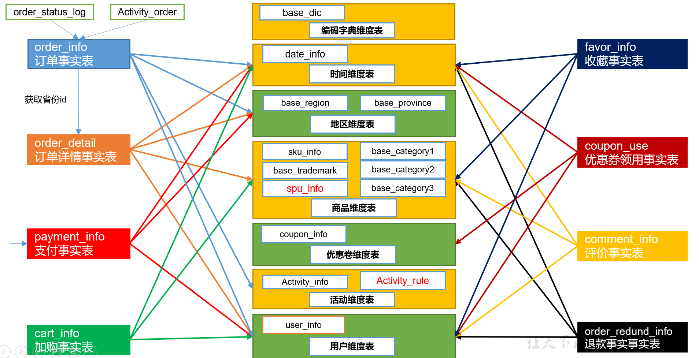
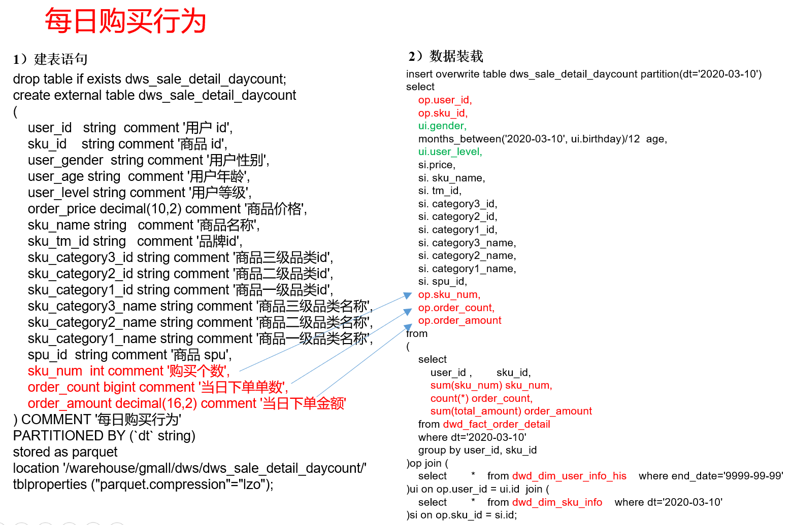

# DWS层（业务）
从**dws、dwt**层开始建的表**只需要使用列式存储即可，不要使用压缩**了，因为dws、dwt层的数据需要经常访问，对文件压缩虽然节约磁盘空间，但是会加重cpu的负担。ods层的数据基本和原始数据差不多（数据量大），从ods到dws只需一天统计一次，不怎么需要计算，属于io密集型操作，使用压缩。dws、dwt层的数据统计各种指标需要经常访问统计，属于计算密集型操作，况且dws、dwt层的数据都是聚合后的数据，数据量不算大，不必使用压缩。

**DWS层的宽表字段，是站在不同维度的视角去看事实表。重点关注事实表的度量值。**

数仓建模：


## 每日会员行为

### 建表语句
```sql
drop table if exists dws_user_action_daycount;

create external table dws_user_action_daycount
(
    user_id string comment '用户id',
    login_count bigint comment '登录次数',
    cart_count bigint comment '加入购物车次数',
    cart_amount double comment '加入购物车金额',
    order_count bigint comment '下单次数',
    order_amount decimal(16,2) comment '下单金额',
    payment_count bigint comment '支付次数',
    payment_amount decimal(16,2) comment '支付金额'
) COMMENT '每日用户行为'
PARTITIONED BY (`dt` string)
stored as parquet
location '/warehouse/gmall/dws/dws_user_action_daycount/';
```

### 导入数据
#### 方式一

方式一：
```sql
with tmp_login as(
    -- 登录次数从启动日志中统计
    select
        user_id,
        count(1) login_count
    from dwd_start_log
    where dt = '2020-03-10' and user_id is not null
    group by user_id
),
tmp_cart as(
    -- 加购事实表为周期型快照事实表，每日快照。所以要在where中过滤当天的数据
    select
        user_id,
        count(1) cart_count,
        sum(cart_price * sku_num) cart_amount
    from dwd_fact_cart_info
    where dt = '2020-03-10' and date_format(create_time,'yyyy-MM-dd') = '2020-03-10' and user_id is not null
    group by user_id
),
tmp_order as(
    --订单事实表（累积型快照事实表）
    select
        user_id,
        count(1) order_count,
        sum(final_total_amount) order_amount
    from dwd_fact_order_info
    where dt = '2020-03-10'
    group by user_id
),
tmp_payment as(
    --支付事实表（事务型快照事实表）
    select
        user_id,
        count(1) payment_count,
        sum(payment_amount) payment_amount
    from dwd_fact_payment_info
    where dt = '2020-03-10'
    group by user_id
)
insert overwrite table dws_user_action_daycount
partition(dt='2020-03-10')
select
    user_id,
    sum(login_count) login_count,
    sum(cart_count) cart_count,
    sum(cart_amount) cart_amount,
    sum(order_count) order_count,
    sum(order_amount) order_amount,
    sum(payment_count) payment_count,
    sum(payment_amount) payment_amount
from(
    select
        user_id,
        login_count,
        0 cart_count,
        0 cart_amount,
        0 order_count,
        0 order_amount,
        0 payment_count,
        0 payment_amount
    from tmp_login
    union all
    select
        user_id,
        0 login_count,
        cart_count,
        cart_amount,
        0 order_count,
        0 order_amount,
        0 payment_count,
        0 payment_amount
    from tmp_cart
    union all
    select
        user_id,
        0 login_count,
        0 cart_count,
        0 cart_amount,
        order_count,
        order_amount,
        0 payment_count,
        0 payment_amount
    from tmp_order
    union all
    select
        user_id,
        0 login_count,
        0 cart_count,
        0 cart_amount,
        0 order_count,
        0 order_amount,
        payment_count,
        payment_amount
    from tmp_payment
) user_actions
group by user_id;
```
查看：
```sql
select * from dws_user_action_daycount where dt='2020-03-10' limit 2;
```

#### 方式二
方式二：
```sql
insert overwrite table dws_user_action_daycount
partition(dt='2020-03-10')
select
    user_id,
    sum(login_count) login_count,
    sum(cart_count) cart_count,
    sum(cart_amount) cart_amount,
    sum(order_count) order_count,
    sum(order_amount) order_amount,
    sum(payment_count) payment_count,
    sum(payment_amount) payment_amount
from(
    -- 登录次数从启动日志中统计
    select
        user_id,
        1 login_count,
        0 cart_count,
        0 cart_amount,
        0 order_count,
        0 order_amount,
        0 payment_count,
        0 payment_amount
    from dwd_start_log
    where dt = '2020-03-10' and user_id is not null
    union all
    -- 加购事实表为周期型快照事实表，每日快照。所以要在where中过滤当天的数据
    select
        user_id,
        0 login_count,
        1 cart_count,
        cart_price * sku_num cart_amount,
        0 order_count,
        0 order_amount,
        0 payment_count,
        0 payment_amount
    from dwd_fact_cart_info
    where dt = '2020-03-10' and date_format(create_time,'yyyy-MM-dd') = '2020-03-10' and user_id is not null
    union all
    --订单事实表（累积型快照事实表）
    select
        user_id,
        0 login_count,
        0 cart_count,
        0 cart_amount,
        1 order_count,
        final_total_amount order_amount,
        0 payment_count,
        0 payment_amount
    from dwd_fact_order_info
    where dt = '2020-03-10'
    union all
    --支付事实表（事务型快照事实表）
    select
        user_id,
        0 login_count,
        0 cart_count,
        0 cart_amount,
        0 order_count,
        0 order_amount,
        1 payment_count,
        payment_amount payment_amount
    from dwd_fact_payment_info
    where dt = '2020-03-10'
) user_actions
group by user_id;
```

查看：
```sql
select * from dws_user_action_daycount where dt='2020-03-10' limit 2;
```

## 每日商品行为

### 建表语句
```sql
drop table if exists dws_sku_action_daycount;

create external table dws_sku_action_daycount 
(   
    sku_id string comment 'sku_id',
    order_count bigint comment '被下单次数',
    order_num bigint comment '被下单件数',
    order_amount decimal(16,2) comment '被下单金额',
    payment_count bigint  comment '被支付次数',
    payment_num bigint comment '被支付件数',
    payment_amount decimal(16,2) comment '被支付金额',
    refund_count bigint  comment '被退款次数',
    refund_num bigint comment '被退款件数',
    refund_amount  decimal(16,2) comment '被退款金额',
    cart_count bigint comment '被加入购物车次数',
    cart_num bigint comment '被加入购物车件数',
    favor_count bigint comment '被收藏次数',
    appraise_good_count bigint comment '好评数',
    appraise_mid_count bigint comment '中评数',
    appraise_bad_count bigint comment '差评数',
    appraise_default_count bigint comment '默认评价数'
) COMMENT '每日商品行为'
PARTITIONED BY (`dt` string)
stored as parquet
location '/warehouse/gmall/dws/dws_sku_action_daycount/';
```

### 导入数据
注意：如果是23点59下单，支付日期跨天。需要从订单详情里面取出支付时间是今天，订单时间是昨天或者今天的订单。

#### 方式一

```sql
with tmp_order as(
    -- 订单明细事实表（事务型快照事实表）
    select
        sku_id,
        count(1) order_count,
        sum(sku_num) order_num,
        sum(total_amount) order_amount
    from dwd_fact_order_detail
    where dt = '2020-03-10'
    group by sku_id
),
tmp_payment as(
    -- 订单事实表（累积型快照事实表）
    -- 查询今天和昨天的数据：防止昨天24点左右下单，今天支付。in子查询也可以使用join实现相同的效果。
    select
        sku_id,
        count(1) payment_count,
        sum(sku_num) payment_num,
        sum(total_amount) payment_amount
    from dwd_fact_order_detail
    where dt = '2020-03-10' and order_id in (
        select
            id
        from dwd_fact_order_info
        where (dt = '2020-03-10' or dt = date_sub('2020-03-10', 1)) 
        and date_format(payment_time, 'yyyy-MM-dd') = '2020-03-10'
    )
    group by sku_id
),
tmp_refund as(
    -- 退款事实表（事务型快照事实表）
    select
        sku_id,
        count(1) refund_count,
        sum(refund_num) refund_num,
        sum(refund_amount) refund_amount
    from dwd_fact_order_refund_info
    where dt = '2020-03-10'
    group by sku_id
),
tmp_cart as(
    -- 加购事实表（周期型快照事实表，每日快照）
    select
        sku_id,
        count(1) cart_count,
        sum(sku_num) cart_num
    from dwd_fact_cart_info
    where dt = '2020-03-10' and date_format(create_time, 'yyyy-MM-dd') = '2020-03-10'
    group by sku_id
),
tmp_favor as(
    -- 收藏事实表（周期型快照事实表，每日快照）
    select
        sku_id,
        count(1) favor_count
    from dwd_fact_favor_info
    where dt = '2020-03-10' and date_format(create_time, 'yyyy-MM-dd') = '2020-03-10'
    group by sku_id
),
tmp_appraise as(
    -- 评价事实表（事务型快照事实表）
    select
        sku_id,
        sum(if(appraise='1201', 1, 0)) appraise_good_count,
        sum(if(appraise='1202', 1, 0)) appraise_mid_count,
        sum(if(appraise='1203', 1, 0)) appraise_bad_count,
        sum(if(appraise='1204', 1, 0)) appraise_default_count
    from dwd_fact_comment_info
    where dt = '2020-03-10'
    group by sku_id
)
insert overwrite table dws_sku_action_daycount
partition(dt='2020-03-10')
select
    sku_id,
    sum(order_count) order_count,
    sum(order_num) order_num,
    sum(order_amount) order_amount,
    sum(payment_count) payment_count,
    sum(payment_num) payment_num,
    sum(payment_amount) payment_amount,
    sum(refund_count) refund_count,
    sum(refund_num) refund_num,
    sum(refund_amount) refund_amount,
    sum(cart_count) cart_count,
    sum(cart_num) cart_num,
    sum(favor_count) favor_count,
    sum(appraise_good_count) appraise_good_count,
    sum(appraise_mid_count) appraise_mid_count,
    sum(appraise_bad_count) appraise_bad_count,
    sum(appraise_default_count) appraise_default_count
from(
    select
        sku_id,
        order_count,
        order_num,
        order_amount,
        0 payment_count,
        0 payment_num,
        0 payment_amount,
        0 refund_count,
        0 refund_num,
        0 refund_amount,
        0 cart_count,
        0 cart_num,
        0 favor_count,
        0 appraise_good_count,
        0 appraise_mid_count,
        0 appraise_bad_count,
        0 appraise_default_count
    from tmp_order
    union all
    select
        sku_id,
        0 order_count,
        0 order_num,
        0 order_amount,
        payment_count,
        payment_num,
        payment_amount,
        0 refund_count,
        0 refund_num,
        0 refund_amount,
        0 cart_count,
        0 cart_num,
        0 favor_count,
        0 appraise_good_count,
        0 appraise_mid_count,
        0 appraise_bad_count,
        0 appraise_default_count
    from tmp_payment
    union all
    select
        sku_id,
        0 order_count,
        0 order_num,
        0 order_amount,
        0 payment_count,
        0 payment_num,
        0 payment_amount,
        refund_count,
        refund_num,
        refund_amount,
        0 cart_count,
        0 cart_num,
        0 favor_count,
        0 appraise_good_count,
        0 appraise_mid_count,
        0 appraise_bad_count,
        0 appraise_default_count
    from tmp_refund
    union all
    select
        sku_id,
        0 order_count,
        0 order_num,
        0 order_amount,
        0 payment_count,
        0 payment_num,
        0 payment_amount,
        0 refund_count,
        0 refund_num,
        0 refund_amount,
        cart_count,
        cart_num,
        0 favor_count,
        0 appraise_good_count,
        0 appraise_mid_count,
        0 appraise_bad_count,
        0 appraise_default_count
    from tmp_cart
    union all
    select
        sku_id,
        0 order_count,
        0 order_num,
        0 order_amount,
        0 payment_count,
        0 payment_num,
        0 payment_amount,
        0 refund_count,
        0 refund_num,
        0 refund_amount,
        0 cart_count,
        0 cart_num,
        favor_count,
        0 appraise_good_count,
        0 appraise_mid_count,
        0 appraise_bad_count,
        0 appraise_default_count
    from tmp_favor
    union all
    select
        sku_id,
        0 order_count,
        0 order_num,
        0 order_amount,
        0 payment_count,
        0 payment_num,
        0 payment_amount,
        0 refund_count,
        0 refund_num,
        0 refund_amount,
        0 cart_count,
        0 cart_num,
        0 favor_count,
        appraise_good_count,
        appraise_mid_count,
        appraise_bad_count,
        appraise_default_count
    from tmp_appraise
) user_actions
group by sku_id;
```

查看：
```sql
select * from dwd_dim_sku_info where dt='2020-03-10' limit 2;
```

#### 方式二
**dwd_fact_cart_info的sku_num字段为string，union all要求每列的类型一致，前面的方式使用sum(sku_num)会转换string**

这个使用cast转换成int，结果显示整数型，方式一使用sum结果显示小数型，方式三使用sku_num*1结果显示小数型。


```sql
insert overwrite table dws_sku_action_daycount
partition(dt='2020-03-10')
select
    sku_id,
    sum(order_count) order_count,
    sum(order_num) order_num,
    sum(order_amount) order_amount,
    sum(payment_count) payment_count,
    sum(payment_num) payment_num,
    sum(payment_amount) payment_amount,
    sum(refund_count) refund_count,
    sum(refund_num) refund_num,
    sum(refund_amount) refund_amount,
    sum(cart_count) cart_count,
    sum(cart_num) cart_num,
    sum(favor_count) favor_count,
    sum(appraise_good_count) appraise_good_count,
    sum(appraise_mid_count) appraise_mid_count,
    sum(appraise_bad_count) appraise_bad_count,
    sum(appraise_default_count) appraise_default_count
from(
    -- 订单明细事实表（事务型快照事实表）
    select
        sku_id,
        1 order_count,
        sku_num order_num,
        total_amount order_amount,
        0 payment_count,
        0 payment_num,
        0 payment_amount,
        0 refund_count,
        0 refund_num,
        0 refund_amount,
        0 cart_count,
        0 cart_num,
        0 favor_count,
        0 appraise_good_count,
        0 appraise_mid_count,
        0 appraise_bad_count,
        0 appraise_default_count
    from dwd_fact_order_detail
    where dt = '2020-03-10'
    union all
    -- 订单事实表（累积型快照事实表）
    -- 查询今天和昨天的数据：防止昨天24点左右下单，今天支付。in子查询也可以使用join实现相同的效果。
    select
        sku_id,
        0 order_count,
        0 order_num,
        0 order_amount,
        1 payment_count,
        sku_num payment_num,
        total_amount payment_amount,
        0 refund_count,
        0 refund_num,
        0 refund_amount,
        0 cart_count,
        0 cart_num,
        0 favor_count,
        0 appraise_good_count,
        0 appraise_mid_count,
        0 appraise_bad_count,
        0 appraise_default_count
    from dwd_fact_order_detail
    where dt = '2020-03-10' and order_id in (
        select
            id
        from dwd_fact_order_info
        where (dt = '2020-03-10' or dt = date_sub('2020-03-10', 1)) 
        and date_format(payment_time, 'yyyy-MM-dd') = '2020-03-10'
    )
    union all
    -- 退款事实表（事务型快照事实表）
    select
        sku_id,
        0 order_count,
        0 order_num,
        0 order_amount,
        0 payment_count,
        0 payment_num,
        0 payment_amount,
        1 refund_count,
        refund_num refund_num,
        refund_amount refund_amount,
        0 cart_count,
        0 cart_num,
        0 favor_count,
        0 appraise_good_count,
        0 appraise_mid_count,
        0 appraise_bad_count,
        0 appraise_default_count
    from dwd_fact_order_refund_info
    where dt = '2020-03-10'
    union all
    -- 加购事实表（周期型快照事实表，每日快照）
    -- -- dwd_fact_cart_info的sku_num字段为string，union all要求每列的类型一致，前面的方式使用sum(sku_num)会转换string
    select
        sku_id,
        0 order_count,
        0 order_num,
        0 order_amount,
        0 payment_count,
        0 payment_num,
        0 payment_amount,
        0 refund_count,
        0 refund_num,
        0 refund_amount,
        1 cart_count,
        cast(sku_num as int) cart_num,
        0 favor_count,
        0 appraise_good_count,
        0 appraise_mid_count,
        0 appraise_bad_count,
        0 appraise_default_count
    from dwd_fact_cart_info
    where dt = '2020-03-10' and date_format(create_time, 'yyyy-MM-dd') = '2020-03-10'
    union all
    -- 收藏事实表（周期型快照事实表，每日快照）
    select
        sku_id,
        0 order_count,
        0 order_num,
        0 order_amount,
        0 payment_count,
        0 payment_num,
        0 payment_amount,
        0 refund_count,
        0 refund_num,
        0 refund_amount,
        0 cart_count,
        0 cart_num,
        1 favor_count,
        0 appraise_good_count,
        0 appraise_mid_count,
        0 appraise_bad_count,
        0 appraise_default_count
    from dwd_fact_favor_info
    where dt = '2020-03-10' and date_format(create_time, 'yyyy-MM-dd') = '2020-03-10'
    union all
    -- 评价事实表（事务型快照事实表）
    select
        sku_id,
        0 order_count,
        0 order_num,
        0 order_amount,
        0 payment_count,
        0 payment_num,
        0 payment_amount,
        0 refund_count,
        0 refund_num,
        0 refund_amount,
        0 cart_count,
        0 cart_num,
        0 favor_count,
        if(appraise='1201', 1, 0) appraise_good_count,
        if(appraise='1202', 1, 0) appraise_mid_count,
        if(appraise='1203', 1, 0) appraise_bad_count,
        if(appraise='1204', 1, 0) appraise_default_count
    from dwd_fact_comment_info
    where dt = '2020-03-10'
) user_actions
group by sku_id;
```

查看：
```sql
select * from dwd_dim_sku_info where dt='2020-03-10' limit 2;
```

#### 方式三
这个和方式二个差不多，就是把方式二的前两个union all合起来应该会提高一点效率，不过得使用join代替之前的in子查询。

**dwd_fact_cart_info的sku_num字段为string，union all要求每列的类型一致，前面的方式使用sum(sku_num)会转换string**
```sql
insert overwrite table dws_sku_action_daycount
partition(dt='2020-03-10')
select
    sku_id,
    sum(order_count) order_count,
    sum(order_num) order_num,
    sum(order_amount) order_amount,
    sum(payment_count) payment_count,
    sum(payment_num) payment_num,
    sum(payment_amount) payment_amount,
    sum(refund_count) refund_count,
    sum(refund_num) refund_num,
    sum(refund_amount) refund_amount,
    sum(cart_count) cart_count,
    sum(cart_num) cart_num,
    sum(favor_count) favor_count,
    sum(appraise_good_count) appraise_good_count,
    sum(appraise_mid_count) appraise_mid_count,
    sum(appraise_bad_count) appraise_bad_count,
    sum(appraise_default_count) appraise_default_count
from(
    --使用left join下单和支付一起统计
    -- 订单明细事实表（事务型快照事实表）
    -- 订单事实表（累积型快照事实表）
    -- 查询今天和昨天的数据：防止昨天24点左右下单，今天支付。
    select
        sku_id,
        1 order_count,
        sku_num order_num,
        total_amount order_amount,
        if(op.id is not null, 1, 0) payment_count,
        if(op.id is not null, sku_num, 0) payment_num,
        if(op.id is not null, total_amount, 0) payment_amount,
        0 refund_count,
        0 refund_num,
        0 refund_amount,
        0 cart_count,
        0 cart_num,
        0 favor_count,
        0 appraise_good_count,
        0 appraise_mid_count,
        0 appraise_bad_count,
        0 appraise_default_count
    from(
        select
            order_id,
            sku_id,
            sku_num,
            total_amount
        from dwd_fact_order_detail
        where dt = '2020-03-10'
    ) od
    left join(
        select
            id
        from dwd_fact_order_info
        where (dt = '2020-03-10' or dt = date_sub('2020-03-10', 1)) 
        and date_format(payment_time, 'yyyy-MM-dd') = '2020-03-10'
    ) op on od.order_id = op.id
    union all
    -- 退款事实表（事务型快照事实表）
    select
        sku_id,
        0 order_count,
        0 order_num,
        0 order_amount,
        0 payment_count,
        0 payment_num,
        0 payment_amount,
        1 refund_count,
        refund_num refund_num,
        refund_amount refund_amount,
        0 cart_count,
        0 cart_num,
        0 favor_count,
        0 appraise_good_count,
        0 appraise_mid_count,
        0 appraise_bad_count,
        0 appraise_default_count
    from dwd_fact_order_refund_info
    where dt = '2020-03-10'
    union all
    -- 加购事实表（周期型快照事实表，每日快照）
    -- dwd_fact_cart_info的sku_num字段为string，union all要求每列的类型一致，前面的方式使用sum(sku_num)会转换string
    select
        sku_id,
        0 order_count,
        0 order_num,
        0 order_amount,
        0 payment_count,
        0 payment_num,
        0 payment_amount,
        0 refund_count,
        0 refund_num,
        0 refund_amount,
        1 cart_count,
        sku_num * 1 cart_num,
        0 favor_count,
        0 appraise_good_count,
        0 appraise_mid_count,
        0 appraise_bad_count,
        0 appraise_default_count
    from dwd_fact_cart_info
    where dt = '2020-03-10' and date_format(create_time, 'yyyy-MM-dd') = '2020-03-10'
    union all
    -- 收藏事实表（周期型快照事实表，每日快照）
    select
        sku_id,
        0 order_count,
        0 order_num,
        0 order_amount,
        0 payment_count,
        0 payment_num,
        0 payment_amount,
        0 refund_count,
        0 refund_num,
        0 refund_amount,
        0 cart_count,
        0 cart_num,
        1 favor_count,
        0 appraise_good_count,
        0 appraise_mid_count,
        0 appraise_bad_count,
        0 appraise_default_count
    from dwd_fact_favor_info
    where dt = '2020-03-10' and date_format(create_time, 'yyyy-MM-dd') = '2020-03-10'
    union all
    -- 评价事实表（事务型快照事实表）
    select
        sku_id,
        0 order_count,
        0 order_num,
        0 order_amount,
        0 payment_count,
        0 payment_num,
        0 payment_amount,
        0 refund_count,
        0 refund_num,
        0 refund_amount,
        0 cart_count,
        0 cart_num,
        0 favor_count,
        if(appraise='1201', 1, 0) appraise_good_count,
        if(appraise='1202', 1, 0) appraise_mid_count,
        if(appraise='1203', 1, 0) appraise_bad_count,
        if(appraise='1204', 1, 0) appraise_default_count
    from dwd_fact_comment_info
    where dt = '2020-03-10'
) user_actions
group by sku_id;
```


查看：
```sql
select * from dwd_dim_sku_info where dt='2020-03-10' limit 2;
```

#### sql编写过程
left:
```sql
create external table dws_sku_action_daycount 
(   
    sku_id string comment 'sku_id',
    order_count bigint comment '被下单次数',
    order_num bigint comment '被下单件数',
    order_amount decimal(16,2) comment '被下单金额',
    payment_count bigint  comment '被支付次数',
    payment_num bigint comment '被支付件数',
    payment_amount decimal(16,2) comment '被支付金额',
    refund_count bigint  comment '被退款次数',
    refund_num bigint comment '被退款件数',
    refund_amount  decimal(16,2) comment '被退款金额',
    cart_count bigint comment '被加入购物车次数',
    cart_num bigint comment '被加入购物车件数',
    favor_count bigint comment '被收藏次数',
    appraise_good_count bigint comment '好评数',
    appraise_mid_count bigint comment '中评数',
    appraise_bad_count bigint comment '差评数',
    appraise_default_count bigint comment '默认评价数'
) COMMENT '每日商品行为'
PARTITIONED BY (`dt` string)

-- 订单明细事实表（事务型快照事实表）
create external table dwd_fact_order_detail (
    `id` string COMMENT '订单编号',
    `order_id` string COMMENT '订单号',
    `user_id` string COMMENT '用户id',
    `sku_id` string COMMENT 'sku商品id',
    `sku_name` string COMMENT '商品名称',
    `order_price` decimal(10,2) COMMENT '商品价格',
    `sku_num` bigint COMMENT '商品数量',
    `create_time` string COMMENT '创建时间',
    `province_id` string COMMENT '省份ID',
    `total_amount` decimal(20,2) COMMENT '订单总金额'
) 
PARTITIONED BY (`dt` string)

-- 订单事实表（累积型快照事实表）
create external table dwd_fact_order_info (
    `id` string COMMENT '订单编号',
    `order_status` string COMMENT '订单状态',
    `user_id` string COMMENT '用户id',
    `out_trade_no` string COMMENT '支付流水号',
    `create_time` string COMMENT '创建时间(未支付状态)',
    `payment_time` string COMMENT '支付时间(已支付状态)',
    `cancel_time` string COMMENT '取消时间(已取消状态)',
    `finish_time` string COMMENT '完成时间(已完成状态)',
    `refund_time` string COMMENT '退款时间(退款中状态)',
    `refund_finish_time` string COMMENT '退款完成时间(退款完成状态)',
    `province_id` string COMMENT '省份ID',
    `activity_id` string COMMENT '活动ID',
    `original_total_amount` decimal(10,2) COMMENT '原价金额',
    `benefit_reduce_amount` decimal(10,2) COMMENT '优惠金额',
    `feight_fee` string COMMENT '运费',
    `final_total_amount` decimal(10,2) COMMENT '订单金额'
) 
PARTITIONED BY (`dt` string)

-- 退款事实表（事务型快照事实表）
create external table dwd_fact_order_refund_info(
    `id` string COMMENT '编号',
    `user_id` string COMMENT '用户ID',
    `order_id` string COMMENT '订单ID',
    `sku_id` string COMMENT '商品ID',
    `refund_type` string COMMENT '退款类型',
    `refund_num` bigint COMMENT '退款件数',
    `refund_amount` decimal(16,2) COMMENT '退款金额',
    `refund_reason_type` string COMMENT '退款原因类型',
    `create_time` string COMMENT '退款时间'
) COMMENT '退款事实表'
PARTITIONED BY (`dt` string)

-- 加购事实表（周期型快照事实表，每日快照）
create external table dwd_fact_cart_info(
    `id` string COMMENT '编号',
    `user_id` string  COMMENT '用户id',
    `sku_id` string  COMMENT 'skuid',
    `cart_price` string  COMMENT '放入购物车时价格',
    `sku_num` string  COMMENT '数量',
    `sku_name` string  COMMENT 'sku名称 (冗余)',
    `create_time` string  COMMENT '创建时间',
    `operate_time` string COMMENT '修改时间',
    `is_ordered` string COMMENT '是否已经下单。1为已下单;0为未下单',
    `order_time` string  COMMENT '下单时间'
) COMMENT '加购事实表'
PARTITIONED BY (`dt` string)

-- 收藏事实表（周期型快照事实表，每日快照）
create external table dwd_fact_favor_info(
    `id` string COMMENT '编号',
    `user_id` string  COMMENT '用户id',
    `sku_id` string  COMMENT 'skuid',
    `spu_id` string  COMMENT 'spuid',
    `is_cancel` string  COMMENT '是否取消',
    `create_time` string  COMMENT '收藏时间',
    `cancel_time` string  COMMENT '取消时间'
) COMMENT '收藏事实表'
PARTITIONED BY (`dt` string)


-- 评价事实表（事务型快照事实表）
create external table dwd_fact_comment_info(
    `id` string COMMENT '编号',
    `user_id` string COMMENT '用户ID',
    `sku_id` string COMMENT '商品sku',
    `spu_id` string COMMENT '商品spu',
    `order_id` string COMMENT '订单ID',
    `appraise` string COMMENT '评价',
    `create_time` string COMMENT '评价时间'
) COMMENT '评价事实表'
PARTITIONED BY (`dt` string)
('12','评价',NULL,NULL,NULL),
('1201','好评','12',NULL,NULL),
('1202','中评','12',NULL,NULL),
('1203','差评','12',NULL,NULL),
('1204','自动','12',NULL,NULL),
```

right:
```sql
with tmp_order as(
    -- 订单明细事实表（事务型快照事实表）
    select
        sku_id,
        count(1) order_count,
        sum(sku_num) order_num,
        sum(total_amount) order_amount
    from dwd_fact_order_detail
    where dt = '2020-03-10'
    group by sku_id;
),
with tmp_payment as(
    -- 订单事实表（累积型快照事实表）
    -- 查询今天和昨天的数据：防止昨天24点左右下单，今天支付。in子查询也可以使用join实现相同的效果。
    select
        sku_id,
        count(1) payment_count,
        sum(sku_num) payment_num,
        sum(total_amount) payment_amount
    from dwd_fact_order_detail
    where dt = '2020-03-10' and order_id in (
        select
            id
        from dwd_fact_order_info
        where (dt = '2020-03-10' or dt = date_sub('2020-03-10', 1)) 
        and date_format(payment_time, 'yyyy-MM-dd') = '2020-03-10'
    )
    group by sku_id;
),
with tmp_refund as(
    -- 退款事实表（事务型快照事实表）
    select
        sku_id,
        count(1) refund_count,
        sum(refund_num) refund_num,
        sum(refund_amount) refund_amount
    from dwd_fact_order_refund_info
    where dt = '2020-03-10'
    group by sku_id;
),
with tmp_cart as(
    -- 加购事实表（周期型快照事实表，每日快照）
    select
        sku_id,
        count(1) cart_count,
        sum(sku_num) cart_num
    from dwd_fact_order_refund_info
    where dt = '2020-03-10' and date_format(create_time, 'yyyy-MM-dd') = '2020-03-10'
    group by sku_id;
),
with tmp_favor as(
    -- 收藏事实表（周期型快照事实表，每日快照）
    select
        sku_id,
        count(1) favor_count
    from dwd_fact_favor_info
    where dt = '2020-03-10' and date_format(create_time, 'yyyy-MM-dd') = '2020-03-10'
    group by sku_id;
),
with tmp_appraise as(
    -- 评价事实表（事务型快照事实表）
    select
        sku_id,
        sum(if(appraise='1201', 1, 0)) appraise_good_count,
        sum(if(appraise='1202', 1, 0)) appraise_mid_count,
        sum(if(appraise='1203', 1, 0)) appraise_bad_count,
        sum(if(appraise='1204', 1, 0)) appraise_default_count
    from dwd_fact_comment_info
    where dt = '2020-03-10'
    group by sku_id;
)
insert overwrite table dws_sku_action_daycount
partition(dt='2020-03-10')
select
    sku_id,
    sum(order_count) order_count,
    sum(order_num) order_num,
    sum(order_amount) order_amount,
    sum(payment_count) payment_count,
    sum(payment_num) payment_num,
    sum(payment_amount) payment_amount,
    sum(refund_count) refund_count,
    sum(refund_num) refund_num,
    sum(refund_amount) refund_amount,
    sum(cart_count) cart_count,
    sum(cart_num) cart_num,
    sum(favor_count) favor_count,
    sum(appraise_good_count) appraise_good_count,
    sum(appraise_mid_count) appraise_mid_count,
    sum(appraise_bad_count) appraise_bad_count,
    sum(appraise_default_count) appraise_default_count
from(
    select
        sku_id
        order_count,
        order_num,
        order_amount,
        0 payment_count,
        0 payment_num,
        0 payment_amount,
        0 refund_count,
        0 refund_num,
        0 refund_amount,
        0 cart_count,
        0 cart_num,
        0 favor_count,
        0 appraise_good_count,
        0 appraise_mid_count,
        0 appraise_bad_count,
        0 appraise_default_count
    from tmp_order
    union all
    select
        sku_id
        0 order_count,
        0 order_num,
        0 order_amount,
        payment_count,
        payment_num,
        payment_amount,
        0 refund_count,
        0 refund_num,
        0 refund_amount,
        0 cart_count,
        0 cart_num,
        0 favor_count,
        0 appraise_good_count,
        0 appraise_mid_count,
        0 appraise_bad_count,
        0 appraise_default_count
    from tmp_payment
    union all
    select
        sku_id
        0 order_count,
        0 order_num,
        0 order_amount,
        0 payment_count,
        0 payment_num,
        0 payment_amount,
        refund_count,
        refund_num,
        refund_amount,
        0 cart_count,
        0 cart_num,
        0 favor_count,
        0 appraise_good_count,
        0 appraise_mid_count,
        0 appraise_bad_count,
        0 appraise_default_count
    from tmp_refund
    union all
    select
        sku_id
        0 order_count,
        0 order_num,
        0 order_amount,
        0 payment_count,
        0 payment_num,
        0 payment_amount,
        0 refund_count,
        0 refund_num,
        0 refund_amount,
        cart_count,
        cart_num,
        0 favor_count,
        0 appraise_good_count,
        0 appraise_mid_count,
        0 appraise_bad_count,
        0 appraise_default_count
    from tmp_cart
    union all
    select
        sku_id
        0 order_count,
        0 order_num,
        0 order_amount,
        0 payment_count,
        0 payment_num,
        0 payment_amount,
        0 refund_count,
        0 refund_num,
        0 refund_amount,
        0 cart_count,
        0 cart_num,
        favor_count,
        0 appraise_good_count,
        0 appraise_mid_count,
        0 appraise_bad_count,
        0 appraise_default_count
    from tmp_favor
    union all
    select
        sku_id
        0 order_count,
        0 order_num,
        0 order_amount,
        0 payment_count,
        0 payment_num,
        0 payment_amount,
        0 refund_count,
        0 refund_num,
        0 refund_amount,
        0 cart_count,
        0 cart_num,
        0 favor_count,
        appraise_good_count,
        appraise_mid_count,
        appraise_bad_count,
        appraise_default_count
    from tmp_appraise
) user_actions
group by sku_id;
```


## 每日购买行为


### 建表语句
```sql
drop table if exists dws_sale_detail_daycount;

create external table dws_sale_detail_daycount
(   
    user_id string comment '用户 id',
    sku_id string comment '商品 id',
    user_gender string comment '用户性别',
    user_age string comment '用户年龄',
    user_level string comment '用户等级',
    order_price decimal(10,2) comment '商品价格',
    sku_name string comment '商品名称',
    sku_tm_id string comment '品牌id',
    sku_category3_id string comment '商品三级品类id',
    sku_category2_id string comment '商品二级品类id',
    sku_category1_id string comment '商品一级品类id',
    sku_category3_name string comment '商品三级品类名称',
    sku_category2_name string comment '商品二级品类名称',
    sku_category1_name string comment '商品一级品类名称',
    spu_id  string comment '商品 spu',
    sku_num  int comment '购买个数',
    order_count bigint comment '当日下单单数',
    order_amount decimal(16,2) comment '当日下单金额'
) COMMENT '每日购买行为'
PARTITIONED BY (`dt` string)
stored as parquet
location '/warehouse/gmall/dws/dws_sale_detail_daycount/';
```

### 导入数据
```sql
insert overwrite table dws_sale_detail_daycount
partition(dt='2020-03-10')
select
    op.user_id,
    op.sku_id,
    ui.gender,
    months_between('2020-03-10', ui.birthday)/12 age,
    ui.user_level,
    si.price,
    si.sku_name,
    si.tm_id,
    si.category3_id,
    si.category2_id,
    si.category1_id,
    si.category3_name,
    si.category2_name,
    si.category1_name,
    si.spu_id,
    op.sku_num,
    op.order_count,
    op.order_amount
from(
    -- 订单明细事实表（事务型快照事实表）
    -- 这个统计度量值，其他的都是维度关联
    select
        user_id,
        sku_id,
        sum(sku_num) sku_num,--购买个数
        count(1) order_count,--当日下单单数
        sum(total_amount) order_amount --当日下单金额
    from dwd_fact_order_detail
    where dt = '2020-03-10'
    group by user_id, sku_id
) op
left join(
    -- 关联用户信息。用户维度表（拉链表）
    select
        id,
        gender,
        birthday,
        user_level
    from dwd_dim_user_info_his
    where end_date = '9999-99-99'
) ui on op.user_id = ui.id
left join(
    -- 关联商品信息。商品维度表（全量表）
    select
        id,
        price,
        sku_name,
        tm_id,
        category3_id,
        category2_id,
        category1_id,
        category3_name,
        category2_name,
        category1_name,
        spu_id
    from dwd_dim_sku_info
    where dt = '2020-03-10'
)si on op.sku_id = si.id;
```

查看：
```sql
select * from dwd_dim_sku_info where dt='2020-03-10' limit 2;
```

## DWS层导入数据脚本
DWS层用户行为和业务表共用一个脚本。

创建dwd_to_dws.sh 导入dws的数据。
```
[hadoop@hadoop101 hive-mr-script]$ vi dwd_to_dws.sh
```

内容：
```sh
#!/bin/bash

hive=/opt/module/hive-2.3.6/bin/hive
hive_db=gmall

# 如果是输入的日期按照取输入日期；如果没输入日期取当前时间的前一天
if [[ -n "$1" ]]; then
    do_date=$1
else
    do_date=`date -d '-1 day' +%F`
fi

if [ ${#do_date} -ne 10 ];then
    echo "日期格式不正确"
    exit
fi

echo "===日志日期为 $do_date==="

# 每日设备行为
insert_dws_uv_detail_daycount="
insert overwrite table dws_uv_detail_daycount
partition(dt='$do_date')
select
    mid_id,
    concat_ws('|', collect_set(user_id)) user_id,
    concat_ws('|', collect_set(version_code)) version_code,
    concat_ws('|', collect_set(version_name)) version_name,
    concat_ws('|', collect_set(lang)) lang,
    concat_ws('|', collect_set(source)) source,
    concat_ws('|', collect_set(os)) os,
    concat_ws('|', collect_set(area)) area,
    concat_ws('|', collect_set(model)) model,
    concat_ws('|', collect_set(brand)) brand,
    concat_ws('|', collect_set(sdk_version)) sdk_version,
    concat_ws('|', collect_set(gmail)) gmail,
    concat_ws('|', collect_set(height_width)) height_width,
    concat_ws('|', collect_set(app_time)) app_time,
    concat_ws('|', collect_set(network)) network,
    concat_ws('|', collect_set(lng)) lng,
    concat_ws('|', collect_set(lat)) lat,
    count(1) login_count
from dwd_start_log
where dt = '$do_date'
group by mid_id;
"

# 每日会员行为
insert_dws_user_action_daycount="
with tmp_login as(
    -- 登录次数从启动日志中统计
    select
        user_id,
        count(1) login_count
    from dwd_start_log
    where dt = '$do_date' and user_id is not null
    group by user_id
),
tmp_cart as(
    -- 加购事实表为周期型快照事实表，每日快照。所以要在where中过滤当天的数据
    select
        user_id,
        count(1) cart_count,
        sum(cart_price * sku_num) cart_amount
    from dwd_fact_cart_info
    where dt = '$do_date' and date_format(create_time,'yyyy-MM-dd') = '$do_date' and user_id is not null
    group by user_id
),
tmp_order as(
    --订单事实表（累积型快照事实表）
    select
        user_id,
        count(1) order_count,
        sum(final_total_amount) order_amount
    from dwd_fact_order_info
    where dt = '$do_date'
    group by user_id
),
tmp_payment as(
    --支付事实表（事务型快照事实表）
    select
        user_id,
        count(1) payment_count,
        sum(payment_amount) payment_amount
    from dwd_fact_payment_info
    where dt = '$do_date'
    group by user_id
)
insert overwrite table dws_user_action_daycount
partition(dt='$do_date')
select
    user_id,
    sum(login_count) login_count,
    sum(cart_count) cart_count,
    sum(cart_amount) cart_amount,
    sum(order_count) order_count,
    sum(order_amount) order_amount,
    sum(payment_count) payment_count,
    sum(payment_amount) payment_amount
from(
    select
        user_id,
        login_count,
        0 cart_count,
        0 cart_amount,
        0 order_count,
        0 order_amount,
        0 payment_count,
        0 payment_amount
    from tmp_login
    union all
    select
        user_id,
        0 login_count,
        cart_count,
        cart_amount,
        0 order_count,
        0 order_amount,
        0 payment_count,
        0 payment_amount
    from tmp_cart
    union all
    select
        user_id,
        0 login_count,
        0 cart_count,
        0 cart_amount,
        order_count,
        order_amount,
        0 payment_count,
        0 payment_amount
    from tmp_order
    union all
    select
        user_id,
        0 login_count,
        0 cart_count,
        0 cart_amount,
        0 order_count,
        0 order_amount,
        payment_count,
        payment_amount
    from tmp_payment
) user_actions
group by user_id;
"

# 每日商品行为
insert_dws_sku_action_daycount="
insert overwrite table dws_sku_action_daycount
partition(dt='$do_date')
select
    sku_id,
    sum(order_count) order_count,
    sum(order_num) order_num,
    sum(order_amount) order_amount,
    sum(payment_count) payment_count,
    sum(payment_num) payment_num,
    sum(payment_amount) payment_amount,
    sum(refund_count) refund_count,
    sum(refund_num) refund_num,
    sum(refund_amount) refund_amount,
    sum(cart_count) cart_count,
    sum(cart_num) cart_num,
    sum(favor_count) favor_count,
    sum(appraise_good_count) appraise_good_count,
    sum(appraise_mid_count) appraise_mid_count,
    sum(appraise_bad_count) appraise_bad_count,
    sum(appraise_default_count) appraise_default_count
from(
    --使用left join下单和支付一起统计
    -- 订单明细事实表（事务型快照事实表）
    -- 订单事实表（累积型快照事实表）
    -- 查询今天和昨天的数据：防止昨天24点左右下单，今天支付。
    select
        sku_id,
        1 order_count,
        sku_num order_num,
        total_amount order_amount,
        if(op.id is not null, 1, 0) payment_count,
        if(op.id is not null, sku_num, 0) payment_num,
        if(op.id is not null, total_amount, 0) payment_amount,
        0 refund_count,
        0 refund_num,
        0 refund_amount,
        0 cart_count,
        0 cart_num,
        0 favor_count,
        0 appraise_good_count,
        0 appraise_mid_count,
        0 appraise_bad_count,
        0 appraise_default_count
    from(
        select
            order_id,
            sku_id,
            sku_num,
            total_amount
        from dwd_fact_order_detail
        where dt = '$do_date'
    ) od
    left join(
        select
            id
        from dwd_fact_order_info
        where (dt = '$do_date' or dt = date_sub('$do_date', 1)) 
        and date_format(payment_time, 'yyyy-MM-dd') = '$do_date'
    ) op on od.order_id = op.id
    union all
    -- 退款事实表（事务型快照事实表）
    select
        sku_id,
        0 order_count,
        0 order_num,
        0 order_amount,
        0 payment_count,
        0 payment_num,
        0 payment_amount,
        1 refund_count,
        refund_num refund_num,
        refund_amount refund_amount,
        0 cart_count,
        0 cart_num,
        0 favor_count,
        0 appraise_good_count,
        0 appraise_mid_count,
        0 appraise_bad_count,
        0 appraise_default_count
    from dwd_fact_order_refund_info
    where dt = '$do_date'
    union all
    -- 加购事实表（周期型快照事实表，每日快照）
    -- dwd_fact_cart_info的sku_num字段为string，union all要求每列的类型一致，前面的方式使用sum(sku_num)会转换string
    select
        sku_id,
        0 order_count,
        0 order_num,
        0 order_amount,
        0 payment_count,
        0 payment_num,
        0 payment_amount,
        0 refund_count,
        0 refund_num,
        0 refund_amount,
        1 cart_count,
        sku_num * 1 cart_num,
        0 favor_count,
        0 appraise_good_count,
        0 appraise_mid_count,
        0 appraise_bad_count,
        0 appraise_default_count
    from dwd_fact_cart_info
    where dt = '$do_date' and date_format(create_time, 'yyyy-MM-dd') = '$do_date'
    union all
    -- 收藏事实表（周期型快照事实表，每日快照）
    select
        sku_id,
        0 order_count,
        0 order_num,
        0 order_amount,
        0 payment_count,
        0 payment_num,
        0 payment_amount,
        0 refund_count,
        0 refund_num,
        0 refund_amount,
        0 cart_count,
        0 cart_num,
        1 favor_count,
        0 appraise_good_count,
        0 appraise_mid_count,
        0 appraise_bad_count,
        0 appraise_default_count
    from dwd_fact_favor_info
    where dt = '$do_date' and date_format(create_time, 'yyyy-MM-dd') = '$do_date'
    union all
    -- 评价事实表（事务型快照事实表）
    select
        sku_id,
        0 order_count,
        0 order_num,
        0 order_amount,
        0 payment_count,
        0 payment_num,
        0 payment_amount,
        0 refund_count,
        0 refund_num,
        0 refund_amount,
        0 cart_count,
        0 cart_num,
        0 favor_count,
        if(appraise='1201', 1, 0) appraise_good_count,
        if(appraise='1202', 1, 0) appraise_mid_count,
        if(appraise='1203', 1, 0) appraise_bad_count,
        if(appraise='1204', 1, 0) appraise_default_count
    from dwd_fact_comment_info
    where dt = '$do_date'
) user_actions
group by sku_id;
"

# 每日购买行为
insert_dws_sale_detail_daycount="
insert overwrite table dws_sale_detail_daycount
partition(dt='$do_date')
select
    op.user_id,
    op.sku_id,
    ui.gender,
    months_between('$do_date', ui.birthday)/12 age,
    ui.user_level,
    si.price,
    si.sku_name,
    si.tm_id,
    si.category3_id,
    si.category2_id,
    si.category1_id,
    si.category3_name,
    si.category2_name,
    si.category1_name,
    si.spu_id,
    op.sku_num,
    op.order_count,
    op.order_amount
from(
    -- 订单明细事实表（事务型快照事实表）
    -- 这个统计度量值，其他的都是维度关联
    select
        user_id,
        sku_id,
        sum(sku_num) sku_num,--购买个数
        count(1) order_count,--当日下单单数
        sum(total_amount) order_amount --当日下单金额
    from dwd_fact_order_detail
    where dt = '$do_date'
    group by user_id, sku_id
) op
left join(
    -- 关联用户信息。用户维度表（拉链表）
    select
        id,
        gender,
        birthday,
        user_level
    from dwd_dim_user_info_his
    where end_date = '9999-99-99'
) ui on op.user_id = ui.id
left join(
    -- 关联商品信息。商品维度表（全量表）
    select
        id,
        price,
        sku_name,
        tm_id,
        category3_id,
        category2_id,
        category1_id,
        category3_name,
        category2_name,
        category1_name,
        spu_id
    from dwd_dim_sku_info
    where dt = '$do_date'
)si on op.sku_id = si.id;
"

sql="
use $hive_db;

-- insert_table:每日设备行为
$insert_dws_uv_detail_daycount

-- insert_table:每日会员行为
$insert_dws_user_action_daycount

-- insert_table:每日商品行为
$insert_dws_sku_action_daycount

-- insert_table:每日购买行为
$insert_dws_sale_detail_daycount
"

#echo "$sql"

$hive -e "$sql"
```


脚本测试：
```
[hadoop@hadoop101 hive-mr-script]$ ./dwd_to_dws.sh 2020-03-11
```


查看导入数据
```sql
/opt/module/hive-2.3.6/bin/hive -e "select * from gmall.dws_uv_detail_daycount where dt='2020-03-11' limit 5;"
/opt/module/hive-2.3.6/bin/hive -e "select * from gmall.dws_user_action_daycount where dt='2020-03-11' limit 5;"
/opt/module/hive-2.3.6/bin/hive -e "select * from gmall.dws_sku_action_daycount where dt='2020-03-11' limit 5;"
/opt/module/hive-2.3.6/bin/hive -e "select * from gmall.dws_sale_detail_daycount where dt='2020-03-11' limit 5;"
```


