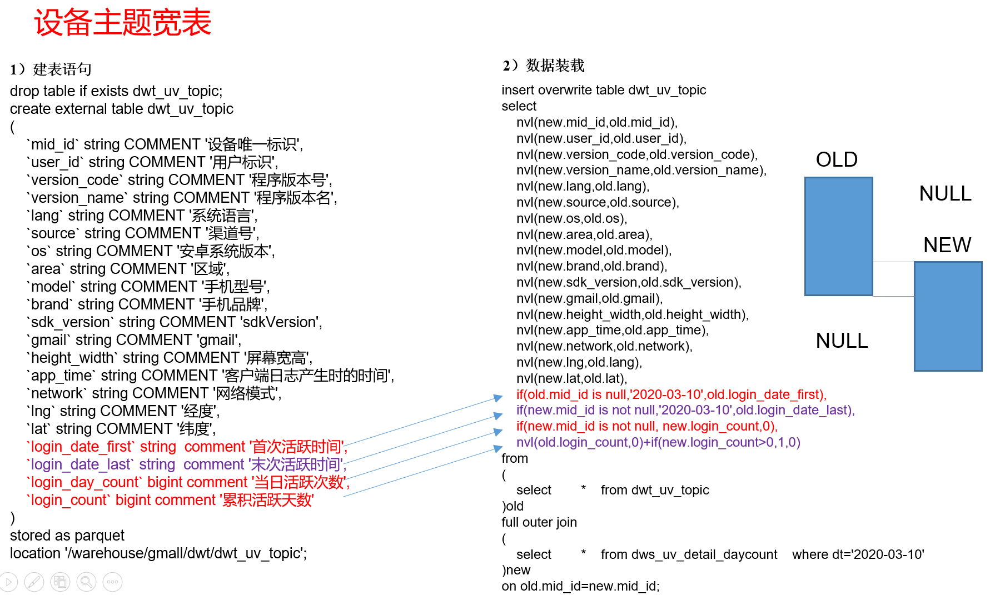
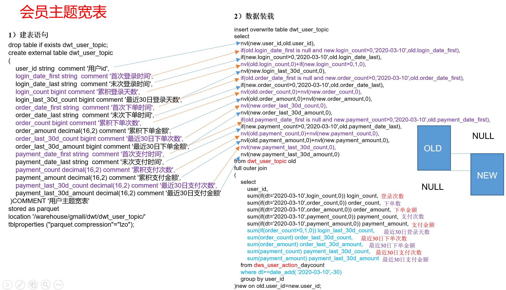

# DWT层

## 设备主题宽表


### 建表语句
```sql
drop table if exists dwt_uv_topic;

create external table dwt_uv_topic
(
    `mid_id` string COMMENT '设备唯一标识',
    `user_id` string COMMENT '用户标识',
    `version_code` string COMMENT '程序版本号',
    `version_name` string COMMENT '程序版本名',
    `lang` string COMMENT '系统语言',
    `source` string COMMENT '渠道号',
    `os` string COMMENT '安卓系统版本',
    `area` string COMMENT '区域',
    `model` string COMMENT '手机型号',
    `brand` string COMMENT '手机品牌',
    `sdk_version` string COMMENT 'sdkVersion',
    `gmail` string COMMENT 'gmail',
    `height_width` string COMMENT '屏幕宽高',
    `app_time` string COMMENT '客户端日志产生时的时间',
    `network` string COMMENT '网络模式',
    `lng` string COMMENT '经度',
    `lat` string COMMENT '纬度',
    `login_date_first` string  comment '首次活跃时间',
    `login_date_last` string  comment '末次活跃时间',
    `login_day_count` bigint comment '当日活跃次数',
    `login_count` bigint comment '累积活跃天数'
)
stored as parquet
location '/warehouse/gmall/dwt/dwt_uv_topic';
```

### 导入数据
```sql
insert overwrite table dwt_uv_topic
select
    -- nvl能实现的，if都能实现，这里就是练一下nvl。
    -- if 和 nvl两个参数的返回类型必须一致：
    -- T if(boolean testCondition, T valueTrue, T valueFalseOrNull)
    -- T nvl(T value, T default_value)
    nvl(new.mid_id, old.mid_id),
    nvl(new.user_id, old.user_id),
    nvl(new.version_code, old.version_code),
    nvl(new.version_name, old.version_name),
    nvl(new.lang, old.lang),
    nvl(new.source, old.source),
    nvl(new.os, old.os),
    nvl(new.area, old.area),
    nvl(new.model, old.model),
    nvl(new.brand, old.brand),
    nvl(new.sdk_version, old.sdk_version),
    nvl(new.gmail, old.gmail),
    nvl(new.height_width, old.height_width),
    nvl(new.app_time, old.app_time),
    nvl(new.network, old.network),
    nvl(new.lng, old.lng),
    nvl(new.lat, old.lat),
    nvl(old.login_date_first, '2020-03-10'),
    if(new.mid_id is not null, '2020-03-10', old.login_date_last),
    nvl(new.login_count, 0),
    nvl(old.login_count, 0) + if(new.login_count > 0, 1, 0)
from(
    select
        *
    from dwt_uv_topic
) old
full join(
    select
        *
    from dws_uv_detail_daycount
    where dt = '2020-03-10'
) new on old.mid_id = new.mid_id;
```

查看：
```sql
select mid_id,login_date_first,login_date_last,login_day_count,login_count from dwt_uv_topic limit 5;
```

## 会员主题宽表
宽表字段怎么来？维度关联的事实表度量值+开头、结尾+累积+累积一个时间段。



### 建表语句
```sql
drop table if exists dwt_user_topic;

create external table dwt_user_topic
(
    user_id string  comment '用户id',
    login_date_first string  comment '首次登录时间',
    login_date_last string  comment '末次登录时间',
    login_count bigint comment '累积登录天数',
    login_last_30d_count bigint comment '最近30日登录天数',
    order_date_first string  comment '首次下单时间',
    order_date_last string  comment '末次下单时间',
    order_count bigint comment '累积下单次数',
    order_amount decimal(16,2) comment '累积下单金额',
    order_last_30d_count bigint comment '最近30日下单次数',
    order_last_30d_amount bigint comment '最近30日下单金额',
    payment_date_first string  comment '首次支付时间',
    payment_date_last string  comment '末次支付时间',
    payment_count decimal(16,2) comment '累积支付次数',
    payment_amount decimal(16,2) comment '累积支付金额',
    payment_last_30d_count decimal(16,2) comment '最近30日支付次数',
    payment_last_30d_amount decimal(16,2) comment '最近30日支付金额'
 )COMMENT '用户主题宽表'
stored as parquet
location '/warehouse/gmall/dwt/dwt_user_topic/';
```

### 导入数据

#### 方式一
每次都查询最近30的数据
```sql
insert overwrite table dwt_user_topic
select
    -- nvl能实现的，if都能实现，这里就是练一下nvl。
    -- if 和 nvl两个参数的返回类型必须一致：
    -- T if(boolean testCondition, T valueTrue, T valueFalseOrNull)
    -- T nvl(T value, T default_value)
    -- 这里面所有的统计都需要考虑两个表（old、new）的数据是否有数据
    nvl(new.user_id, old.user_id), --用户id
    if(old.login_date_first is null and new.login_count > 0, '2020-03-10', old.login_date_first), --首次登录时间
    if(new.login_count > 0, '2020-03-10', old.login_date_last), -- 末次登录时间
    nvl(old.login_count, 0) + if(new.login_count > 0, 1, 0), -- 累积登录天数
    nvl(new.login_last_30d_count,0), --最近30日登录天数
    if(old.order_date_first is null and new.order_count > 0, '2020-03-10', old.order_date_first), --首次下单时间
    if(new.order_count > 0, '2020-03-10', old.order_date_last), -- 末次下单时间
    nvl(old.order_count, 0) + nvl(new.order_count, 0), -- 累积下单次数
    nvl(old.order_amount, 0) + nvl(new.order_amount, 0), -- 累积下单金额
    nvl(new.order_last_30d_count, 0), -- 最近30日下单次数
    nvl(new.order_last_30d_amount, 0), -- 最近30日下单金额
    if(old.payment_date_first is null and new.payment_count > 0, '2020-03-10', old.payment_date_first), --首次支付时间
    if(new.payment_count > 0, '2020-03-10', old.payment_date_last), -- 末次支付时间
    nvl(old.payment_count, 0) + nvl(new.payment_count, 0), -- 累积支付次数
    nvl(old.payment_amount, 0) + nvl(new.payment_amount, 0), -- 累积支付金额
    nvl(new.payment_last_30d_count, 0), -- 最近30日支付次数
    nvl(new.payment_last_30d_amount, 0) -- 最近30日支付金额
from(
    select
        *
    from dwt_user_topic
) old
full join(
    -- 
    select
        user_id,
        -- 当天登录次数
        sum(if(dt='2020-03-10', login_count, 0)) login_count,
        -- 当天下单次数
        sum(if(dt='2020-03-10', order_count, 0)) order_count,
        -- 当天下单金额
        sum(if(dt='2020-03-10', order_amount,0)) order_amount,
        -- 当天支付次数
        sum(if(dt='2020-03-10', payment_count, 0)) payment_count,
        -- 当天支付金额
        sum(if(dt='2020-03-10', payment_amount,0)) payment_amount,
        -- 最近30日登录天数
        sum(if(login_count>0, 1, 0)) login_last_30d_count,
        -- 最近30日下单次数
        sum(order_count) order_last_30d_count,
        -- 最近30日下单金额
        sum(order_amount) order_last_30d_amount,
        -- 最近30日支付次数
        sum(payment_count) payment_last_30d_count,
        -- 最近30日支付金额
        sum(payment_amount) payment_last_30d_amount
    from dws_user_action_daycount
    where dt > date_sub('2020-03-10', 30) and dt <= '2020-03-10'
    group by user_id
) new on old.user_id = new.user_id;
```

查看：
```sql
select * from dwd_dim_sku_info where dt='2020-03-10' limit 2;
```

#### 方式二
把最近30每天的统计值都储存到字段中，使用自定义udf，超过30天时弹出最早的数据。


## 商品主题宽表

### 建表语句
```sql
drop table if exists dwt_sku_topic;

create external table dwt_sku_topic
(
    sku_id string comment 'sku_id',
    spu_id string comment 'spu_id',
    order_last_30d_count bigint comment '最近30日被下单次数',
    order_last_30d_num bigint comment '最近30日被下单件数',
    order_last_30d_amount decimal(16,2)  comment '最近30日被下单金额',
    order_count bigint comment '累积被下单次数',
    order_num bigint comment '累积被下单件数',
    order_amount decimal(16,2) comment '累积被下单金额',
    payment_last_30d_count   bigint  comment '最近30日被支付次数',
    payment_last_30d_num bigint comment '最近30日被支付件数',
    payment_last_30d_amount  decimal(16,2) comment '最近30日被支付金额',
    payment_count   bigint  comment '累积被支付次数',
    payment_num bigint comment '累积被支付件数',
    payment_amount  decimal(16,2) comment '累积被支付金额',
    refund_last_30d_count bigint comment '最近三十日退款次数',
    refund_last_30d_num bigint comment '最近三十日退款件数',
    refund_last_30d_amount decimal(10,2) comment '最近三十日退款金额',
    refund_count bigint comment '累积退款次数',
    refund_num bigint comment '累积退款件数',
    refund_amount decimal(10,2) comment '累积退款金额',
    cart_last_30d_count bigint comment '最近30日被加入购物车次数',
    cart_last_30d_num bigint comment '最近30日被加入购物车件数',
    cart_count bigint comment '累积被加入购物车次数',
    cart_num bigint comment '累积被加入购物车件数',
    favor_last_30d_count bigint comment '最近30日被收藏次数',
    favor_count bigint comment '累积被收藏次数',
    appraise_last_30d_good_count bigint comment '最近30日好评数',
    appraise_last_30d_mid_count bigint comment '最近30日中评数',
    appraise_last_30d_bad_count bigint comment '最近30日差评数',
    appraise_last_30d_default_count bigint comment '最近30日默认评价数',
    appraise_good_count bigint comment '累积好评数',
    appraise_mid_count bigint comment '累积中评数',
    appraise_bad_count bigint comment '累积差评数',
    appraise_default_count bigint comment '累积默认评价数'
 )COMMENT '商品主题宽表'
stored as parquet
location '/warehouse/gmall/dwt/dwt_sku_topic/';
```

### 导入数据
**这里面关联sku信息使用的是`on nvl(new.sku_id,old.sku_id) = sku_info.id`**，jion中原来也可以使用函数。

```sql
insert overwrite table dwt_sku_topic
select 
    nvl(new.sku_id,old.sku_id),
    sku_info.spu_id,
    nvl(new.order_count30,0),
    nvl(new.order_num30,0),
    nvl(new.order_amount30,0),
    nvl(old.order_count,0) + nvl(new.order_count,0),
    nvl(old.order_num,0) + nvl(new.order_num,0),
    nvl(old.order_amount,0) + nvl(new.order_amount,0),
    nvl(new.payment_count30,0),
    nvl(new.payment_num30,0),
    nvl(new.payment_amount30,0),
    nvl(old.payment_count,0) + nvl(new.payment_count,0),
    nvl(old.payment_num,0) + nvl(new.payment_count,0),
    nvl(old.payment_amount,0) + nvl(new.payment_count,0),
    nvl(new.refund_count30,0),
    nvl(new.refund_num30,0),
    nvl(new.refund_amount30,0),
    nvl(old.refund_count,0) + nvl(new.refund_count,0),
    nvl(old.refund_num,0) + nvl(new.refund_num,0),
    nvl(old.refund_amount,0) + nvl(new.refund_amount,0),
    nvl(new.cart_count30,0),
    nvl(new.cart_num30,0),
    nvl(old.cart_count,0) + nvl(new.cart_count,0),
    nvl(old.cart_num,0) + nvl(new.cart_num,0),
    nvl(new.favor_count30,0),
    nvl(old.favor_count,0) + nvl(new.favor_count,0),
    nvl(new.appraise_good_count30,0),
    nvl(new.appraise_mid_count30,0),
    nvl(new.appraise_bad_count30,0),
    nvl(new.appraise_default_count30,0)  ,
    nvl(old.appraise_good_count,0) + nvl(new.appraise_good_count,0),
    nvl(old.appraise_mid_count,0) + nvl(new.appraise_mid_count,0),
    nvl(old.appraise_bad_count,0) + nvl(new.appraise_bad_count,0),
    nvl(old.appraise_default_count,0) + nvl(new.appraise_default_count,0) 
from 
(
    select
        sku_id,
        spu_id,
        order_last_30d_count,
        order_last_30d_num,
        order_last_30d_amount,
        order_count,
        order_num,
        order_amount  ,
        payment_last_30d_count,
        payment_last_30d_num,
        payment_last_30d_amount,
        payment_count,
        payment_num,
        payment_amount,
        refund_last_30d_count,
        refund_last_30d_num,
        refund_last_30d_amount,
        refund_count,
        refund_num,
        refund_amount,
        cart_last_30d_count,
        cart_last_30d_num,
        cart_count,
        cart_num,
        favor_last_30d_count,
        favor_count,
        appraise_last_30d_good_count,
        appraise_last_30d_mid_count,
        appraise_last_30d_bad_count,
        appraise_last_30d_default_count,
        appraise_good_count,
        appraise_mid_count,
        appraise_bad_count,
        appraise_default_count 
    from dwt_sku_topic
)old
full outer join 
(
    select 
        sku_id,
        sum(if(dt='2020-03-10', order_count,0 )) order_count,
        sum(if(dt='2020-03-10',order_num ,0 ))  order_num, 
        sum(if(dt='2020-03-10',order_amount,0 )) order_amount ,
        sum(if(dt='2020-03-10',payment_count,0 )) payment_count,
        sum(if(dt='2020-03-10',payment_num,0 )) payment_num,
        sum(if(dt='2020-03-10',payment_amount,0 )) payment_amount,
        sum(if(dt='2020-03-10',refund_count,0 )) refund_count,
        sum(if(dt='2020-03-10',refund_num,0 )) refund_num,
        sum(if(dt='2020-03-10',refund_amount,0 )) refund_amount,  
        sum(if(dt='2020-03-10',cart_count,0 )) cart_count,
        sum(if(dt='2020-03-10',cart_num,0 )) cart_num,
        sum(if(dt='2020-03-10',favor_count,0 )) favor_count,
        sum(if(dt='2020-03-10',appraise_good_count,0 )) appraise_good_count,  
        sum(if(dt='2020-03-10',appraise_mid_count,0 ) ) appraise_mid_count ,
        sum(if(dt='2020-03-10',appraise_bad_count,0 )) appraise_bad_count,  
        sum(if(dt='2020-03-10',appraise_default_count,0 )) appraise_default_count,
        sum(order_count) order_count30 ,
        sum(order_num) order_num30,
        sum(order_amount) order_amount30,
        sum(payment_count) payment_count30,
        sum(payment_num) payment_num30,
        sum(payment_amount) payment_amount30,
        sum(refund_count) refund_count30,
        sum(refund_num) refund_num30,
        sum(refund_amount) refund_amount30,
        sum(cart_count) cart_count30,
        sum(cart_num) cart_num30,
        sum(favor_count) favor_count30,
        sum(appraise_good_count) appraise_good_count30,
        sum(appraise_mid_count) appraise_mid_count30,
        sum(appraise_bad_count) appraise_bad_count30,
        sum(appraise_default_count) appraise_default_count30 
    from dws_sku_action_daycount
    where dt > date_sub('2020-03-10', 30) and dt <= '2020-03-10'
    group by sku_id    
)new 
on new.sku_id = old.sku_id
left join 
(select * from dwd_dim_sku_info where dt='2020-03-10') sku_info
on nvl(new.sku_id,old.sku_id)= sku_info.id;
```

查看：
```sql
select * from dwd_dim_sku_info where dt='2020-03-10' limit 2;
```

## DWT层导入数据脚本
创建dws_to_dwt.sh 导入dws的数据。
```
[hadoop@hadoop101 hive-mr-script]$ vi dws_to_dwt.sh
```

内容：
```sh
#!/bin/bash

hive=/opt/module/hive-2.3.6/bin/hive
hive_db=gmall

# 如果是输入的日期按照取输入日期；如果没输入日期取当前时间的前一天
if [[ -n "$1" ]]; then
    do_date=$1
else
    do_date=`date -d '-1 day' +%F`
fi

if [ ${#do_date} -ne 10 ];then
    echo "日期格式不正确"
    exit
fi

echo "===日志日期为 $do_date==="

# 设备主题宽表
insert_dwt_uv_topic="
insert overwrite table dwt_uv_topic
select
    -- nvl能实现的，if都能实现，这里就是练一下nvl。
    -- if 和 nvl两个参数的返回类型必须一致：
    -- T if(boolean testCondition, T valueTrue, T valueFalseOrNull)
    -- T nvl(T value, T default_value)
    nvl(new.mid_id, old.mid_id),
    nvl(new.user_id, old.user_id),
    nvl(new.version_code, old.version_code),
    nvl(new.version_name, old.version_name),
    nvl(new.lang, old.lang),
    nvl(new.source, old.source),
    nvl(new.os, old.os),
    nvl(new.area, old.area),
    nvl(new.model, old.model),
    nvl(new.brand, old.brand),
    nvl(new.sdk_version, old.sdk_version),
    nvl(new.gmail, old.gmail),
    nvl(new.height_width, old.height_width),
    nvl(new.app_time, old.app_time),
    nvl(new.network, old.network),
    nvl(new.lng, old.lng),
    nvl(new.lat, old.lat),
    nvl(old.login_date_first, '$do_date'),
    if(new.mid_id is not null, '$do_date', old.login_date_last),
    nvl(new.login_count, 0),
    nvl(old.login_count, 0) + if(new.login_count > 0, 1, 0)
from(
    select
        *
    from dwt_uv_topic
) old
full join(
    select
        *
    from dws_uv_detail_daycount
    where dt = '$do_date'
) new on old.mid_id = new.mid_id;
"

# 会员主题宽表
insert_dwt_user_topic="
insert overwrite table dwt_user_topic
select
    -- nvl能实现的，if都能实现，这里就是练一下nvl。
    -- if 和 nvl两个参数的返回类型必须一致：
    -- T if(boolean testCondition, T valueTrue, T valueFalseOrNull)
    -- T nvl(T value, T default_value)
    -- 这里面所有的统计都需要考虑两个表（old、new）的数据是否有数据
    nvl(new.user_id, old.user_id), --用户id
    if(old.login_date_first is null and new.login_count > 0, '$do_date', old.login_date_first), --首次登录时间
    if(new.login_count > 0, '$do_date', old.login_date_last), -- 末次登录时间
    nvl(old.login_count, 0) + if(new.login_count > 0, 1, 0), -- 累积登录天数
    nvl(new.login_last_30d_count,0), --最近30日登录天数
    if(old.order_date_first is null and new.order_count > 0, '$do_date', old.order_date_first), --首次下单时间
    if(new.order_count > 0, '$do_date', old.order_date_last), -- 末次下单时间
    nvl(old.order_count, 0) + nvl(new.order_count, 0), -- 累积下单次数
    nvl(old.order_amount, 0) + nvl(new.order_amount, 0), -- 累积下单金额
    nvl(new.order_last_30d_count, 0), -- 最近30日下单次数
    nvl(new.order_last_30d_amount, 0), -- 最近30日下单金额
    if(old.payment_date_first is null and new.payment_count > 0, '$do_date', old.payment_date_first), --首次支付时间
    if(new.payment_count > 0, '$do_date', old.payment_date_last), -- 末次支付时间
    nvl(old.payment_count, 0) + nvl(new.payment_count, 0), -- 累积支付次数
    nvl(old.payment_amount, 0) + nvl(new.payment_amount, 0), -- 累积支付金额
    nvl(new.payment_last_30d_count, 0), -- 最近30日支付次数
    nvl(new.payment_last_30d_amount, 0) -- 最近30日支付金额
from(
    select
        *
    from dwt_user_topic
) old
full join(
    -- 
    select
        user_id,
        -- 当天登录次数
        sum(if(dt='$do_date', login_count, 0)) login_count,
        -- 当天下单次数
        sum(if(dt='$do_date', order_count, 0)) order_count,
        -- 当天下单金额
        sum(if(dt='$do_date', order_amount,0)) order_amount,
        -- 当天支付次数
        sum(if(dt='$do_date', payment_count, 0)) payment_count,
        -- 当天支付金额
        sum(if(dt='$do_date', payment_amount,0)) payment_amount,
        -- 最近30日登录天数
        sum(if(login_count>0, 1, 0)) login_last_30d_count,
        -- 最近30日下单次数
        sum(order_count) order_last_30d_count,
        -- 最近30日下单金额
        sum(order_amount) order_last_30d_amount,
        -- 最近30日支付次数
        sum(payment_count) payment_last_30d_count,
        -- 最近30日支付金额
        sum(payment_amount) payment_last_30d_amount
    from dws_user_action_daycount
    where dt > date_sub('$do_date', 30) and dt <= '$do_date'
    group by user_id
) new on old.user_id = new.user_id;
"

# 商品主题宽表
insert_dwt_sku_topic="
insert overwrite table dwt_sku_topic
select 
    nvl(new.sku_id,old.sku_id),
    sku_info.spu_id,
    nvl(new.order_count30,0),
    nvl(new.order_num30,0),
    nvl(new.order_amount30,0),
    nvl(old.order_count,0) + nvl(new.order_count,0),
    nvl(old.order_num,0) + nvl(new.order_num,0),
    nvl(old.order_amount,0) + nvl(new.order_amount,0),
    nvl(new.payment_count30,0),
    nvl(new.payment_num30,0),
    nvl(new.payment_amount30,0),
    nvl(old.payment_count,0) + nvl(new.payment_count,0),
    nvl(old.payment_num,0) + nvl(new.payment_count,0),
    nvl(old.payment_amount,0) + nvl(new.payment_count,0),
    nvl(new.refund_count30,0),
    nvl(new.refund_num30,0),
    nvl(new.refund_amount30,0),
    nvl(old.refund_count,0) + nvl(new.refund_count,0),
    nvl(old.refund_num,0) + nvl(new.refund_num,0),
    nvl(old.refund_amount,0) + nvl(new.refund_amount,0),
    nvl(new.cart_count30,0),
    nvl(new.cart_num30,0),
    nvl(old.cart_count,0) + nvl(new.cart_count,0),
    nvl(old.cart_num,0) + nvl(new.cart_num,0),
    nvl(new.favor_count30,0),
    nvl(old.favor_count,0) + nvl(new.favor_count,0),
    nvl(new.appraise_good_count30,0),
    nvl(new.appraise_mid_count30,0),
    nvl(new.appraise_bad_count30,0),
    nvl(new.appraise_default_count30,0)  ,
    nvl(old.appraise_good_count,0) + nvl(new.appraise_good_count,0),
    nvl(old.appraise_mid_count,0) + nvl(new.appraise_mid_count,0),
    nvl(old.appraise_bad_count,0) + nvl(new.appraise_bad_count,0),
    nvl(old.appraise_default_count,0) + nvl(new.appraise_default_count,0) 
from 
(
    select
        sku_id,
        spu_id,
        order_last_30d_count,
        order_last_30d_num,
        order_last_30d_amount,
        order_count,
        order_num,
        order_amount  ,
        payment_last_30d_count,
        payment_last_30d_num,
        payment_last_30d_amount,
        payment_count,
        payment_num,
        payment_amount,
        refund_last_30d_count,
        refund_last_30d_num,
        refund_last_30d_amount,
        refund_count,
        refund_num,
        refund_amount,
        cart_last_30d_count,
        cart_last_30d_num,
        cart_count,
        cart_num,
        favor_last_30d_count,
        favor_count,
        appraise_last_30d_good_count,
        appraise_last_30d_mid_count,
        appraise_last_30d_bad_count,
        appraise_last_30d_default_count,
        appraise_good_count,
        appraise_mid_count,
        appraise_bad_count,
        appraise_default_count 
    from dwt_sku_topic
)old
full outer join 
(
    select 
        sku_id,
        sum(if(dt='$do_date', order_count,0 )) order_count,
        sum(if(dt='$do_date',order_num ,0 ))  order_num, 
        sum(if(dt='$do_date',order_amount,0 )) order_amount ,
        sum(if(dt='$do_date',payment_count,0 )) payment_count,
        sum(if(dt='$do_date',payment_num,0 )) payment_num,
        sum(if(dt='$do_date',payment_amount,0 )) payment_amount,
        sum(if(dt='$do_date',refund_count,0 )) refund_count,
        sum(if(dt='$do_date',refund_num,0 )) refund_num,
        sum(if(dt='$do_date',refund_amount,0 )) refund_amount,  
        sum(if(dt='$do_date',cart_count,0 )) cart_count,
        sum(if(dt='$do_date',cart_num,0 )) cart_num,
        sum(if(dt='$do_date',favor_count,0 )) favor_count,
        sum(if(dt='$do_date',appraise_good_count,0 )) appraise_good_count,  
        sum(if(dt='$do_date',appraise_mid_count,0 ) ) appraise_mid_count ,
        sum(if(dt='$do_date',appraise_bad_count,0 )) appraise_bad_count,  
        sum(if(dt='$do_date',appraise_default_count,0 )) appraise_default_count,
        sum(order_count) order_count30 ,
        sum(order_num) order_num30,
        sum(order_amount) order_amount30,
        sum(payment_count) payment_count30,
        sum(payment_num) payment_num30,
        sum(payment_amount) payment_amount30,
        sum(refund_count) refund_count30,
        sum(refund_num) refund_num30,
        sum(refund_amount) refund_amount30,
        sum(cart_count) cart_count30,
        sum(cart_num) cart_num30,
        sum(favor_count) favor_count30,
        sum(appraise_good_count) appraise_good_count30,
        sum(appraise_mid_count) appraise_mid_count30,
        sum(appraise_bad_count) appraise_bad_count30,
        sum(appraise_default_count) appraise_default_count30 
    from dws_sku_action_daycount
    where dt > date_sub('$do_date', 30) and dt <= '$do_date'
    group by sku_id    
)new 
on new.sku_id = old.sku_id
left join 
(select * from dwd_dim_sku_info where dt='$do_date') sku_info
on nvl(new.sku_id,old.sku_id)= sku_info.id;
"

sql="
use $hive_db;

-- insert_table:设备主题宽表
$insert_dwt_uv_topic

-- insert_table:会员主题宽表
$insert_dwt_user_topic

-- insert_table:商品主题宽表
$insert_dwt_sku_topic
"

#echo "$sql"

$hive -e "$sql"
```

脚本测试：
```
[hadoop@hadoop101 hive-mr-script]$ ./dws_to_dwt.sh 2020-03-11
```


查看导入数据
```sql
/opt/module/hive-2.3.6/bin/hive -e "select * from gmall.dwt_user_topic limit 5;"
```

## 一个坑
脚本输出来的sql在hive命令行里都是可以执行的，但是就是用hive -e和hive -e就报错，一片一片的删除发现一行注释里有一个单引号，妈的在ive命令行里也不报错，

就是因为` -- 当天下单金额'`这一行，把单引号去了就好了。
```sql
insert overwrite table dwt_user_topic
select
    -- nvl能实现的，if都能实现，这里就是练一下nvl。
    -- if 和 nvl两个参数的返回类型必须一致：
    -- T if(boolean testCondition, T valueTrue, T valueFalseOrNull)
    -- T nvl(T value, T default_value)
    -- 这里面所有的统计都需要考虑两个表（old、new）的数据是否有数据
    nvl(new.user_id, old.user_id), --用户id
    if(old.login_date_first is null and new.login_count > 0, '$do_date', old.login_date_first), --首次登录时间
    if(new.login_count > 0, '$do_date', old.login_date_last), -- 末次登录时间
    nvl(old.login_count, 0) + if(new.login_count > 0, 1, 0), -- 累积登录天数
    nvl(new.login_last_30d_count,0), --最近30日登录天数
    if(old.order_date_first is null and new.order_count > 0, '$do_date', old.order_date_first), --首次下单时间
    if(new.order_count > 0, '$do_date', old.order_date_last), -- 末次下单时间
    nvl(old.order_count, 0) + nvl(new.order_count, 0), -- 累积下单次数
    nvl(old.order_amount, 0) + nvl(new.order_amount, 0), -- 累积下单金额
    nvl(new.order_last_30d_count, 0), -- 最近30日下单次数
    nvl(new.order_last_30d_amount, 0), -- 最近30日下单金额
    if(old.payment_date_first is null and new.payment_count > 0, '$do_date', old.payment_date_first), --首次支付时间
    if(new.payment_count > 0, '$do_date', old.payment_date_last), -- 末次支付时间
    nvl(old.payment_count, 0) + nvl(new.payment_count, 0), -- 累积支付次数
    nvl(old.payment_amount, 0) + nvl(new.payment_amount, 0), -- 累积支付金额
    nvl(new.payment_last_30d_count, 0), -- 最近30日支付次数
    nvl(new.payment_last_30d_amount, 0) -- 最近30日支付金额
from(
    select
        *
    from dwt_user_topic
) old
full join(
    -- 
    select
        user_id,
        -- 当天登录次数
        sum(if(dt='$do_date', login_count, 0)) login_count,
        -- 当天下单次数
        sum(if(dt='$do_date', order_count, 0)) order_count,
        -- 当天下单金额'
        sum(if(dt='$do_date', order_amount,0)) order_amount,
        -- 当天支付次数
        sum(if(dt='$do_date', payment_count, 0)) payment_count,
        -- 当天支付金额
        sum(if(dt='$do_date', payment_amount,0)) payment_amount,
        -- 最近30日登录天数
        sum(if(login_count>0, 1, 0)) login_last_30d_count,
        -- 最近30日下单次数
        sum(order_count) order_last_30d_count,
        -- 最近30日下单金额
        sum(order_amount) order_last_30d_amount,
        -- 最近30日支付次数
        sum(payment_count) payment_last_30d_count,
        -- 最近30日支付金额
        sum(payment_amount) payment_last_30d_amount
    from dws_user_action_daycount
    where dt > date_sub('$do_date', 30) and dt <= '$do_date'
    group by user_id
) new on old.user_id = new.user_id;
```


