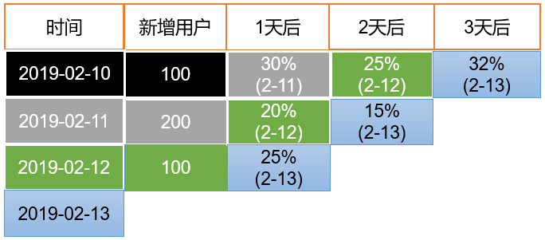
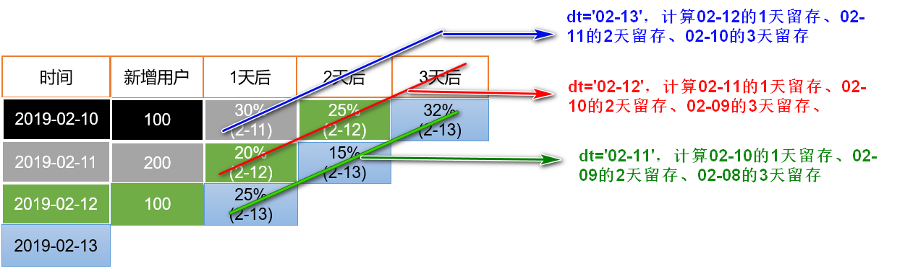

ads层的数据列式存储和压缩都没必要用。

# 设备主题

## 活跃设备数（日、周、月）
需求定义：

日活：当日活跃的设备数
周活：当周活跃的设备数
月活：当月活跃的设备数

### 建表语句
```sql
drop table if exists ads_uv_count;

create external table ads_uv_count( 
    `dt` string COMMENT '统计日期',
    `day_count` bigint COMMENT '当日用户数量',
    `wk_count`  bigint COMMENT '当周用户数量',
    `mn_count`  bigint COMMENT '当月用户数量',
    `is_weekend` string COMMENT 'Y,N是否是周末,用于得到本周最终结果',
    `is_monthend` string COMMENT 'Y,N是否是月末,用于得到本月最终结果' 
) COMMENT '活跃设备数'
row format delimited fields terminated by '\t'
location '/warehouse/gmall/ads/ads_uv_count/';
```

### 导入数据
这一从dwt层直接统计出，十分方便!
```sql
insert into table ads_uv_count
select
    '2020-03-10' dt,
    sum(if(login_day_count>0, 1, 0)) day_count,
    sum(if(login_date_last>=date_add(next_date('2020-03-10','MON'), -7), 1, 0)) wk_count,
    sum(if(login_day_count>=date_format('2020-03-10','yyyy-MM-01'), 1, 0)) mn_count,
    if(day_of_week('2020-03-10')=1, 'Y', 'N') is_weekend,
    if(last_day('2020-03-10')='2020-03-10', 'Y', 'N')is_monthend
from dwt_uv_topic;
```

## 每日新增设备


### 建表语句
```sql
drop table if exists ads_new_mid_count;

create external table ads_new_mid_count
(
    `create_date`     string comment '创建时间' ,
    `new_mid_count`   BIGINT comment '新增设备数量' 
)  COMMENT '每日新增设备信息数量'
row format delimited fields terminated by '\t'
location '/warehouse/gmall/ads/ads_new_mid_count/';
```


### 导入数据
```sql
insert into table ads_new_mid_count
select
    '2020-03-10' create_date,
    sum(if(login_date_first='2020-03-10', 1, 0)) new_mid_count
from dwt_uv_topic;

-- 或者：
insert into table ads_new_mid_count
select
    login_date_first create_date,
    count(1) new_mid_count
from dwt_uv_topic
where login_date_first='2020-03-10';
```

## 沉默用户数
需求定义：
沉默用户：只在安装当天启动过，且启动时间是在7天前


### 建表语句
```sql
drop table if exists ads_silent_count;

create external table ads_silent_count( 
    `dt` string COMMENT '统计日期',
    `silent_count` bigint COMMENT '沉默设备数'
) 
row format delimited fields terminated by '\t'
location '/warehouse/gmall/ads/ads_silent_count';
```


### 导入数据
```sql
insert into table ads_silent_count
select
    '2020-03-10' dt,
    sum(if(login_date_first=login_date_last and login_date_first <= date_sub('2020-03-10', 7), 1, 0)) silent_count
from dwt_uv_topic;

-- 或者：
insert into table ads_silent_count
select
    '2020-03-10' dt,
    count(1) silent_count
from dwt_uv_topic
where login_date_first=login_date_last and login_date_first <= date_sub('2020-03-10', 7);
```

## 本周回流用户数
需求定义：
本周回流用户：上周未活跃，本周活跃的设备，且不是本周新增设备

### 建表语句
```sql
drop table if exists ads_back_count;

create external table ads_back_count( 
    `dt` string COMMENT '统计日期',
    `wk_dt` string COMMENT '统计日期所在周',
    `back_count` bigint COMMENT '回流设备数'
) 
row format delimited fields terminated by '\t'
location '/warehouse/gmall/ads/ads_back_count';
```


### 导入数据
```sql
insert into table ads_back_count
select
    '2020-03-10' dt,
    concat(date_add(next_date('2020-03-10','MON'), -7), '_', date_add(next_date('2020-03-10','MON'), -1)) wk_dt,
    count(1) back_count
from(
    select
        current_wk.mid_id
    from(
        -- 本周活跃的设备、减去本周新增设备
        select
            mid_id
        from dwt_uv_topic
        where login_date_last >= date_add(next_date('2020-03-10','MON'), -7) 
            and login_date_first < date_add(next_date('2020-03-10','MON'), -7) 
    ) current_wk
    left join(
        -- 上周活跃的设备（不能从dwt中取数据，因为取的是上周活跃的设备，而不是从上周到现在活跃的设备）
        select
            mid_id
        from dws_uv_detail_daycount
        where dt >= date_add(next_date('2020-03-10','MON'), -14) 
            and dt <= date_add(next_date('2020-03-10','MON'), -8)
        group by mid_id
    ) last_wk on current_wk.mid_id = last_wk.mid_id
    where last_wk.mid_id is null
) u;

-- 或者
insert into table ads_back_count
select
    '2020-03-10' dt,
    concat(date_add(next_date('2020-03-10','MON'), -7), '_', date_add(next_date('2020-03-10','MON'), -1)) wk_dt,
    count(1) back_count
from(
    -- 本周活跃的设备、减去本周新增设备
    select
        mid_id
    from dwt_uv_topic
    where login_date_last >= date_add(next_date('2020-03-10','MON'), -7) 
        and login_date_first < date_add(next_date('2020-03-10','MON'), -7) 
) current_wk
left join(
    -- 上周活跃的设备（不能从dwt中取数据，因为取的是上周活跃的设备，而不是从上周到现在活跃的设备）
    select
        mid_id
    from dws_uv_detail_daycount
    where dt >= date_add(next_date('2020-03-10','MON'), -14) 
        and dt <= date_add(next_date('2020-03-10','MON'), -8)
    group by mid_id
) last_wk on current_wk.mid_id = last_wk.mid_id
where last_wk.mid_id is null
```

## 流失用户数
需求定义：
流失用户：最近7天未活跃的设备


### 建表语句
```sql
drop table if exists ads_wastage_count;

create external table ads_wastage_count( 
    `dt` string COMMENT '统计日期',
    `wastage_count` bigint COMMENT '流失设备数'
) 
row format delimited fields terminated by '\t'
location '/warehouse/gmall/ads/ads_wastage_count';
```


### 导入数据
```sql
insert into table ads_wastage_count
select
    '2020-03-10' dt,
    count(1) wastage_count
from dwt_uv_topic
where login_date_last < date_sub('2020-03-10', 7);
```

## 留存率
**留存用户**：某段时间内的新增用户（活跃用户），经过一段时间后，又继续使用应用的被认作是留存用户；

**留存率**：留存用户占当时新增用户（活跃用户）的比例即是留存率。

例如，2月10日新增用户100，这100人在2月11日启动过应用的有30人，2月12日启动过应用的有25人，2月13日启动过应用的有32人；
则2月10日新增用户次日的留存率是30/100 = 30%，两日留存率是25/100=25%，三日留存率是32/100=32%。



**假如需要计算3天的留存率，今天是导入的数据是13号的。今天可以计算的是，12号用户的1天留存率，11号用户的2天留存率，10号用户的3天留存率。**

**只需要计算到最新时间的留存率即可，之前的之前都计算过。到最新时间天的用户数可以在dwt中直接获取。**不这样计算会很麻烦。


### 建表语句
```sql
drop table if exists ads_user_retention_day_rate;
create external table ads_user_retention_day_rate 
(
     `stat_date`          string comment '统计日期',
     `create_date`       string  comment '设备新增日期',
     `retention_day`     int comment '截止当前日期留存天数',
     `retention_count`    bigint comment  '留存数量',
     `new_mid_count`     bigint comment '设备新增数量',
     `retention_ratio`   decimal(10,2) comment '留存率'
)  COMMENT '每日用户留存情况'
row format delimited fields terminated by '\t'
location '/warehouse/gmall/ads/ads_user_retention_day_rate/';
```

### 导入数据
```sql
insert into table ads_user_retention_day_rate
select
    '2020-03-10' stat_date,
    date_sub('2020-03-10', 3) create_date,
    3 retention_day,
    sum(if(login_date_first=date_sub('2020-03-10', 3) and login_day_count>0, 1, 0)) retention_count,
    sum(if(login_date_first=date_sub('2020-03-10', 3), 1, 0)) new_mid_count,
    sum(if(login_date_first=date_sub('2020-03-10', 3) and login_day_count>0, 1, 0)) / sum(if(login_date_first=date_sub('2020-03-10', 3), 1, 0)) retention_ratio
from dwt_uv_topic
union all
select
    '2020-03-10' stat_date,
    date_sub('2020-03-10', 2) create_date,
    2 retention_day,
    sum(if(login_date_first=date_sub('2020-03-10', 2) and login_day_count>0, 1, 0)) retention_count,
    sum(if(login_date_first=date_sub('2020-03-10', 2), 1, 0)) new_mid_count,
    sum(if(login_date_first=date_sub('2020-03-10', 2) and login_day_count>0, 1, 0)) / sum(if(login_date_first=date_sub('2020-03-10', 2), 1, 0)) retention_ratio
from dwt_uv_topic
union all
select
    '2020-03-10' stat_date,
    date_sub('2020-03-10', 1) create_date,
    1 retention_day,
    sum(if(login_date_first=date_sub('2020-03-10', 1) and login_day_count>0, 1, 0)) retention_count,
    sum(if(login_date_first=date_sub('2020-03-10', 1), 1, 0)) new_mid_count,
    sum(if(login_date_first=date_sub('2020-03-10', 1) and login_day_count>0, 1, 0)) / sum(if(login_date_first=date_sub('2020-03-10', 1), 1, 0)) retention_ratio
from dwt_uv_topic;
```

## 最近连续三周活跃用户数

### 建表语句
```sql
drop table if exists ads_continuity_wk_count;

create external table ads_continuity_wk_count( 
    `dt` string COMMENT '统计日期,一般用结束周周日日期,如果每天计算一次,可用当天日期',
    `wk_dt` string COMMENT '持续时间',
    `continuity_count` bigint COMMENT '活跃用户数'
) 
row format delimited fields terminated by '\t'
location '/warehouse/gmall/ads/ads_continuity_wk_count';
```


### 导入数据
```sql
insert into table ads_continuity_wk_count
select
    '2020-03-10' dt
    concat(date_sub(next_day('2020-03-10', 'MON'), 21), '_', date_sub(next_day('2020-03-10', 'MON'), 1)) wk_dt
    count(1) continuity_count
from(
    select
        mid_id
    from(
        select
            mid_id,
            date_sub(next_day('2020-03-10', 'MON'), 7) wk
        from dws_uv_detail_daycount
        where dt >= date_sub(next_day('2020-03-10', 'MON'), 21) and dt <= date_sub(next_day('2020-03-10', 'MON'), 1)
        group by mid_id, wk
    ) u_wk
    group by mid_id
    having count(1) = 3
) u;

-- 或者
insert into table ads_continuity_wk_count
select
    '2020-03-10' dt
    concat(date_sub(next_day('2020-03-10', 'MON'), 21), '_', date_sub(next_day('2020-03-10', 'MON'), 1)) wk_dt
    count(1) continuity_count
from(
    select
        mid_id
    from(
        select
            mid_id
        from dws_uv_detail_daycount
        where dt >= date_sub(next_day('2020-03-10', 'MON'), 21) and dt <= date_sub(next_day('2020-03-10', 'MON'), 1+14)
        group by mid_id
        union all
        select
            mid_id
        from dws_uv_detail_daycount
        where dt >= date_sub(next_day('2020-03-10', 'MON'), 14) and dt <= date_sub(next_day('2020-03-10', 'MON'), 1+7)
        group by mid_id
        union all
        select
            mid_id
        from dws_uv_detail_daycount
        where dt >= date_sub(next_day('2020-03-10', 'MON'), 7) and dt <= date_sub(next_day('2020-03-10', 'MON'), 1)
        group by mid_id
    ) u_wk
    group by mid_id
    having count(1) = 3
) u;
```

## 最近七天内连续三天活跃用户数

### 建表语句
```sql
drop table if exists ads_continuity_uv_count;

create external table ads_continuity_uv_count( 
    `dt` string COMMENT '统计日期',
    `wk_dt` string COMMENT '最近7天日期',
    `continuity_count` bigint
) COMMENT '连续活跃设备数'
row format delimited fields terminated by '\t'
location '/warehouse/gmall/ads/ads_continuity_uv_count';
```


### 导入数据
```sql
insert into table ads_continuity_uv_count
select
    '2020-03-10' dt
    concat(date_sub('2020-03-10', 6), '_', '2020-03-10') wk_dt
    count(1) continuity_count
from(
    -- 这里还需要取下重，在周期内一个用户可能多次连续3天活跃
    select
        mid_id
    from(
        select
            mid_id,
            date_diff
        from(
            select
                mid_id,
                date_sub(dt, rank) date_diff
            from(
                select
                    mid_id,
                    dt,
                    row_number() over(partition by mid_id order by dt) rank
                from dws_uv_detail_daycount
                where dt >= date_sub('2020-03-10', 6) and dt <= '2020-03-10'
            ) t1
        ) t2
        group by mid_id, date_diff
        having count(1) >= 3
    ) t3
    group by mid_id
) u;

-- 或者
insert into table ads_continuity_uv_count
select
    '2020-03-10' dt
    concat(date_sub('2020-03-10', 6), '_', '2020-03-10') wk_dt
    count(1) continuity_count
from(
    -- 这里还需要取下重，在周期内一个用户可能多次连续3天活跃
    select
        mid_id
    from(
        select
            mid_id,
            date_diff
        from(
            select
                mid_id,
                -- 这个语法是不对的
                -- date_sub(dt, row_number()) over(partition by mid_id order by dt) date_diff,
                -- 可以这样
                datediff(dt, '1970-01-01') - row_number() over(partition by mid_id order by dt) date_diff,
            from dws_uv_detail_daycount
            where dt >= date_sub('2020-03-10', 6) and dt <= '2020-03-10'
        ) t1
        group by mid_id, date_diff
        having count(1) >= 3
    ) t2
    group by mid_id
) u;
```

# 会员主题

## 会员主题信息


### 建表语句
```sql
drop table if exists ads_user_topic;

create external table ads_user_topic(
    `dt` string COMMENT '统计日期',
    `day_users` string COMMENT '活跃会员数',
    `day_new_users` string COMMENT '新增会员数',
    `day_new_payment_users` string COMMENT '新增消费会员数',
    `payment_users` string COMMENT '总付费会员数',
    `users` string COMMENT '总会员数',
    `day_users2users` decimal(10,2) COMMENT '会员活跃率',
    `payment_users2users` decimal(10,2) COMMENT '会员付费率',
    `day_new_users2users` decimal(10,2) COMMENT '会员新鲜度'
) COMMENT '会员主题信息表'
row format delimited fields terminated by '\t'
location '/warehouse/gmall/ads/ads_user_topic';
```


### 导入数据
```sql
insert into table ads_user_topic
select
    '2020-03-10' dt,
    sum(if(login_date_last='2020-03-10', 1, 0)) day_users,
    sum(if(login_date_first='2020-03-10', 1, 0)) day_new_users,
    sum(if(payment_date_first='2020-03-10', 1, 0)) day_new_payment_users,
    sum(if(payment_count>0, 1, 0)) payment_users,
    count(1) users,
    sum(if(login_date_last='2020-03-10', 1, 0))/count(1) day_users2users,
    sum(if(payment_count>0, 1, 0))/count(1) payment_users2users,
    sum(if(login_date_first='2020-03-10', 1, 0))/sum(if(login_date_last='2020-03-10', 1, 0)) day_new_users2users
from dwt_user_topic;
```

## 漏斗分析
统计“浏览->购物车->下单->支付”的转化率

思路：统计各个行为的人数，然后计算比值。

### 建表语句
```sql
drop table if exists ads_user_action_convert_day;

create external  table ads_user_action_convert_day(
    `dt` string COMMENT '统计日期',
    `total_visitor_m_count`  bigint COMMENT '总访问人数',
    `cart_u_count` bigint COMMENT '加入购物车的人数',
    `visitor2cart_convert_ratio` decimal(10,2) COMMENT '访问到加入购物车转化率',
    `order_u_count` bigint     COMMENT '下单人数',
    `cart2order_convert_ratio`  decimal(10,2) COMMENT '加入购物车到下单转化率',
    `payment_u_count` bigint     COMMENT '支付人数',
    `order2payment_convert_ratio` decimal(10,2) COMMENT '下单到支付的转化率'
 ) COMMENT '用户行为漏斗分析'
row format delimited  fields terminated by '\t'
location '/warehouse/gmall/ads/ads_user_action_convert_day/';
```


### 导入数据
```sql
insert into table ads_user_action_convert_day
select
    '2020-03-10' dt,
    total_visitor_m_count,
    cart_u_count,
    cart_u_count/total_visitor_m_count visitor2cart_convert_ratio,
    order_u_count,
    order_u_count/cart_u_count cart2order_convert_ratio,
    payment_u_count,
    payment_u_count/order_u_count order2payment_convert_ratio
from(
    select
        '2020-03-10' dt,
        sum(if(cart_count>0, 1, 0)) cart_u_count,
        sum(if(order_count>0, 1, 0)) order_u_count,
        sum(if(payment_count>0, 1, 0)) payment_u_count
    from dws_user_action_daycount
    where dt = '2020-03-10'
) ua
join (
    -- 总的访问人数直接从ads中去取
    select
        dt,
        day_count total_visitor_m_count
    from ads_uv_count
    where dt = '2020-03-10'
) uv on ua.dt=uv.dt;

-- 或者
insert into table ads_user_action_convert_day
select
    '2020-03-10' dt,
    total_visitor_m_count,
    cart_u_count,
    cart_u_count/total_visitor_m_count visitor2cart_convert_ratio,
    order_u_count,
    order_u_count/cart_u_count cart2order_convert_ratio,
    payment_u_count,
    payment_u_count/order_u_count order2payment_convert_ratio
from(
    select
        '2020-03-10' dt,
        sum(if(cart_count>0, 1, 0)) cart_u_count,
        sum(if(order_count>0, 1, 0)) order_u_count,
        sum(if(payment_count>0, 1, 0)) payment_u_count
    from dws_user_action_daycount
    where dt = '2020-03-10'
) ua
join (
    -- 总的访问人数直接从dws中去取
    select
        dt,
        count(1) total_visitor_m_count
    from dws_uv_detail_daycount
    where dt = '2020-03-10'
) uv on ua.dt=uv.dt;

-- 或者
insert into table ads_user_action_convert_day
select
    '2020-03-10' dt,
    sum(uv_count) total_visitor_m_count,
    sum(cart_count) cart_u_count,
    sum(cart_count)/sum(uv_count) visitor2cart_convert_ratio,
    sum(order_count) order_u_count,
    sum(order_count)/sum(cart_count) cart2order_convert_ratio,
    sum(payment_count) payment_u_count,
    sum(payment_count)/sum(order_count) order2payment_convert_ratio
from(
    select
        0 uv_count,
        if(cart_count>0, 1, 0) cart_count,
        if(order_count>0, 1, 0) order_count,
        if(payment_count>0, 1, 0) payment_count
    from dws_user_action_daycount
    where dt = '2020-03-10'
    unoin all
    select
        1 uv_count,
        0 cart_count,
        0 order_count,
        0 payment_count
    from dws_uv_detail_daycount
    where dt = '2020-03-10'
) t;
```

# 商品主题

## 商品个数信息


### 建表语句
```sql
drop table if exists ads_product_info;

create external table ads_product_info(
    `dt` string COMMENT '统计日期',
    `sku_num` string COMMENT 'sku个数',
    `spu_num` string COMMENT 'spu个数'
) COMMENT '商品个数信息'
row format delimited fields terminated by '\t'
location '/warehouse/gmall/ads/ads_product_info';
```


### 导入数据
```sql
insert into table ads_product_info
select
    '2020-03-10' dt,
    sku_num,
    spu_num
from(
    select
        '2020-03-10' dt,
        count(1) sku_num
    from dwt_sku_topic
) sku
join(
    select
        '2020-03-10' dt,
        count(1) spu_num
    from (
        select
            spu_id
        from dwt_sku_topic
        group by spu_id
    ) t
) spu on sku.dt= spu.dt;
```

不使用这个：
```sql
insert into table ads_product_info
select
    '2020-03-10' dt,
    count(sku_id) sku_num,
    count(distinct spu_id) spu_num
from dwt_sku_topic;
```

## 商品销量排名

### 建表语句
```sql
drop table if exists ads_product_sale_topN;

create external table ads_product_sale_topN(
    `dt` string COMMENT '统计日期',
    `sku_id` string COMMENT '商品ID',
    `payment_amount` bigint COMMENT '销量'
) COMMENT '商品个数信息'
row format delimited fields terminated by '\t'
location '/warehouse/gmall/ads/ads_product_sale_topN';
```


### 导入数据
```sql
insert into table ads_product_sale_topN
select
    '2020-03-10' dt,
    sku_id,
    payment_amount
from dws_sku_action_daycount
where dt = '2020-03-10'
order by payment_amount desc
limit 10;
```

## 商品收藏排名

### 建表语句
```sql
drop table if exists ads_product_favor_topN;

create external table ads_product_favor_topN(
    `dt` string COMMENT '统计日期',
    `sku_id` string COMMENT '商品ID',
    `favor_count` bigint COMMENT '收藏量'
) COMMENT '商品收藏TopN'
row format delimited fields terminated by '\t'
location '/warehouse/gmall/ads/ads_product_favor_topN';
```


### 导入数据
```sql
insert into table ads_product_favor_topN
select
    '2020-03-10' dt,
    sku_id,
    favor_count
from dws_sku_action_daycount
where dt = '2020-03-10'
order by favor_count desc
limit 10;
```

## 商品加入购物车排名

### 建表语句
```sql
drop table if exists ads_product_cart_topN;

create external table ads_product_cart_topN(
    `dt` string COMMENT '统计日期',
    `sku_id` string COMMENT '商品ID',
    `cart_num` bigint COMMENT '加入购物车数量'
) COMMENT '商品加入购物车TopN'
row format delimited fields terminated by '\t'
location '/warehouse/gmall/ads/ads_product_cart_topN';
```

### 导入数据
```sql
insert into table ads_product_cart_topN
select
    '2020-03-10' dt,
    sku_id,
    cart_num
from dws_sku_action_daycount
where dt = '2020-03-10'
order by cart_num desc
limit 10;
```

## 商品退款率排名(最近30天)

### 建表语句
```sql
drop table if exists ads_product_refund_topN;

create external table ads_product_refund_topN(
    `dt` string COMMENT '统计日期',
    `sku_id` string COMMENT '商品ID',
    `refund_ratio` decimal(10,2) COMMENT '退款率'
) COMMENT '商品退款率TopN'
row format delimited fields terminated by '\t'
location '/warehouse/gmall/ads/ads_product_refund_topN';
```


### 导入数据
```sql
-- 从dwt中统计
insert into table ads_product_refund_topN
select
    '2020-03-10',
    sku_id,
    refund_last_30d_count/payment_last_30d_count*100 refund_ratio
from dwt_sku_topic
-- order by中可以使用select中计算后的值
order by refund_ratio desc
limit 10;

-- 从dws中统计
insert into table ads_product_refund_topN
select
    '2020-03-10' dt,
    sku_id,
    refund_count/payment_count refund_ratio
from (
    select
        sku_id,
        sum(payment_count) payment_count,
        sum(refund_count) refund_count
    from dws_sku_action_daycount
    where dt >= date_sub('2020-03-10', 30)
    group by sku_id
) sku
-- order by中可以使用select中计算后的值
order by refund_ratio desc
limit 10;
```

## 商品差评率排名

### 建表语句
```sql
drop table if exists ads_appraise_bad_topN;

create external table ads_appraise_bad_topN(
    `dt` string COMMENT '统计日期',
    `sku_id` string COMMENT '商品ID',
    `appraise_bad_ratio` decimal(10,2) COMMENT '差评率'
) COMMENT '商品差评率TopN'
row format delimited fields terminated by '\t'
location '/warehouse/gmall/ads/ads_appraise_bad_topN';
```


### 导入数据
```sql
insert into table ads_product_cart_topN
select
    '2020-03-10' dt,
    sku_id,
    appraise_bad_count/(appraise_good_count+appraise_mid_count+appraise_bad_count+appraise_default_count) appraise_bad_ratio
from dws_sku_action_daycount
where dt = '2020-03-10'
-- order by中可以使用select中计算后的值
order by appraise_bad_ratio desc
limit 10;
```

# 营销主题（用户+商品+购买行为）

## 下单数目统计
需求分析：统计每日下单数，下单金额及下单用户数。

### 建表语句
```sql
drop table if exists ads_order_daycount;

create external table ads_order_daycount(
    dt string comment '统计日期',
    order_count bigint comment '单日下单笔数',
    order_amount decimal(16,2) comment '单日下单金额',
    order_users bigint comment '单日下单用户数'
) comment '每日订单总计表'
row format delimited fields terminated by '\t'
location '/warehouse/gmall/ads/ads_order_daycount';
```

### 导入数据
```sql
insert into table ads_order_daycount
select
    '2020-03-10' dt,
    sum(order_count) order_count,
    sum(order_amount) order_amount,
    sum(if(order_count>0, 1, 0)) order_users
from dws_user_action_daycount
where dt = '2020-03-10';
```

## 支付信息统计
每日支付金额、支付人数、支付商品数、支付笔数以及下单到支付的平均时长（取自DWD）

### 建表语句
```sql
drop table if exists ads_payment_daycount;

create external table ads_payment_daycount(
    dt string comment '统计日期',
    payment_count bigint comment '单日支付笔数',
    payment_amount decimal(16,2) comment '单日支付金额',
    payment_user_count bigint comment '单日支付人数',
    payment_sku_count bigint comment '单日支付商品数',
    payment_avg_time double comment '下单到支付的平均时长，取分钟数'
) comment '每日订单总计表'
row format delimited fields terminated by '\t'
location '/warehouse/gmall/ads/ads_payment_daycount';
```


### 导入数据
```sql
insert into table ads_payment_daycount
select
    '2020-03-10' dt,
    payment_count,
    payment_amount,
    payment_user_count,
    payment_sku_count,
    payment_avg_time
from(
    select
        '2020-03-10' dt,
        sum(payment_count) payment_count,
        sum(payment_amount) payment_amount,
        sum(if(payment_count>0, 1, 0)) payment_user_count
    from dws_user_action_daycount
    where dt = '2020-03-10'
) a
join(
    select
        '2020-03-10' dt,
        sum(if(payment_amount>0, 1, 0)) payment_sku_count
    from dws_sku_action_daycount
    where dt = '2020-03-10'
) b on a.dt = b.dt
join(
    select
        '2020-03-10' dt,
        sum(unix_timestamp(payment_time) - unix_timestamp(create_time))/count(*)/60 payment_avg_time
        -- 这样应该也行吧
        -- avg(unix_timestamp(payment_time) - unix_timestamp(create_time))/60 payment_avg_time
    from dwd_fact_order_info
    where dt = '2020-03-10' and payment_time is not null
) c on a.dt = c.dt;
```

## 复购率

### 建表语句
```sql
drop table ads_sale_tm_category1_stat_mn;

create external table ads_sale_tm_category1_stat_mn
(  
    tm_id string comment '品牌id',
    category1_id string comment '1级品类id ',
    category1_name string comment '1级品类名称 ',
    buycount   bigint comment  '购买人数',
    buy_twice_last bigint  comment '两次以上购买人数',
    buy_twice_last_ratio decimal(10,2)  comment  '单次复购率',
    buy_3times_last   bigint comment   '三次以上购买人数',
    buy_3times_last_ratio decimal(10,2)  comment  '多次复购率',
    stat_mn string comment '统计月份',
    stat_date string comment '统计日期' 
)   COMMENT '复购率统计'
row format delimited fields terminated by '\t'
location '/warehouse/gmall/ads/ads_sale_tm_category1_stat_mn/';
```

### 导入数据
```sql
insert into table ads_sale_tm_category1_stat_mn
select
    sku_tm_id,
    sku_category1_id,
    sku_category1_name,
    sum(if(order_count>=1, 1, 0)) buycount,
    sum(if(order_count>=2, 1, 0)) buy_twice_last,
    sum(if(order_count>=2, 1, 0))/sum(if(order_count>=1, 1, 0)) buy_twice_last_ratio,
    sum(if(order_count>=3, 1, 0)) buy_3times_last
    sum(if(order_count>=3, 1, 0))/sum(if(order_count>=1, 1, 0)) buy_3times_last_ratio,
    date_format('2020-03-10', 'yyyy-MM') stat_mn,
    '2020-03-10' stat_date
from(
    -- 每个用户的购买次数
    select
        sku_tm_id,
        sku_category1_id,
        sku_category1_name,
        user_id,
        sum(order_count) order_count
    from dws_sale_detail_daycount
    where dt >= date_format('2020-03-10', 'yyyy-MM-01') and dt <= last_date('2020-03-10')
    group by sku_tm_id,sku_category1_id,sku_category1_name,user_id
) t
group by sku_tm_id,sku_category1_id,sku_category1_name;
```

