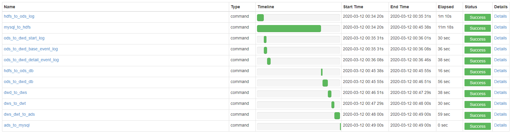
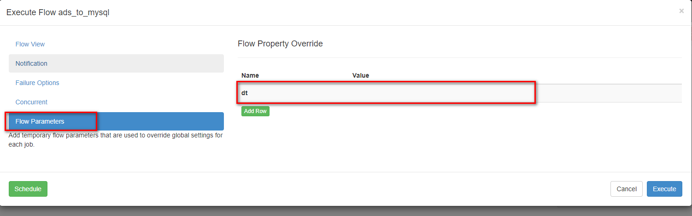
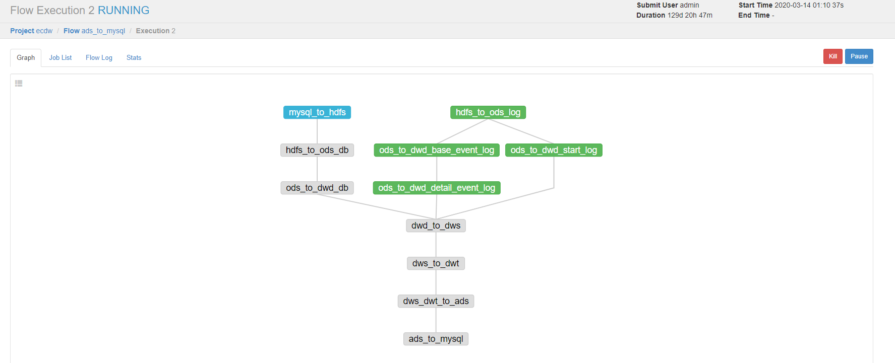

# Azkaban调度

## 创建MySQL数据库和表
创建gmall_report数据库：


由于时间关系，就建几个表，用于导出，都是一样的。数据表的字段要求和hdfs中的每行的数据字段一样。


```sql
CREATE TABLE `ads_uv_count` (
  `dt` date NOT NULL,
  `day_count` bigint(20) DEFAULT NULL,
  `wk_count` bigint(20) DEFAULT NULL,
  `mn_count` bigint(20) DEFAULT NULL,
  `is_weekend` varchar(2) DEFAULT NULL,
  `is_monthend` varchar(2) DEFAULT NULL,
  PRIMARY KEY (`dt`)
) ENGINE=InnoDB DEFAULT CHARSET=utf8;

CREATE TABLE `ads_user_retention_day_rate` (
  `stat_date` date NOT NULL,
  `create_date` date NOT NULL,
  `retention_day` int(11) NOT NULL,
  `retention_count` bigint(20) DEFAULT NULL,
  `new_mid_count` bigint(20) DEFAULT NULL,
  `retention_ratio` double DEFAULT NULL,
  PRIMARY KEY (`create_date`,`retention_day`)
) ENGINE=InnoDB DEFAULT CHARSET=utf8;

CREATE TABLE `ads_user_topic` (
  `dt` date NOT NULL,
  `day_users` bigint(20) DEFAULT NULL,
  `day_new_users` bigint(20) DEFAULT NULL,
  `day_new_payment_users` bigint(20) DEFAULT NULL,
  `payment_users` bigint(20) DEFAULT NULL,
  `users` bigint(20) DEFAULT NULL,
  `day_users2users` double DEFAULT NULL,
  `payment_users2users` double DEFAULT NULL,
  `day_new_users2users` double DEFAULT NULL,
  PRIMARY KEY (`dt`)
) ENGINE=InnoDB DEFAULT CHARSET=utf8;
```

## Sqoop导出脚本
### 脚本
在`/home/hadoop/bigdata-project/ecdw/sqoop`下创建sqoop_export.sh文件
```sh
[hadoop@hadoop101 sqoop]$ pwd
/home/hadoop/bigdata-project/ecdw/sqoop
[hadoop@hadoop101 sqoop]$ vi sqoop_export.sh
```

内容：
```sh
#!/bin/bash

sqoop_home=/opt/module/sqoop-1.4.6

#不同于导入，导出的都是hive表中的全量数据，不像导入的时候可以自定义sql查询


# 导出函数。$1：hive中ads表的名称，$2：mysql中表的名称，$3：mysql表中决定插入还是更新的属性列。
export_data() {
$sqoop_home/bin/sqoop export \
--connect "jdbc:mysql://hadoop101:3306/gmall_report?useUnicode=true&characterEncoding=utf-8"  \
--username root \
--password 123456 \
--table $2 \
--num-mappers 1 \
--export-dir /warehouse/gmall/ads/$1 \
--input-fields-terminated-by "\t" \
--update-mode allowinsert \
--update-key $3 \
--input-null-string '\\N'    \
--input-null-non-string '\\N'
}

case $1 in
"ads_uv_count")
     export_data "ads_uv_count" "ads_uv_count" "dt"
;;
"ads_user_retention_day_rate") 
     export_data "ads_user_retention_day_rate" "ads_user_retention_day_rate" "create_date,retention_day"
;;
"ads_user_topic")
     export_data "ads_user_topic" "ads_user_topic" "dt"
;;
"all")
     export_data "ads_uv_count" "ads_uv_count" "dt"
     export_data "ads_user_retention_day_rate" "ads_user_retention_day_rate" "create_date,retention_day"
     export_data "ads_user_topic" "ads_user_topic" "dt"
;;
*)
    echo "参数不对"
    exit;
;;
esac

```

### 参数说明
 关于导出update还是insert的问题：
```
--update-mode：
    updateonly   只更新，无法插入新数据
    allowinsert   允许新增 

-update-key：允许更新的情况下，指定哪些字段匹配视为同一条数据，进行更新而不增加。多个字段用逗号分隔。
```

空值处理：
```
--input-null-string和--input-null-non-string：
分别表示，将字符串列和非字符串列的空串和“null”转义。
```
Hive中的Null在底层是以“\N”来存储，而MySQL中的Null在底层就是Null，为了保证数据两端的一致性。在导出数据时采用--input-null-string和--input-null-non-string两个参数。导入数据时采用--null-string和--null-non-string。

### 脚本测试
脚本可以使用
```
[hadoop@hadoop101 sqoop]$ ./sqoop_export.sh all
```

## 生成数据
生成一下03-12号的数据。

### 生成log数据
停止集群，修改时间，生成2020-03-12日志。
```
# flume
[hadoop@hadoop101 ecdw-flume]$ bin/stop_log_kafka_agent.sh
[hadoop@hadoop102 ecdw-flume]$ bin/stop_log_kafka_agent.sh
[hadoop@hadoop103 ecdw-flume]$ bin/stop_kafka_hdfs_agent.sh

# 停止集群
[hadoop@hadoop101 app-script]$ ./kafka_cluster.sh stop
[hadoop@hadoop101 app-script]$ ./zookeeper_cluster.sh stop
[hadoop@hadoop101 app-script]$ ./hadoop_cluster.sh stop

# 修改时间
[hadoop@hadoop101 bin]$ ./dt.sh 2020-03-12

# 启动集群
[hadoop@hadoop101 app-script]$ ./hadoop_cluster.sh start
[hadoop@hadoop101 app-script]$ ./zookeeper_cluster.sh start
[hadoop@hadoop101 app-script]$ ./zookeeper_cluster.sh status
[hadoop@hadoop101 app-script]$ ./kafka_cluster.sh start

# 启动flume
[hadoop@hadoop103 ecdw-flume]$ bin/start_kafka_hdfs_agent.sh
[hadoop@hadoop102 ecdw-flume]$ bin/start_log_kafka_agent.sh
[hadoop@hadoop101 ecdw-flume]$ bin/start_log_kafka_agent.sh

# 生成1000条日志
[hadoop@hadoop101 bin]$ ./gene_log.sh 0 2000
```

### 生成db数据
在配置文件application.properties中修改
```
#业务日期
mock.date=2020-03-12
#是否重置：是否清空之前的数据
mock.clear=0
```

再次执行命令，生成2020-03-12日期数据：
```
[hadoop@hadoop101 db-log]$ java -jar gmall-mock-db-2020-03-16-SNAPSHOT.jar
```


## 任务调度脚本
需要调度的脚本：
```sh
# 用sqoop把mysql导入数据到hdfs
mysql_to_hdfs.sh all 2020-03-11

# hdfs数据剪切到hive的ods层
hdfs_to_ods_log.sh  2020-03-11
hdfs_to_ods_db.sh all 2020-03-11

# ods层加载到dwd
ods_to_dwd_start_log.sh 2020-03-11
ods_to_dwd_base_event_log.sh 2020-03-11
ods_to_dwd_detail_event_log.sh 2020-03-11
ods_to_dwd_db.sh 2020-03-11

# dwd到dws
dwd_to_dws.sh 2020-03-11
# dws到dwt
dws_to_dwt.sh 2020-03-11

# ads层出统计结果
dws_dwt_to_ads.sh 2020-03-11

# 用sqoop把ads层统计结果导出到mysql
sqoop_export.sh all
```

创建各个job：
```sh
lifengchao@lifengchao-YangTianM4601c-00:~/codes/ecdwFlow$ ll
总用量 52
drwxr-xr-x 2 lifengchao lifengchao 4096 7月  21 13:46 ./
drwxr-xr-x 7 lifengchao lifengchao 4096 7月  21 12:41 ../
-rw-r--r-- 1 lifengchao lifengchao  274 7月  21 14:04 ads_to_mysql.job
-rw-r--r-- 1 lifengchao lifengchao  327 7月  21 14:01 dwd_to_dws.job
-rw-r--r-- 1 lifengchao lifengchao  283 7月  21 14:03 dws_dwt_to_ads.job
-rw-r--r-- 1 lifengchao lifengchao  275 7月  21 14:02 dws_to_dwt.job
-rw-r--r-- 1 lifengchao lifengchao  322 7月  21 13:55 hdfs_to_ods_db.job
-rw-r--r-- 1 lifengchao lifengchao  262 7月  21 13:51 hdfs_to_ods_log.job
-rw-r--r-- 1 lifengchao lifengchao  252 7月  21 13:43 mysql_to_hdfs.job
-rw-r--r-- 1 lifengchao lifengchao  311 7月  21 13:58 ods_to_dwd_base_event_log.job
-rw-r--r-- 1 lifengchao lifengchao  285 7月  21 13:58 ods_to_dwd_db.job
-rw-r--r-- 1 lifengchao lifengchao  325 7月  21 13:59 ods_to_dwd_detail_event_log.job
-rw-r--r-- 1 lifengchao lifengchao  334 7月  21 13:55 ods_to_dwd_start_log.job
```

### 各个job内容
mysql_to_hdfs.job：
```sh
# mysql_to_hdfs.job
type=command
# 调用外部sh脚本，后期不需要改变流程的情况下只需要修改外部的脚本即可，azkaban的调度流程不要修改。
command=sh /home/hadoop/bigdata-project/ecdw/sqoop/mysql_to_hdfs.sh all ${dt}
```

hdfs_to_ods_log.job：
```sh
# hdfs_to_ods_log.job
type=command
# 调用外部sh脚本，后期不需要改变流程的情况下只需要修改外部的脚本即可，azkaban的调度流程不要修改。
command=sh /home/hadoop/bigdata-project/ecdw/hive-mr-script/hdfs_to_ods_log.sh ${dt}
```

hdfs_to_ods_db.job：
```sh
# hdfs_to_ods_db.job，依赖于：mysql_to_hdfs.job
type=command
dependencies=mysql_to_hdfs
# 调用外部sh脚本，后期不需要改变流程的情况下只需要修改外部的脚本即可，azkaban的调度流程不要修改。
command=sh /home/hadoop/bigdata-project/ecdw/hive-mr-script/hdfs_to_ods_db.sh all ${dt}
```

ods_to_dwd_start_log.job：
```sh
# ods_to_dwd_start_log.job，依赖于：hdfs_to_ods_log.job
type=command
dependencies=hdfs_to_ods_log
# 调用外部sh脚本，后期不需要改变流程的情况下只需要修改外部的脚本即可，azkaban的调度流程不要修改。
command=sh /home/hadoop/bigdata-project/ecdw/hive-mr-script/ods_to_dwd_start_log.sh ${dt}
```

ods_to_dwd_base_event_log.job：
```sh
# ods_to_dwd_base_event_log.job
type=command
dependencies=hdfs_to_ods_log
# 调用外部sh脚本，后期不需要改变流程的情况下只需要修改外部的脚本即可，azkaban的调度流程不要修改。
command=sh /home/hadoop/bigdata-project/ecdw/hive-mr-script/ods_to_dwd_base_event_log.sh ${dt}
```

ods_to_dwd_detail_event_log.job：
```sh
# ods_to_dwd_detail_event_log.job
type=command
dependencies=ods_to_dwd_base_event_log
# 调用外部sh脚本，后期不需要改变流程的情况下只需要修改外部的脚本即可，azkaban的调度流程不要修改。
command=sh /home/hadoop/bigdata-project/ecdw/hive-mr-script/ods_to_dwd_detail_event_log.sh ${dt}
```

ods_to_dwd_db.job：
```sh
# ods_to_dwd_db.job
type=command
dependencies=hdfs_to_ods_db
# 调用外部sh脚本，后期不需要改变流程的情况下只需要修改外部的脚本即可，azkaban的调度流程不要修改。
command=sh /home/hadoop/bigdata-project/ecdw/hive-mr-script/ods_to_dwd_db.sh ${dt}
```

dwd_to_dws.job：
```sh
# dwd_to_dws.job
type=command
dependencies=ods_to_dwd_start_log,ods_to_dwd_detail_event_log,ods_to_dwd_db
# 调用外部sh脚本，后期不需要改变流程的情况下只需要修改外部的脚本即可，azkaban的调度流程不要修改。
command=sh /home/hadoop/bigdata-project/ecdw/hive-mr-script/dwd_to_dws.sh ${dt}
```

dws_to_dwt.job：
```sh
# dws_to_dwt.job
type=command
dependencies=dwd_to_dws
# 调用外部sh脚本，后期不需要改变流程的情况下只需要修改外部的脚本即可，azkaban的调度流程不要修改。
command=sh /home/hadoop/bigdata-project/ecdw/hive-mr-script/dws_to_dwt.sh ${dt}
```

dws_dwt_to_ads.job：
```sh
# dws_dwt_to_ads.job
type=command
dependencies=dws_to_dwt
# 调用外部sh脚本，后期不需要改变流程的情况下只需要修改外部的脚本即可，azkaban的调度流程不要修改。
command=sh /home/hadoop/bigdata-project/ecdw/hive-mr-script/dws_dwt_to_ads.sh ${dt}
```

ads_to_mysql.job：
```sh
# ads_to_mysql.job
type=command
dependencies=dws_dwt_to_ads
# 调用外部sh脚本，后期不需要改变流程的情况下只需要修改外部的脚本即可，azkaban的调度流程不要修改。
command=sh /home/hadoop/bigdata-project/ecdw/sqoop/sqoop_export.sh all
```


### 打包
打包：
```sh
zip ecdwFlowJobs.zip *.job
```

## 立即执行测试
流程是这样


添加参数，时间制定为2020-03-12（参数配置为空字符串调用sh脚本时日期就会传前一天的时间）


点击立即执行。

sqoop导出特别慢...


调度完成


mysql中也更新了数据。

## 定时调度测试
先生成13号的数据。然后把服务器的时间调到14号，启动集群和azkaban，配置任务定时启动，出去转一圈，看看结果。


添加参数，参数配置为空字符串调用sh脚本时日期就会传前一天的时间(2020-03-13)


因为刚开始不确定凌晨0点是am、pm哪个就选了个上午一点。

10分就开始了：

这个也变了：


点这个看详细信息：


详细信息：


经过一段时间任务就完成了：


hive表中和mysql表中都生成了数据。

```sql

```