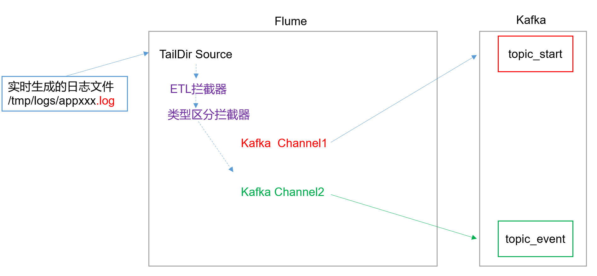
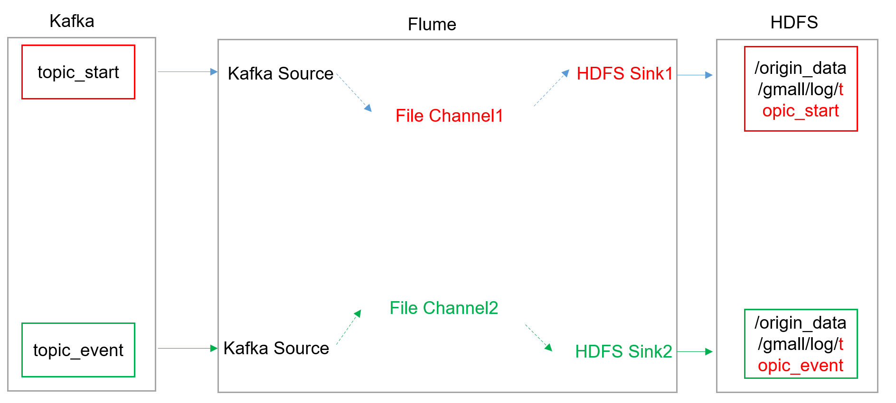
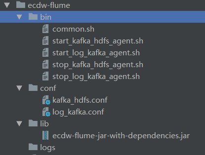

## flume部署结构


hadoop101、hadoop102各部署部署一个agent,从`/opt/module/tomcat/logs/ecdw/app-.*.log`采集日志，并且区分日志类型分别把两种日志发送到kafka的两个topic：ecdw-start、ecdw-event。

hadoop103部署一个agent从kafka采集topic为ecdw-start、ecdw-event中的日志，下沉日志到hdfs，启动日志下沉到`/origin_data/gmall/log/topic_start/%Y-%m-%d`文件夹，行为日志下沉到`/origin_data/gmall/log/topic_event/%Y-%m-%d`文件夹。

## 拦截器
本项目中自定义了两个拦截器，分别是：ETL拦截器、日志类型区分拦截器。

* ETL拦截器主要用于，过滤时间戳不合法和Json数据不完整的日志  
* 日志类型区分拦截器主要用于，将启动日志和事件日志区分开来，方便发往Kafka的不同Topic。   

```xml
<?xml version="1.0" encoding="UTF-8"?>
<project xmlns="http://maven.apache.org/POM/4.0.0"
         xmlns:xsi="http://www.w3.org/2001/XMLSchema-instance"
         xsi:schemaLocation="http://maven.apache.org/POM/4.0.0 http://maven.apache.org/xsd/maven-4.0.0.xsd">
    <modelVersion>4.0.0</modelVersion>

    <groupId>com.ecdw2.flume</groupId>
    <artifactId>ecdwFLume</artifactId>
    <version>1.0-SNAPSHOT</version>

    <properties>
        <project.build.sourceEncoding>UTF-8</project.build.sourceEncoding>
        <project.reporting.outputEncoding>UTF-8</project.reporting.outputEncoding>
        <maven.compiler.source>1.8</maven.compiler.source>
        <maven.compiler.target>1.8</maven.compiler.target>
        <flume.version>1.7.0</flume.version>
    </properties>

    <dependencies>
        <dependency>
            <groupId>org.apache.flume</groupId>
            <artifactId>flume-ng-core</artifactId>
            <version>${flume.version}</version>
            <scope>provided</scope>
        </dependency>

        <dependency>
            <groupId>org.slf4j</groupId>
            <artifactId>slf4j-api</artifactId>
            <version>1.7.5</version>
        </dependency>

        <dependency>
            <groupId>org.slf4j</groupId>
            <artifactId>slf4j-log4j12</artifactId>
            <version>1.7.5</version>
        </dependency>
    </dependencies>

    <build>
        <finalName>ecdw-flume</finalName>
        <plugins>
            <plugin>
                <groupId>org.apache.maven.plugins</groupId>
                <artifactId>maven-compiler-plugin</artifactId>
                <version>3.0</version>
            </plugin>

            <plugin>
                <artifactId>maven-assembly-plugin</artifactId>
                <version>2.5.5</version>
                <configuration>
                    <descriptorRefs>
                        <descriptorRef>jar-with-dependencies</descriptorRef>
                    </descriptorRefs>
                </configuration>
                <executions>
                    <execution>
                        <id>make-zip</id>
                        <!-- 绑定到package生命周期阶段上 -->
                        <phase>package</phase>
                        <goals>
                            <!-- 绑定到package生命周期阶段上 -->
                            <goal>single</goal>
                        </goals>
                    </execution>
                </executions>
            </plugin>
        </plugins>
    </build>


</project>
```

### ETL拦截器
LogETLIterceptor:
```java
package com.ecdw2.flume.interceptor;

import org.apache.flume.Context;
import org.apache.flume.Event;
import org.apache.flume.interceptor.Interceptor;
import org.slf4j.Logger;
import org.slf4j.LoggerFactory;

import java.util.ArrayList;
import java.util.List;

/**
 * 简单的过滤作用：过滤时间戳不合法和Json数据不完整的日志
 * flume的拦截器只适合做简单的过滤校验，不能影响了性能
 */
public class LogETLIterceptor implements Interceptor{
    public static Logger logger = LoggerFactory.getLogger(LogETLIterceptor.class);

    @Override
    public void initialize() {

    }

    @Override
    public Event intercept(Event event) {
        try {
            String log = new String(event.getBody(), "utf-8");

            // 在业务上保证启动日志中包含start，而行为日志中不包含start
            if (log.contains("start")) {
                if (LogUtils.validateStart(log)){
                    return event;
                }
            }else {
                if (LogUtils.validateEvent(log)){
                    return event;
                }
            }

            logger.info("不合法的日志" + log);

        } catch (Exception e) {
            e.printStackTrace();
            logger.error("日志解析出错", e);
        }
        return null;
    }

    @Override
    public List<Event> intercept(List<Event> events) {
        List<Event> list = new ArrayList<>();

        for (Event event : events) {
            Event outEvent = intercept(event);
            if (outEvent != null){
                list.add(outEvent);
            }
        }

        return list;
    }

    @Override
    public void close() {

    }

    public static class Builder implements Interceptor.Builder {

        @Override
        public Interceptor build() {
            return new LogETLIterceptor();
        }

        @Override
        public void configure(Context context) {

        }
    }
}

```

LogUtils:
```java
package com.ecdw2.flume.interceptor;
import org.apache.commons.lang.math.NumberUtils;

public class LogUtils {

    public static boolean validateEvent(String log) {
        // 服务器时间 | json
        // 1549696569054 | {"cm":{"ln":"-89.2","sv":"V2.0.4","os":"8.2.0","g":"M67B4QYU@gmail.com","nw":"4G","l":"en","vc":"18","hw":"1080*1920","ar":"MX","uid":"u8678","t":"1549679122062","la":"-27.4","md":"sumsung-12","vn":"1.1.3","ba":"Sumsung","sr":"Y"},"ap":"weather","et":[]}

        // 1 切割
        String[] logContents = log.split("\\|");

        // 2 校验
        if(logContents.length != 2){
            return false;
        }

        //3 校验服务器时间
        if (logContents[0].length()!=13 || !NumberUtils.isDigits(logContents[0])){
            return false;
        }

        // 4 校验json
        if (!logContents[1].trim().startsWith("{") || !logContents[1].trim().endsWith("}")){
            return false;
        }

        return true;
    }

    public static boolean validateStart(String log) {
        // {"action":"1","ar":"MX","ba":"HTC","detail":"542","en":"start","entry":"2","extend1":"","g":"S3HQ7LKM@gmail.com","hw":"640*960","l":"en","la":"-43.4","ln":"-98.3","loading_time":"10","md":"HTC-5","mid":"993","nw":"WIFI","open_ad_type":"1","os":"8.2.1","sr":"D","sv":"V2.9.0","t":"1559551922019","uid":"993","vc":"0","vn":"1.1.5"}

        if (log == null){
            return false;
        }

        // 校验json
        if (!log.trim().startsWith("{") || !log.trim().endsWith("}")){
            return false;
        }

        return true;
    }
}

```


### 分类型拦截器
LogTypeInterceptor:
```java
package com.ecdw2.flume.interceptor;

import org.apache.flume.Context;
import org.apache.flume.Event;
import org.apache.flume.interceptor.Interceptor;
import org.slf4j.Logger;
import org.slf4j.LoggerFactory;

import java.util.List;
import java.util.Map;

/**
 * 区分出日志类型：向header中添加kafka_topic的key，用于区分日志类型。
 * flume中的数据是有header的，而kafka中的数据没不带header的。
 *
 */
public class LogTypeInterceptor implements Interceptor{
    public static Logger logger = LoggerFactory.getLogger(LogTypeInterceptor.class);

    @Override
    public void initialize() {

    }

    @Override
    public Event intercept(Event event) {
        try {
            String log = new String(event.getBody(), "utf-8");
            Map<String, String> headers = event.getHeaders();

            // 在业务上保证启动日志中包含start，而行为日志中不包含start
            if (log.contains("start")) {
                headers.put("kafka_topic","ecdw_start");
            }else {
                headers.put("kafka_topic","ecdw_event");
            }

        } catch (Exception e) {
            e.printStackTrace();
            logger.error("日志解析出错", e);
        }
        return event;
    }

    @Override
    public List<Event> intercept(List<Event> events) {
        for (Event event : events) {
            intercept(event);
        }
        return events;
    }

    @Override
    public void close() {

    }

    public static class Builder implements Interceptor.Builder {

        @Override
        public Interceptor build() {
            return new LogTypeInterceptor();
        }

        @Override
        public void configure(Context context) {

        }
    }
}
```

## Flume配置
### 日志采集Flume配置


log_kafka.conf:
```
a1.sources = r1
a1.channels = c1 c2

# 默认的TAILDIR有bug：文件重命名重复读取，可以自己实现
a1.sources.r1.type = TAILDIR
a1.sources.r1.channels = c1 c2
# 此文件储存各个文件的读取进度。File in JSON format to record the inode, the absolute path and the last position of each tailing file.
a1.sources.r1.positionFile = /opt/module/flume-1.7.0/checkpoint/ecdw/taildir_position.json
# 可以配置多个filegroups，监控多个filegroups
a1.sources.r1.filegroups = f1
a1.sources.r1.filegroups.f1 = /opt/module/tomcat/logs/ecdw/app-.*.log
# source的拦截器
a1.sources.r1.interceptors =  i1 i2
a1.sources.r1.interceptors.i1.type = com.ecdw2.flume.interceptor.LogETLIterceptor$Builder
a1.sources.r1.interceptors.i2.type = com.ecdw2.flume.interceptor.LogTypeInterceptor$Builder

a1.sources.r1.selector.type = multiplexing
a1.sources.r1.selector.header = kafka_topic
a1.sources.r1.selector.mapping.ecdw_start = c1
a1.sources.r1.selector.mapping.ecdw_event = c2

# Kafka Channel
a1.channels.c1.type = org.apache.flume.channel.kafka.KafkaChannel
a1.channels.c1.kafka.bootstrap.servers = hadoop101:9092,hadoop102:9092,hadoop103:9092
a1.channels.c1.kafka.topic = ecdw-start
# 默认值为true，即会为对source来的数据进行解析，解析完会对数据前加前缀，前缀为topic名
a1.channels.c1.parseAsFlumeEvent = false
a1.channels.c1.kafka.consumer.group.id = flume-consumer

# Kafka Channel
a1.channels.c2.type = org.apache.flume.channel.kafka.KafkaChannel
a1.channels.c2.kafka.bootstrap.servers = hadoop101:9092,hadoop102:9092,hadoop103:9092
a1.channels.c2.kafka.topic = ecdw-event
# 默认值为true，即会为对source来的数据进行解析，解析完会对数据前加前缀，前缀为topic名
a1.channels.c2.parseAsFlumeEvent = false
a1.channels.c2.kafka.consumer.group.id = flume-consumer

```

### 日志消费Flume配置


kafka_hdfs.conf:
```
a1.sources = r1 r2
a1.channels = c1 c2
a1.sinks = k1 k2

# source1
a1.sources.r1.type = org.apache.flume.source.kafka.KafkaSource
a1.sources.r1.channels = c1
a1.sources.r1.batchSize = 1000
a1.sources.r1.batchDurationMillis = 2000
a1.sources.r1.kafka.bootstrap.servers = hadoop101:9092,hadoop102:9092,hadoop103:9092
a1.sources.r1.kafka.topics = ecdw-start
a1.sources.r1.kafka.consumer.group.id = flume-consumer

# source2
a1.sources.r2.type = org.apache.flume.source.kafka.KafkaSource
a1.sources.r2.channels = c2
a1.sources.r2.batchSize = 1000
a1.sources.r2.batchDurationMillis = 2000
a1.sources.r2.kafka.bootstrap.servers = hadoop101:9092,hadoop102:9092,hadoop103:9092
a1.sources.r2.kafka.topics = ecdw-event
a1.sources.r2.kafka.consumer.group.id = flume-consumer

# channel1
a1.channels.c1.type = file
a1.channels.c1.checkpointDir = /opt/module/flume-1.7.0/checkpoint/ecdw-start
a1.channels.c1.dataDirs = /opt/module/flume-1.7.0/data/ecdw-start
a1.channels.c1.maxFileSize = 104857600
a1.channels.c1.capacity = 10000000
a1.channels.c1.keep-alive = 60

# channel2
a1.channels.c2.type = file
a1.channels.c2.checkpointDir = /opt/module/flume-1.7.0/checkpoint/ecdw-event
a1.channels.c2.dataDirs = /opt/module/flume-1.7.0/data/ecdw-event
a1.channels.c2.maxFileSize = 104857600
a1.channels.c2.capacity = 10000000
a1.channels.c2.keep-alive = 60

# sink1
a1.sinks.k1.type = hdfs
a1.sinks.k1.channel = c1
a1.sinks.k1.hdfs.path = /origin_data/gmall/log/topic_start/%Y-%m-%d
#上传文件的前缀
a1.sinks.k1.hdfs.filePrefix = logstart-
#积攒多少个Event才flush到HDFS一次
a1.sinks.k1.hdfs.batchSize = 100
#多久生成一个新的文件
#hdfs sink间隔多长将临时文件滚动成最终目标文件，单位：秒；
#如果设置成0，则表示不根据时间来滚动文件；
a1.sinks.k1.hdfs.rollInterval = 3600
#设置每个文件的滚动大小大概是128M
a1.sinks.k1.hdfs.rollSize = 134217728
#文件的滚动与Event数量无关
a1.sinks.k1.hdfs.rollCount = 0
# 控制输出文件压缩
a1.sinks.k1.hdfs.fileType = CompressedStream
a1.sinks.k1.hdfs.codeC = lzop

# sink1
a1.sinks.k2.type = hdfs
a1.sinks.k2.channel = c2
a1.sinks.k2.hdfs.path = /origin_data/gmall/log/topic_event/%Y-%m-%d
#上传文件的前缀
a1.sinks.k2.hdfs.filePrefix = logevent-
#积攒多少个Event才flush到HDFS一次
a1.sinks.k2.hdfs.batchSize = 100
#多久生成一个新的文件
#hdfs sink间隔多长将临时文件滚动成最终目标文件，单位：秒；
#如果设置成0，则表示不根据时间来滚动文件；
a1.sinks.k2.hdfs.rollInterval = 3600
#设置每个文件的滚动大小大概是128M
a1.sinks.k2.hdfs.rollSize = 134217728
#文件的滚动与Event数量无关
a1.sinks.k2.hdfs.rollCount = 0
# 控制输出文件压缩
a1.sinks.k2.hdfs.fileType = CompressedStream
a1.sinks.k2.hdfs.codeC = lzop

```

## Flume启动停止脚本


### common.sh
common.sh:
```sh
#!/bin/sh

env=$1

home=$(cd `dirname $0`; cd ..; pwd)
bin_home=$home/bin
conf_home=$home/conf
logs_home=$home/logs
data_home=$home/data
lib_home=$home/lib

flume_home=/opt/module/flume-1.7.0

```

### log_kafka_agent

#### start_log_kafka_agent.sh
start_log_kafka_agent.sh
```sh
#!/bin/sh

# 此文件父目录的父目录
home=$(cd `dirname $0`; cd ..; pwd)

# 当前shell里执行脚本，脚本中设置的环境变量，本shell也可以访问
. ${home}/bin/common.sh

${flume_home}/bin/flume-ng agent \
--classpath ${lib_home}/ecdw-flume-jar-with-dependencies.jar \
--conf ${conf_home} \
-f ${conf_home}/log_kafka.conf -n a1 \
-Dflume.monitoring.type=http \
-Dflume.monitoring.port=5653 \
>> ${logs_home}/log_kafka_agent.log 2>&1 &

# Shell最后运行的后台Process的PID
echo $! > ${logs_home}/log_kafka_agent.pid

```

#### stop_log_kafka_agent.sh
stop_log_kafka_agent.sh
```sh
#!/bin/sh

home=$(cd `dirname $0`; cd ..; pwd)

. ${home}/bin/common.sh

pid=`cat ${logs_home}/log_kafka_agent.pid | head -1`

kill ${pid}

```


### kafka_hdfs_agent

#### start_kafka_hdfs_agent.sh
start_kafka_hdfs_agent.sh
```sh
#!/bin/sh

# 此文件父目录的父目录
home=$(cd `dirname $0`; cd ..; pwd)

# 当前shell里执行脚本，脚本中设置的环境变量，本shell也可以访问
. ${home}/bin/common.sh

${flume_home}/bin/flume-ng agent \
--conf ${conf_home} \
-f ${conf_home}/kafka_hdfs.conf -n a1 \
-Dflume.monitoring.type=http \
-Dflume.monitoring.port=5654 \
>> ${logs_home}/kafka_hdfs_agent.log 2>&1 &

# Shell最后运行的后台Process的PID
echo $! > ${logs_home}/kafka_hdfs_agent.pid

```

#### stop_kafka_hdfs_agent.sh
stop_kafka_hdfs_agent.sh
```sh
#!/bin/sh

home=$(cd `dirname $0`; cd ..; pwd)

. ${home}/bin/common.sh

pid=`cat ${logs_home}/kafka_hdfs_agent.pid | head -1`

kill ${pid}

```

## 测试

### 启动flume
```
[hadoop@hadoop103 ecdw-flume]$ bin/start_kafka_hdfs_agent.sh
[hadoop@hadoop102 ecdw-flume]$ bin/start_log_kafka_agent.sh
[hadoop@hadoop101 ecdw-flume]$ bin/start_log_kafka_agent.sh
```

### 生成日志

先手动创建文件，cat追加日志测试一下flume
```
[hadoop@hadoop101 ~]$ mkdir -p /opt/module/tomcat/logs/ecdw
[hadoop@hadoop101 ~]$ cd /opt/module/tomcat/logs/ecdw
[hadoop@hadoop101 ecdw]$ touch app-2020-07-01.log

[hadoop@hadoop102 ~]$ mkdir -p /opt/module/tomcat/logs/ecdw
[hadoop@hadoop102 ~]$ cd /opt/module/tomcat/logs/ecdw
[hadoop@hadoop102 ecdw]$ touch app-2020-07-01.log
```

手动追加log到文件：
```
# 执行了5次
[hadoop@hadoop101 ecdw]$ echo '{"action":"1","ar":"MX","ba":"Huawei","detail":"542","en":"start","entry":"1","extend1":"","g":"013Q0E1H@gmail.com","hw":"640*960","l":"en","la":"-43.8","ln":"-80.5","loading_time":"6","md":"Huawei-11","mid":"3","nw":"WIFI","open_ad_type":"1","os":"8.0.3","sr":"Y","sv":"V2.0.3","t":"1593547475530","uid":"3","vc":"17","vn":"1.2.1"}' >> app-2020-07-01.log

# 执行了7次
[hadoop@hadoop101 ecdw]$ echo '1593609058050|{"cm":{"ln":"-86.5","sv":"V2.5.7","os":"8.0.0","g":"AKYKDEZE@gmail.com","mid":"7","nw":"4G","l":"en","vc":"2","hw":"640*1136","ar":"MX","uid":"7","t":"1593536934898","la":"-0.20000000000000018","md":"sumsung-9","vn":"1.1.1","ba":"Sumsung","sr":"S"},"ap":"app","et":[{"ett":"1593532247580","en":"display","kv":{"goodsid":"2","action":"1","extend1":"1","place":"1","category":"68"}},{"ett":"1593522104017","en":"newsdetail","kv":{"entry":"3","goodsid":"3","news_staytime":"25","loading_time":"15","action":"3","showtype":"3","category":"48","type1":""}}]}' >> app-2020-07-01.log
```

### 查看是否生成文件
在对应的目录确实生成了文件，启动的时间还很短，还是临时文件，把flume停了后缀就变了，文件生成了。

是lzo的压缩文件。

#### hadoop查看lzo文件
使用`hadoop fs -cat filePath`命令输出的是乱码。

使用`hadoop fs -text filePath`命令会解码，输出明文。

查看行为日志：
```
[hadoop@hadoop101 ecdw]$ hadoop fs -text /origin_data/gmall/log/topic_event/2020-07-03/logevent-.1593731128666.lzo
20/07/03 07:13:20 INFO lzo.GPLNativeCodeLoader: Loaded native gpl library from the embedded binaries
20/07/03 07:13:20 INFO lzo.LzoCodec: Successfully loaded & initialized native-lzo library [hadoop-lzo rev 52decc77982b58949890770d22720a91adce0c3f]
20/07/03 07:13:20 INFO Configuration.deprecation: hadoop.native.lib is deprecated. Instead, use io.native.lib.available
20/07/03 07:13:20 INFO compress.CodecPool: Got brand-new decompressor [.lzo]
1593609058050|{"cm":{"ln":"-86.5","sv":"V2.5.7","os":"8.0.0","g":"AKYKDEZE@gmail.com","mid":"7","nw":"4G","l":"en","vc":"2","hw":"640*1136","ar":"MX","uid":"7","t":"1593536934898","la":"-0.20000000000000018","md":"sumsung-9","vn":"1.1.1","ba":"Sumsung","sr":"S"},"ap":"app","et":[{"ett":"1593532247580","en":"display","kv":{"goodsid":"2","action":"1","extend1":"1","place":"1","category":"68"}},{"ett":"1593522104017","en":"newsdetail","kv":{"entry":"3","goodsid":"3","news_staytime":"25","loading_time":"15","action":"3","showtype":"3","category":"48","type1":""}}]}
......
```

查看启动日志：
```
[hadoop@hadoop101 ecdw]$ hadoop fs -text /origin_data/gmall/log/topic_start/2020-07-03/logstart-.1593731053647.lzo
20/07/03 07:14:21 INFO lzo.GPLNativeCodeLoader: Loaded native gpl library from the embedded binaries
20/07/03 07:14:21 INFO lzo.LzoCodec: Successfully loaded & initialized native-lzo library [hadoop-lzo rev 52decc77982b58949890770d22720a91adce0c3f]
20/07/03 07:14:21 INFO Configuration.deprecation: hadoop.native.lib is deprecated. Instead, use io.native.lib.available
20/07/03 07:14:21 INFO compress.CodecPool: Got brand-new decompressor [.lzo]
{"action":"1","ar":"MX","ba":"Huawei","detail":"542","en":"start","entry":"1","extend1":"","g":"013Q0E1H@gmail.com","hw":"640*960","l":"en","la":"-43.8","ln":"-80.5","loading_time":"6","md":"Huawei-11","mid":"3","nw":"WIFI","open_ad_type":"1","os":"8.0.3","sr":"Y","sv":"V2.0.3","t":"1593547475530","uid":"3","vc":"17","vn":"1.2.1"}
```

#### 查看kafka中的数据
两个topic中都有数据，两种日志都进入到了各自的分区。
```
bin/kafka-console-consumer.sh --bootstrap-server hadoop101:9092,hadoop102:9092 --from-beginning --topic ecdw-start
bin/kafka-console-consumer.sh --bootstrap-server hadoop101:9092,hadoop102:9092 --from-beginning --topic ecdw-event
```


```

```