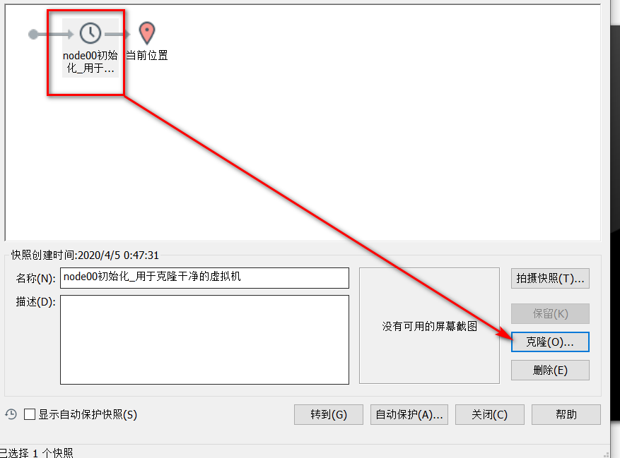
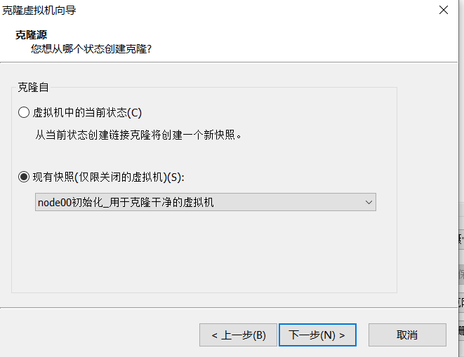
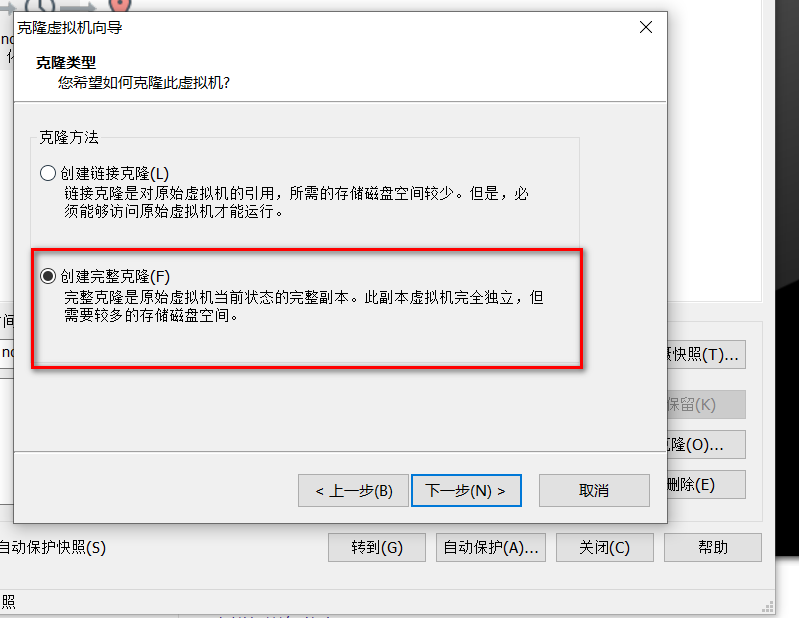
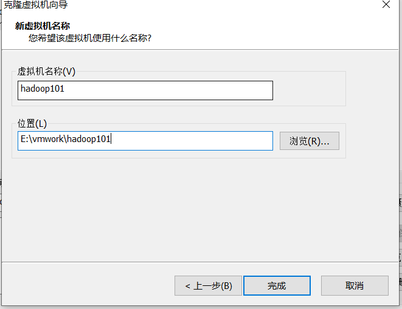
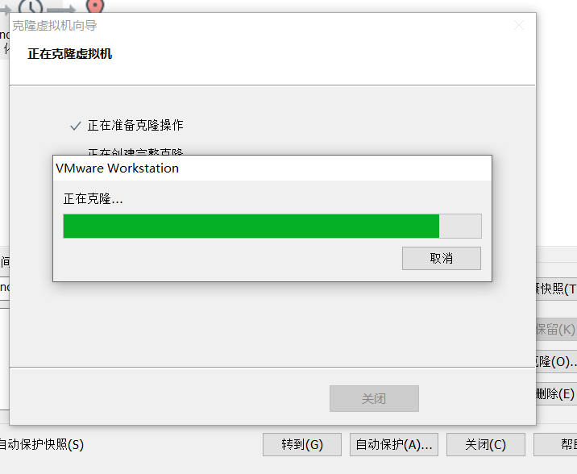
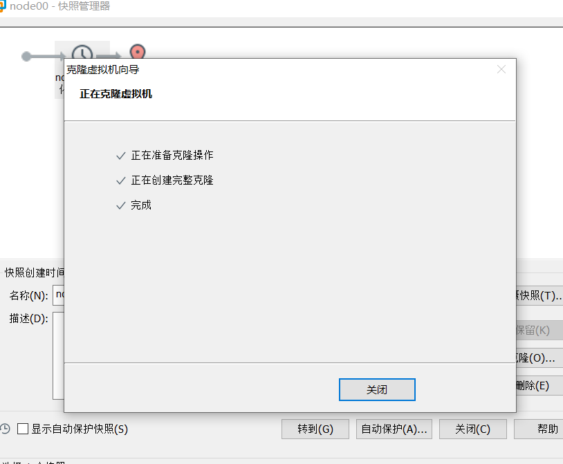
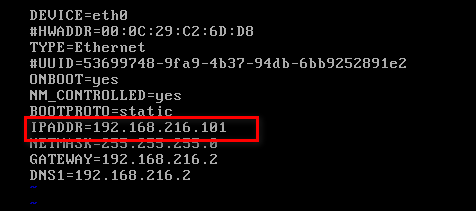
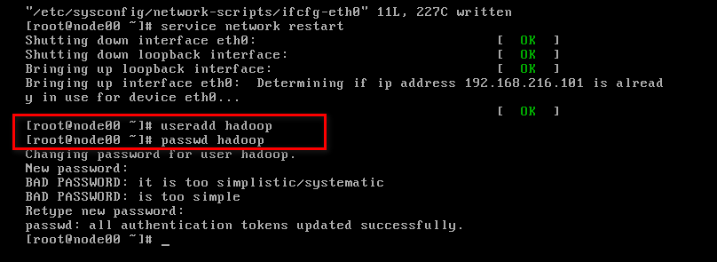

linux环境准备

ecdw(Electronic Commerce data warehouse)

## clone3台虚拟机
之前已经准备好了用于克隆的虚拟机，虚拟机的安装在linux的note中。

在最干净的快照克隆












继续克隆hadoop102、hadoop103

## 配置环境
配置静态ip：
```
vi /etc/sysconfig/network-scripts/ifcfg-eth0
```


重启network使之生效
```
service network restart
```
新加一个用户，之后的配置用工具远程这个用户配置。


配置主机名
vi /etc/sysconfig/network
```
NETWORKING=yes
HOSTNAME=hadoop101
```

hosts配置映射
vi /etc/hosts
```
127.0.0.1   localhost localhost.localdomain localhost4 localhost4.localdomain4
::1         localhost localhost.localdomain localhost6 localhost6.localdomain6

192.168.216.101 hadoop101
192.168.216.102 hadoop102
192.168.216.103 hadoop103
```

防火墙可克隆的节点中已经是关闭的了：
```
[root@hadoop100 hadoop]# service iptables status
iptables: Firewall is not running.
```
如果未关闭：
```
[root@hadoop100 hadoop]# service iptables stop
[root@hadoop100 hadoop]# chkconfig iptables off
```

配置 hadoop 用户 sudoer 权限
```
在 root 账号下，命令终端输入：vi /etc/sudoers

找到 root ALL=(ALL) ALL 这一行，

然后在他下面添加一行(yy复制行，p粘贴，i修改用户名)：

hadoop ALL=(ALL) ALL

保存，退出
```


poweroff关机，拍快照，方便以后环境清零测试。

其他的两个机器配置同理。

重启之后在外面的Windows配置虚拟机的主机映射：
```
c:/windows/system32/drivers/etc/hosts   
```

```
192.168.216.101 hadoop101
192.168.216.102 hadoop102
192.168.216.103 hadoop103
```

##  SSH免密登录配置(hadoop用户)
配置hadoop101对hadoop101、hadoop102、hadoop103三台服务器免密登录(hadoop用户)。

```
ssh-keygen -t rsa
```
生成公钥和私钥，然后敲（三个回车），就会生成两个文件id_rsa（私钥）、id_rsa.pub（公钥）
```
[hadoop@hadoop101 ~]$ ssh-keygen -t rsa
Generating public/private rsa key pair.
Enter file in which to save the key (/home/hadoop/.ssh/id_rsa): 
Created directory '/home/hadoop/.ssh'.
Enter passphrase (empty for no passphrase): 
Enter same passphrase again: 
Your identification has been saved in /home/hadoop/.ssh/id_rsa.
Your public key has been saved in /home/hadoop/.ssh/id_rsa.pub.
The key fingerprint is:
b6:10:ca:af:2a:10:44:b5:d6:11:d8:28:a3:10:b4:1e hadoop@hadoop101
The key's randomart image is:
+--[ RSA 2048]----+
|++..+o.          |
|.+.oo..          |
|+Eoo ..          |
|+ o. . .         |
| o  o . S        |
|.    . o .       |
|.     . .        |
|.    .           |
| ....            |
+-----------------+
[hadoop@hadoop101 ~]$ ll .ssh/
total 8
-rw------- 1 hadoop hadoop 1675 Apr  5 18:32 id_rsa
-rw-r--r-- 1 hadoop hadoop  395 Apr  5 18:32 id_rsa.pub
```

将公钥拷贝到要免密登录的目标机器上
```
ssh-copy-id hadoop101
ssh-copy-id hadoop102
ssh-copy-id hadoop103
```

可以免密登录：
```
[hadoop@hadoop101 ~]$ ssh hadoop@hadoop101
Last login: Sun Apr  5 18:09:34 2020 from 192.168.216.1
[hadoop@hadoop101 ~]$ exit
logout
Connection to hadoop101 closed.
[hadoop@hadoop101 ~]$ ssh hadoop@hadoop102
Last login: Sun Apr  5 17:43:57 2020 from 192.168.216.1
[hadoop@hadoop102 ~]$ exit
logout
Connection to hadoop102 closed.
[hadoop@hadoop101 ~]$ ssh hadoop@hadoop103
Last login: Sun Apr  5 17:43:57 2020 from 192.168.216.1
[hadoop@hadoop103 ~]$ exit
logout
Connection to hadoop103 closed.
[hadoop@hadoop101 ~]$ 
```

重复对hadoop102、hadoop103配置，实现hadoop101、hadoop102、hadoop103能够两辆免密登录。

**其实对于hadoop的启动，只需要在nameNode和resourceManager的机器上配置即可**，不过为了方便还是全配置吧。

## 集群同步脚本
在/bin目录下创建文件xsync，文件内容如下：
```
#!/bin/bash
#1 获取输入参数个数，如果没有参数，直接退出
pcount=$#
if((pcount==0)); then
        echo no args;
        exit;
fi

#2 获取文件名称
p1=$1
fname=`basename $p1`
echo fname=$fname

#3 获取上级目录到绝对路径
pdir=`cd -P $(dirname $p1); pwd`
echo pdir=$pdir

#4 获取当前用户名称
user=`whoami`

#5 循环
for host in "hadoop102" "hadoop103"
do
        echo ---------------- $host --------------
        rsync -rvl $pdir/$fname $user@$host:$pdir
done
```

修改脚本 xsync 具有执行权限
```
[hadoop@hadoop101 ~]$ ll /bin/xsync
-rw-r--r-- 1 root root 500 Apr  5 18:48 /bin/xsync
[hadoop@hadoop101 ~]$ sudo chmod 777 /bin/xsync
[hadoop@hadoop101 ~]$ ll /bin/xsync
-rwxrwxrwx 1 root root 500 Apr  5 18:48 /bin/xsync
```

## 安装JDK（三台）
### 卸载已有的jdk
我的这几台机器上都是没有的，都是最小化的安装。如果有的话按照下面的卸载

（1）查询是否安装Java软件：
[hadoop@hadoop102 opt]$ rpm -qa | grep java
（2）如果安装的版本低于1.7，卸载该JDK：
[hadoop@hadoop102 opt]$ sudo rpm -e 软件包
（3）查看JDK安装路径：
[hadoop@hadoop102 ~]$ which java

### 安装JDK
/opt目录下创建software和module目录，software用于放置上传的软件，module用于软件的安装。

目录的所有者设置为hadoop,切换用户操作。
```
[root@hadoop101 opt]# mkdir software
[root@hadoop101 opt]# mkdir module
[root@hadoop101 opt]# ll
total 8
drwxr-xr-x 2 root root 4096 Jun 29 06:58 module
drwxr-xr-x 2 root root 4096 Jun 29 06:57 software
[root@hadoop101 opt]# chown hadoop:hadoop *
[root@hadoop101 opt]# ll
total 8
drwxr-xr-x 2 hadoop hadoop 4096 Jun 29 06:58 module
drwxr-xr-x 2 hadoop hadoop 4096 Jun 29 06:57 software
[root@hadoop101 opt]# exit
exit
[hadoop@hadoop101 ~]$ ll
[hadoop@hadoop101 ~]$ cd /opt/
[hadoop@hadoop101 opt]$ ll
total 8
drwxr-xr-x 2 hadoop hadoop 4096 Jun 29 06:58 module
drwxr-xr-x 2 hadoop hadoop 4096 Jun 29 06:57 software
[hadoop@hadoop101 opt]$ 
```

jdk上传到opt目录下面的software文件夹下面
```
[hadoop@hadoop101 software]$ ll
total 181168
-rw-rw-r-- 1 hadoop hadoop 185515842 Jun 29 07:02 jdk-8u144-linux-x64.tar.gz
```

解压JDK到/opt/module目录下
```
[hadoop@hadoop101 software]$ [hadoop@hadoop101 software]$ tar -zxf jdk-8u144-linux-x64.tar.gz -C /opt/module/
[hadoop@hadoop101 software]$ cd /opt/module/jdk1.8.0_144/
[hadoop@hadoop101 jdk1.8.0_144]$ pwd
/opt/module/jdk1.8.0_144
```

配置JDK环境变量,在`/etc/profile.d`下创建env.sh，在这里配置环境变量可以免去再配置用户的环境变量： ~/.bashrc。
```
vi /etc/profile.d/env.sh
```

```
#JAVA_HOME
export JAVA_HOME=/opt/module/jdk1.8.0_144
export PATH=$PATH:$JAVA_HOME/bin
```

让修改后的文件生效
```
[hadoop@hadoop101 jdk1.8.0_144]$ source /etc/profile.d/env.sh
[hadoop@hadoop101 jdk1.8.0_144]$ java -version
java version "1.8.0_144"
Java(TM) SE Runtime Environment (build 1.8.0_144-b01)
Java HotSpot(TM) 64-Bit Server VM (build 25.144-b01, mixed mode)
```

分发jdk到其他的节点上：
```
[hadoop@hadoop101 module]$ xsync jdk1.8.0_144/
# 或者
[hadoop@hadoop101 module]$ scp -r jdk1.8.0_144/ hadoop@hadoop102:`pwd`
[hadoop@hadoop101 module]$ scp -r jdk1.8.0_144/ hadoop@hadoop103:`pwd`
```

同样配置JDK环境变量,让修改后的文件生效。

## rsync的安装
刚开始用的时候发现rsync命令没有，因为是最小化的安装。在3个节点都安装一下rsync。

```
[hadoop@hadoop101 module]$ sudo yum install rsync
[hadoop@hadoop101 module]$ which rsync
/usr/bin/rsync
```


## 集群整体操作脚本
在/bin目录下创建文件xcall，文件内容如下：
```
#!/bin/bash

for i in hadoop101 hadoop102 hadoop103
do
        echo --------- $i ----------
        ssh $i "$*"
done
```
修改脚本 xcall 具有执行权限
```
sudo chmod 777 /bin/xcall
```

测试
```
[hadoop@hadoop101 module]$ sudo chmod 777 /bin/xcall
[hadoop@hadoop101 module]$ ls /bin/xcall
/bin/xcall
[hadoop@hadoop101 module]$ xcall jps
--------- hadoop101 ----------
bash: jps: command not found
--------- hadoop102 ----------
bash: jps: command not found
--------- hadoop103 ----------
bash: jps: command not found
[hadoop@hadoop101 module]$ 
```

上面是之前的情况，这次在在`/etc/profile.d`下创建env.sh配置环境变量就省事了。

将/etc/profile文件追加到~/.bashrc后面
```
[hadoop@hadoop101 module]$ cat /etc/profile >> ~/.bashrc
[hadoop@hadoop102 module]$ cat /etc/profile >> ~/.bashrc
[hadoop@hadoop103 module]$ cat /etc/profile >> ~/.bashrc
```

再次测试
```
[hadoop@hadoop101 module]$ xcall jps
--------- hadoop101 ----------
1857 Jps
--------- hadoop102 ----------
1367 Jps
--------- hadoop103 ----------
1333 Jps
[hadoop@hadoop101 module]$
```

在hadoop102 hadoop103上也创建xcall，方便测试。

## 修改时间
查看时区
```
[hadoop@hadoop103 module]$ date -R
Mon, 29 Jun 2020 00:36:04 +0800
[hadoop@hadoop103 module]$ cat /etc/sysconfig/clock 
ZONE="Asia/Shanghai"
[hadoop@hadoop103 module]$ 
```
时区是对的。


设置时间
```
sudo date -s "2020-06-29 00:34:50"
```


