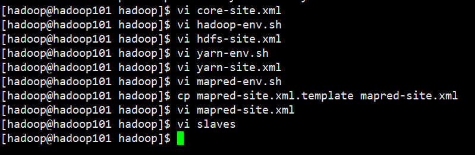
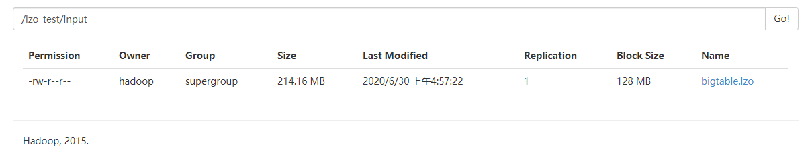
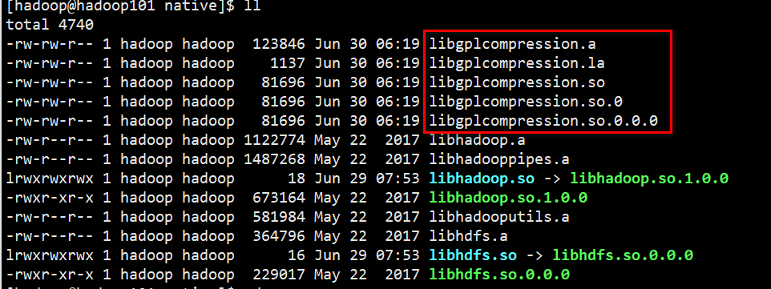
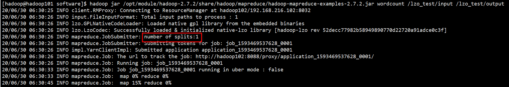
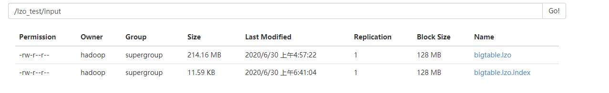
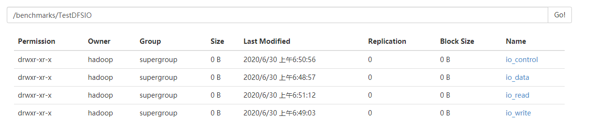

hadoop安装配置

## 解压

hadoop上传到opt目录下面的software文件夹下面，解压到/opt/module目录下
```
[hadoop@hadoop101 software]$ ll
total 193028
-rw-rw-r-- 1 hadoop hadoop 197657687 Jun 29 07:51 hadoop-2.7.2.tar.gz
[hadoop@hadoop101 software]$ tar -zxf hadoop-2.7.2.tar.gz -C /opt/module/
[hadoop@hadoop101 software]$ ll /opt/module/
```

配置环境变量
```
#HADOOP_HOME
export HADOOP_HOME=/opt/module/hadoop-2.7.2
export PATH=$PATH:$HADOOP_HOME/bin
export PATH=$PATH:$HADOOP_HOME/sbin
```

## 配置


### 核心配置文件
配置core-site.xml
```xml
<!-- 配置hdfs文件系统的命名空间-->
<property>
    <name>fs.defaultFS</name>
    <value>hdfs://hadoop101:9000</value>
</property>

<!-- 配置操作hdfs的缓冲大小-->
<property>
    <name>io.file.buffer.size</name>
    <value>4096</value>
</property>

<!-- 配置临时数据缓存目录-->
<property>
    <name>hadoop.tmp.dir</name>
    <value>/opt/module/hadoop-2.7.2/data/tmp</value>
</property>

<property>
    <name>hadoop.proxyuser.hadoop.hosts</name>
    <value>*</value>
</property>
<property>
    <name>hadoop.proxyuser.hadoop.groups</name>
    <value>*</value>
</property>
```

### HDFS配置文件
配置hadoop-env.sh
```
export JAVA_HOME=/opt/module/jdk1.8.0_144
```

配置hdfs-site.xml
```xml
<!-- hdfs的元数据存储位置 -->
<property>
    <name>dfs.namenode.name.dir</name>
    <value>/opt/module/hadoop-2.7.2/data/dfs/name</value>
</property>

<!-- hdfs的数据存储位置 -->
<property>
    <name>dfs.datanode.data.dir</name>
    <value>/opt/module/hadoop-2.7.2/data/dfs/data</value>
</property>

<!-- 副本数 -->
<property>
    <name>dfs.replication</name>
    <value>1</value>
</property>

<!-- 块大小 -->
<property>
    <name>dfs.blocksize</name>
    <value>134217728</value>
</property>

<!-- hdfs的namenode的web ui地址-->
<property>
    <name>dfs.http.address</name>
    <value>hadoop101:50070</value>
</property>

<!-- hdfs的secondarynamenode的web ui地址-->
<property>
    <name>dfs.secondary.http.address</name>
    <value>hadoop103:50090</value>
</property>

<!-- 是否开启web操作hdfs -->
<property>
  <name>dfs.webhdfs.enabled</name>
  <value>true</value>
</property>

<!-- 是否启用hdfs的权限（acl） -->
<property> 
    <name>dfs.permissions.enabled</name> 
    <value>false</value> 
</property>
```

### YARN配置文件
配置yarn-env.sh
```
export JAVA_HOME=/opt/module/jdk1.8.0_144
```

配置yarn-site.xml
```xml
<!-- 指定YARN的老大（ResourceManager）的地址 -->
<property>
    <name>yarn.resourcemanager.hostname</name>
    <value>hadoop102</value>
</property>

<!-- reducer获取数据的方式 -->
<property>
    <name>yarn.nodemanager.aux-services</name>
    <value>mapreduce_shuffle</value>
</property>

<!-- 日志聚集功能使能 -->
<property>
    <name>yarn.log-aggregation-enable</name>
    <value>true</value>
</property>

<!-- 日志保留时间设置7天 -->
<property>
    <name>yarn.log-aggregation.retain-seconds</name>
    <value>604800</value>
</property>

<!--是否启动一个线程检查每个任务正使用的物理内存量，如果任务超出分配值，则直接将其杀掉，默认是 true。为了在虚拟机中测试。 -->
<property>
    <name>yarn.nodemanager.pmem-check-enabled</name>
    <value>false</value>
</property>

<!--是否启动一个线程检查每个任务正使用的虚拟内存量，如果任务超出分配值，则直接将其杀掉，默认是 true。为了在虚拟机中测试。 -->
<property>
    <name>yarn.nodemanager.vmem-check-enabled</name>
    <value>false</value>
</property>
```

### MapReduce配置文件
配置mapred-env.sh
```
export JAVA_HOME=/opt/module/jdk1.8.0_144
```

配置mapred-site.xml
```xml
<!-- 指定mapreduce运行框架  -->
<property>
    <name>mapreduce.framework.name</name>
    <value>yarn</value>
</property>

<!-- 指定mapreduce历史服务的通信地址  -->
<property>
    <name>mapreduce.jobhistory.address</name>
    <value>hadoop101:10020</value>
</property>

<!-- 指定mapreduce web ui地址  -->
<property>
    <name>mapreduce.jobhistory.webapp.address</name>
    <value>hadoop101:19888</value>
</property>
```

### slaves配置文件
在该文件中增加如下内容：
```
hadoop101
hadoop102
hadoop103
```
**注意：该文件中添加的内容结尾不允许有空格，文件中不允许有空行**

## 启动集群
同步hadoop文件夹到其他两个节点。
```sh
[hadoop@hadoop101 module]$ pwd
/opt/module
[hadoop@hadoop101 module]$ ll
total 8
drwxr-xr-x 9 hadoop hadoop 4096 May 22  2017 hadoop-2.7.2
drwxr-xr-x 8 hadoop hadoop 4096 Jul 22  2017 jdk1.8.0_144
[hadoop@hadoop101 module]$ xsync hadoop-2.7.2/
```

### 格式化NameNode
如果集群是第一次启动，需要格式化NameNode（注意格式化之前，一定要先停止上次启动的所有namenode和datanode进程，然后再删除data和log数据）.
```
[hadoop@hadoop101 hadoop-2.7.2]$ bin/hdfs namenode -format
```

### 启动HDFS
```
[hadoop@hadoop101 hadoop-2.7.2]$ sbin/start-dfs.sh
```

### 启动YARN
```
[hadoop@hadoop102 hadoop-2.7.2]$ sbin/start-yarn.sh
```
**注意：NameNode和ResourceManger如果不是同一台机器，不能在NameNode上启动YARN，应该在ResouceManager所在的机器上启动YARN。**


### 启动历史服务器
```
[hadoop@hadoop101 hadoop-2.7.2]$ sbin/mr-jobhistory-daemon.sh start historyserver
```

### 启动后的进程
数据存储目录是自动生成的。
```
[hadoop@hadoop101 hadoop-2.7.2]$ xcall jps
--------- hadoop101 ----------
1952 JobHistoryServer
2052 Jps
1527 DataNode
1400 NameNode
1772 NodeManager
--------- hadoop102 ----------
1762 Jps
1426 NodeManager
1323 ResourceManager
1214 DataNode
--------- hadoop103 ----------
1204 DataNode
1367 NodeManager
1513 Jps
1262 SecondaryNameNode
[hadoop@hadoop101 hadoop-2.7.2]$ xcall ls /opt/module/hadoop-2.7.2/data/
--------- hadoop101 ----------
dfs
tmp
--------- hadoop102 ----------
dfs
tmp
--------- hadoop103 ----------
dfs
tmp
[hadoop@hadoop101 hadoop-2.7.2]$ xcall ls /opt/module/hadoop-2.7.2/data/dfs/
--------- hadoop101 ----------
data
name
--------- hadoop102 ----------
data
--------- hadoop103 ----------
data
[hadoop@hadoop101 hadoop-2.7.2]$ 
```

## 支持LZO压缩配置
hadoop本身并不支持lzo压缩，故需要使用twitter提供的hadoop-lzo开源组件。

1）hadoop-lzo需依赖hadoop和lzo进行编译，编译hadoop-lzo

2）将编译好后的hadoop-lzo-0.4.20.jar 放入hadoop-2.7.2/share/hadoop/common/
```
[hadoop@hadoop101 software]$ ll /opt/module/hadoop-2.7.2/share/hadoop/common
total 5560
-rw-r--r-- 1 hadoop hadoop 3441272 May 22  2017 hadoop-common-2.7.2.jar
-rw-r--r-- 1 hadoop hadoop 1875437 May 22  2017 hadoop-common-2.7.2-tests.jar
-rw-rw-r-- 1 hadoop hadoop  193831 Jun 30 04:37 hadoop-lzo-0.4.20.jar
-rw-r--r-- 1 hadoop hadoop  159477 May 22  2017 hadoop-nfs-2.7.2.jar
```

3）同步hadoop-lzo-0.4.20.jar到hadoop102、hadoop103
```
[hadoop@hadoop101 software]$ xsync /opt/module/hadoop-2.7.2/share/hadoop/common/hadoop-lzo-0.4.20.jar 
```

4）core-site.xml增加配置支持LZO压缩
```

<!-- 支持LZO压缩-->
<property>
    <name>io.compression.codecs</name>
    <value>
        org.apache.hadoop.io.compress.GzipCodec,
        org.apache.hadoop.io.compress.DefaultCodec,
        org.apache.hadoop.io.compress.BZip2Codec,
        org.apache.hadoop.io.compress.SnappyCodec,
        com.hadoop.compression.lzo.LzoCodec,
        com.hadoop.compression.lzo.LzopCodec
    </value>
</property>

<property>
    <name>io.compression.codec.lzo.class</name>
    <value>com.hadoop.compression.lzo.LzoCodec</value>
</property>
```

5）同步core-site.xml到hadoop102、hadoop103
```
[hadoop@hadoop101 hadoop]$ xsync core-site.xml 
```

6）启动及查看集群
```
# 在namenode的节点启动hdfs
[hadoop@hadoop101 software]$ start-dfs.sh 
# 在namenode的节点启动yarn
[hadoop@hadoop102 module]$ start-yarn.sh 
```

## LZO使用：LZO创建索引
创建LZO文件的索引，LZO压缩文件的可切片特性依赖于其索引，故我们需要手动为LZO压缩文件创建索引。若无索引，则LZO文件的切片只有一个。
```
hadoop jar /path/to/your/hadoop-lzo.jar com.hadoop.compression.lzo.DistributedLzoIndexer big_file.lzo
```

### 默认是不切片的
（1）将bigtable.lzo（215M）上传到集群
```
[hadoop@hadoop101 software]$ ll -h
total 215M
-rw-rw-r-- 1 hadoop hadoop 215M Jun 30 04:55 bigtable.lzo
[hadoop@hadoop101 software]$ hadoop fs -mkdir -p /lzo_test/input
[hadoop@hadoop101 software]$ hadoop fs -put bigtable.lzo /lzo_test/input
```


（2）执行wordcount程序
```
[hadoop@hadoop101 software]$ hadoop jar /opt/module/hadoop-2.7.2/share/hadoop/mapreduce/hadoop-mapreduce-examples-2.7.2.jar wordcount /lzo_test/input /lzo_test/output
```
刚开始执行报错了，提示`native-lzo library not available`，没有本地库，把hadoop-lzo-0.4.20.jar中的native复制到hadoop的native下
```
[hadoop@hadoop101 native]$ ll
total 4740
-rw-rw-r-- 1 hadoop hadoop  123846 Jun 30 06:19 libgplcompression.a
-rw-rw-r-- 1 hadoop hadoop    1137 Jun 30 06:19 libgplcompression.la
-rw-rw-r-- 1 hadoop hadoop   81696 Jun 30 06:19 libgplcompression.so
-rw-rw-r-- 1 hadoop hadoop   81696 Jun 30 06:19 libgplcompression.so.0
-rw-rw-r-- 1 hadoop hadoop   81696 Jun 30 06:19 libgplcompression.so.0.0.0
-rw-r--r-- 1 hadoop hadoop 1122774 May 22  2017 libhadoop.a
-rw-r--r-- 1 hadoop hadoop 1487268 May 22  2017 libhadooppipes.a
lrwxrwxrwx 1 hadoop hadoop      18 Jun 29 07:53 libhadoop.so -> libhadoop.so.1.0.0
-rwxr-xr-x 1 hadoop hadoop  673164 May 22  2017 libhadoop.so.1.0.0
-rw-r--r-- 1 hadoop hadoop  581984 May 22  2017 libhadooputils.a
-rw-r--r-- 1 hadoop hadoop  364796 May 22  2017 libhdfs.a
lrwxrwxrwx 1 hadoop hadoop      16 Jun 29 07:53 libhdfs.so -> libhdfs.so.0.0.0
-rwxr-xr-x 1 hadoop hadoop  229017 May 22  2017 libhdfs.so.0.0.0
```


重启后再执行，可以看到只有一个切片：

```
[hadoop@hadoop101 software]$ hadoop jar /opt/module/hadoop-2.7.2/share/hadoop/mapreduce/hadoop-mapreduce-examples-2.7.2.jar wordcount /lzo_test/input /lzo_test/output
20/06/30 06:30:25 INFO client.RMProxy: Connecting to ResourceManager at hadoop102/192.168.216.102:8032
20/06/30 06:30:26 INFO input.FileInputFormat: Total input paths to process : 1
20/06/30 06:30:26 INFO lzo.GPLNativeCodeLoader: Loaded native gpl library from the embedded binaries
20/06/30 06:30:26 INFO lzo.LzoCodec: Successfully loaded & initialized native-lzo library [hadoop-lzo rev 52decc77982b58949890770d22720a91adce0c3f]
20/06/30 06:30:26 INFO mapreduce.JobSubmitter: number of splits:1
20/06/30 06:30:26 INFO mapreduce.JobSubmitter: Submitting tokens for job: job_1593469537628_0001
20/06/30 06:30:26 INFO impl.YarnClientImpl: Submitted application application_1593469537628_0001
20/06/30 06:30:26 INFO mapreduce.Job: The url to track the job: http://hadoop102:8088/proxy/application_1593469537628_0001/
20/06/30 06:30:26 INFO mapreduce.Job: Running job: job_1593469537628_0001
20/06/30 06:30:33 INFO mapreduce.Job: Job job_1593469537628_0001 running in uber mode : false
20/06/30 06:30:33 INFO mapreduce.Job:  map 0% reduce 0%
20/06/30 06:30:45 INFO mapreduce.Job:  map 15% reduce 0%
20/06/30 06:30:48 INFO mapreduce.Job:  map 22% reduce 0%
20/06/30 06:30:51 INFO mapreduce.Job:  map 29% reduce 0%
20/06/30 06:30:54 INFO mapreduce.Job:  map 37% reduce 0%
20/06/30 06:30:57 INFO mapreduce.Job:  map 44% reduce 0%
20/06/30 06:31:00 INFO mapreduce.Job:  map 51% reduce 0%
20/06/30 06:31:03 INFO mapreduce.Job:  map 58% reduce 0%
20/06/30 06:31:06 INFO mapreduce.Job:  map 65% reduce 0%
20/06/30 06:31:09 INFO mapreduce.Job:  map 67% reduce 0%
20/06/30 06:31:12 INFO mapreduce.Job:  map 100% reduce 0%
20/06/30 06:31:24 INFO mapreduce.Job:  map 100% reduce 97%
20/06/30 06:31:25 INFO mapreduce.Job:  map 100% reduce 100%
20/06/30 06:31:26 INFO mapreduce.Job: Job job_1593469537628_0001 completed successfully
20/06/30 06:31:26 INFO mapreduce.Job: Counters: 49
	File System Counters
		FILE: Number of bytes read=242201309
		FILE: Number of bytes written=297355834
		FILE: Number of read operations=0
		FILE: Number of large read operations=0
		FILE: Number of write operations=0
		HDFS: Number of bytes read=224565569
		HDFS: Number of bytes written=49560641
		HDFS: Number of read operations=6
		HDFS: Number of large read operations=0
		HDFS: Number of write operations=2
	Job Counters 
		Launched map tasks=1
		Launched reduce tasks=1
		Rack-local map tasks=1
		Total time spent by all maps in occupied slots (ms)=35143
		Total time spent by all reduces in occupied slots (ms)=10964
		Total time spent by all map tasks (ms)=35143
		Total time spent by all reduce tasks (ms)=10964
		Total vcore-milliseconds taken by all map tasks=35143
		Total vcore-milliseconds taken by all reduce tasks=10964
		Total megabyte-milliseconds taken by all map tasks=35986432
		Total megabyte-milliseconds taken by all reduce tasks=11227136
	Map-Reduce Framework
		Map input records=3025530
		Map output records=21447250
		Map output bytes=450963147
		Map output materialized bytes=54917884
		Input split bytes=114
		Combine input records=26374465
		Combine output records=6350186
		Reduce input groups=1422971
		Reduce shuffle bytes=54917884
		Reduce input records=1422971
		Reduce output records=1422971
		Spilled Records=7773157
		Shuffled Maps =1
		Failed Shuffles=0
		Merged Map outputs=1
		GC time elapsed (ms)=1282
		CPU time spent (ms)=47140
		Physical memory (bytes) snapshot=449888256
		Virtual memory (bytes) snapshot=4188270592
		Total committed heap usage (bytes)=304611328
	Shuffle Errors
		BAD_ID=0
		CONNECTION=0
		IO_ERROR=0
		WRONG_LENGTH=0
		WRONG_MAP=0
		WRONG_REDUCE=0
	File Input Format Counters 
		Bytes Read=224565455
	File Output Format Counters 
		Bytes Written=49560641
[hadoop@hadoop101 software]$
```

### 对LZO文件建索引、使支持切片
```
[hadoop@hadoop101 software]$ hadoop jar /opt/module/hadoop-2.7.2/share/hadoop/common/hadoop-lzo-0.4.20.jar com.hadoop.compression.lzo.DistributedLzoIndexer /lzo_test/input/bigtable.lzo
```
可以看到是跑了一个mr
```
[hadoop@hadoop101 software]$ hadoop jar /opt/module/hadoop-2.7.2/share/hadoop/common/hadoop-lzo-0.4.20.jar com.hadoop.compression.lzo.DistributedLzoIndexer /lzo_test/input/bigtable.lzo
20/06/30 06:40:46 INFO lzo.GPLNativeCodeLoader: Loaded native gpl library from the embedded binaries
20/06/30 06:40:46 INFO lzo.LzoCodec: Successfully loaded & initialized native-lzo library [hadoop-lzo rev 52decc77982b58949890770d22720a91adce0c3f]
20/06/30 06:40:46 INFO lzo.DistributedLzoIndexer: Adding LZO file /lzo_test/input/bigtable.lzo to indexing list (no index currently exists)
20/06/30 06:40:46 INFO Configuration.deprecation: mapred.map.tasks.speculative.execution is deprecated. Instead, use mapreduce.map.speculative
20/06/30 06:40:46 INFO client.RMProxy: Connecting to ResourceManager at hadoop102/192.168.216.102:8032
20/06/30 06:40:47 INFO input.FileInputFormat: Total input paths to process : 1
20/06/30 06:40:47 INFO mapreduce.JobSubmitter: number of splits:1
20/06/30 06:40:47 INFO mapreduce.JobSubmitter: Submitting tokens for job: job_1593469537628_0002
20/06/30 06:40:47 INFO impl.YarnClientImpl: Submitted application application_1593469537628_0002
20/06/30 06:40:47 INFO mapreduce.Job: The url to track the job: http://hadoop102:8088/proxy/application_1593469537628_0002/
20/06/30 06:40:47 INFO lzo.DistributedLzoIndexer: Started DistributedIndexer job_1593469537628_0002 with 1 splits for [/lzo_test/input/bigtable.lzo]
20/06/30 06:40:47 INFO mapreduce.Job: Running job: job_1593469537628_0002
20/06/30 06:40:51 INFO mapreduce.Job: Job job_1593469537628_0002 running in uber mode : false
20/06/30 06:40:51 INFO mapreduce.Job:  map 0% reduce 0%
20/06/30 06:41:01 INFO mapreduce.Job:  map 62% reduce 0%
20/06/30 06:41:04 INFO mapreduce.Job:  map 90% reduce 0%
20/06/30 06:41:05 INFO mapreduce.Job:  map 100% reduce 0%
20/06/30 06:41:05 INFO mapreduce.Job: Job job_1593469537628_0002 completed successfully
20/06/30 06:41:05 INFO mapreduce.Job: Counters: 31
	File System Counters
		FILE: Number of bytes read=0
		FILE: Number of bytes written=117988
		FILE: Number of read operations=0
		FILE: Number of large read operations=0
		FILE: Number of write operations=0
		HDFS: Number of bytes read=12028
		HDFS: Number of bytes written=11864
		HDFS: Number of read operations=2
		HDFS: Number of large read operations=0
		HDFS: Number of write operations=4
	Job Counters 
		Launched map tasks=1
		Rack-local map tasks=1
		Total time spent by all maps in occupied slots (ms)=11821
		Total time spent by all reduces in occupied slots (ms)=0
		Total time spent by all map tasks (ms)=11821
		Total vcore-milliseconds taken by all map tasks=11821
		Total megabyte-milliseconds taken by all map tasks=12104704
	Map-Reduce Framework
		Map input records=1483
		Map output records=1483
		Input split bytes=114
		Spilled Records=0
		Failed Shuffles=0
		Merged Map outputs=0
		GC time elapsed (ms)=45
		CPU time spent (ms)=3600
		Physical memory (bytes) snapshot=183451648
		Virtual memory (bytes) snapshot=2084823040
		Total committed heap usage (bytes)=98041856
	com.hadoop.mapreduce.LzoSplitRecordReader$Counters
		READ_SUCCESS=1
	File Input Format Counters 
		Bytes Read=11914
	File Output Format Counters 
		Bytes Written=0
```
多了一个索引文件：


再次执行wordcount，发现切片变成了2个：
```
[hadoop@hadoop101 software]$ hadoop jar /opt/module/hadoop-2.7.2/share/hadoop/mapreduce/hadoop-mapreduce-examples-2.7.2.jar wordcount /lzo_test/input /lzo_test/output2
20/06/30 06:43:16 INFO client.RMProxy: Connecting to ResourceManager at hadoop102/192.168.216.102:8032
20/06/30 06:43:17 INFO input.FileInputFormat: Total input paths to process : 2
20/06/30 06:43:17 INFO lzo.GPLNativeCodeLoader: Loaded native gpl library from the embedded binaries
20/06/30 06:43:17 INFO lzo.LzoCodec: Successfully loaded & initialized native-lzo library [hadoop-lzo rev 52decc77982b58949890770d22720a91adce0c3f]
20/06/30 06:43:17 INFO mapreduce.JobSubmitter: number of splits:2
20/06/30 06:43:17 INFO mapreduce.JobSubmitter: Submitting tokens for job: job_1593469537628_0003
20/06/30 06:43:17 INFO impl.YarnClientImpl: Submitted application application_1593469537628_0003
20/06/30 06:43:17 INFO mapreduce.Job: The url to track the job: http://hadoop102:8088/proxy/application_1593469537628_0003/
20/06/30 06:43:17 INFO mapreduce.Job: Running job: job_1593469537628_0003
20/06/30 06:43:22 INFO mapreduce.Job: Job job_1593469537628_0003 running in uber mode : false
20/06/30 06:43:22 INFO mapreduce.Job:  map 0% reduce 0%
20/06/30 06:43:28 INFO mapreduce.Job:  map 50% reduce 0%
20/06/30 06:43:32 INFO mapreduce.Job:  map 57% reduce 0%
```

## 项目经验之基准测试
### 测试HDFS写性能
测试内容：向HDFS集群写10个128M的文件
```
[hadoop@hadoop101 software]$ hadoop jar /opt/module/hadoop-2.7.2/share/hadoop/mapreduce/hadoop-mapreduce-client-jobclient-2.7.2-tests.jar TestDFSIO -write -nrFiles 10 -fileSize 128MB
```


```
[hadoop@hadoop101 software]$ hadoop jar /opt/module/hadoop-2.7.2/share/hadoop/mapreduce/hadoop-mapreduce-client-jobclient-2.7.2-tests.jar TestDFSIO -write -nrFiles 10 -fileSize 128MB
20/06/30 06:48:38 INFO fs.TestDFSIO: TestDFSIO.1.8
20/06/30 06:48:38 INFO fs.TestDFSIO: nrFiles = 10
20/06/30 06:48:38 INFO fs.TestDFSIO: nrBytes (MB) = 128.0
20/06/30 06:48:38 INFO fs.TestDFSIO: bufferSize = 1000000
20/06/30 06:48:38 INFO fs.TestDFSIO: baseDir = /benchmarks/TestDFSIO
20/06/30 06:48:39 INFO fs.TestDFSIO: creating control file: 134217728 bytes, 10 files
20/06/30 06:48:39 INFO fs.TestDFSIO: created control files for: 10 files
20/06/30 06:48:39 INFO client.RMProxy: Connecting to ResourceManager at hadoop102/192.168.216.102:8032
20/06/30 06:48:39 INFO client.RMProxy: Connecting to ResourceManager at hadoop102/192.168.216.102:8032
20/06/30 06:48:39 INFO mapred.FileInputFormat: Total input paths to process : 10
20/06/30 06:48:39 INFO mapreduce.JobSubmitter: number of splits:10
20/06/30 06:48:39 INFO mapreduce.JobSubmitter: Submitting tokens for job: job_1593469537628_0004
20/06/30 06:48:39 INFO impl.YarnClientImpl: Submitted application application_1593469537628_0004
20/06/30 06:48:40 INFO mapreduce.Job: The url to track the job: http://hadoop102:8088/proxy/application_1593469537628_0004/
20/06/30 06:48:40 INFO mapreduce.Job: Running job: job_1593469537628_0004
20/06/30 06:48:44 INFO mapreduce.Job: Job job_1593469537628_0004 running in uber mode : false
20/06/30 06:48:44 INFO mapreduce.Job:  map 0% reduce 0%
20/06/30 06:48:51 INFO mapreduce.Job:  map 10% reduce 0%
20/06/30 06:48:53 INFO mapreduce.Job:  map 20% reduce 0%
20/06/30 06:49:01 INFO mapreduce.Job:  map 27% reduce 7%
20/06/30 06:49:02 INFO mapreduce.Job:  map 67% reduce 7%
20/06/30 06:49:03 INFO mapreduce.Job:  map 100% reduce 7%
20/06/30 06:49:04 INFO mapreduce.Job:  map 100% reduce 100%
20/06/30 06:49:04 INFO mapreduce.Job: Job job_1593469537628_0004 completed successfully
20/06/30 06:49:04 INFO mapreduce.Job: Counters: 51
	File System Counters
		FILE: Number of bytes read=845
		FILE: Number of bytes written=1308170
		FILE: Number of read operations=0
		FILE: Number of large read operations=0
		FILE: Number of write operations=0
		HDFS: Number of bytes read=2350
		HDFS: Number of bytes written=1342177359
		HDFS: Number of read operations=43
		HDFS: Number of large read operations=0
		HDFS: Number of write operations=12
	Job Counters 
		Killed map tasks=1
		Launched map tasks=11
		Launched reduce tasks=1
		Data-local map tasks=8
		Rack-local map tasks=3
		Total time spent by all maps in occupied slots (ms)=146217
		Total time spent by all reduces in occupied slots (ms)=11160
		Total time spent by all map tasks (ms)=146217
		Total time spent by all reduce tasks (ms)=11160
		Total vcore-milliseconds taken by all map tasks=146217
		Total vcore-milliseconds taken by all reduce tasks=11160
		Total megabyte-milliseconds taken by all map tasks=149726208
		Total megabyte-milliseconds taken by all reduce tasks=11427840
	Map-Reduce Framework
		Map input records=10
		Map output records=50
		Map output bytes=739
		Map output materialized bytes=899
		Input split bytes=1230
		Combine input records=0
		Combine output records=0
		Reduce input groups=5
		Reduce shuffle bytes=899
		Reduce input records=50
		Reduce output records=5
		Spilled Records=100
		Shuffled Maps =10
		Failed Shuffles=0
		Merged Map outputs=10
		GC time elapsed (ms)=3904
		CPU time spent (ms)=24060
		Physical memory (bytes) snapshot=3022974976
		Virtual memory (bytes) snapshot=23063240704
		Total committed heap usage (bytes)=2073559040
	Shuffle Errors
		BAD_ID=0
		CONNECTION=0
		IO_ERROR=0
		WRONG_LENGTH=0
		WRONG_MAP=0
		WRONG_REDUCE=0
	File Input Format Counters 
		Bytes Read=1120
	File Output Format Counters 
		Bytes Written=79
20/06/30 06:49:04 INFO fs.TestDFSIO: ----- TestDFSIO ----- : write
20/06/30 06:49:04 INFO fs.TestDFSIO:            Date & time: Tue Jun 30 06:49:04 CST 2020
20/06/30 06:49:04 INFO fs.TestDFSIO:        Number of files: 10
20/06/30 06:49:04 INFO fs.TestDFSIO: Total MBytes processed: 1280.0
20/06/30 06:49:04 INFO fs.TestDFSIO:      Throughput mb/sec: 31.182245608906427
20/06/30 06:49:04 INFO fs.TestDFSIO: Average IO rate mb/sec: 39.42890167236328
20/06/30 06:49:04 INFO fs.TestDFSIO:  IO rate std deviation: 30.949928753782828
20/06/30 06:49:04 INFO fs.TestDFSIO:     Test exec time sec: 25.118
20/06/30 06:49:04 INFO fs.TestDFSIO:
```

### 测试HDFS读性能
测试内容：读取HDFS集群10个128M的文件
```
[hadoop@hadoop101 software]$ hadoop jar /opt/module/hadoop-2.7.2/share/hadoop/mapreduce/hadoop-mapreduce-client-jobclient-2.7.2-tests.jar TestDFSIO -read -nrFiles 10 -fileSize 128MB
```

```
[hadoop@hadoop101 software]$ hadoop jar /opt/module/hadoop-2.7.2/share/hadoop/mapreduce/hadoop-mapreduce-client-jobclient-2.7.2-tests.jar TestDFSIO -read -nrFiles 10 -fileSize 128MB
20/06/30 06:50:55 INFO fs.TestDFSIO: TestDFSIO.1.8
20/06/30 06:50:55 INFO fs.TestDFSIO: nrFiles = 10
20/06/30 06:50:55 INFO fs.TestDFSIO: nrBytes (MB) = 128.0
20/06/30 06:50:55 INFO fs.TestDFSIO: bufferSize = 1000000
20/06/30 06:50:55 INFO fs.TestDFSIO: baseDir = /benchmarks/TestDFSIO
20/06/30 06:50:56 INFO fs.TestDFSIO: creating control file: 134217728 bytes, 10 files
20/06/30 06:50:56 INFO fs.TestDFSIO: created control files for: 10 files
20/06/30 06:50:56 INFO client.RMProxy: Connecting to ResourceManager at hadoop102/192.168.216.102:8032
20/06/30 06:50:56 INFO client.RMProxy: Connecting to ResourceManager at hadoop102/192.168.216.102:8032
20/06/30 06:50:56 INFO mapred.FileInputFormat: Total input paths to process : 10
20/06/30 06:50:56 INFO mapreduce.JobSubmitter: number of splits:10
20/06/30 06:50:56 INFO mapreduce.JobSubmitter: Submitting tokens for job: job_1593469537628_0005
20/06/30 06:50:56 INFO impl.YarnClientImpl: Submitted application application_1593469537628_0005
20/06/30 06:50:56 INFO mapreduce.Job: The url to track the job: http://hadoop102:8088/proxy/application_1593469537628_0005/
20/06/30 06:50:56 INFO mapreduce.Job: Running job: job_1593469537628_0005
20/06/30 06:51:01 INFO mapreduce.Job: Job job_1593469537628_0005 running in uber mode : false
20/06/30 06:51:01 INFO mapreduce.Job:  map 0% reduce 0%
20/06/30 06:51:09 INFO mapreduce.Job:  map 10% reduce 0%
20/06/30 06:51:10 INFO mapreduce.Job:  map 20% reduce 0%
20/06/30 06:51:13 INFO mapreduce.Job:  map 100% reduce 0%
20/06/30 06:51:14 INFO mapreduce.Job:  map 100% reduce 100%
20/06/30 06:51:14 INFO mapreduce.Job: Job job_1593469537628_0005 completed successfully
20/06/30 06:51:14 INFO mapreduce.Job: Counters: 51
	File System Counters
		FILE: Number of bytes read=863
		FILE: Number of bytes written=1308184
		FILE: Number of read operations=0
		FILE: Number of large read operations=0
		FILE: Number of write operations=0
		HDFS: Number of bytes read=1342179630
		HDFS: Number of bytes written=80
		HDFS: Number of read operations=53
		HDFS: Number of large read operations=0
		HDFS: Number of write operations=2
	Job Counters 
		Killed map tasks=1
		Launched map tasks=10
		Launched reduce tasks=1
		Data-local map tasks=8
		Rack-local map tasks=2
		Total time spent by all maps in occupied slots (ms)=81123
		Total time spent by all reduces in occupied slots (ms)=2236
		Total time spent by all map tasks (ms)=81123
		Total time spent by all reduce tasks (ms)=2236
		Total vcore-milliseconds taken by all map tasks=81123
		Total vcore-milliseconds taken by all reduce tasks=2236
		Total megabyte-milliseconds taken by all map tasks=83069952
		Total megabyte-milliseconds taken by all reduce tasks=2289664
	Map-Reduce Framework
		Map input records=10
		Map output records=50
		Map output bytes=757
		Map output materialized bytes=917
		Input split bytes=1230
		Combine input records=0
		Combine output records=0
		Reduce input groups=5
		Reduce shuffle bytes=917
		Reduce input records=50
		Reduce output records=5
		Spilled Records=100
		Shuffled Maps =10
		Failed Shuffles=0
		Merged Map outputs=10
		GC time elapsed (ms)=1140
		CPU time spent (ms)=8730
		Physical memory (bytes) snapshot=2674061312
		Virtual memory (bytes) snapshot=22966747136
		Total committed heap usage (bytes)=2109734912
	Shuffle Errors
		BAD_ID=0
		CONNECTION=0
		IO_ERROR=0
		WRONG_LENGTH=0
		WRONG_MAP=0
		WRONG_REDUCE=0
	File Input Format Counters 
		Bytes Read=1120
	File Output Format Counters 
		Bytes Written=80
20/06/30 06:51:14 INFO fs.TestDFSIO: ----- TestDFSIO ----- : read
20/06/30 06:51:14 INFO fs.TestDFSIO:            Date & time: Tue Jun 30 06:51:14 CST 2020
20/06/30 06:51:14 INFO fs.TestDFSIO:        Number of files: 10
20/06/30 06:51:14 INFO fs.TestDFSIO: Total MBytes processed: 1280.0
20/06/30 06:51:14 INFO fs.TestDFSIO:      Throughput mb/sec: 179.44763774008132
20/06/30 06:51:14 INFO fs.TestDFSIO: Average IO rate mb/sec: 200.35479736328125
20/06/30 06:51:14 INFO fs.TestDFSIO:  IO rate std deviation: 51.47733589666921
20/06/30 06:51:14 INFO fs.TestDFSIO:     Test exec time sec: 17.904
20/06/30 06:51:14 INFO fs.TestDFSIO: 
```

### 删除测试生成数据

```
[hadoop@hadoop101 software]$ hadoop jar /opt/module/hadoop-2.7.2/share/hadoop/mapreduce/hadoop-mapreduce-client-jobclient-2.7.2-tests.jar TestDFSIO -clean
20/06/30 06:53:38 INFO fs.TestDFSIO: TestDFSIO.1.8
20/06/30 06:53:38 INFO fs.TestDFSIO: nrFiles = 1
20/06/30 06:53:38 INFO fs.TestDFSIO: nrBytes (MB) = 1.0
20/06/30 06:53:38 INFO fs.TestDFSIO: bufferSize = 1000000
20/06/30 06:53:38 INFO fs.TestDFSIO: baseDir = /benchmarks/TestDFSIO
20/06/30 06:53:38 INFO fs.TestDFSIO: Cleaning up test files
```


### 使用Sort程序评测MapReduce
这个我没测试，怕虚拟机崩了。

（1）使用RandomWriter来产生随机数，每个节点运行10个Map任务，每个Map产生大约1G大小的二进制随机数
```
[hadoop@hadoop101 mapreduce]$ hadoop jar /opt/module/hadoop-2.7.2/share/hadoop/mapreduce/hadoop-mapreduce-examples-2.7.2.jar randomwriter random-data
```

（2）执行Sort程序
```
[hadoop@hadoop101 mapreduce]$ hadoop jar /opt/module/hadoop-2.7.2/share/hadoop/mapreduce/hadoop-mapreduce-examples-2.7.2.jar sort random-data sorted-data
```

（3）验证数据是否真正排好序了
```
[hadoop@hadoop101 mapreduce]$ hadoop jar /opt/module/hadoop-2.7.2/share/hadoop/mapreduce/hadoop-mapreduce-client-jobclient-2.7.2-tests.jar testmapredsort -sortInput random-data -sortOutput sorted-data
```


```

```