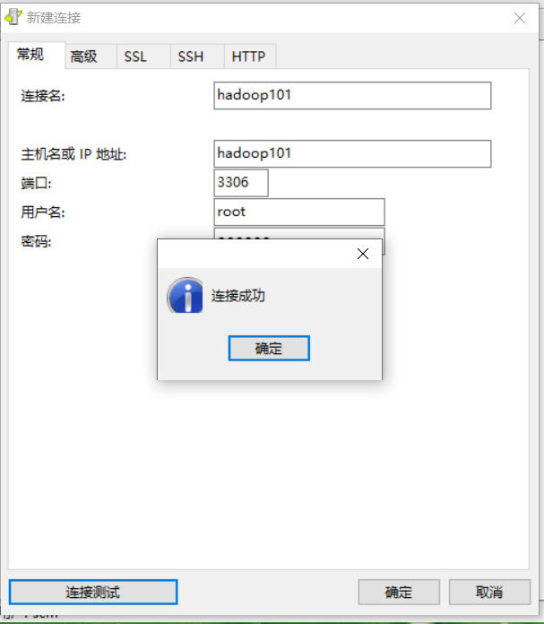

主要用于存储hive的原数据。MySQL安装到hadoop101上。

**注意：一定要用root用户操作如下步骤；先卸载MySQL再安装，卸载和安装都需要在root用户下。**

## 卸载原有的MySQL
查看MySQL是否安装
```
[root@hadoop101 software]# rpm -qa|grep mysql
mysql-libs-5.1.71-1.el6.x86_64
```

如果安装了MySQL，就先卸载
```
[root@hadoop101 software]# rpm -e --nodeps mysql-libs-5.1.71-1.el6.x86_64
[root@hadoop101 software]# rpm -qa|grep mysql
```

## 安装包准备
上传mysql相关文件到node01的/opt/software目录
```
[root@hadoop101 software]# ll
total 75988
-rw-rw-r-- 1 hadoop hadoop 77807942 Jul  5 06:24 mysql-libs.zip
[root@hadoop101 software]# unzip mysql-libs.zip 
bash: unzip: command not found
# 安装zip和unzip，-y不用手动输入yes
[root@hadoop101 software]# yum install -y unzip zip
```

解压：
```
[root@hadoop101 software]# unzip mysql-libs.zip 
Archive:  mysql-libs.zip
   creating: mysql-libs/
  inflating: mysql-libs/MySQL-client-5.6.24-1.el6.x86_64.rpm  
  inflating: mysql-libs/mysql-connector-java-5.1.27.tar.gz  
  inflating: mysql-libs/MySQL-server-5.6.24-1.el6.x86_64.rpm  
[root@hadoop101 software]# ll
total 75992
drwxr-xr-x 2 root   root       4096 Jun 26  2015 mysql-libs
-rw-rw-r-- 1 hadoop hadoop 77807942 Jul  5 06:24 mysql-libs.zip
[root@hadoop101 software]# cd mysql-libs
[root@hadoop101 mysql-libs]# ll
total 76048
-rw-r--r-- 1 root root 18509960 Mar 26  2015 MySQL-client-5.6.24-1.el6.x86_64.rpm
-rw-r--r-- 1 root root  3575135 Dec  1  2013 mysql-connector-java-5.1.27.tar.gz
-rw-r--r-- 1 root root 55782196 Mar 26  2015 MySQL-server-5.6.24-1.el6.x86_64.rpm
```

## 安装MySQL服务器
安装MySQL服务端
```
[root@hadoop101 mysql-libs]# rpm -ivh MySQL-server-5.6.24-1.el6.x86_64.rpm
```


然后就安装成功了，结尾有这两行，这个可以查看产生的随机密码
```
A RANDOM PASSWORD HAS BEEN SET FOR THE MySQL root USER !
You will find that password in '/root/.mysql_secret'.
```


查看MySQL状态
```
[root@hadoop101 mysql-libs]# service mysql status
 ERROR! MySQL is not running
```

启动MySQL
```
[root@hadoop101 mysql-libs]# service mysql start
Starting MySQL.. SUCCESS! 
[root@hadoop101 mysql-libs]# service mysql status
 SUCCESS! MySQL running (1429)
```

**查看产生的随机密码**
```
[root@hadoop101 mysql-libs]# cat /root/.mysql_secret
# The random password set for the root user at Sun Jul  5 06:31:11 2020 (local time): d1Nv2f6ll49GFeIc
```

## 安装MySQL客户端、修改密码
安装MySQL客户端
```
[root@hadoop101 mysql-libs]# rpm -ivh MySQL-client-5.6.24-1.el6.x86_64.rpm 
Preparing...                ########################################### [100%]
   1:MySQL-client           ########################################### [100%]
```

链接MySQL（密码替换成产生的随机密码）
```
[root@hadoop101 mysql-libs]# mysql -uroot -pd1Nv2f6ll49GFeIc
```

修改密码，退出
```
mysql> SET PASSWORD=PASSWORD('123456');
Query OK, 0 rows affected (0.00 sec)

mysql> exit
Bye
[root@hadoop101 mysql-libs]# 
```

看是否改密码成功
```
[root@hadoop101 mysql-libs]# mysql -uroot -p123456
```

## MySQL中user表中主机配置

配置只要是root用户+密码，在任何主机上都能登录MySQL数据库。

```
mysql> show databases;
+--------------------+
| Database           |
+--------------------+
| information_schema |
| mysql              |
| performance_schema |
| test               |
+--------------------+
4 rows in set (0.00 sec)

mysql> use mysql;
Reading table information for completion of table and column names
You can turn off this feature to get a quicker startup with -A

Database changed
mysql> select User, Host, Password from user;
+------+-----------+-------------------------------------------+
| User | Host      | Password                                  |
+------+-----------+-------------------------------------------+
| root | localhost | *6BB4837EB74329105EE4568DDA7DC67ED2CA2AD9 |
| root | node01    | *E4FFD5A08B6D29239DB41BB83B854B182AFFE01B |
| root | 127.0.0.1 | *E4FFD5A08B6D29239DB41BB83B854B182AFFE01B |
| root | ::1       | *E4FFD5A08B6D29239DB41BB83B854B182AFFE01B |
+------+-----------+-------------------------------------------+
4 rows in set (0.00 sec)

mysql> update user set host='%' where host='localhost';
Query OK, 1 row affected (0.00 sec)
Rows matched: 1  Changed: 1  Warnings: 0

mysql> use mysql;
Database changed
mysql> select User, Host, Password from user;
+------+-----------+-------------------------------------------+
| User | Host      | Password                                  |
+------+-----------+-------------------------------------------+
| root | %         | *6BB4837EB74329105EE4568DDA7DC67ED2CA2AD9 |
| root | node01    | *E4FFD5A08B6D29239DB41BB83B854B182AFFE01B |
| root | 127.0.0.1 | *E4FFD5A08B6D29239DB41BB83B854B182AFFE01B |
| root | ::1       | *E4FFD5A08B6D29239DB41BB83B854B182AFFE01B |
+------+-----------+-------------------------------------------+
4 rows in set (0.00 sec)

mysql> delete from user where Host!='%';
Query OK, 3 rows affected (0.00 sec)

mysql> select User, Host, Password from user;
+------+------+-------------------------------------------+
| User | Host | Password                                  |
+------+------+-------------------------------------------+
| root | %    | *6BB4837EB74329105EE4568DDA7DC67ED2CA2AD9 |
+------+------+-------------------------------------------+
1 row in set (0.00 sec)

mysql> 
```

**刷新才生效**
```
mysql> flush privileges;
Query OK, 0 rows affected (0.00 sec)

mysql> quit;
Bye
[root@node01 software]# 
```

window连接测试：



```

```


