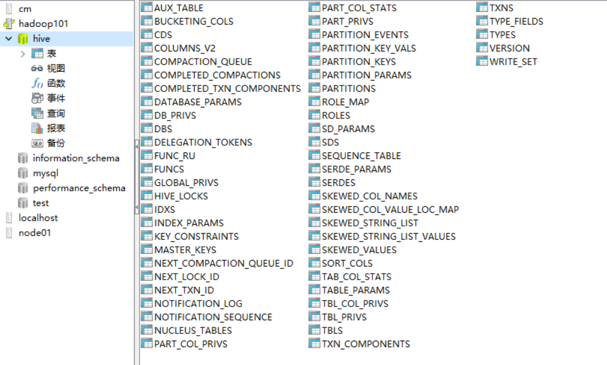
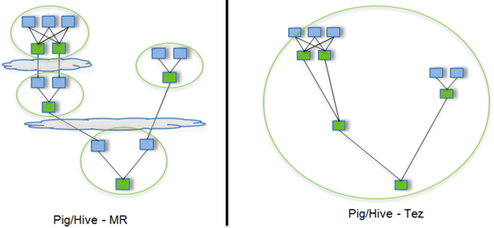

hive使用2.3的版本，和1.x的版本相比**需要多启动metastore服务**

## hive安装配置

### 解压
解压
```
[hadoop@hadoop101 software]$ ll
total 362420
-rw-rw-r-- 1 hadoop hadoop 232225538 Jul  5 07:00 apache-hive-2.3.6-bin.tar.gz
-rw-rw-r-- 1 hadoop hadoop  61074757 Jul  5 06:59 apache-tez-0.9.1-bin.tar.gz
drwxr-xr-x 2 root   root        4096 Jun 26  2015 mysql-libs
-rw-rw-r-- 1 hadoop hadoop  77807942 Jul  5 06:24 mysql-libs.zip
[hadoop@hadoop101 software]$ tar -zxf apache-hive-2.3.6-bin.tar.gz -C /opt/module/
[hadoop@hadoop101 software]$ cd /opt/module/
[hadoop@hadoop101 module]$ ll
total 68
drwxrwxr-x 10 hadoop hadoop  4096 Jul  5 07:01 apache-hive-2.3.6-bin
drwxrwxr-x  8 hadoop hadoop  4096 Jul  3 07:02 flume-1.7.0
drwxr-xr-x 11 hadoop hadoop  4096 Jun 30 04:18 hadoop-2.7.2
drwxr-xr-x  8 hadoop hadoop  4096 Jul 22  2017 jdk1.8.0_144
drwxr-xr-x  7 hadoop hadoop  4096 Jul  1 04:12 kafka_2.11-0.11.0.2
drwxrwxr-x  3 hadoop hadoop  4096 Jul  3 06:31 tomcat
drwxr-xr-x 12 hadoop hadoop  4096 Jun 30 07:56 zookeeper-3.4.10
[hadoop@hadoop101 module]$ mv apache-hive-2.3.6-bin hive-2.3.6
[hadoop@hadoop101 module]$ ll
total 68
drwxrwxr-x  8 hadoop hadoop  4096 Jul  3 07:02 flume-1.7.0
drwxr-xr-x 11 hadoop hadoop  4096 Jun 30 04:18 hadoop-2.7.2
drwxrwxr-x 10 hadoop hadoop  4096 Jul  5 07:01 hive-2.3.6
drwxr-xr-x  8 hadoop hadoop  4096 Jul 22  2017 jdk1.8.0_144
drwxr-xr-x  7 hadoop hadoop  4096 Jul  1 04:12 kafka_2.11-0.11.0.2
drwxrwxr-x  3 hadoop hadoop  4096 Jul  3 06:31 tomcat
drwxr-xr-x 12 hadoop hadoop  4096 Jun 30 07:56 zookeeper-3.4.10
```

### 复制mysql驱动到lib目录下
复制mysql驱动到lib目录下
```
[hadoop@hadoop101 mysql-libs]$ ll
total 76048
-rw-r--r-- 1 hadoop hadoop 18509960 Mar 26  2015 MySQL-client-5.6.24-1.el6.x86_64.rpm
-rw-r--r-- 1 hadoop hadoop  3575135 Dec  1  2013 mysql-connector-java-5.1.27.tar.gz
-rw-r--r-- 1 hadoop hadoop 55782196 Mar 26  2015 MySQL-server-5.6.24-1.el6.x86_64.rpm
[hadoop@hadoop101 mysql-libs]$ tar -zxf mysql-connector-java-5.1.27.tar.gz 
[hadoop@hadoop101 mysql-libs]$ ll
total 76052
-rw-r--r-- 1 hadoop hadoop 18509960 Mar 26  2015 MySQL-client-5.6.24-1.el6.x86_64.rpm
drwxr-xr-x 4 hadoop hadoop     4096 Oct 24  2013 mysql-connector-java-5.1.27
-rw-r--r-- 1 hadoop hadoop  3575135 Dec  1  2013 mysql-connector-java-5.1.27.tar.gz
-rw-r--r-- 1 hadoop hadoop 55782196 Mar 26  2015 MySQL-server-5.6.24-1.el6.x86_64.rpm
[hadoop@hadoop101 mysql-libs]$ ll mysql-connector-java-5.1.27
total 1272
-rw-r--r-- 1 hadoop hadoop  47173 Oct 24  2013 build.xml
-rw-r--r-- 1 hadoop hadoop 222520 Oct 24  2013 CHANGES
-rw-r--r-- 1 hadoop hadoop  18122 Oct 24  2013 COPYING
drwxr-xr-x 2 hadoop hadoop   4096 Jul  5 07:07 docs
-rw-r--r-- 1 hadoop hadoop 872303 Oct 24  2013 mysql-connector-java-5.1.27-bin.jar
-rw-r--r-- 1 hadoop hadoop  61423 Oct 24  2013 README
-rw-r--r-- 1 hadoop hadoop  63674 Oct 24  2013 README.txt
drwxr-xr-x 7 hadoop hadoop   4096 Oct 24  2013 src
[hadoop@hadoop101 mysql-libs]$ mv mysql-connector-java-5.1.27/mysql-connector-java-5.1.27-bin.jar ./
[hadoop@hadoop101 mysql-libs]$ ll
total 76904
-rw-r--r-- 1 hadoop hadoop 18509960 Mar 26  2015 MySQL-client-5.6.24-1.el6.x86_64.rpm
drwxr-xr-x 4 hadoop hadoop     4096 Jul  5 07:08 mysql-connector-java-5.1.27
-rw-r--r-- 1 hadoop hadoop   872303 Oct 24  2013 mysql-connector-java-5.1.27-bin.jar
-rw-r--r-- 1 hadoop hadoop  3575135 Dec  1  2013 mysql-connector-java-5.1.27.tar.gz
-rw-r--r-- 1 hadoop hadoop 55782196 Mar 26  2015 MySQL-server-5.6.24-1.el6.x86_64.rpm
[hadoop@hadoop101 mysql-libs]$ cp mysql-connector-java-5.1.27-bin.jar /opt/module/hive-2.3.6/lib/
```

### 配置hive-env.sh
```
[hadoop@hadoop101 conf]$ mv hive-env.sh.template hive-env.sh
[hadoop@hadoop101 conf]$ vi hive-env.sh 
```

配置环境变量：
```
export HADOOP_HOME=/opt/module/hadoop-2.7.2
export HIVE_CONF_DIR=/opt/module/hive-2.3.6/conf
```


### 创建配置hive-site.xml
在/opt/module/hive-2.3.6/conf路径上，创建hive-site.xml文件
```
[hadoop@hadoop101 conf]$ vi hive-site.xml
```
添加如下内容
```xml
<?xml version="1.0"?>
<?xml-stylesheet type="text/xsl" href="configuration.xsl"?>
<configuration>
	<property>
	    <name>javax.jdo.option.ConnectionURL</name>
	    <value>jdbc:mysql://hadoop101:3306/hive?createDatabaseIfNotExist=true</value>
	    <description>JDBC connect string for a JDBC metastore</description>
	</property>

	<property>
	    <name>javax.jdo.option.ConnectionDriverName</name>
	    <value>com.mysql.jdbc.Driver</value>
	    <description>Driver class name for a JDBC metastore</description>
	</property>

	<property>
	    <name>javax.jdo.option.ConnectionUserName</name>
	    <value>root</value>
	    <description>username to use against metastore database</description>
	</property>

	<property>
	    <name>javax.jdo.option.ConnectionPassword</name>
	    <value>123456</value>
	    <description>password to use against metastore database</description>
	</property>
      
    <!-- 指向的是运行metastore服务的主机 -->
    <property>
        <name>hive.metastore.uris</name>
        <value>thrift://hadoop101:9083</value>
    </property>
    
    <!-- hive元数据地址，默认是/user/hive/warehouse -->
    <property>
         <name>hive.metastore.warehouse.dir</name>
         <value>/user/hive/warehouse</value>
         <description>location of default database for the warehouse</description>
    </property>
    
    <!-- hive查询时输出列名 -->
    <property>
        <name>hive.cli.print.header</name>
        <value>true</value>
    </property>

    <!-- 显示当前数据库名 -->
    <property>
        <name>hive.cli.print.current.db</name>
        <value>true</value>
    </property>
    
    <!-- 开启本地模式，默认是false -->
    <property>
    	<name>hive.exec.mode.local.auto</name>
    	<value>true</value>
    </property>
    
    <property>
        <name>hive.metastore.schema.verification</name>
        <value>false</value>
    </property>
    
    <property>
        <name>datanucleus.schema.autoCreateAll</name>
        <value>true</value> 
    </property>
</configuration>
```

###  配置hive-log4j2.properties
```
[hadoop@hadoop101 conf]$ mv hive-log4j2.properties.template hive-log4j2.properties
[hadoop@hadoop101 conf]$ vi hive-log4j2.properties
```

主要就修改一下log文件的储存位置：
```
property.hive.log.dir = /opt/module/hive-2.3.6/logs
```

### 初始化mysql元数据库
```
[hadoop@hadoop101 hive-2.3.6]$ bin/schematool -initSchema -dbType mysql
SLF4J: Class path contains multiple SLF4J bindings.
SLF4J: Found binding in [jar:file:/opt/module/hive-2.3.6/lib/log4j-slf4j-impl-2.6.2.jar!/org/slf4j/impl/StaticLoggerBinder.class]
SLF4J: Found binding in [jar:file:/opt/module/hadoop-2.7.2/share/hadoop/common/lib/slf4j-log4j12-1.7.10.jar!/org/slf4j/impl/StaticLoggerBinder.class]
SLF4J: See http://www.slf4j.org/codes.html#multiple_bindings for an explanation.
SLF4J: Actual binding is of type [org.apache.logging.slf4j.Log4jLoggerFactory]
Metastore connection URL:	 jdbc:mysql://hadoop101:3306/hive?createDatabaseIfNotExist=true
Metastore Connection Driver :	 com.mysql.jdbc.Driver
Metastore connection User:	 root
Starting metastore schema initialization to 2.3.0
Initialization script hive-schema-2.3.0.mysql.sql
Initialization script completed
schemaTool completed
[hadoop@hadoop101 hive-2.3.6]$ 
```


### 启动服务
**hive2.x需要启动metastore服务**，
```
# 只启动这个就行。
[hadoop@hadoop101 hive-2.3.6]$ nohup bin/hive --service metastore &
[hadoop@hadoop101 hive-2.3.6]$ nohup bin/hive --service hiveserver2 &
```

启动metastore服务：
```
#开启元数据
[hadoop@hadoop101 hive-2.3.6]$ nohup bin/hive --service metastore &
```

名字是RunJar
```
[hadoop@hadoop101 hive-2.3.6]$ jps
2512 Jps
2147 JobHistoryServer
2420 RunJar
1815 DataNode
2074 NodeManager
1679 NameNode
[hadoop@hadoop101 hive-2.3.6]$ jps -l
2530 sun.tools.jps.Jps
2147 org.apache.hadoop.mapreduce.v2.hs.JobHistoryServer
2420 org.apache.hadoop.util.RunJar
1815 org.apache.hadoop.hdfs.server.datanode.DataNode
2074 org.apache.hadoop.yarn.server.nodemanager.NodeManager
1679 org.apache.hadoop.hdfs.server.namenode.NameNode
[hadoop@hadoop101 hive-2.3.6]$ jps -ml
2545 sun.tools.jps.Jps -ml
2147 org.apache.hadoop.mapreduce.v2.hs.JobHistoryServer
2420 org.apache.hadoop.util.RunJar /opt/module/hive-2.3.6/lib/hive-metastore-2.3.6.jar org.apache.hadoop.hive.metastore.HiveMetaStore
1815 org.apache.hadoop.hdfs.server.datanode.DataNode
2074 org.apache.hadoop.yarn.server.nodemanager.NodeManager
1679 org.apache.hadoop.hdfs.server.namenode.NameNode
[hadoop@hadoop101 hive-2.3.6]$ 
```

#### metastore与hiveserver2

hive metastore 服务端启动命令：
```
hive --service metastore -p <port_num>
如果不加端口默认启动：hive --service metastore，则默认监听端口是：9083 。

注意客户端中的端口配置需要和启动监听的端口一致。服务端启动正常后，客户端就可以执行hive操作了。
```

启动Thrift服务：hive --service hiveserver2
测试Thrift服务：
新开一个命令行窗口，执行beeline命令：
```
shuwendeMBP:~ shuwen$ beeline
beeline> !connect jdbc:hive2://hadoop101:10000
```

### 启动Hive并测试
```
[hadoop@hadoop101 hive-2.3.6]$ bin/hive
hive (default)> create table test(
              > id int,
              > name string);
OK
Time taken: 1.17 seconds
hive (default)> insert into test values(1,"zhangsan");
hive (default)> select * from test;
OK
test.id	test.name
1	zhangsan
Time taken: 0.104 seconds, Fetched: 1 row(s)
hive (default)> drop table test;
OK
Time taken: 0.24 seconds
hive (default)> exit;
```

## Hive集成引擎Tez
Tez是一个Hive的运行引擎，性能优于MR。为什么优于MR呢？看下图。

用Hive直接编写MR程序，假设有四个有依赖关系的MR作业，上图中，绿色是Reduce Task，云状表示写屏蔽，需要将中间结果持久化写到HDFS。

Tez可以将多个有依赖的作业转换为一个作业，这样只需写一次HDFS，且中间节点较少，从而大大提升作业的计算性能。但是同时比较耗内存。

### 安装包准备
1）下载tez的依赖包：http://tez.apache.org

2）拷贝apache-tez-0.9.1-bin.tar.gz到hadoop101的/opt/software目录
```
[hadoop@hadoop101 software]$ ll
total 59648
-rw-rw-r-- 1 hadoop hadoop 61074757 Jul  5 06:59 apache-tez-0.9.1-bin.tar.gz
drwxr-xr-x 3 hadoop hadoop     4096 Jul  5 07:08 mysql-libs
```

3）将apache-tez-0.9.1-bin.tar.gz上传到HDFS的/tez目录下。
```
[hadoop@hadoop101 software]$ hadoop fs -mkdir /tez
[hadoop@hadoop101 software]$ hadoop fs -put apache-tez-0.9.1-bin.tar.gz /tez
```

4）解压缩apache-tez-0.9.1-bin.tar.gz
```
[hadoop@hadoop101 software]$ tar -zxf apache-tez-0.9.1-bin.tar.gz -C /opt/module
```

5）修改名称
```
[hadoop@hadoop101 software]$ mv /opt/module/apache-tez-0.9.1-bin/ /opt/module/tez-0.9.1
[hadoop@hadoop101 software]$ ll /opt/module/
total 32
drwxrwxr-x  8 hadoop hadoop 4096 Jul  3 07:02 flume-1.7.0
drwxr-xr-x 11 hadoop hadoop 4096 Jun 30 04:18 hadoop-2.7.2
drwxrwxr-x 11 hadoop hadoop 4096 Jul  5 07:55 hive-2.3.6
drwxr-xr-x  8 hadoop hadoop 4096 Jul 22  2017 jdk1.8.0_144
drwxr-xr-x  7 hadoop hadoop 4096 Jul  1 04:12 kafka_2.11-0.11.0.2
drwxr-xr-x  5 hadoop hadoop 4096 Dec 13  2017 tez-0.9.1
drwxrwxr-x  3 hadoop hadoop 4096 Jul  3 06:31 tomcat
drwxr-xr-x 12 hadoop hadoop 4096 Jun 30 07:56 zookeeper-3.4.10
```

### 集成Tez
进入到Hive的配置目录：/opt/module/hive/conf
```
[hadoop@hadoop101 hive-2.3.6]$ cd conf/
[hadoop@hadoop101 conf]$ pwd
/opt/module/hive-2.3.6/conf
```

#### 创建配置tez-site.xml
```
[hadoop@hadoop101 conf]$ vi tez-site.xml
```

添加如下内容
```xml
<?xml version="1.0" encoding="UTF-8"?>
<?xml-stylesheet type="text/xsl" href="configuration.xsl"?>
<configuration>
    <property>
        <name>tez.lib.uris</name>
        <value>${fs.defaultFS}/tez/apache-tez-0.9.1-bin.tar.gz</value>
    </property>
    
    <property>
         <name>tez.use.cluster.hadoop-libs</name>
         <value>true</value>
    </property>
    
    <property>
         <name>tez.history.logging.service.class</name>        
         <value>org.apache.tez.dag.history.logging.ats.ATSHistoryLoggingService</value>
    </property>
</configuration>
```

#### 配置hive-env.sh
在hive-env.sh文件中添加tez环境变量配置和依赖包环境变量配置

```
export HADOOP_HOME=/opt/module/hadoop-2.7.2
export HIVE_CONF_DIR=/opt/module/hive-2.3.6/conf

export TEZ_HOME=/opt/module/tez-0.9.1
export TEZ_JARS=""
for jar in `ls $TEZ_HOME |grep jar`; do
    export TEZ_JARS=$TEZ_JARS:$TEZ_HOME/$jar
done
for jar in `ls $TEZ_HOME/lib`; do
    export TEZ_JARS=$TEZ_JARS:$TEZ_HOME/lib/$jar
done

# 正好以:连接jar路径
export HIVE_AUX_JARS_PATH=/opt/module/hadoop-2.7.2/share/hadoop/common/hadoop-lzo-0.4.20.jar$TEZ_JARS

```

#### 配置hive-site.xml
在hive-site.xml文件中添加如下配置，更改hive计算引擎
```xml
<!-- 更改hive计算引擎 -->
<property>
    <name>hive.execution.engine</name>
    <value>tez</value>
</property>
```

#### 测试
```
[hadoop@hadoop101 hive-2.3.6]$ bin/hive

create table student(
id int,
name string);

insert into student values(1,"zhangsan");

select * from student;
```


#### 注意事项
1）运行Tez时检查到用过多内存而被NodeManager杀死进程问题：
```
Caused by: org.apache.tez.dag.api.SessionNotRunning: TezSession has already shutdown. Application application_1546781144082_0005 failed 2 times due to AM Container for appattempt_1546781144082_0005_000002 exited with  exitCode: -103
For more detailed output, check application tracking page:http://hadoop103:8088/cluster/app/application_1546781144082_0005Then, click on links to logs of each attempt.
Diagnostics: Container [pid=11116,containerID=container_1546781144082_0005_02_000001] is running beyond virtual memory limits. Current usage: 216.3 MB of 1 GB physical memory used; 2.6 GB of 2.1 GB virtual memory used. Killing container.
```
这种问题是从机上运行的Container试图使用过多的内存，而被NodeManager kill掉了。
```
[摘录] The NodeManager is killing your container. It sounds like you are trying to use hadoop streaming which is running as a child process of the map-reduce task. The NodeManager monitors the entire process tree of the task and if it eats up more memory than the maximum set in mapreduce.map.memory.mb or mapreduce.reduce.memory.mb respectively, we would expect the Nodemanager to kill the task, otherwise your task is stealing memory belonging to other containers, which you don't want.
```

**2）解决方法：**

（1）关掉虚拟内存检查，修改yarn-site.xml，
```
<property>
    <name>yarn.nodemanager.vmem-check-enabled</name>
    <value>false</value>
</property>
```
（2）修改后一定要分发，并重新启动hadoop集群。
```
[hadoop@hadoop101 hadoop]$ xsync yarn-site.xml
```


```

```

