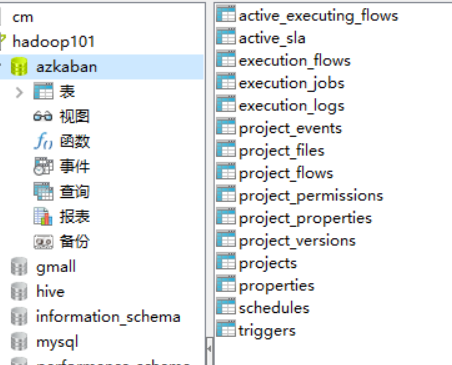
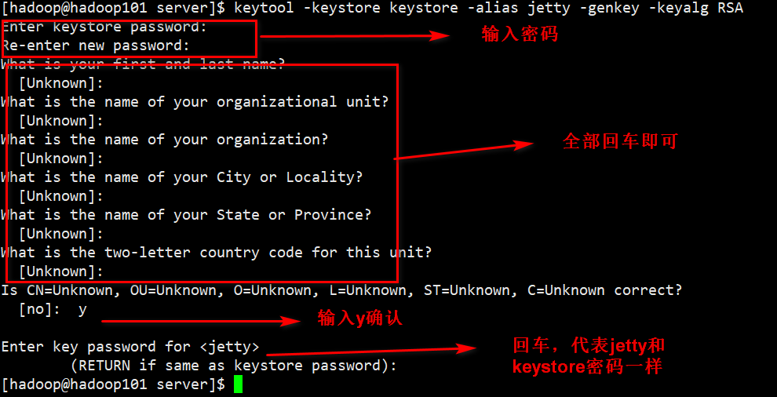
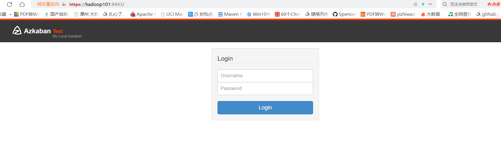

# azkaban安装配置

## 准备文件
将Azkaban Web服务器、Azkaban执行服务器、Azkaban的sql执行脚本拷贝到hadoop101/opt/software目录下
```sh
[hadoop@hadoop101 software]$ ll
total 22612
-rw-rw-r-- 1 hadoop hadoop 11157302 Jul 21 05:40 azkaban-executor-server-2.5.0.tar.gz
-rw-rw-r-- 1 hadoop hadoop     1928 Jul 21 05:40 azkaban-sql-script-2.5.0.tar.gz
-rw-rw-r-- 1 hadoop hadoop 11989669 Jul 21 05:40 azkaban-web-server-2.5.0.tar.gz
```

## 解压
创建文件夹：/opt/module/azkaban，把这3个文件解压到/opt/module/azkaban
```sh
[hadoop@hadoop101 software]$ mkdir /opt/module/azkaban
[hadoop@hadoop101 software]$ tar -zxf azkaban-executor-server-2.5.0.tar.gz -C /opt/module/azkaban
[hadoop@hadoop101 software]$ tar -zxf azkaban-web-server-2.5.0.tar.gz -C /opt/module/azkaban
[hadoop@hadoop101 software]$ tar -zxf azkaban-sql-script-2.5.0.tar.gz -C /opt/module/azkaban
[hadoop@hadoop101 software]$ cd /opt/module/azkaban/
[hadoop@hadoop101 azkaban]$ ll
total 12
drwxrwxr-x 2 hadoop hadoop 4096 Jul 21 05:44 azkaban-2.5.0
drwxrwxr-x 7 hadoop hadoop 4096 Jul 21 05:43 azkaban-executor-2.5.0
drwxrwxr-x 8 hadoop hadoop 4096 Jul 21 05:43 azkaban-web-2.5.0
```

重命名文件夹名称：
```sh
[hadoop@hadoop101 azkaban]$ mv azkaban-web-2.5.0 server
[hadoop@hadoop101 azkaban]$ mv azkaban-executor-2.5.0/ executor
[hadoop@hadoop101 azkaban]$ mv azkaban-2.5.0/ azkaban-sql
[hadoop@hadoop101 azkaban]$ ll
total 12
drwxrwxr-x 2 hadoop hadoop 4096 Jul 21 05:44 azkaban-sql
drwxrwxr-x 7 hadoop hadoop 4096 Jul 21 05:43 executor
drwxrwxr-x 8 hadoop hadoop 4096 Jul 21 05:43 server
```

## 数据库准备
进入mysql，创建azkaban数据库，并将解压的脚本导入到azkaban数据库。
```sh
mysql> use azkaban;
Database changed
mysql> source /opt/module/azkaban/azkaban-sql/create-all-sql-2.5.0.sql
```


## 生成密钥库
在server目录下生成密钥库

```sh
[hadoop@hadoop101 server]$ keytool -keystore keystore -alias jetty -genkey -keyalg RSA
```


## 配置文件

### Web服务器配置
配置文件在conf目录下

#### azkaban.properties
```properties
#Azkaban Personalization Settings
azkaban.name=Test
azkaban.label=My Local Azkaban
azkaban.color=#FF3601
azkaban.default.servlet.path=/index
#配置绝对路径在哪里启动启程都可以
web.resource.dir=/opt/module/azkaban/server/web/
default.timezone.id=Asia/Shanghai

#Azkaban UserManager class
user.manager.class=azkaban.user.XmlUserManager
#用户权限管理默认类（绝对路径）
user.manager.xml.file=/opt/module/azkaban/server/conf/azkaban-users.xml

#Loader for projects
##global配置文件所在位置（绝对路径）
executor.global.properties=/opt/module/azkaban/server/conf/global.properties
azkaban.project.dir=projects

database.type=mysql
mysql.port=3306
mysql.host=hadoop101
mysql.database=azkaban
mysql.user=root
mysql.password=123456
mysql.numconnections=100

# Velocity dev mode
velocity.dev.mode=false

# Azkaban Jetty server properties.
jetty.maxThreads=25
jetty.ssl.port=8443
jetty.port=8081
#SSL文件名（绝对路径）
jetty.keystore=/opt/module/azkaban/server/keystore
#SSL文件密码
jetty.password=123456
#Jetty主密码与keystore文件相同
jetty.keypassword=123456
#SSL文件名（绝对路径）
jetty.truststore=/opt/module/azkaban/server/keystore
#SSL文件密码
jetty.trustpassword=123456

# Azkaban Executor settings
executor.port=12321

# mail settings
mail.sender=
mail.host=
job.failure.email=
job.success.email=

lockdown.create.projects=false

cache.directory=cache

```

#### azkaban-users.xml 
```xml
<azkaban-users>
	<user username="azkaban" password="azkaban" roles="admin" groups="azkaban" />
	<user username="metrics" password="metrics" roles="metrics"/>
    
    <!-- 加一个用户 -->
    <user username="admin" password="admin" roles="admin" />
	
	<role name="admin" permissions="ADMIN" />
	<role name="metrics" permissions="METRICS"/>
</azkaban-users>
```

### 执行服务器配置

#### azkaban.properties
```properties
#Azkaban
default.timezone.id=Asia/Shanghai

# Azkaban JobTypes Plugins
azkaban.jobtype.plugin.dir=/opt/module/azkaban/executor/plugins/jobtypes

#Loader for projects
executor.global.properties=/opt/module/azkaban/executor/conf/global.properties
azkaban.project.dir=projects

database.type=mysql
mysql.port=3306
mysql.host=hadoop101
mysql.database=azkaban
mysql.user=root
mysql.password=123456
mysql.numconnections=100

# Azkaban Executor settings
executor.maxThreads=50
#端口号(如修改,请与web服务中一致)
executor.port=12321
executor.flow.threads=30

```

## 启动
先执行executor，再执行web，避免Web Server会因为找不到执行器启动失败。

### 启动executor服务器
在executor服务器目录下执行启动命令
```sh
[hadoop@hadoop101 executor]$ bin/azkaban-executor-start.sh
```


### 启动web服务器
在azkaban web服务器目录下执行启动命令
```sh
[hadoop@hadoop101 server]$ bin/azkaban-web-start.sh
```

## 登录
浏览器输入`https://hadoop101:8443/`即可访问



```sh

```