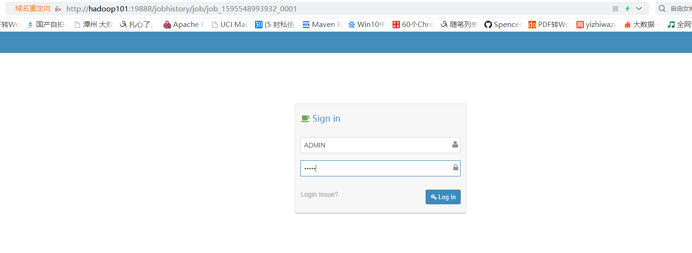
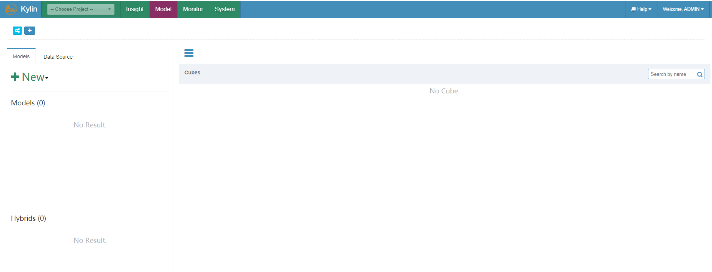

# Kylin安装
在一个节点安装即可

## Kylin依赖环境
安装Kylin前需先部署好Hadoop、Hive、Zookeeper、HBase，并且需要配置以下环境变量HADOOP_HOME，HIVE_HOME，HBASE_HOME，记得source使其生效。

## 下载Kylin安装包
下载地址：http://kylin.apache.org/cn/download/

## 解压
```sh
[hadoop@hadoop101 software]$ ll
total 304088
-rw-rw-r-- 1 hadoop hadoop 311385444 Jul 24 07:49 apache-kylin-2.5.1-bin-hbase1x.tar.gz
[hadoop@hadoop101 software]$ tar -zxf apache-kylin-2.5.1-bin-hbase1x.tar.gz -C /opt/module/
[hadoop@hadoop101 software]$ cd /opt/module/
# 修改一下目录名
[hadoop@hadoop101 module]$ mv apache-kylin-2.5.1-bin-hbase1x kylin-2.5.1
```

## 启动
**注意：启动前检查HADOOP_HOME，HIVE_HOME，HBASE_HOME是否配置完毕**

kylin.sh启动时会调用find-hive-dependency.sh等检查依赖。
```
[hadoop@hadoop101 bin]$ ll
total 84
-rwxr-xr-x 1 hadoop hadoop 2696 Nov  6  2018 check-env.sh
-rwxr-xr-x 1 hadoop hadoop 1276 Nov  6  2018 check-hive-usability.sh
-rwxr-xr-x 1 hadoop hadoop 1414 Nov  6  2018 check-migration-acl.sh
-rwxr-xr-x 1 hadoop hadoop 2328 Nov  6  2018 diag.sh
-rwxr-xr-x 1 hadoop hadoop 2725 Nov  6  2018 find-hadoop-conf-dir.sh
-rwxr-xr-x 1 hadoop hadoop 1576 Nov  6  2018 find-hbase-dependency.sh
-rwxr-xr-x 1 hadoop hadoop 5497 Nov  6  2018 find-hive-dependency.sh
-rwxr-xr-x 1 hadoop hadoop 1964 Nov  6  2018 find-kafka-dependency.sh
-rwxr-xr-x 1 hadoop hadoop 1476 Nov  6  2018 find-spark-dependency.sh
-rwxr-xr-x 1 hadoop hadoop 1139 Nov  6  2018 get-properties.sh
-rwxr-xr-x 1 hadoop hadoop 1520 Nov  6  2018 header.sh
-rwxr-xr-x 1 hadoop hadoop 1638 Nov  6  2018 health-check.sh
-rwxr-xr-x 1 hadoop hadoop 3818 Nov  6  2018 kylin-port-replace-util.sh
-rwxr-xr-x 1 hadoop hadoop 8037 Nov  6  2018 kylin.sh
-rwxr-xr-x 1 hadoop hadoop 1436 Nov  6  2018 load-hive-conf.sh
-rwxr-xr-x 1 hadoop hadoop 3373 Nov  6  2018 metastore.sh
-rwxr-xr-x 1 hadoop hadoop 5739 Nov  6  2018 sample.sh
-rwxr-xr-x 1 hadoop hadoop 1299 Nov  6  2018 sample-streaming.sh
```

### 启动依赖
启动Kylin之前，需先启动Hadoop（hdfs，yarn，jobhistoryserver）、Zookeeper、Hbase
```
[hadoop@hadoop101 app-script]$ ./hadoop_cluster.sh start
[hadoop@hadoop101 app-script]$ ./zookeeper_cluster.sh start
[hadoop@hadoop101 app-script]$ start-hbase.sh 
```

**hive原数据服务也是需要启动的**
```
[hadoop@hadoop101 hive-2.3.6]$ bin/hive --service metastore
```
要不会报错启动：
```
Retrieving hive dependency...
Couldn't find hive configuration directory. Please set HIVE_CONF to the path which contains hive-site.xml.
```


测试历史服务器是否可用：
```
[hadoop@hadoop101 module]$ hadoop jar /opt/module/hadoop-2.7.2/share/hadoop/mapreduce/hadoop-mapreduce-examples-2.7.2.jar pi 1 1
```
访问http://hadoop102:8088/cluster，点击刚运行的任务的History,跳到了历史服务器的页面可以`http://hadoop101:19888/jobhistory/job/job_1595548993932_0001`


### 启动
```
[hadoop@hadoop101 kylin-2.5.1]$ bin/kylin.sh start
```

启动成功
```
A new Kylin instance is started by hadoop. To stop it, run 'kylin.sh stop'
Check the log at /opt/module/kylin-2.5.1/logs/kylin.log
Web UI is at http://<hostname>:7070/kylin
```

### Web页面
在http://hadoop101:7070/kylin查看Web页面

用户名为：**ADMIN**，密码为：**KYLIN**




### 关闭
```
[hadoop@hadoop101 kylin-2.5.1]$ bin/kylin.sh stop
```

### 关闭所有集群
```
[hadoop@hadoop101 kylin-2.5.1]$ bin/kylin.sh stop
[hadoop@hadoop101 app-script]$ stop-hbase.sh
[hadoop@hadoop101 app-script]$ ./zookeeper_cluster.sh stop
[hadoop@hadoop101 app-script]$ ./hadoop_cluster.sh stop
```


```

```