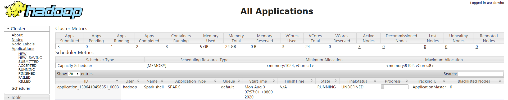
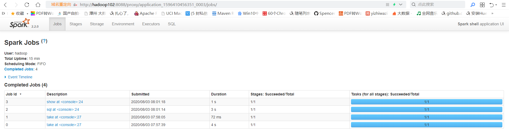
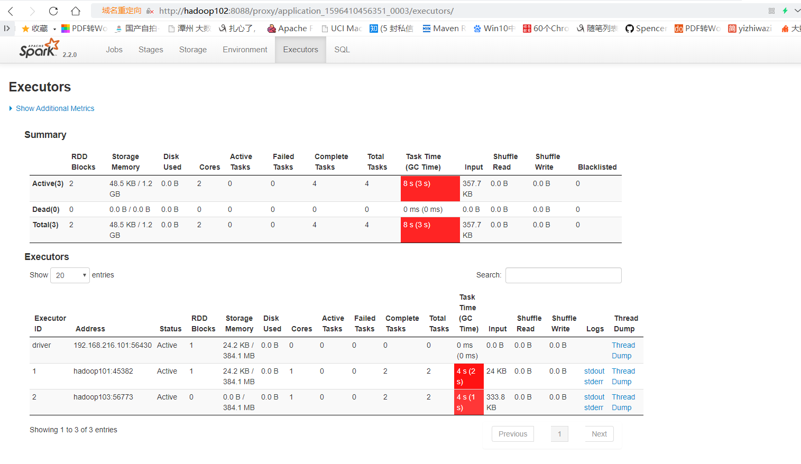
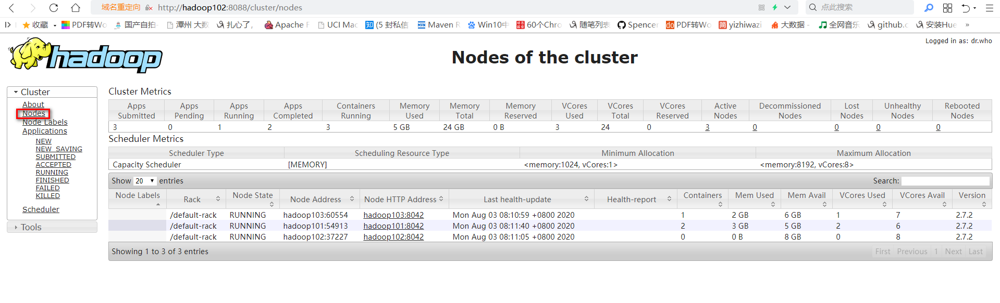

# spark安装配置

## 解压
```sh
[hadoop@hadoop101 software]$ ll
total 198956
-rw-rw-r-- 1 hadoop hadoop 203728858 Aug  3 07:23 spark-2.2.0-bin-hadoop2.7.tgz
[hadoop@hadoop101 software]$ tar -zxf spark-2.2.0-bin-hadoop2.7.tgz -C /opt/module/
[hadoop@hadoop101 software]$ cd /opt/module/
[hadoop@hadoop101 module]$ ll
total 52
drwxrwxr-x  5 hadoop hadoop 4096 Jul 21 05:46 azkaban
drwxrwxr-x  8 hadoop hadoop 4096 Jul  3 07:02 flume-1.7.0
drwxr-xr-x 11 hadoop hadoop 4096 Jun 30 04:18 hadoop-2.7.2
drwxrwxr-x  8 hadoop hadoop 4096 Jul 24 07:40 hbase-1.3.1
drwxrwxr-x 11 hadoop hadoop 4096 Jul  5 07:55 hive-2.3.6
drwxr-xr-x  8 hadoop hadoop 4096 Jul 22  2017 jdk1.8.0_144
drwxr-xr-x  7 hadoop hadoop 4096 Jul  1 04:12 kafka_2.11-0.11.0.2
drwxr-xr-x 11 hadoop hadoop 4096 Jul 25 07:49 kylin-2.5.1
drwxr-xr-x 12 hadoop hadoop 4096 Jul  1  2017 spark-2.2.0-bin-hadoop2.7
drwxr-xr-x  9 hadoop hadoop 4096 Apr 27  2015 sqoop-1.4.6
drwxr-xr-x  5 hadoop hadoop 4096 Dec 13  2017 tez-0.9.1
drwxrwxr-x  3 hadoop hadoop 4096 Jul  3 06:31 tomcat
drwxr-xr-x 12 hadoop hadoop 4096 Jun 30 07:56 zookeeper-3.4.10

```

## 配置

### spark-env.sh
```
[hadoop@hadoop101 conf]$ cp spark-env.sh.template spark-env.sh
```

```
HADOOP_CONF_DIR=/opt/module/hadoop-2.7.2/etc/hadoop
```

### hive-site.xml
```xml
<?xml version="1.0"?>
<?xml-stylesheet type="text/xsl" href="configuration.xsl"?>
<configuration>

    <property>
        <name>hive.metastore.uris</name>
        <value>thrift://hadoop101:9083</value>
    </property>
    
</configuration>
```

### 测试

#### 启动hive metastore
必须启动这个，因为配置了hive的配置，实际上可以不配置，只在使用sql的jar工程中配置这个参数即可，也可以把配置文件放到classpath，配置的优先级和hadoop一样。
``
[hadoop@hadoop101 hadoop]$ hive --service metastore
``

#### 测试运行在yarn上与读取hive
不知道为啥要不把这个hadoop-lzo-0.4.20.jar放到classpath会报错。

测试用client模式比较方便
```sh
bin/spark-shell \
--master yarn \
--deploy-mode client \
--jars /opt/module/hadoop-2.7.2/share/hadoop/common/hadoop-lzo-0.4.20.jar
```

可以看到普通的text文件和用lzo压缩parquet格式的hive表，都可以读取。

测试：
```
[hadoop@hadoop101 spark-2.2.0-bin-hadoop2.7]$ bin/spark-shell \
--master yarn \
--deploy-mode client \
--jars /opt/module/hadoop-2.7.2/share/hadoop/common/hadoop-lzo-0.4.20.jar
Setting default log level to "WARN".
To adjust logging level use sc.setLogLevel(newLevel). For SparkR, use setLogLevel(newLevel).
20/08/03 07:56:57 WARN util.NativeCodeLoader: Unable to load native-hadoop library for your platform... using builtin-java classes where applicable
20/08/03 07:56:58 WARN yarn.Client: Neither spark.yarn.jars nor spark.yarn.archive is set, falling back to uploading libraries under SPARK_HOME.
Spark context Web UI available at http://192.168.216.101:4040
Spark context available as 'sc' (master = yarn, app id = application_1596410456351_0003).
Spark session available as 'spark'.
Welcome to
      ____              __
     / __/__  ___ _____/ /__
    _\ \/ _ \/ _ `/ __/  '_/
   /___/ .__/\_,_/_/ /_/\_\   version 2.2.0
      /_/
         
Using Scala version 2.11.8 (Java HotSpot(TM) 64-Bit Server VM, Java 1.8.0_144)
Type in expressions to have them evaluated.
Type :help for more information.

scala> val rdd = sc.textFile("/warehouse/gmall/dwd/dwd_dim_date_info/date_info.txt")
rdd: org.apache.spark.rdd.RDD[String] = /warehouse/gmall/dwd/dwd_dim_date_info/date_info.txt MapPartitionsRDD[1] at textFile at <console>:24

scala> rdd.take(3).foreach(println)
2019-01-01	1	3	1	1	1	2019	0	0
2019-01-02	1	4	2	1	1	2019	0	0
2019-01-03	1	5	3	1	1	2019	0	0

scala> rdd.map(line => (line.split("\t")(0).substring(5,7), 1)).reduceByKey(_+_, 2).take(10).foreach(println)
(06,60)                                                                         
(02,57)
(04,60)
(11,60)
(08,62)
(09,60)
(03,62)
(07,62)
(12,62)
(05,62)

scala> spark.sql("show databases").show();
+------------+
|databaseName|
+------------+
|     default|
|       gmall|
+------------+

scala> spark.sql("use gmall")
res4: org.apache.spark.sql.DataFrame = []

scala> spark.sql("show tables")
res5: org.apache.spark.sql.DataFrame = [database: string, tableName: string ... 1 more field]

scala> spark.sql("show tables").show()
+--------+--------------------+-----------+
|database|           tableName|isTemporary|
+--------+--------------------+-----------+
|   gmall|ads_appraise_bad_...|      false|
|   gmall|      ads_back_count|      false|
|   gmall|ads_continuity_uv...|      false|
|   gmall|ads_continuity_wk...|      false|
|   gmall|   ads_new_mid_count|      false|
|   gmall|  ads_order_daycount|      false|
|   gmall|ads_payment_daycount|      false|
|   gmall|ads_product_cart_...|      false|
|   gmall|ads_product_favor...|      false|
|   gmall|    ads_product_info|      false|
|   gmall|ads_product_refun...|      false|
|   gmall|ads_product_sale_...|      false|
|   gmall|ads_sale_tm_categ...|      false|
|   gmall|    ads_silent_count|      false|
|   gmall|ads_user_action_c...|      false|
|   gmall|ads_user_retentio...|      false|
|   gmall|      ads_user_topic|      false|
|   gmall|        ads_uv_count|      false|
|   gmall|   ads_wastage_count|      false|
|   gmall|dwd_active_backgr...|      false|
+--------+--------------------+-----------+
only showing top 20 rows

                                   
scala> spark.sql("show tables").show(true)
+--------+--------------------+-----------+
|database|           tableName|isTemporary|
+--------+--------------------+-----------+
|   gmall|ads_appraise_bad_...|      false|
|   gmall|      ads_back_count|      false|
|   gmall|ads_continuity_uv...|      false|
|   gmall|ads_continuity_wk...|      false|
|   gmall|   ads_new_mid_count|      false|
|   gmall|  ads_order_daycount|      false|
|   gmall|ads_payment_daycount|      false|
|   gmall|ads_product_cart_...|      false|
|   gmall|ads_product_favor...|      false|
|   gmall|    ads_product_info|      false|
|   gmall|ads_product_refun...|      false|
|   gmall|ads_product_sale_...|      false|
|   gmall|ads_sale_tm_categ...|      false|
|   gmall|    ads_silent_count|      false|
|   gmall|ads_user_action_c...|      false|
|   gmall|ads_user_retentio...|      false|
|   gmall|      ads_user_topic|      false|
|   gmall|        ads_uv_count|      false|
|   gmall|   ads_wastage_count|      false|
|   gmall|dwd_active_backgr...|      false|
+--------+--------------------+-----------+
only showing top 20 rows


scala> spark.sql("show tables").show(false)
+--------+-----------------------------+-----------+
|database|tableName                    |isTemporary|
+--------+-----------------------------+-----------+
|gmall   |ads_appraise_bad_topn        |false      |
|gmall   |ads_back_count               |false      |
|gmall   |ads_continuity_uv_count      |false      |
|gmall   |ads_continuity_wk_count      |false      |
|gmall   |ads_new_mid_count            |false      |
|gmall   |ads_order_daycount           |false      |
|gmall   |ads_payment_daycount         |false      |
|gmall   |ads_product_cart_topn        |false      |
|gmall   |ads_product_favor_topn       |false      |
|gmall   |ads_product_info             |false      |
|gmall   |ads_product_refund_topn      |false      |
|gmall   |ads_product_sale_topn        |false      |
|gmall   |ads_sale_tm_category1_stat_mn|false      |
|gmall   |ads_silent_count             |false      |
|gmall   |ads_user_action_convert_day  |false      |
|gmall   |ads_user_retention_day_rate  |false      |
|gmall   |ads_user_topic               |false      |
|gmall   |ads_uv_count                 |false      |
|gmall   |ads_wastage_count            |false      |
|gmall   |dwd_active_background_log    |false      |
+--------+-----------------------------+-----------+
only showing top 20 rows


scala> spark.sql("select * from dws_user_action_daycount").show()
+-------+-----------+----------+-----------+-----------+------------+-------------+--------------+----------+
|user_id|login_count|cart_count|cart_amount|order_count|order_amount|payment_count|payment_amount|        dt|
+-------+-----------+----------+-----------+-----------+------------+-------------+--------------+----------+
|      0|          1|         0|        0.0|          0|        0.00|            0|          0.00|2020-03-11|
|      1|          1|         0|        0.0|          0|        0.00|            0|          0.00|2020-03-11|
|     10|          1|         0|        0.0|          0|        0.00|            0|          0.00|2020-03-11|
|   1000|          1|         0|        0.0|          0|        0.00|            0|          0.00|2020-03-11|
|   1001|          1|         0|        0.0|          0|        0.00|            0|          0.00|2020-03-11|
|   1002|          1|         0|        0.0|          0|        0.00|            0|          0.00|2020-03-11|
|   1003|          1|         0|        0.0|          0|        0.00|            0|          0.00|2020-03-11|
|   1004|          2|         0|        0.0|          0|        0.00|            0|          0.00|2020-03-11|
|   1006|          1|         0|        0.0|          0|        0.00|            0|          0.00|2020-03-11|
|   1007|          1|         0|        0.0|          0|        0.00|            0|          0.00|2020-03-11|
|   1009|          2|         0|        0.0|          0|        0.00|            0|          0.00|2020-03-11|
|    101|          1|         0|        0.0|          0|        0.00|            0|          0.00|2020-03-11|
|   1011|          2|         0|        0.0|          0|        0.00|            0|          0.00|2020-03-11|
|   1013|          1|         0|        0.0|          0|        0.00|            0|          0.00|2020-03-11|
|   1015|          1|         0|        0.0|          0|        0.00|            0|          0.00|2020-03-11|
|   1016|          2|         0|        0.0|          0|        0.00|            0|          0.00|2020-03-11|
|   1019|          1|         0|        0.0|          0|        0.00|            0|          0.00|2020-03-11|
|    102|          1|         0|        0.0|          0|        0.00|            0|          0.00|2020-03-11|
|   1020|          1|         0|        0.0|          0|        0.00|            0|          0.00|2020-03-11|
|   1021|          1|         0|        0.0|          0|        0.00|            0|          0.00|2020-03-11|
+-------+-----------+----------+-----------+-----------+------------+-------------+--------------+----------+
only showing top 20 rows

scala> spark.sql("select dt,count(1) from dws_user_action_daycount group by dt").show()
+----------+--------+                                                           
|        dt|count(1)|
+----------+--------+
|2020-03-10|    7000|
|2020-03-12|    1494|
|2020-03-11|    7464|
|2020-03-13|    1480|
+----------+--------+

scala> :quit
[hadoop@hadoop101 spark-2.2.0-bin-hadoop2.7]$
```
#### web页面



点击	ApplicationMaster：



查看yarn上spark使用的资源


默认不是2个executor吗，怎么用了3个呢，ApplicationMaster也算一个，查看hadoop101上进程，ExecutorLauncher应该就是ApplicationMaster。：
```
[hadoop@hadoop101 app-script]$ jps
2497 RunJar
3442 Jps
1878 NodeManager
1576 DataNode
1960 JobHistoryServer
3160 ExecutorLauncher
1466 NameNode
3211 CoarseGrainedExecutorBackend
3023 SparkSubmit
[hadoop@hadoop101 app-script]$ 
```

